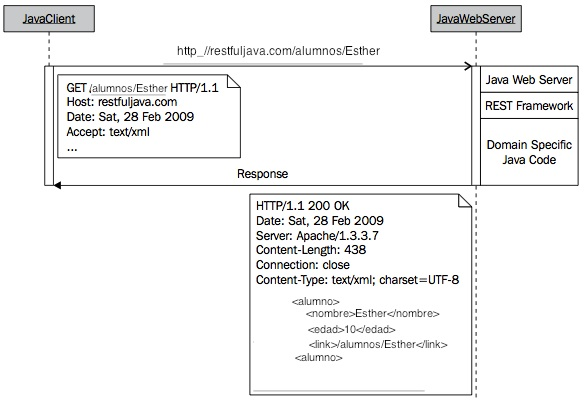

# Acceso a servicios REST


Cuando las aplicaciones móviles se conectan a un servidor web, normalmente no buscan obtener un documento web (como en el caso de los navegadores, que normalmente solicitarán documentos HTML), sino que lo que hacen es acceder a servicios. Estos servicios nos pueden servir para realizar alguna operación en el servidor, o para obtener información en un formato que nuestra aplicación sea capaz de entender y de procesar. Un servicio consiste en una interfaz que nos da acceso a ciertas funcionalidades. Al realizarse el acceso a estos servicios mediante protocolos web, como HTTP, hablamos de servicios web.

Existen diferentes tipos de servicios web. Uno de los principales tipos de servicios web son los servicios SOAP. Se trata de un estándar XML que nos permite crear servicios con un alto grado de operabilidad, dado que la forma de consumirlos será idéntica, independientemente de la plataforma en la que estén implementados. Además, al definirse de forma estándar existen herramientas que nos permiten integrarlos casi de forma automática en cualquier lenguaje y plataforma. Sin embargo, tienen el inconveniente de que para conseguir dicha interoperabilidad y facilidad de integración necesitan definir un XML demasiado pesado y rígido, lo cual resulta poco adecuado para dispositivos móviles y para la web en general. Estos servicios se utilizan comúnmente para integración de aplicaciones, y en el ámbito de grandes aplicaciones transaccionales.

Para la web y dispositivos móviles se ha impuesto otro estilo para crear servicios web. Se trata del estilo REST, que acerca los servicios web a la web. Se trata de servicios fuertemente vinculados a los protocolos web (HTTP) sobre los que se invocan, en los que tendremos una gran flexibilidad a la hora de elegir el formato con el que queremos intercambiar la información. Vamos a centrarnos en estudiar este estilo REST.


## Fundamentos de REST


El estilo REST (_Representational State Transfer_) es una forma ligera de crear Servicios Web. El elemento principal en el que se basan estos servicios son las URLs. En líneas generales podemos decir que estos servicios consisten en URLs a las que podemos acceder, por ejemplo mediante protocolo HTTP, para obtener información o realizar alguna operación. El formato de la información que se intercambie con estas URLs lo decidirá el desarrollador del servicio. Este tipo de servicios acercan los Servicios Web al tipo de arquitectura de la _web_, siendo especialmente interesantes para su utilización en AJAX.

El término REST proviene de la tesis doctoral de Roy Fielding, publicada en el año 2000, y significa *_REpresentational State Transfer_*. REST es un conjunto de restricciones que, cuando son aplicadas al diseño de un sistema, crean un estilo arquitectónico de software. Dicho estilo arquitectónico se caracteriza por:


* Debe ser un sistema cliente-servidor
* Tiene que ser sin estado, es decir, no hay necesidad de que los servicios guarden las sesiones de los usuarios (cada petición al servicio tiene que ser independiente de las demás)
* Debe soportar un sistema de _cachés_: la infraestructura de la red debería soportar _caché_ en diferentes niveles
* Debe ser un sistema uniformemente accesible (con una interfaz uniforme): cada recurso debe tener una única dirección y un punto válido de acceso. Los recursos se identifican con URIs, lo cual proporciona un espacio de direccionamiento global para el descubrimiento del servicio y de los recursos.
* Tiene que ser un sistema por capas: por lo tanto debe soportar escalabilidad
* Debe utilizar mensajes auto-descriptivos: los recursos se desacoplan de su representación de forma que puedan ser accedidos en una variedad de formatos, como por ejemplo XML, HTML, texto plano, PDF, JPEG, JSON, etc.


Estas restricciones no dictan qué tipo de tecnología utilizar; solamente definen cómo se transfieren los datos entre componentes y qué beneficios se obtienen siguiendo estas restricciones. Por lo tanto, un sistema RESTful puede implementarse en cualquier arquitectura de la red disponible. Y lo que es más importante, no es necesario "inventar" nuevas tecnologías o protocolos de red: podemos utilizar las infraestructuras de red existentes, tales como la Web, para crear arquitecturas RESTful.


Antes de que las restricciones REST fuesen formalizadas, ya disponíamos de un ejemplo de un sistema RESTful: la Web (estática). Por ejemplo, la infraestructura de red existente proporciona sistemas de _caché_, conexión sin estado, y enlaces únicos a los recursos, en donde los recursos son todos los documentos disponibles en cada sitio web y las representaciones de dichos recursos son conjuntos de ficheros "legibles" por navegadores web (por ejemplo, ficheros HTML). Por lo tanto, la web estática es un sistema construido sobre un estilo arquitectónico REST.


A continuación analizaremos las abstracciones que constituyen un sistema RESTful: recursos, representaciones, URIs, y los tipos de peticiones HTTP que constituyen la interfaz uniforme utilizada en las transferencias cliente/servidor


## Recursos

Un recurso REST es cualquier cosa que sea direccionable a través de la Web. Por direccionable nos refererimos a recursos que puedan ser accedidos y transferidos entre clientes y servidores. Por lo tanto, un recurso es una correspondencia lógica y temporal con un concepto en el dominio del problema para el cual estamos implementando una solución.

Algunos ejemplos de recursos REST son:


* Una noticia de un periódico
* La temperatura de Alicante a las 4:00pm
* Un valor de IVA almacenado en una base de datos
* Una lista con el historial de las revisiones de código en un sistema CVS
* Un estudiante en alguna aula de alguna universidad
* El resultado de una búsqueda de un ítem particular en Google

Aun cuando el mapeado de un recurso es único, diferentes peticiones a un recurso pueden devolver la misma representación binaria almacenada en el servidor. Por ejemplo, consideremos un recurso en el contexto de un sistema de publicaciones. En este caso, una petición de la "última revisión publicada" y la petición de "la revisión número 12" en algún momento de tiempo pueden devolver la misma representación del recurso: cuando la última revisión sea efectivamente la 12. Por lo tanto, cuando la última revisión publicada se incremente a la versión 13, una petición a la última revisión devolverá la versión 13, y una petición de la revisión 12, continuará devolviendo la versión 12. En definitiva: cada uno de los recursos puede ser accedido directamente y de forma independiente, pero diferentes peticiones podrían "apuntar" al mismo dato.


Debido a que estamos utilizando HTTP para comunicarnos, podemos transferir cualquier tipo de información que pueda transportarse entre clientes y servidores. Por ejemplo, si realizamos una petición de un fichero de texto de la CNN, nuestro navegador mostrará un fichero de texto. Si solicitamos una película flash a YouTube, nuestro navegador recibirá una película flash. En ambos casos, los datos son transferidos sobre TCP/IP y el navegador conoce cómo interpretar los _streams_ binarios debido a la cabecera de respuesta del protocolo HTTP _Content-Type_. Por lo tanto, en un sistema RESTful, la representación de un recurso depende del tipo deseado por el cliente (tipo MIME), el cual está especificado en la petición del protocolo de comunicaciones.


## Representación

La representación de los recursos es lo que se envía entre los servidores y clientes. Una representación muestra el estado del dato real almacenado en algún dispositivo de almacenamiento en el momento de la petición. En términos generales, es un _stream_ binario, juntamente con los metadatos que describen cómo dicho _stream_ debe ser consumido por el cliente y/o servidor (los metadatos también puden contener información extra sobre el recurso, como por ejemplo información de validación y encriptación, o código extra para ser ejecutado dinámicamente).


A través del ciclo de vida de un servicio web, pueden haber varios clientes solicitando recursos. Clientes diferentes son capaces de consumir diferentes representaciones del mismo recurso. Por lo tanto, una representación puede tener varias formas, como por ejemplo, una imagen, un texto, un fichero XML, o un fichero JSON, pero tienen que estar disponibles en la misma URL.


Para respuestas generadas para humanos a través de un navegador, una representación típica tiene la forma de página HTML. Para respuestas automáticas de otros servicios web, la legibilidad no es importante y puede utilizarse una representación mucho más eficiente como por ejemplo XML.


El lenguaje para el intercambio de información con el servicio queda a elección del desarrollador. A continuación mostramos algunos formatos comunes que podemos utilizar para intercambiar esta información:

<table>
<tr>
<th>Formato</th>
<th>Tipo MIME</th>
</tr>
<tr>
<td>Texto plano</td>
<td>`text/plain`</td>
</tr>
<tr>
<td>HTML</td>
<td>`text/html`</td>
</tr>
<tr>
<td>XML</td>
<td>`application/xml`</td>
</tr>
<tr>
<td>JSON</td>
<td>`application/json`</td>
</tr>
</table>

De especial interés es el formato JSON. Se trata de un lenguaje ligero de intercambio
de información, que puede utilizarse en lugar de XML (que resulta considerablemente
más pesado) para aplicaciones AJAX. De hecho, en Javascript puede leerse este tipo de
formato simplemente utilizando el método `eval()`.

## URI

Una URI, o *Uniform Resource Identifier*, en un servicio web RESTful es un hiper-enlace a un recurso, y es la única forma de intercambiar representaciones entre clientes y servidores. Un servicio web RESTful expone un conjunto de recursos que identifican los objetivos de la interacción con sus clientes.


El conjunto de restricciones REST no impone que las URIs deban ser hiper-enlaces. Simplemente hablamos de hiper-enlaces porque estamos utilizando la Web para crear servicios web. Si estuviésemos utilizando un conjunto diferente de tecnologías soportadas, una URI RESTful podría ser algo completamente diferente. Sin embargo, la idea de direccionabilidad debe permanecer.


En un sistema REST, la URI no cambia a lo largo del tiempo, ya que la implementación de la arquitectura es la que gestiona los servicios, localiza los recursos, negocia las representaciones, y envía respuestas con los recursos solicitados. Y lo que es más importante, si hubiese un cambio en la estructura del dispositivo de almacenamiento en el lado del servidor (por ejemplo, un cambio de servidores de bases de datos), nuestras URIs seguirán siendo las mismas y serán válidas mientras el servicio web siga estando "en marcha" o el contexto del recurso no cambie.


Sin las restricciones REST, los recursos se acceden por su localización: las direcciones web típicas son URIs fijas. Si por ejemplo renombramos un fichero en el servidor, la URI será diferente; si movemos el fichero a un directorio diferente, la URI también será diferente.


Por ejemplo, si en nuestra aplicación tenemos información de cursos, podríamos acceder a la lista de cursos disponibles mediante una URL como la siguiente:

<a href="http://jtech.ua.es/resources/cursos">http://jtech.ua.es/resources/cursos</a>

Esto nos devolverá la lista de cursos en el formato que el desarrollador del servicio haya decidido. Hay que destacar por lo tanto que en este caso debe haber un entendimiento entre el consumidor y el productor del servicio, de forma que el primero comprenda el lenguaje utilizado por el segundo.

Esta URL nos podría devolver un documento como el siguiente:

```xml
<![CDATA[<?xml version="1.0"?>
<j:Cursos xmlns:j="http://www.jtech.ua.es"
         xmlns:xlink="http://www.w3.org/1999/xlink">
  <Curso id="1"
         xlink:href="http://jtech.ua.es/resources/cursos/1"/>
  <Curso id="2"
         xlink:href="http://jtech.ua.es/resources/cursos/2"/>
  <Curso id="4"
         xlink:href="http://jtech.ua.es/resources/cursos/4"/>
  <Curso id="6"
         xlink:href="http://jtech.ua.es/resources/cursos/6"/>
</j:Cursos>]]>
```

En este documento se muestra la lista de cursos registrados en la aplicación, cada uno de ellos representado también por una URL. Accediendo a estas URLs podremos obtener información sobre cada curso concreto o bien modificarlo.

 ## Uniformidad de las interfaces a través de peticiones HTTP

Ya hemos introducido los conceptos de recursos y sus representaciones. Hemos dicho que los recursos son _mappings_ de los estados reales de las entidades que son intercambiados entre los clientes y servidores. También hemos dicho que las representaciones son negociadas entre los clientes y servidores a través del protocolo de comunicación en tiempo de ejecución (a través de HTTP). A continuación veremos con detalle lo que significa el intercambio de estas representaciones, y lo que implica para los clientes y servidores el realizar acciones sobre dichos recursos.


El desarrollo de servicios web REST es similar al desarrollo de aplicaciones web. Sin embargo, la diferencia fundamental entre el desarrollo de aplicaciones web tradicionales y las más modernas es cómo pensamos sobre las acciones a realizar sobre nuestras abstracciones de datos. De forma más concreta, el desarrollo moderno está centrado en el concepto de *nombres* (intercambio de recursos); el desarrollo tradicional está centrado en el concepto de verbos (acciones remotas a realizar sobre los datos). Con la primera forma, estamos implementando un servicio web RESTful; con la segunda un servicio similar a una llamada a procedimiento remoto- RPC). Y lo que es más, un servicio RESTful modifica el estado de los datos a través de la representación de los recursos (por el contrario, una llamada a un servicio RPC, oculta la representación de los datos y en su lugar envía comandos para modificar el estado de los datos en el lado del servidor). Finalmente, en el desarrollo moderno de aplicaciones web limitamos la ambigüedad en el diseño y la implementación debido a que tenemos cuatro acciones específicas que podemos realizar sobre los recursos: _Create, Retrieve, Update, Delete (CRUD)_. Por otro lado, en el desarrollo tradicional de aplicaciones web, podemos tener otras acciones con nombres o implementaciones no estándar.


A continuación mostramos la correspondencia entre las acciones CRUD sobre los datos y los métodos HTTP correspondientes:

<table>
<tr>
<th>Acción sobre los datos</th>
<th>Protocolo HTTP equivalente</th>
</tr>
<tr>
<td>CREATE</td>
<td>POST</td>
</tr>
<tr>
<td>RETRIEVE</td>
<td>GET</td>
</tr>
<tr>
<td>UPDATE</td>
<td>PUT</td>
</tr>
<tr>
<td>DELETE</td>
<td>DELETE</td>
</tr>
</table>


En su forma más simple, los servicios web RESTful son aplicaciones cliente-servidor a través de la red que manipulan el estado de los recursos. En este contexto, la manipulación de los recursos significa creación de recursos, recuperación, modificación y borrado. Sin embargo, los servicios web RESTful no están limitados solamente a estos cuatro conceptos básicos de manipulación de datos. Por el contrario, los servicios RESTful pueden ejecutar lógica en al lado del servidor, pero recordando que cada respuesta debe ser una representación del recurso del dominio en cuestión. Deberemos determinar qué operación HTTP se ajusta mejor a la manipulación que deseamos realizar sobre los datos. Mención especial merece el método PUT, ya que no se trata simplemente de una actualización de los datos, sino de establecer el estado del recurso, exista previamente o no. A continuación trataremos cada uno de estos métodos con más detalle.


> Nota: Una interfaz uniforme centra la atención en los conceptos abstractos que hemos visto: recursos, representaciones y URIs. Por lo tanto, si consideramos todos estos conceptos en su conjunto, podemos describir el desarrollo RESTful en una frase: utilizamos URIs para conectar clientes y servidores para intercambiar recursos en forma de sus representaciones. O también: en una arquitectura con estilo REST, los clientes y servidores intercambian representaciones de los recursos utilizando un protocolo e interfaces estandarizados.


# Tipos de peticiones HTTP

A continuación vamos a ver los cuatro tipos de peticiones HTTP con detalle, y veremos cómo se utiliza cada una de ellas para intercambiar representaciones para modificar el estado de los recursos.


## GET/RETRIEVE

El método GET se utiliza para *RECUPERAR* recursos. Antes de indicar la mecánica de la peticion GET, vamos a determinar cuál es el recurso que vamos a manejar y el tipo de representación que vamos a utilizar. Para ello vamos a seguir un ejemplo de un servicio web que gestiona alumnos en una clase, con la URI: _http://restfuljava.com_. Para dicho servicio, asumiremos una representación como la siguiente:


```xml
<![CDATA[<alumno>
    <nombre>Esther</nombre>
    <edad>10</edad>
    <link>/alumnos/Jane</link>
</alumno>]]>
```


Una lista de alumnos tendrá el siguiente aspecto:

```xml
<![CDATA[<alumnos>
  <alumno>
    <nombre>Esther</nombre>
    <edad>10</edad>
    <link>/alumnos/Esther</link>
  <alumno>
  <alumno>
    <nombre>Pedro</nombre>
    <edad>11</edad>
    <link>/alumnos/Pedro</link>
  <alumno>
</alumnos>]]>
```


Una vez definida nuestra representación, asumimos que las URIs tienen la forma: _http://restfuljava.com/alumnos_ para acceder a la lista de alumnos, y _http://restfuljava.com/alumnos/{nombre}_ para acceder a un alumno específico con el identificador con el valor _nombre_.


Ahora hagamos peticiones sobre nuestro servicio. Por ejemplo, si queremos recuperar la información de una alumna con el nombre _Esther_, realizamos una petición a la URI: _http://restfuljava.com/alumnos/Esther_.

Una representación de _Esther_ en el momento de la petición, puede ser ésta:

```xml
<![CDATA[<alumno>
   <nombre>Esther</nombre>
   <edad>10</edad>
   <link>/alumnos/Esther</link>
</alumno>]]>
```

También podríamos acceder a una lista de estudiantes a través de la URI: y _http://restfuljava.com/alumnos_ y la respuesta del servicio sería algo similar a ésta (asumiendo que solamente hay dos alumnos):


```xml
<![CDATA[<alumnos>
  <alumno>
    <nombre>Esther</nombre>
    <edad>10</edad>
    <link>/alumnos/Esther</link>
  <alumno>
  <alumno>
    <nombre>Pedro</nombre>
    <edad>11</edad>
    <link>/alumnos/Pedro</link>
  <alumno>
</alumnos>]]>
```

Echemos un vistazo a los detalles de la petición. Una petición para recuperar un recurso _Esther_ usa el método GET con la URI: _http://restfuljava.com/alumnos/Esther_. Un diagrama de secuencia de dicha petición sería como el que mostramos a continuación:




<!--

-->

¿Qué está ocurriendo aquí?:

* Un cliente Java realiza una petición HTTP con el método GET y Esther es el identificador del alumno
* El cliente establece la representación solicitada a través del campo de cabecera `Accept`
* El servidor web recibe e interpreta la petición GET como una acción RETRIEVE. En este momento, el servidor web cede el control al _framework_ RESTful para gestionar la petición. Remarquemos que los _frameworks_ RESTful no recuperan de forma automática los recursos, ése no es su trabajo. La función del _framework_ es facilitar la implementación de las restricciones REST. La lógica de negocio y la implementación del almacenamiento
es el papel del código Java específico del dominio.
* El programa del lado del servidor busca el recurso _Esther_. Encontrar el recurso podría significar buscarlo en una base de datos, un sistema de ficheros, o una llamada a otro servicio web.
* Una vez que el programa encuentra a _Esther_, convierte el dato binario del recurso a la representación solicitada por el cliente.
* Con la representación convertida a XML, el servidor envía de vuelta una respuesta HTTP con un código numérico de 200 (`Ok`) junto con la representación solicitada. Si hay algún error, el servidor HTTP devuelve el código numérico correspondiente, pero es el cliente el que debe tratar de forma adecuada el fallo. El fallo más común es que el recurso no exista, en cuyo caso se devolvería el código 404 (`Not Found`).


Todos los mensajes entre el cliente y el servidor son llamadas del protocolo estándar HTTP. Para cada acción de recuperación, enviamos una petición GET y obtenemos una respuesta HTTP con la representación del recurso solicitada, o bien, si hay un fallo, el correspondiente código de error (por ejemplo, `404 Not Found` si un recurso no se encuentra; `500 Internal Server Error` si hay un problema con el código Java en forma de una excepción).

En las peticiones de recuperación de datos resulta recomendable también implementar un sistema de caché. Para hacer esto utilizaremos el código de respuesta `304 Not Modified` en caso de que los datos no hubiesen cambiado desde la última petición que realizamos (se podría pasar un parámetro con la fecha en la que obtuvimos la representación por última vez). De esta forma, si un cliente recibe ese código como respuesta, sabe que puede seguir trabajando con la representación de la que ya dispone, sin tener que descargar una nueva.

Solicitar una representación para todos los alumnos funciona de forma similar.

> Nota: El método HTTP GET solamente debería utilizarse para recuperar representaciones. Podríamos utilizar una petición GET para actualizar el estado de los datos en el servidor, pero no es recomendable. Una operación GET  debe ser segura e idempotente (para más información ver <a href="http://www.w3.org/DesingIssues/Axioms">http://www.w3.org/DesingIssues/Axioms</a>. Para que una petición sea *segura*, múltiples peticiones al mismo recurso no deben cambiar el estado de los datos en el servidor. Por ejemplo, supongamos una petición en el instante t1 para un recurso R devuelve R1; a continuación, una petición en el instante t2 para R devuelve R2; suponiendo que no hay más acciones de modificación entre t1 y t2, entonces R1 = R2 = R. Para que una petición sea *idempotente* tiene que ocurrir que múltiples llamadas a la misma acción dejan siempre el mismo estado en el recurso. Por ejemplo, múltiples llamadas para crear un recurso R en los instantes t1, t2, y t3, darían como resultado que el recurso R existe sólo como R, y que las llamadas en los instantes t2 y t3 son ignoradas.


### POST/CREATE

El método POST se utiliza para *CREAR* recursos. Vamos a utilizar el método HTTP POST para crear un nuevo alumno. De nuevo, la URI para añadir un nuevo alumno a nuestra lista será: _http://restfuljava.com/alumnos_. El tipo de método para la petición lo determina el cliente.


Asumamos que el alumno con nombre _Ricardo_ no existe en nuestra lista y queremos añadirlo. Nuestra nueva representación XML de _Ricardo_ es:


```xml
<![CDATA[<alumno>
   <nombre>Ricardo</nombre>
   <edad>10</edad>
   <link></link>
</alumno>]]>
```

El elemento _link_ forma parte de la representación, pero está vacía debido a que éste valor se genera en tiempo de ejecución y no es creado por el cliente cuando envía la petición POST. Esto es solamente una convención para nuestro ejemplo; sin embargo, los clientes que utilizan el servicio web pueden especificar la estructura de las URIs.

En este caso, no mostraremos el escenario, pero los pasos que se siguen cuando se realiza la petición son los siguientes:


* Un cliente Java realiza una petición HTTP a la URI _http://restfuljava.com/alumnos_, con el método HTTP POST
* La petición POST incluye una representación en forma de XML de _Ricardo_
* El servidor web recibe la petición y delega en el _framework_ REST para que la gestione; nuestro código dentro del _framework_ ejecuta los comandos adecuados para almacenar dicha representación (de nuevo, el dispositivo de almenamiento puede ser cualquiera).
* Una vez que se ha completado el almacenamiento del nuevo recurso, se envía una respuesta de vuelta: si no ha habido ningún error, enviaremos el código 201 (`Created`); si se produce un fallo, enviaremos el código de error adecuado. Además, podemos devolver en la cabecera `Location` la URL que nos dará acceso al recurso recién creado.

<source lang="plain">Location: http://restfuljava.com/alumnos/Ricardo</source>

Las peticiones POST no son idempotentes, por lo que si invocamos una misma llamada varias veces sobre un mismo recurso, el estado del recurso puede verse alterado en cada una de ellas. Por ejemplo, si ejecutamos varias veces la acción POST con los datos del ejemplo anterior, podríamos estar creando cada vez un nuevo alumno de nombre `Ricardo`, teniendo así varios alumnos con el mismo nombre y edad (pero asociados a IDs distintos, por ejemplo: `/Ricardo`, `/Ricardo1`, `/Ricardo2`, etc).


### PUT/UPDATE

El método PUT se utiliza para *ACTUALIZAR* (modificar) recursos, o para crearlos si el recurso en la URI especificada no existiese previamente. Es decir, PUT se utiliza para establecer un determinado recurso, dada su URI, a la representación que proporcionemos, independientemente de que existiese o no. Para actualizar un recurso, primero necesitamos su representación en el cliente; en segundo lugar, en el lado del cliente actualizaremos el recurso con los nuevos valores deseados; y finalmente, actualizaremos el recurso mediente una petición PUT, adjuntando la representación correspondiente.


Para nuestro ejemplo, omitiremos la petición GET para recuperar a _Esther_ del servicio web, ya que es el mismo que acabamos de indicar en la sección anterior. Supongamos que queremos modificar la edad, y cambiarla de 10 a 12. La nueva representación será:

```xml
<![CDATA[<alumno>
   <nombre>Esther</nombre>
   <edad>12</edad>
   <link>/alumnos/Esther</link>
</alumno>]]>
```

La secuencia de pasos necesarios para enviar/procesar la petición PUT es:

* Un cliente Java realiza una petición HTTP PUT a la URI _http://restfuljava.com/alumnos/Esther_, incluyendo la nueva definición XML
* El servidor web recibe la petición y delega en el _framework_ REST para que la gestione; nuestro código dentro del _framework_ ejecuta los comandos adecuados para actualizar la representación de _Esther_.
* Una vez que se ha completado la actualización, se envía una respuesta al cliente. Si el recurso que hemos enviado no existía previamente, se devolverá el código 201 (`Created`). En caso de que ya existiese, se podría devolver 200 (`Ok`) con el recurso actualizado como contenido, o simplemente 204 (`No Content`) para indicar que la operación se ha realizado correctamente sin devolver ningún contenido.

Muchas veces se confunden los métodos PUT y POST. El significado de estos métodos es el siguiente:


* *POST*: Publica datos en un determinado recurso. El recurso debe existir previamente, y los datos enviados son añadidos a él. Por ejemplo, para añadir nuevos alumnos con POST hemos visto que debíamos hacerlo con el recurso lista de alumnos (`/alumnos`), ya que la URI del nuevo alumno todavía no existe. La operación *no es idempotente*, es decir, si añadimos varias veces el mismo alumno aparecerá repetido en nuestra lista de alumnos con URIs distintas.
* *PUT*: Hace que el recurso indicado tome como contenido los datos enviados. El recurso podría no existir previamente, y en caso de que existiese sería sobrescrito con la nueva información. A diferencia de POST, PUT *es idempotente*. Múltiples llamadas idénticas a la misma acción PUT siempre dejarán el recurso en el mismo estado. La acción se realiza sobre la URI concreta que queremos establecer (por ejemplo, `/alumnos/Esther`), de forma que varias llamadas consecutivas con los mismos datos tendrán el mismo efecto que realizar sólo una de ellas.

Podríamos añadir nuevos alumnos de dos formas diferentes. La primera de ellas es haciendo POST sobre el recurso que contiene la lista de alumnos:

<source lang="plain">POST /alumnos HTTP/1.1</source>

También podríamos hacer PUT sobre el recurso de un alumno concreto:

<source lang="plain">PUT /alumnos/Esther HTTP/1.1</source>

Si _Esther_ existía ya, sobrescribirá sus datos, en casa contrario, creará el nuevo recurso.

Si utilizamos POST de esta última forma, sobre un recurso concreto, si el recurso existiese podríamos realizar alguna operación que modifique sus datos, pero si no existiese nos daría un error, ya que no podemos hacer POST sobre un recurso inexistente.

<source lang="plain">POST /alumnos/Esther HTTP/1.1</source>

El caso anterior sólo será correcto si _Esther_ existe, en caso contrario obtendremos un error. Para crear nuevos recursos con POST debemos recurrir al recurso del conjunto de alumnos. Una diferencia entre estas dos formas alternativas de crear nuevos recursos es que con PUT podemos indicar explícitamente el identificador del recurso creado, mientras que con POST será el servidor quien lo decida.

### DELETE/DELETE

El método DELETE se utiliza para *BORRAR* representaciones. Para nuestro ejemplo, usaremos la misma URI de las secciones anteriores.

La secuencia de pasos necesarios para enviar/procesar la petición DELETE es:

* Un cliente Java realiza una petición DELETE a la URI _http://restfuljava.com/alumnos/Esther_
* El servidor web recibe la petición y delega en el _framework_ REST para que la gestione; nuestro código dentro del _framework_ ejecuta los comandos adecuados para borrar la representación de _Esther_.
* Una vez que se ha completado la actualización, se envía una respuesta al cliente. Se podría devolver 200 (`Ok`) con el recurso borrado como contenido, o simplemente 204 (`No Content`) para indicar que la operación se ha realizado correctamente sin devolver ningún contenido.

Hasta aquí hemos visto las principales acciones que podemos realizar con los recursos en un servicio web RESTful. No conocemos cómo el servicio web implementa el almacenamiento de los datos, y no conocemos qué tecnologías se utilizan para implementar el servicio. Todo lo que conocemos es que nuestro cliente y servidor se comunican a través de HTTP, que usamos dicho protocolo de comunicaciones para enviar peticiones, y que nuestras representaciones de los recursos se intercambian entre el cliente y el servidor a través del intercambio de URIs.

## Clientes de servicios REST

### Invocación de servicios RESTful desde una clase Java

Vamos a ver como crear un cliente RESTful utilizando una sencilla clase Java, lo cual es aplicable a Android. Para ello vamos a utilizar el API de mensajes proporcionado por Twitter (<a href="http://www.twitter.com">http://www.twitter.com</a>). No va a ser necesario disponer de una cuenta de Twitter ni conocer con detalle qué es Twitter para seguir el ejemplo.


> Nota: Twitter es una plataforma de _micro-blogging_ que permite que múltiples usuarios actualicen su estado utilizando 140 caracteres como máximo cada vez. Además, los usuarios pueden "seguirse" unos a otros formando redes de "amigos". Twitter almacena estas actualizaciones en sus servidores, y por defecto, están disponibles públicamente. Es por ésto por lo que utilizaremos Twitter para crear nuestros ejemplos de clientes REST.

```java
try {
      URL twitter = new
        URL("http://twitter.com/statuses/public_timeline.xml");

      // Abrimos la conexión
      URLConnection tc = twitter.openConnection();

      // Obtenemos la respuesta del servidor
      BufferedReader in = new BufferedReader(new
                InputStreamReader( tc.getInputStream()));
      String line;

      // Leemos la respuesta del servidor y la imprimimos
      while ((line = in.readLine()) != null) {
           tvResult.append(line);
      }
      in.close();
    } catch (MalformedURLException e) {
           e.printStackTrace();
    } catch (IOException e) {
           e.printStackTrace();
}
```

Podemos ver que hemos utilizado el paquete estándar `java.net`. La URI del servicio web es: _http://twitter.com/statuses/public_timeline.xml_. Ésta será la URI de nuestro recurso y apuntará a las últimas 20 actualizaciones públicas.


Para conectar con el servicio web, primero tenemos que instanciar el objeto URL con la URI del servicio. A continuación, "abriremos" un objeto _URLConnection_ para la instancia de Twitter. La llamada al método _twitter.openConnection()_ ejecuta una petición HTTP GET.


Una vez que tenemos establecida la conexión, el servidor devuelve la respuesta HTTP. Dicha respuesta contiene una representación XML de las actualizaciones. Por simplicidad, volcaremos en la salida estandar la respuesta del servidor. Para ello, primero leemos el _stream_ de respuesta en un objeto _BufferedReader_, y a continuación realizamos un bucle para cada línea del _stream_, asignándola a un objeto _String_. Finalmente hemos incluido nuestro código en una sentencia _try/catch_, y enviamos cualquier mensaje de excepción a la salida estándar.


Éste es el estado público de la última actualización de Twitter de la estructura XML obtenida (sólo mostramos parte de uno de los _tweets_).

```xml
<![CDATA[<?xml version="1.0" encoding="UTF-8"?> <statuses type="array">
  ...
  <status>
    <created_at>Tue Feb 22 11:43:25 +0000 2011</created_at>
    <id>40013788233216000</id>
    <text>Haar doen voor de cam. #ahahah</text>
    <source>web
    <truncated>false</truncated>
    <favorited>false</favorited>
    <in_reply_to_status_id></in_reply_to_status_id>
    <in_reply_to_user_id></in_reply_to_user_id>
    <in_reply_to_screen_name></in_reply_to_screen_name>
    <retweet_count>0</retweet_count>
    <retweeted>false</retweeted>
    <user>
      <id>250090010</id>
      <name>Dani&#235;l van der wal</name>
      <screen_name>DanielvdWall</screen_name>
      <location>Nederland,   Hoogezand</location>
      <description></description>
      <profile_image_url>
      http://a0.twimg.com/profile_images/1240171940/Picture0003_normal.JPG
      </profile_image_url>
      <url>http://daniel694.hyves.nl/</url>
      <protected>false</protected>
       <followers_count>50</followers_count>
       ...
      <friends_count>74</friends_count>
      ...
      <following>false</following>
      <statuses_count>288</statuses_count>
      <lang>en</lang>
      <contributors_enabled>false</contributors_enabled>
      <follow_request_sent>false</follow_request_sent>
      <listed_count>0</listed_count>
      <show_all_inline_media>false</show_all_inline_media>
      <is_translator>false</is_translator>
    </user>
    <geo/>
    <coordinates/>
    <place/>
    <contributors/>
  </status>
...
</statuses>]]>
```


No entraremos en los detallos de la estructura XML, podemos encontrar la documentación del API en <a href="http://dev.twitter.com/">http://dev.twitter.com/</a>


La documentación del API nos dice que si cambiamos la extensión _.xml_ obtendremos diferentes representaciones del recurso. Por ejemplo, podemos cambiar _.xml_, por _.json_, _.rss_ o _.atom_. Así, por ejemplo, si quisiéramos recibir la respuesta en formato JSON (JavaScript Object Notation), el único cambio que tendríamos que hacer es en la siguiente línea:


```java
URL twitter =
      new URL("http://twitter.com/statuses/public_timeline.json");
```

En este caso, obtendríamos algo como esto:

```bash
[{"in_reply_to_status_id_str":null,"text":"THAT GAME SUCKED ASS.",
"contributors":null,"retweeted":false,"in_reply_to_user_id_str"
:null,"retweet_count":0,"in_reply_to_user_id":null,"source":"web",
"created_at":"Tue Feb 22 11:55:17 +0000 2011","place":null,
"truncated":false,"id_str":"40016776221696000","geo":null,
"favorited":false,"user":{"listed_count":0,"following":null,
"favourites_count":0,"url":"http:\/\/www.youtube.com\/user\
/haezelnut","profile_use_background_image":true,...
```


Los detalles sobre JSON se encuentran en la documentación del API.

> Nota: Aunque Twitter referencia este servicio como servicio RESTful, esta API en particular no es completamente RESTful, debido a una elección de diseño. Analizando la documentación del API vemos que el tipo de representación de la petición forma parte de la URI y no de la cabecera _accept_ de HTTP. El API devuelve una representación que solamente depende de la propia URI: _http://twitter.com/statuses/public_timeline.FORMATO_, en donde FORMATO puede ser _.xml_, _.json_, _.rss_, o _.atom_. Sin embargo, esta cuestión no cambia la utilidad del API para utilizarlo como ejemplo para nuestro cliente REST.


Otra posibilidad de implementación de nuestro cliente Java para Android es utilizar la librería _Http Client_. Dicha librería ofrece una mayor facilidad para controlar y utilizar objetos de conexión HTTP.


El código de nuestra clase cliente utilizando la librería quedaría así:

```java
HttpClient client = new DefaultHttpClient();
HttpGet request = new HttpGet(
                    "http://twitter.com/statuses/public_timeline.xml");
try {
    ResponseHandler<String> handler = new BasicResponseHandler();
    String contenido = client.execute(request, handler);

    tvResponse.setText(contenido);

} catch (ClientProtocolException e) {
} catch (IOException e) {
} finally {
    client.getConnectionManager().shutdown();
}
```

Observamos que primero instanciamos el cliente HTTP y procedemos a crear un objeto que representa el método HTTP GET. Con el cliente y el método instanciado, necesitamos ejecutar la petición con el método `execute`. Si queremos tener un mayor control sobre la respuesta, en lugar de utilizar un `BasicResponseHandler` podríamos ejecutar directamente la petición sobre el cliente, y obtener así la respuesta completa, tal como vimos en la sesión anterior.


En este caso, hemos visto cómo realizar una petición GET, tal como se vio en sesiones anteriores, para acceder a servicios REST. Sin embargo, para determinadas operaciones hemos visto que REST utiliza métodos HTTP distintos, como POST, PUT o DELETE. Para cambiar el método simplemente tendremos que cambiar el objeto `HttpGet` por el del método que corresponda. Cada tipo incorporará los métodos necesarios para el tipo de petición HTTP que represente. Por ejemplo, a continuación vemos un ejemplo de petición POST. Creamos un objeto `HttpPost` al que le deberemos pasar una entidad que represente el bloque de contenido a enviar (en una petición POST ya no sólo tenemos un bloque de contenido en la respuesta, sino que también lo tenemos en la petición). Podemos crear diferentes tipos de entidades, que serán clases que hereden de `HttpEntity`. La más habitual para los servicios que estamos utilizando será `StringEntity`, que nos facilitará incluir en la petición contenido XML o JSON como una cadena de texto. Además, deberemos especificar el tipo MIME de la entidad de la petición mediante `setContentType` (en el siguiente ejemplo consideramos que es XML). Por otro lado, también debemos especificar el tipo de representación que queremos obtener como respuesta, y como hemos visto anteriormente, esto debe hacerse mediante la cabecera `Accept`. Esta cabecera la deberemos establecer en el objeto que representa la petición POST (`HttpPost`).

```java
HttpClient client = new DefaultHttpClient();

HttpPost post = new HttpPost("http://jtech.ua.es/recursos/peliculas");
StringEntity s = new StringEntity("[contenido xml]");
s.setContentType("application/xml");
post.setEntity(s);
post.setHeader("Accept", "application/xml");

ResponseHandler<String> handler = new BasicResponseHandler();
String respuesta = client.execute(post, handler);
```

Como podemos ver en el ejemplo anterior, una vez configurada la petición POST la forma de ejecutar la petición es la misma que la vista anteriormente para peticiones GET. Para el resto de métodos HTTP el funcionamiento será similar, simplemente cambiando el tipo del objeto de la petición por el que corresponda (por ejemplo `HttpPut` o `HttpDelete`).

### Acceso a servicios REST desde iOS

En iOS podemos acceder a servicios REST utilizando las clases para conectar con URLs vistas en anteriores sesiones. Por ejemplo, para hacer una consulta al _public timeline_ de Twitter podríamos utilizar un código como el siguiente para iniciar la conexión (recordemos que este método de conexión es asíncrono, y los datos los recibirá posteriormente el objeto delegado especificado):

```objectivec
NSURL *url = [NSURL URLWithString:
    @"http://twitter.com/statuses/public_timeline.json"];
NSURLRequest *theRequest = [NSURLRequest requestWithURL: url];
NSURLConnection *theConnection =
   [NSURLConnection connectionWithRequest: theRequest delegate: self];
```

En el caso de Objective-C, si queremos realizar peticiones con métodos distintos a GET, deberemos utilizar la clase `NSMutableURLRequest`, en lugar de `NSURLRequest`, ya que esta última no nos permite modificar los datos de la petición, incluyendo el método HTTP. Podremos de esta forma establecer todos los datos necesarios para la petición al servicio: método HTTP, mensaje a enviar (por ejemplo XML o JSON), y cabeceras (para indicar el tipo de contenido enviado, o los tipos de representaciones que aceptamos). Por ejemplo:

```objectivec

NSURL *url =
    [NSURL URLWithString:@"http://jtech.ua.es/resources/peliculas"];
NSData *datosPelicula = ... // Componer mensaje XML con datos de la
                            // película a crear

NSMutableURLRequest *theRequest =
    [NSMutableURLRequest requestWithURL: url];
[theRequest setHTTPMethod: @"POST"];
[theRequest setHTTPBody: datosPelicula];
[theRequest setValue:@"application/xml" forHTTPHeaderField:@"Accept"];
[theRequest setValue:@"application/xml"
  forHTTPHeaderField:@"Content-Type"];

NSURLConnection *theConnection =
    [NSURLConnection connectionWithRequest: theRequest
                                  delegate: self];
```

Podemos ver que en la petición POST hemos establecido todos los datos necesarios. Por un lado su bloque de contenido, con los datos del recurso que queremos añadir en la representación que consideremos adecuada. En este caso suponemos que utilizamos XML como representación. En tal caso hay que avisar de que el contenido lo enviamos con este formato, mediante la cabecera `Content-Type`, y de que la respuesta también queremos obtenerla en XML, mediante la cabecera `Accept`.


## Parsing de estructuras XML


En las comunicaciones por red es muy común transmitir información en formato XML, el ejemplo más conocido, depués del HTML, son las noticias RSS. En este último caso, al delimitar cada campo de la noticia por tags de XML se permite a los diferentes clientes lectores de RSS obtener sólo aquellos campos que les interese mostrar.


### Parsing de XML en Android


Android nos ofrece dos maneras de trocear o "parsear" XML. El `SAXParser` y el `XmlPullParser`. El parser SAX requiere la implementación de manejadores que reaccionan a eventos tales como encontrar la apertura o cierre de una etiqueta, o encontrar atributos. Menos implementación requiere el uso del parser Pull que consiste en iterar sobre el árbol de XML (sin tenerlo completo en memoria) conforme el código lo va requiriendo, indicándole al parser que tome la siguiente etiqueta (método `next()`) o texto (método nextText()).


A continuación mostramos un ejemplo sencillo de uso del `XmlPullParser`. Préstese atención a las sentencias y constantes resaltadas, para observar cómo se identifican los distintos tipos de etiqueta, y si son de apertura o cierre. También se puede ver cómo encontrar atributos y cómo obtener su valor.

```java
try {
  URL text = new URL("http://www.ua.es");

  XmlPullParserFactory parserCreator = XmlPullParserFactory.newInstance();
  XmlPullParser parser = parserCreator.newPullParser();
  parser.setInput(text.openStream(), null);
  int parserEvent = parser.getEventType();
  while (parserEvent != XmlPullParser.END_DOCUMENT) {

    switch (parserEvent) {
    case XmlPullParser.START_DOCUMENT:
      break;
    case XmlPullParser.END_DOCUMENT:
      break;
    case XmlPullParser.START_TAG:
      String tag = parser.getName();
      if (tag.equalsIgnoreCase("title")) {
        Log.i("XML","El titulo es: "+ parser.nextText());
      } else if(tag.equalsIgnoreCase("meta")) {
        String name = parser.getAttributeValue(null, "name");
        if(name.equalsIgnoreCase("description")) {
          Log.i("XML","La descripción es:" +
                      parser.getAttributeValue(null,"content"));
        }
      }
      break;
    case XmlPullParser.END_TAG:
      break;
    }

    parserEvent = parser.next();
  }
} catch (Exception e) {
  Log.e("Net", "Error en la conexion de red", e);
}
```


El ejemplo anterior serviría para imprimir en el LogCat el título del siguiente fragmento de página web, que en este caso sería "Universidad de Alicante", y para encontrar el `meta` cuyo atributo `name` sea "Description" y mostrar el valor de su atributo `content`:


```html
<![CDATA[
<html xmlns="http://www.w3.org/1999/xhtml" lang="es" xml:lang="es">
<head>
<title>Universidad de Alicante*</title>
<meta name="Description" content="Informacion Universidad Alicante.
  Estudios, masteres, diplomaturas, ingenierias, facultades, escuelas"/>
<![CDATA[<meta http-equiv="pragma" content="no-cache" />
<meta name="Author" content="Universidad de Alicante" />
<meta name="Copyright" content="&copy; Universidad de Alicante" />
<meta name="robots" content="index, follow" />]]>
```

### Parsing de XML en iOS

Para análisis de XML en iOS contamos en el SDK con `NSXMLParser`. Con esta librería el análisis se realiza de forma parecida a los parsers SAX de Java. Este es el parser principal incluido en el SDK y está escrito en Objective-C, aunque también contamos dentro del SDK con libxml2, escrito en C, que incluye tanto un parser SAX como DOM. También encontramos otras librerías que podemos incluir en nuestro proyecto como parsers DOM XML:

<table>
		<tr><th>Parser</th><th>URL</th><th></th><th></th></tr>
		<tr><td>TBXML</td><td colspan="3"><a href="http://www.tbxml.co.uk/">http://www.tbxml.co.uk/</a></td></tr>
		<tr><td>TouchXML</td><td colspan="3"><a href="https://github.com/TouchCode/TouchXML">https://github.com/TouchCode/TouchXML</a></td></tr>
		<tr><td>KissXML</td><td colspan="3"><a href="http://code.google.com/p/kissxml">http://code.google.com/p/kissxml</a></td></tr>
		<tr><td>TinyXML</td><td colspan="3"><a href="http://www.grinninglizard.com/tinyxml/">http://www.grinninglizard.com/tinyxml/</a></td></tr>
		<tr><td>GDataXML</td><td colspan="3"><a href="http://code.google.com/p/gdata-objectivec-client">http://code.google.com/p/gdata-objectivec-client</a></td></tr>
</table>

Nos vamos a centrar en el estudio de `NSXMLParser`, por ser el parser principal incluido en la API de Cocoa Touch.

Para implementar un parser con esta librería deberemos crear una clase que adopte el protocolo `NSXMLParserDelegate`, el cual define, entre otros, los siguientes métodos:

```objectivec
- (void) parser:(NSXMLParser *)parser
didStartElement:(NSString *)elementName
   namespaceURI:(NSString *)namespaceURI
  qualifiedName:(NSString *)qualifiedName
     attributes:(NSDictionary *)attributeDict;

- (void) parser:(NSXMLParser *)parser
  didEndElement:(NSString *)elementName
   namespaceURI:(NSString *)namespaceURI
  qualifiedName:(NSString *)qName;

- (void) parser:(NSXMLParser *)parser
foundCharacters:(NSString *)string;
```

Podemos observar que nos informa de tres tipos de eventos: `didStartElement`, `foundCharacters`, y `didEndElement`. El análisis del XML será secuencial, el parser irá leyendo el documento y nos irá notificando los elementos que encuentre. Cuando se abra una etiqueta, llamará al método `didStartElement` de nuestro parser, cuando encuentre texto llamará a `foundCharacters`, y cuando se cierra la etiqueta llamará a `didEndElement`. Será responsabilidad nuestra implementar de forma correcta estos tres eventos, y guardar la información de estado que necesitemos durante el análisis.

Por ejemplo, imaginemos un documento XML sencillo como el siguiente:

```xml
<![CDATA[<mensajes>
    <mensaje usuario="pepe">Hola, ¿qué tal?</mensaje>
    <mensaje usuario="ana">Fetén</mensaje>
</mensajes>]]>
```

Podemos analizarlo mediante un parser `NSXMLParser` como el siguiente:

```objectivec

- (void)     parser:(NSXMLParser *)parser
    didStartElement:(NSString *)elementName
       namespaceURI:(NSString *)namespaceURI
      qualifiedName:(NSString *)qualifiedName
         attributes:(NSDictionary *)attributeDict {

  if([[elementName lowercaseString] isEqualToString:@"mensajes"]) {
    self.listaMensajes = [NSMutableArray arrayWithCapacity: 100];
  } else if([[elementName lowercaseString]
                                     isEqualToString:@"mensaje"]) {
    self.currentMensaje = [UAMensaje mensaje];
    self.currentMensaje.usuario =
        [attributeDict objectForKey:@"usuario"];
  } else {
    // No puede haber etiquetas distintas a mensajes o mensaje
    [parser abortParsing];
  }
}

- (void)   parser:(NSXMLParser *)parser
    didEndElement:(NSString *)elementName
     namespaceURI:(NSString *)namespaceURI
    qualifiedName:(NSString *)qName {

  if([[elementName lowercaseString] isEqualToString:@"mensaje"]) {
    [self.listaMensajes addObject: self.currentMensaje];
    self.currentMensaje = nil;
  }
}

- (void)     parser:(NSXMLParser *)parser
    foundCharacters:(NSString *)string {

	NSString* value = [string stringByTrimmingCharactersInSet:
	             [NSCharacterSet whitespaceAndNewlineCharacterSet]];

	if([value length]!=0 && self.currentMensaje!=nil) {
        self.currentMensaje.texto = value;
	}
}
```

Podemos observar que cada vez que encuentra una etiqueta de apertura, podemos obtener tanto la etiqueta como sus atributos. Cada vez que se abre un nuevo mensaje, se crea un objeto de tipo `UAMensaje` en una variable de instancia, y se van introduciendo en él los datos que se encuentran en el XML, hasta encontrar la etiqueta de cierre (en nuestro caso el texto, aunque podríamos tener etiquetas anidadas).

Para que se ejecute el _parser_ que hemos implementado mediante el delegado, deberemos crear un objeto `NSXMLParser` y proporcionarle dicho delegado (en el siguiente ejemplo suponemos que nuestro objeto `self` hace de delegado). El parser se debe inicializar proporcionando el contenido XML a analizar (encapsulado en un objeto `NSData`):


```objectivec
NSXMLParser *parser = [[NSXMLParser alloc] initWithData: self.content];
parser.delegate = self;
BOOL result = [parser parse];
```

Tras inicializar el _parser_, lo ejecutamos llamando el método `parse`, que realizará el análisis de forma síncrona, y nos devolverá `YES` si todo ha ido bien, o `NO` si ha habido algún error al procesar la información (se producirá un error si en el delegado durante el _parsing_ llamamos a `[parser abortParsing]`).


## Parsing de estructuras JSON

JSON es una representación muy utilizada para formatear los recursos solicitados a un servicio web RESTful. Se trata de ficheros con texto plano que pueden ser manipulados muy fácilmente utilizando JavaScript.


La gramática de los objetos JSON es simple y requiere la agrupación de la definición de los datos y valores de los mismos. En primer lugar, los elementos están contenidos dentro de llaves `{` y `}`; los valores de los diferentes elementos se organizan en pares, con la estructura: `"nombre":"valor"`, y están separados por comas; y finalmente, las secuencias de elementos están contenidas entre corchetes `[` y `]`. Y esto es todo :)! Para una descripción detallada de la gramática, podéis consultar <a href="http://www.json.org/fatfree.html"> http://www.json.org/fatfree.html</a>


Con la definición de agrupaciones anterior, podemos combinar múltiples conjuntos para crear cualquier tipo de estructura requerido. El siguiente ejemplo muestra una descipción JSON de un objeto con información sobre una lista de mensajes:


<source lang="plain">[ {"texto":"Hola, ¿qué tal?", "usuario":"Pepe" },
  {"texto":"Fetén", "usuario":"Ana" } ]</source>

Antes de visualizar cualquiera de los valores de una respuesta JSON, necesitamos convertirla en una estructura que nos resulte familiar, por ejemplo, sabemos cómo trabajar con las jerarquías de objetos Javascript.


Para convertir una cadena JSON en código "usable" utilizaremos la función Javascript nativa _eval()_. En el caso de un _stream_ JSON, _eval()_ transforma dicho _stream_ en un objeto junto con propiedades que son accesibles sin necesidad de manipular ninguna cadenas de caracteres.


>Nota: Los _streams_ JSON son fragmentos de código Javascript y deben evaluarse utilizando la función _eval()_ antes de poder utilizarse como objetos en tiempo de ejecución. En general, ejecutar Javascript a través de _eval()_ desde fuentes no confiables introducen riesgos de seguridad debido al valor de los parámetros de las funciones ejecutadas como Javascript. Sin embargo, para nuestra aplicación de ejemplo, confiamos en que el JavaScript enviado desde Twitter es una estructura JSON segura.

Debido a que un objeto JSON evaluado es similar a un objeto DOM, podremos atravesar el árbol del objeto utilizando el carácter "punto". Por ejemplo, un elemento raíz denominado `Root` con un sub-elemento denominado `Element` puede ser accedido mediante `Root.Element`


> Nota: Si estamos ante una cadena JSON sin ninguna documentación del API correspondiente, tendremos que buscar llaves de apertura y cierre (`{` y `}`). Esto nos llevará de forma inmediata a la definición del objeto. A continuación buscaremos pares de de nombre/valor entre llaves.

El análisis de JSON en Android e iOS es algo más complejo que en Javascript, pero en ambas plataformas encontramos tanto librerías integradas en el SDK, como librerías proporcionadas por terceros.

### Parsing de JSON en Android

Dentro de la API de Android encontramos una serie de clases que nos permiten analizar y componer mensajes JSON. Las dos clases fundamentales son `JSONArray` y `JSONObject`. La primera de ellas representa una lista de elementos, mientras que la segunda representa un objeto con una serie de propiedades. Podemos combinar estos dos tipos de objetos para crear cualquier estructura JSON. Cuando en el JSON encontremos una lista de elementos (`[ ... ]`) se representará mediante `JSONArray`, mientras que cuando encontremos un conjunto de propiedades _clave-valor_ encerrado entre llaves (`{ ... }`) se representará con `JSONObject`. Encontraremos estos dos tipos de elementos anidados según la estructura JSON que estemos leyendo.

```java
JSONArray mensajes = new JSONArray(contenido);

for(int i=0;i<mensajes.length();i++) {
    JSONObject mensaje = mensajes.getJSONObject(i);

    String texto = mensaje.getString("texto");
    String usuario = mensaje.getString("usuario");

    ...
}
```

El objeto `JSONArray` nos permite conocer el número de elementos que contiene (`length`), y obtenerlos a partir de su índice, con una serie de métodos `get-`. Los elementos pueden ser de tipos básicos (`boolean`, `double`, `int`, `long`, `String`), o bien ser objetos o listas de objetos (`JSONObject`, `JSONArray`). En el caso del ejemplo anterior cada elemento de la lista es un objeto _mensaje_.

Los objetos (`JSONObject`) tienen una serie de campos, a los que también se accede mediante una serie de métodos `get-` que pueden ser de los mismos tipos que en el caso de las listas. En el ejemplo anterior son cadenas (_texto_, y _usuario_), pero podrían ser listas u objetos anidados.

Esta librería no sólo nos permite analizar JSON, sino que también podemos componer mensajes con este formato. Los objetos `JSONObject` y `JSONArray` tienen para cada método `get-`, un método `put-` asociado que nos permite añadir campos o elementos. Una vez añadida la información necesaria, podemos obtener el texto JSON mediante el método `toString()` de los objetos anteriores.

Esta librería es sencilla y fácil de utilizar, pero puede generar demasiado código para parsear estructuras de complejidad media. Existen otras librerías que podemos utilizar como *GSON* (<a href="http://sites.google.com/site/gson/gson-user-guide">`http://sites.google.com/site/gson/gson-user-guide`</a>) o *Jackson* (<a href="http://wiki.fasterxml.com/JacksonInFiveMinutes">`http://wiki.fasterxml.com/JacksonInFiveMinutes`</a>) que nos facilitarán notablemente el trabajo, ya que nos permiten mapear el JSON directamente con nuestros objetos Java, con lo que podremos acceder al contenido JSON de forma similar a como se hace en Javascript.

### Parsing de JSON en iOS

El parsing de JSON no se incorporó al SDK de iOS hasta la versión 5.0. Anteriormente contábamos con diferentes librerías que podíamos incluir para realizar esta tarea, como *JSONKit* (<a href="https://github.com/johnezang/JSONKit">`https://github.com/johnezang/JSONKit`</a>) o *json-framework* (<a href="https://github.com/stig/json-framework/">`https://github.com/stig/json-framework/`</a>). Sin embargo, ahora podemos trabajar con JSON directamente con las clases de Cocoa Touch, sin necesidad de incluir ninguna librería adicional. Vamos a centrarnos en esta forma de trabajar.

Simplemente necesitaremos la clase `NSJSONSerialization`. A partir de ella obtendremos el contenido del JSON en una jerarquía de objetos `NSArray` y `NSDictionary`

```objectivec
NSError *error = nil;
NSData *data = ... // Contenido JSON obtenido de la red
NSArray *mensajes = [NSJSONSerialization JSONObjectWithData: data
                                                    options:0
                                                      error:&error];

if(error==nil) {
    for(NSDictionary *mensaje in mensajes) {
        NSString *texto = [mensaje valueForKey:@"texto"];
        NSString *usuario = [mensaje valueForKey:@"usuario"];

        ...
    }
}
```

El método `JSONObjectWithData:options:error:` de la clase `NSJSONSerialization` nos devolverá un `NSDictionary` o `NSArray` según si el elemento principal del JSON es un objeto o una lista, respectivamente.

Al igual que en el caso de Android, el objeto `NSJSONSerialization` también nos permite realizar la transformación en el sentido inverso, permitiendo transformar una jerarquía de objetos `NSArray` y `NSDictionary` en una representación JSON. Para eso contaremos con el método `dataWithJSONObject`:

```objectivec
NSDictionary *dict = [NSDictionary dictionaryWithObjectsAndKeys:
                          @"Hola!", @"texto",
                          @"Pepe",  @"usuario", nil];

NSData *json = [NSJSONSerialization dataWithJSONObject: dict
                                               options:0
                                                 error:&error];
```

