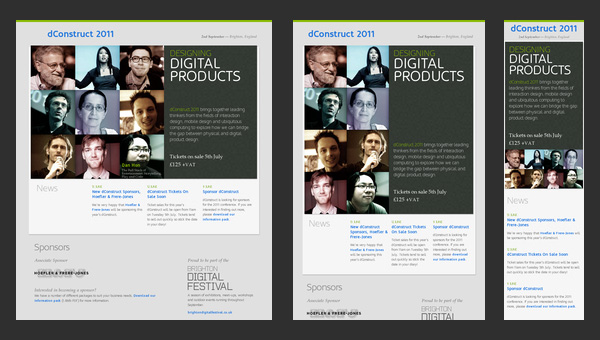
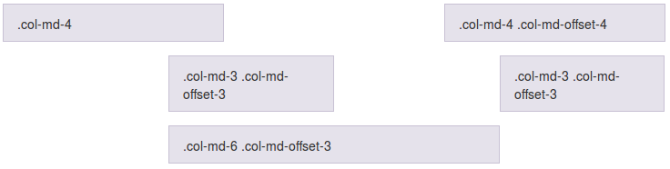

<!-- *********************************************************************** -->
# Introducción al diseño "responsive"

El diseño web _responsive_, adaptable o adaptativo, conocido por las siglas _RWD_ (del inglés, _Responsive Web Design_) es una filosofía de diseño y desarrollo cuyo objetivo es adaptar la apariencia de las páginas web al dispositivo que se esté utilizando para visualizarla. Hoy día las páginas web se visualizan en multitud de tipos de dispositivos como tabletas, _smartphones_, libros electrónicos, portátiles, PCs, etc. Esta tecnología pretende que con un solo diseño web tengamos una visualización adecuada en cualquier dispositivo.

El diseño _responsive_ se basa en proporcionar a todos los usuarios de una web los mismos contenidos y una experiencia de usuario lo más similar posible, frente a otras aproximaciones al desarrollo web móvil como la creación de _apps_, el cambio de dominio o webs servidas dinámicamente en función del dispositivo.

Aunque todas tienen pros y contras, la web _responsive_ es considerada por muchos expertos como la mejor práctica posible, al unificar la web, reducir tiempos de desarrollo y ofrecer grandes ventajas para SEO móvil.


<!-- *********************************************************************** -->
## Variabilidad en las resoluciones de pantalla

Durante muchos años el desarrollo web se ha basado en la resolución estándar de 1024×768 (hace apenas 3 años aproximadamente el 40% de los usuarios tenía esta resolución). Pero en la actualidad existe una amplia variedad de resoluciones, no solo en pantallas de ordenadores de escritorio sino también para _tablets_ y dispositivos móviles.


Es muy importante conocer todas estas estadísticas así como cuales son las dimensiones de pantalla de los usuarios, a qué público vamos dirigidos, etc. y así poder tenerlo en cuenta en la usabilidad de nuestra web. Ya no es posible centrar el desarrollo pensando que los usuarios van a tener (en un alto porcentaje) una única resolución de pantalla.

Desde hace ya unos años en el desarrollo web se ha sustituido en cierta medida el problema de la compatibilidad de navegadores (gracias a que poco a poco todas las compañías se están ciñendo a los estándares con HTML5/CSS3 y otras se basan directamente en web-kit) por el problema de las resoluciones de los dispositivos.

En la siguiente tabla se pueden ver las últimas estadísticas (2014) de las resoluciones de pantalla más utilizadas:

| Resolución     | % utilización |
| -------------- | ------------ |
| **> 1920x1080** | 34% |
| 1920x1080    | 13% |
| **1366x768** | 31% |
| 1280x1024    | 8% |
| 1280x800     | 7% |
| 1024x768     | 6% |
| 800×600      | 0.5% |
| < 800×600    | 0.5% |

En la actualidad ya no es 1024x768 la resolución más utilizada, sino que es 1366×768 y resoluciones superiores a 1920x1080.

Es fundamental tener en cuenta que en el diseño _responsive_, al variar tanto las posibles resoluciones en las que se verá nuestra web deberemos mostrar en primer lugar los contenidos más importantes e imprescindibles.


<!-- *********************************************************************** -->
## Ejemplos de sitios web creados con tecnología _Responsive_

En un artículo llamado: "_Responsive Web Design: 50 Examples and Best Practices_" muestra excelentes ejemplos de la aplicación de esta tecnología. Algunos de estos ejemplos son:

**dConstruct 2011**



**Boston Globe**


**Food Sense**


**Deren keskin**


<!-- *********************************************************************** -->
## Funcionamiento del diseño adaptable

El diseño _responsive_ se basa en adaptar dinámicamente el diseño web en función de la resolución de la pantalla del visitante. De esta forma adaptamos nuestras webs a dispositivos móviles sin necesidad de tener dos sitios separados y al mismo tiempo también podemos adaptar la web a resoluciones grandes para mejorar la experiencia de usuario.

Antiguamente se pensaba en hacer 2 diseños, uno para móviles y otro para web, sin embargo, el diseño _responsive_ trata de estructurar o adaptar el contenido que ya tienes en el diseño original a otros formatos diferentes: móviles, _tablets_ y versión de escritorio, como bien muestra esta imagen:


La solución técnica que se le ha dado en el desarrollo web al problema de esta diversidad de resoluciones web se llama _Responsive Web Design_ y nos permite hacer interfaces adaptadas al entorno del usuario mediante estructuras, bloques, columnas e imágenes fluidas gracias a _media-queries_ de CSS.

A partir de CSS 2.1 las hojas de estilo han incluido los _media types_, lo cual nos ha facilitado, por ejemplo, proveer un estilo distinto para el diseño de impresión:

```html
<link rel="stylesheet" type="text/css" href="core.css" media="screen" />
<link rel="stylesheet" type="text/css" href="print.css" media="print" />
```

A partir de CSS 3 el W3C creó las _media queries_. Una media query nos permite apuntar no sólo a ciertas clases de dispositivos, sino realmente inspeccionar las características físicas del dispositivo que está renderizando nuestro trabajo. Para utilizarlas podemos incorporar una _query_ al atributo media de un _link_ a una hoja de estilos:


```html
<link rel="stylesheet" type="text/css" media="screen and (max-device-width: 480px)" href="shetland.css" />
```

La _query_ contiene dos componentes:

* Un media type (_screen_, _print_ o _all_).
* La consulta entre paréntesis, conteniendo una característica a inspeccionar (max-device-width o min-device-width) seguida por el valor al que apuntamos (480px).

También es posible utilizarlas directamente en el CSS como parte de una regla `@media`:

```css
@media screen and (max-device-width: 480px) {
    .column {
        float: none;
    }
}
```

Por ejemplo, si quisiéramos crear un estilo de bloques _fluidos_ que para pantallas grandes se muestre uno a continuación del otro y para pantallas pantallas cambie a mostrarse de forma apilada, uno encima de otro, podríamos hacer algo como:

```css
@media all and (max-width: 800px) {
	.bloque{
		display: block !important;
		/* Cuando el ancho sea inferior a 800px el elemento será un bloque */
		width: auto !important;
	}
}
.bloque {
	display: inline-block;	/* Para que se muestren los bloques en línea */
	height:300px;
	width: 300px;
	border:1px solid #333;
	background: #999;
	margin:20px;
}
```

Para más información podéis consultar: http://www.w3.org/TR/css3-mediaqueries/


<!-- *********************************************************************** -->
## Probando el responsive

Para probar nuestros diseños _responsive_ tenemos varias opciones, una de ellas es usar algunas de las webs que existen para tal fin. Como por ejemplo:

**Dimensions Toolkit** (http://www.dimensionstoolkit.com)

Se puede utilizar tanto de forma _online_ como descargar su extensión para Chrome. Para facilitar el trabajo incorpora una serie de tamaños prefijados entre los cuales se puede ir cambiando.


**Responsinator** (http://www.responsinator.com)

Esta herramienta está disponible solamente de forma _online_, pero nos permite ver de un solo vistazo como se mostraría nuestra web con el tamaño de los _smarthones_ y _tablets_ más populares, como por ejemplo las diferentes versiones de iPhone, iPad, Kindle y algunas versiones de teléfonos Android.


El problema de estas herramientas es que tenemos que acceder a una versión publicada de nuestra web (no permiten localhost) y son un poco más lentas para realizar pruebas continuas, por esta razón es mucho más recomendable utilizar alguno de los kits de herramientas para el desarrollador web que existen para los diferentes navegadores.


<!-- *********************************************************************** -->
**Herramientas para el desarrollador del navegador**

Tanto en Firefox como Chrome viene instalado por defecto una serie de herramientas de ayuda para el desarrollador que nos permiten, entre otras cosas, ver la consola de mensajes, inspeccionar el código o ver la secuencia de llamadas al servidor.


Además de estas también existen otras herramientas más avanzadas que podemos instalar como una extensión de nuestro navegador, como por ejemplo Firebug.

La ventaja de estas herramientas frente a las anteriores es que son muchos más rápidas, nos permiten probar nuestra página en local y además podemos inspeccionar el código y modificar los estilos en tiempo real. Usando el inspector de estas herramientas nos podemos ahorrar mucho tiempo a la hora de realizar pruebas sobre la propia página cargada, ya que de otra forma tendríamos que modificar el código directamente, recargar la página y volver a probarlo.


<!-- *********************************************************************** -->
## Frameworks responsive

Como se suele decir, en vez de reinventar la rueda y programar nosotros todo el diseño _responsive_, podemos aprovechar algunos de los _frameworks_ que existen en el mercado para este propósito. Nos ahorrarán muchísimo tiempo, partiremos de código ampliamente probado, y de unos diseños base de todos los elementos web bastante más bonitos que la que tendrían de forma nativa.

Actualmente existen en el mercado una amplia variedad de este tipo _frameworks responsive_, algunos de los más utilizados son:

* **Bootstrap** (http://getbootstrap.com/): Este framework es uno de los más populares del mercado, habiendo sido desarrollado por el equipo de Twitter. Bootstrap ha sido creado pensando en ofrecer la mejor experiencia de usuario tanto a usuarios de PC (IE7 incluido!), como a smartphones y tabletas. Utiliza un grid responsive de 12 columnas y trae integrado decenas de complementos, plugins de JavaScript, tipografía, controladores de formularios y mucho más. Además utiliza el preprocesador de CSS LESS.

* **Foundation** (http://foundation.zurb.com/): Junto con Bootstrap es uno de los _frameworks_ más avanzados que existen en la actualidad. Ha sido desarrollado con SASS, un potente preprocesador de CSS que hace de Foundation un _framework_ fácilmente personalizable. Además saca partido de las nuevas tecnologías y funciona con IE8+.

* **Skeleton** (http://getskeleton.com/): Skeleton es un _boilerplate_ que ofrece un grid responsive basado en una resolución de 960px que se ajusta al tamaño de los dispositivos móviles. Tiene poco peso e incluye una colección de archivos CSS y JS para facilitarnos el diseño de nuestra web.

* **HTML5 Boilerplate** (http://html5boilerplate.com/): Al igual que los demás nos ofrece un set de utilidades para construir nuestra web responsive de forma rápida y sencilla, con la ventaja de ser uno de los que menos ocupan.


En este curso nos vamos a centrar en **Bootstrap** por ser uno de los _frameworks_ más completos, más utilizados y que mejor funcionan. En las siguientes secciones estudiaremos en detalle el funcionamiento de esta librería.


<!-- *********************************************************************** -->
<!-- *********************************************************************** -->
<!-- *********************************************************************** -->
<!-- *********************************************************************** -->
## Bootstrap

Como ya hemos comentado antes, Bootstrap es uno de los _frameworks_ más populares y utilizados del mercado para la creación de páginas _responsive_, habiendo sido desarrollado por el equipo de Twitter.

Entre los navegadores soportados se encuentran Chrome, Firefox, Opera, Safari e Internet Explorer a partir de la versión 8 (aunque en la versión 7 también funciona correctamente).

Está preparado para funcionar tanto en navegadores de PCs y portátiles con cualquier tamaño de pantalla así como para _tablets_ y _smartphones_ de tamaños mucho más reducidos.

Para conseguir que una misma web se pueda visualizar correctamente en todos esos tamaños de pantalla ha diseñado un avanzado sistema de rejilla dividido en columnas para el posicionamiento de los elementos de nuestra web. Además incorpora otras muchas utilidades y complementos (formularios, botones, barras de navegación, etc.) para simplificar el desarrollo de una web _responsive_.


<!-- *********************************************************************** -->
### Página básica

Bootstrap utiliza ciertos elementos HTML y propiedades CSS que requieren el uso del _doctype_ de HTML 5 para que funcionen, por lo que es importante añadirlo a todas nuestras páginas:

```html
<!DOCTYPE html>
<html lang="en">
  ...
</html>
```

Además para asegurar que se muestra correctamente en dispositivos móviles y que permite la utilización del zoom al arrastrar tenemos que añadir la siguiente etiqueta `meta` dentro de la cabecera `<head>`:

```html
<meta name="viewport" content="width=device-width, initial-scale=1">
```

A continuación se incluye una plantilla HTML base para cualquier proyecto con Bootstrap, a partir de la cual se tendrán que ir añadiendo el resto de elementos:

```html
<!DOCTYPE html>
<html lang="en">
  <head>
    <meta charset="utf-8">
    <meta http-equiv="X-UA-Compatible" content="IE=edge">
    <meta name="viewport" content="width=device-width, initial-scale=1">
    <title>Plantilla básica de Bootstrap</title>

    <!-- Bootstrap -->
    <link href="css/bootstrap.min.css" rel="stylesheet">

    <!-- librerías opcionales que activan el soporte de HTML5 para IE8 -->
    <!--[if lt IE 9]>
      <script src="https://oss.maxcdn.com/html5shiv/3.7.2/html5shiv.min.js"></script>
      <script src="https://oss.maxcdn.com/respond/1.4.2/respond.min.js"></script>
    <![endif]-->
  </head>
  <body>
    <h1>¡Hola Mundo!</h1>

    <!-- Librería jQuery requerida por los plugins de JavaScript -->
    <script src="https://ajax.googleapis.com/ajax/libs/jquery/1.11.1/jquery.min.js"></script>
    <!-- Todos los plugins JavaScript de Bootstrap (también puedes
         incluir archivos JavaScript individuales de los únicos
         plugins que utilices) -->
    <script src="js/bootstrap.min.js"></script>
  </body>
</html>
```

Es posible deshabilitar el zoom para dispositivos móviles añadiendo `user-scalable=no` a la etiqueta _meta_ del _viewport_ (como se puede ver en el ejemplo inferior). De esta forma los usuarios únicamente podrán usar el scroll de la aplicación, haciendo tu web más similar a una aplicación nativa. Sin embargo, hay que usar esta característica con cuidado ya que no es recomendable para todos los sitios.

```html
<meta name="viewport" content="width=device-width, initial-scale=1, maximum-scale=1, user-scalable=no">
```


<!-- *********************************************************************** -->
### Sistema de rejilla

El sistema de rejilla de Bootstrap se basa en la creación o disposición del contenido de nuestra web dentro de rejillas flexibles, las cuales se escalarán al tamaño y posición adecuada de forma automática dependiendo del tamaño de la pantalla en la que se rendericen.


#### Elemento contenedor

El sistema de rejilla tiene que ser utilizado dentro de uno de los dos elementos contenedores que provee Bootstrap: `container` ó `container-fluid`. Es importante tener en cuenta que estos elementos se utilizan como raíz de la rejilla y no se podrán anidar unos dentro de otros.

Si lo que queremos es que el contenido de nuestra web aparezca centrado y con un ancho fijo entonces podemos utilizar la etiqueta `.container`, de la forma:

```html
<div class="container">
  ...
</div>
```

Por el contrario, si queremos que el contenido de nuestra web pueda ocupar todo el ancho disponible (hay que tener en mente todos los tamaños de pantalla, incluso las muy grandes), podemos usar la etiqueta `.container-fluid`:

```html
<div class="container-fluid">
  ...
</div>
```


#### Funcionamiento del sistema de rejillas

El sistema de rejilla está pensado para ayudarnos en la disposición de los contenidos de nuestra web y su adaptación a los diferentes tamaños de pantalla de forma automática. Para ello tenemos que poner el contenido dentro de celdas o columnas que irán dentro de filas. Cada fila se puede dividir hasta en 12 columnas, pero seremos nosotros los que definiremos el número de columnas deseado para cada tamaño de pantalla.

A continuación se detalla el funcionamiento de este sistema:

* Las columnas irán agrupadas dentro de filas (`.row`).

* Las filas (`.row`) se deben colocar dentro de una etiqueta contenedora: `.container` (para ancho fijo) o `.container-fluid` (para poder ocupar todo el ancho), esto permitirá alinear las celdas y asignarles el espaciado correcto.

* El contenido se debe disponer dentro de columnas o celdas, las cuales deben de ser el único hijo posible de las filas (`.row`), las cuales, a su vez, serán el único hijo posible del contenedor (`.container` o `.container-fluid`).

* Al seguir este orden el sistema de rejilla funcionará correctamente, creando el espaciado interior y los márgenes apropiados dependiendo de las dimensiones de la pantalla.

* Cada fila se puede dividir hasta un máximo de 12 columnas, pero somos nosotros los que tendremos que definir el número de columnas en el que queremos dividir cada fila y su ancho para cada tamaño de pantalla. Por ejemplo: 3 columnas de igual ancho.

* Si el tamaño total de las columnas de una fila excede de 12 el tamaño sobrante se colocará en la siguiente fila.

* El tamaño de las columnas se especificará con clases css que Bootstrap define para cada tamaño de pantalla, por ejemplo `.col-md-XX`, donde `XX` es el tamaño de la columna, que podrá tomar valores entre 1 y 12.


En la siguiente tabla se muestra un resumen del sistema de rejilla de Bootstrap, su comportamiento según el tamaño del dispositivo y las clases CSS que nos permiten controlarlo:

| Pantalla   | Prefijo de la clase  | Ancho del contenedor   |
| --         | --                            | --            |
| Tamaño extra pequeño <br>Teléfonos (&lt;768px) | .col-xs- | Ninguno (automático) |
| Tamaño pequeño <br>_Tablets_ (&ge;768px)      | .col-sm- | 750px |
| Tamaño medio <br>Escritorios (&ge;992px)    | .col-md- | 970px |
| Tamaño grande <br>Escritorios (&ge;1200px)    | .col-lg- | 1170px |


Es importante destacar al definir estas clases no solo se aplican para ese tamaño de pantalla sino para los superiores también. Por ejemplo al indicar el tamaño de las columnas con las clases para _tablets_ (_.col-sm-_), también se aplicará para los tamaños de pantalla medianos y grandes (si no hubieran otras clases para estos tamaños que los sobreescribieran).


#### Ejemplos

A continuación se incluyen algunos ejemplos de uso del sistema de rejilla que nos ayudarán a comprender mejor su funcionamiento.


**Ejemplo: selección de tamaño de las columnas solo para pantallas de escritorio **

En el siguiente ejemplo se han creado 3 filas, la primera dividida 2 columnas de tamaño desigual, la segunda en 3 columnas de igual tamaño y la tercera en 2 columnas también de igual tamaño.

```html
<div class="row">
  <div class="col-md-8">.col-md-8</div>
  <div class="col-md-4">.col-md-4</div>
</div>
<div class="row">
  <div class="col-md-4">.col-md-4</div>
  <div class="col-md-4">.col-md-4</div>
  <div class="col-md-4">.col-md-4</div>
</div>
<div class="row">
  <div class="col-md-6">.col-md-6</div>
  <div class="col-md-6">.col-md-6</div>
</div>
```

En la siguiente imagen se puede ver el resultado para una pantalla mediana (de escritorio):


Dado que las columnas se han especificado únicamente mediante las clases `.col-md-*` esto creará estas divisiones solo para las pantallas de escritorio medianas y grandes, pero no para los tamaños de pantalla pequeños (_tablets_ y móviles). En estos dos últimos casos las columnas se ampliarán para ocupar todo el ancho y por lo tanto se mostrarán apiladas de la forma:


**Ejemplo: selección del tamaño para móvil y escritorio**

Si no queremos que las columnas se muestren apiladas para tamaños de pantalla pequeños podemos indicar también la disposición para esos casos mediante las clases `.col-xs-*` además de las que ya teníamos `.col-md-*`. Por ejemplo:

```html
<!-- En pantallas pequeñas aparecerá una columna que ocupará todo el ancho
y otra que ocupará la mitad de la pantalla -->
<div class="row">
  <div class="col-xs-12 col-md-8">.col-xs-12 .col-md-8</div>
  <div class="col-xs-6 col-md-4">.col-xs-6 .col-md-4</div>
</div>

<!-- En pantallas pantallas se indica que ocupe cada columna la mitad
del ancho disponible -->
<div class="row">
  <div class="col-xs-6 col-md-4">.col-xs-6 .col-md-4</div>
  <div class="col-xs-6 col-md-4">.col-xs-6 .col-md-4</div>
  <div class="col-xs-6 col-md-4">.col-xs-6 .col-md-4</div>
</div>

<!-- Como no se indica el tamaño para pantallas grandes las columnas
siempre ocuparán el 50% -->
<div class="row">
  <div class="col-xs-6">.col-xs-6</div>
  <div class="col-xs-6">.col-xs-6</div>
</div>
```

En la siguiente imagen se puede ver como quedaría el código de ejemplo para pantallas medianas (md) y grandes (lg):


En el caso de pantallas pequeñas las columnas se verían de la forma:


**Ejemplo: selección del tamaño para móvil, _tablet_ y escritorio**

Si queremos tener un mayor control podemos especificar también el tamaño de las columnas para las pantallas tipo _tablet_ con las clases `.col-sm-*`. Por ejemplo:

```html
<div class="row">
  <div class="col-xs-12 col-sm-6 col-md-8">.col-xs-12 .col-sm-6 .col-md-8</div>
  <div class="col-xs-6 col-md-4">.col-xs-6 .col-md-4</div>
</div>
<div class="row">
  <div class="col-xs-6 col-sm-4">.col-xs-6 .col-sm-4</div>
  <div class="col-xs-6 col-sm-4">.col-xs-6 .col-sm-4</div>
  <div class="col-xs-6 col-sm-4">.col-xs-6 .col-sm-4</div>
</div>
```

A continuación se incluye una previsualización de este código de ejemplo para pantallas medianas y grandes:


El mismo código pero en pantallas tipo _tablet_ se mostraría como:


Y en el caso de pantallas pequeñas (xs) se vería de la forma:


#### Forzar el cambio de fila

Mediante la clase `.clearfix` podemos forzar el cambio de fila cuando nosotros queremos. Esta clase nos puede ser útil cuando por ejemplo las filas tengan un alto distinto o para forzar el cambio de fila solo para determinados tamaños de pantalla mediante la combinación con otras clases (por ejemplo si añadimos `visible-xs-block` solo se producirá ese cambio de fila para pantallas pequeñas).

```html
<div class="row">
  <div class="col-xs-6 col-sm-3">.col-xs-6 .col-sm-3</div>
  <div class="col-xs-6 col-sm-3">.col-xs-6 .col-sm-3</div>

  <!-- Add the extra clearfix for only the required viewport -->
  <div class="clearfix visible-xs-block"></div>

  <div class="col-xs-6 col-sm-3">.col-xs-6 .col-sm-3</div>
  <div class="col-xs-6 col-sm-3">.col-xs-6 .col-sm-3</div>
</div>
```

En la siguiente imagen podemos ver un ejemplo en el que no se ha utilizado la clase `.clearfix` y debido a que las dos primeras columnas tienen un alto distinto la primera columna de la siguiente fila se coloca en una posición incorrecta:


Si añadimos la clase `.clearfix` como en el código de ejemplo podemos solucionar ese problema, quedando:


#### Anidamiento de columnas

Una característica muy potente del sistema de columnas es que se pueden anidar unas dentro de otras, por ejemplo, dentro de una columna de tamaño 9 podemos crear una nueva fila y subdividirla como queramos (igual que si fuera una fila normal, con hasta 12 columnas). A continuación se incluye un ejemplo:

```html
<div class="row">
  <div class="col-sm-9">
    Level 1: .col-sm-9
    <div class="row">
      <div class="col-xs-8 col-sm-6">
        Level 2: .col-xs-8 .col-sm-6
      </div>
      <div class="col-xs-4 col-sm-6">
        Level 2: .col-xs-4 .col-sm-6
      </div>
    </div>
  </div>
</div>
```


#### Márgenes o espaciado entre columnas

Es posible crear un espaciado entre las columnas o dicho de otra forma, mover o desplazar una columna hacia la derecha, añadiendo un _offset_ inicial mediante las clases: `.col-*-offset-*`. Por ejemplo `col-md-offset-4` creará un espacio a la izquierda de la columna de tamaño 4 (como si se creara una columna oculta de tipo `.col-md-4`). En el siguiente código podemos ver un ejemplo más completo:

```html
<div class="row">
  <div class="col-md-4">.col-md-4</div>
  <div class="col-md-4 col-md-offset-4">.col-md-4 .col-md-offset-4</div>
</div>
<div class="row">
  <div class="col-md-3 col-md-offset-3">.col-md-3 .col-md-offset-3</div>
  <div class="col-md-3 col-md-offset-3">.col-md-3 .col-md-offset-3</div>
</div>
<div class="row">
  <div class="col-md-6 col-md-offset-3">.col-md-6 .col-md-offset-3</div>
</div>
```

El cual se renderizaría de la forma:



Si en algún caso necesitamos eliminar el _offset_ podemos utilizar el tamaño cero (0). Por ejemplo, si especificamos un _offset_ de 2 para tamaños pequeños y no queremos que dicho _offset_ se aplique para pantallas grandes o medias tendríamos que hacer:

```html
  <div class="col-sm-5 col-sm-offset-2 col-md-7 col-md-offset-0"></div>
```


#### Ordenación de columnas

También podemos modificar el orden de las columnas mediante las clases `.col-*-push-*` y `.col-*-pull-*`. Por ejemplo, con `.col-md-push-3` "empujaríamos" la columna 3 espacios hacia la derecha y con `.col-md-pull-3` la empujaríamos 3 espacios hacia la izquierda. A continuación podemos ver un ejemplo:

```html
<div class="row">
  <div class="col-md-9 col-md-push-3">.col-md-9 .col-md-push-3</div>
  <div class="col-md-3 col-md-pull-9">.col-md-3 .col-md-pull-9</div>
</div>
```

El cual quedaría de la forma:


Hay que tener cuidado con estas clases si hay un cambio de fila (debido a el número de columnas ocupe más de 12), en estos casos estas clases no funcionarán correctamente.

Si queremos restaurar la posición podemos utilizar el tamaño cero (0). Por ejemplo, si habíamos desplazado la columna hacia la derecha para tamaños de pantalla pequeños y queremos que no se aplique en tamaños de pantalla medianos y grandes podríamos utilizar la clase `col-md-push-0`.


### Utilidades _Responsive_

Bootstrap también incluye una serie de clases para ayudarnos a mostrar u ocultar contenidos según el tamaño del dispositivo. A continuación se incluye una tabla resumen de todas estas clases:

|    | Extra pequeño<br>Teléfonos (<768px) | Tamaño pequeño<br>_Tablets_ (≥768px) | 	Tamaño medio<br>Escritorios (≥992px) | Tamaño grande<br>Escritorios (≥1200px) |
| ------------- | ----------- | ----------- | ----------- | ----------- |
| .visible-xs-* | **Visible** |	Oculto      | Oculto      |	Oculto      |
| .visible-sm-* | Oculto      |	**Visible** | Oculto      |	Oculto      |
| .visible-md-* | Oculto      |	Oculto     	| **Visible** |	Oculto      |
| .visible-lg-* | Oculto      |	Oculto     	| Oculto      |	**Visible** |
| .hidden-xs    | Oculto      |	**Visible** | **Visible** |	**Visible** |
| .hidden-sm 	| **Visible** |	Oculto     	| **Visible** |	**Visible** |
| .hidden-md    | **Visible** |	**Visible** | Oculto      |	**Visible** |
| .hidden-lg    | **Visible** |	**Visible** | **Visible** |	Oculto      |

En el caso de la clase `.visible-*-*` tenemos la posibilidad de indicar la forma en la que se mostrará el elemento sobre el que se aplique (los posibles valores se corresponden con los que puede adoptar la propiedad `display` de CSS). Por lo que tendríamos:

| Group of classes 	| CSS display |
| ----------------- | ----------- |
| .visible-*-block 	| display: block; |
| .visible-*-inline | display: inline; |
| .visible-*-inline-block | display: inline-block; |

Por lo que para por ejemplo las pantallas extra pequeñas (xs) podríamos utilizar las clases: `.visible-xs-block`, `.visible-xs-inline`, y `.visible-xs-inline-block`. Siendo `.visible-xs-block` la más común y utilizada, para por ejemplo mostrar una columna solo ante un determinado tamaño de pantalla.


Hay que tener en cuenta que las clases `visible-*-*` solo se mostrarán para el tipo de dispositivo indicado, es decir, si por ejemplo indicamos que un campo solo es visible con la etiqueta `visible-md-block` dicho campo no aparecerá para resoluciones inferiores ni tampoco para pantallas tipo _large_.

Por el contrario, las etiquetas tipo `.hidden-` solo se ocultarán el elemento para el tamaño indicado, quedando visible para el resto de tamaños.


### _Media queries_

En la mayoría de los casos gracias a todas las clases que provee Bootstrap nos será suficiente para componer nuestra web. Sin embargo, en algunas situaciones es posible que queramos modificar dicho comportamiento, por ejemplo para aplicar determinados estilos CSS (como colores, alineaciones, etc.) que cambien según el tamaño de pantalla. En estos casos será necesario que creemos nuestra propia _media query_ para aplicar los estilos deseados.

Una _media query_ se define de la forma:

```css
@media (min-width: TAMAÑO-EN-PÍXELES) {
    /* Los estilos aquí contenidos solo se aplicarán a partir
    del tamaño de pantalla indicado */
}
```

En este caso, los estilos que estén dentro de esta _media query_ se aplicarán solo a partir del tamaño en píxeles indicado. Además de un tamaño mínimo podemos indicar el tamaño máximo o el rango de tamaño en el que se aplicarán, de la forma:

```css
@media (max-width: TAMAÑO-EN-PÍXELES) {
    /* Estos estilos solo se aplicarán hasta el tamaño indicado */
}
@media (min-width: TAMAÑO-EN-PÍXELES) and (max-width: TAMAÑO-EN-PÍXELES) {
    /* Solo se aplicarán entre los tamaños indicados */
}
```

Recordamos que los rangos que define Bootstrap son:

* Pantallas extra pequeñas (móviles) < 768px
* Pantallas pequeñas (_tablets_) ≥ 768px
* Pantallas medianas (escritorio) ≥ 992px
* Pantallas grandes (escritorio) ≥ 1200px

Por lo que si por ejemplo queremos que en las pantallas extra pequeñas (xs) el color de fondo que aplica la clase `.miestilo` sea rojo y para el resto de tamaños sea verde, podríamos hacer:

```css
.miestilo {
    background-color: green;
}
@media (max-width: 768px) {
    .miestilo {
        background-color: red;
    }
}
```

O si por ejemplo queremos variar la alineación del texto que se aplica en una clase a partir de las pantallas tipo escritorio:

```css
.miestilo {
    text-align: center;
}
@media (min-width: 992px) {
    .miestilo {
        text-align: left;
    }
}
```


<!-- *********************************************************************** -->
<!-- *********************************************************************** -->
<!-- *********************************************************************** -->
<!-- *********************************************************************** -->


<!-- *********************************************************************** -->
# Ejercicios sobre diseño _responsive_


## Ejercicio 1 - Diseño _responsive_ (1 punto)

En este ejercicio vamos a practicar con la librería Bootstrap y su sistema de rejilla. Partiremos de la plantilla para una página web básica facilitada en la teoría, le añadiremos un contenedor de tipo `container` e iremos añadiendo filas y columnas intentando imitar el diseño (y colores) del esquema de la siguiente figura:


En el esquema de la figura se pueden ver tres disposiciones de la misma web, la de la izquierda se refiere a los tamaños grandes (lg) y medianos (md), la disposición central al tamaño pequeño o de _tablets_ (sm) y la de la derecha la correspondiente a móviles (xs).

Tenéis que aplicar las clases de Bootstrap necesarias para que al cambiar el tamaño de la pantalla se cambie la disposición de los bloques como se muestra en el esquema. Tened en cuenta que la columna roja tendrá que desaparecer cuando el tamaño sea extra pequeño (xs).


## Ejercicio 2 - _Offset_ y ordenación (1 punto)

En este ejercicio vamos a practicar con algunas características más de Bootstrap: la posibilidad de añadir un _offset_ (o espacio inicial a las columnas), el cambio de orden de los elementos de una fila y la visibilidad de las columnas según el tamaño del dispositivo.

Para ello nos crearemos una nueva página web partiendo de la plantilla básica, le añadiremos un contendor de tipo `container` e iremos añadiendo filas y columnas intentando imitar el diseño, colores y contenidos del esquema de la siguiente figura:


Tened en cuenta que:

* La segunda fila (que contiene 4 columnas con los números 1, 2, 3 y 4) es solamente una fila a la que se le han añadido _offsets_. Para forzar el cambio de fila se puede añadir un elemento entre la 2ª y la 3ª columna que solo sea visible cuando la pantalla sea mediana o grande (md o lg) y que aplique la clase `clearfix` de Bootstrap.
* El orden de la tercera fila (con las letras a, b, c, d) se ha alterado para las disposiciones de pantalla grandes (md o lg) usando las clases de bootstrap `col-*-push-*` y `col-*-pull-*`.
* En la 5ª fila naranja se ha aplicado un cambio de orden y un offset para las pantallas grandes y medianas (md o lg). Además, cuando la pantalla sea de tipo _xs_ se deberá de ocultar una de sus columnas.
* La fila azul claro en la que pone _Desktop_ (para pantallas lg o md), _Tablet_ (para sm) y _Mobile_ (cuando la pantalla es xs) en realidad son 3 filas distintas con clases para que solo se muestren en dichos tamaños de pantalla.
* La última fila se deberá de ocultar solamente cuando la pantalla sea del tipo _xs_.


## Ejercicio 3 - Personalizando mediante _media query_ (1 punto)

En este ejercicio se pide que creéis una nueva página web usando la librería Bootstrap. El contenido aparecerá centrado en la pantalla y constará de tres filas con el siguiente contenido y disposición cuando la pantalla sea de tamaño medio (md) y grande (lg):

* Una fila en la parte superior con una única columna con fondo verde que ocupará todo el ancho, en dicha columna aparecerá el texto "_Header_" alineado a la izquierda y en grande.
* Una segunda fila con tres columnas en color rojo con el mismo ancho y con los números 1, 2 y 3 (respectivamente) centrados y en letras grandes.
* La tercera y última fila contendrá dos columnas de igual ancho y en color amarillo, la primera columna tendrá el texto "_footer 1_" alineado a la derecha y la segunda el texto "_footer 2_" alineado a la izquierda (ambos usando un tamaño de fuente grande).

En la siguiente imagen se puede ver un esquema de la web a realizar:


Como se puede ver en el esquema de la imagen la disposición de las columnas y la alineación de los textos variará dependiendo del tamaño de la pantalla. Tenéis que reproducir este comportamiento para que la apariencia de la web sea similar al esquema (número de columnas, alineaciones de los textos y colores) cuando el tamaño de la pantalla sea la de un _tablet_ (sm) o la de un teléfono (xs).

Tened en cuenta que:

* Siempre que sea posible se utilizarán las clases que provee Bootstrap.
* Cuando no sea posible (por ejemplo para controlar la alineación de los textos y el cambio de color de fondo) tendréis que definir una _media query_ que lo haga.


