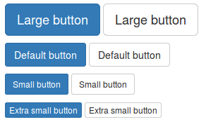
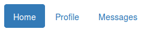

# Aspectos avanzados del diseño "responsive"

Además del sistema de rejilla Bootstrap incluye un completo conjunto de componentes para facilitarnos aún más el diseño de una web _responsive_. Estos componentes aplican estilos a los elementos HTML existentes para crear un diseño más moderno y además adaptable a todos los dispositivos.

Algunos de estos componentes son: barras de navegación, botones, formularios, tablas, desplegables y muchos más. A continuación se explica el funcionamiento de los componentes más utilizados.


<!-- *********************************************************************** -->
## Botones

Mediante la clase `.btn` podemos aplicar estilo a los elementos tipo `button`. Esta clase la podemos combinar con `.btn-default`, `.btn-primary`, `.btn-success`, `.btn-info`, `.btn-warning`, `.btn-danger`, `.btn-link` para crear botones para diferentes estados o acciones en nuestros formularios:


```html
<button type="button" class="btn btn-default">Default</button>
<button type="button" class="btn btn-primary">Primary</button>
<button type="button" class="btn btn-success">Success</button>
<button type="button" class="btn btn-info">Info</button>
<button type="button" class="btn btn-warning">Warning</button>
<button type="button" class="btn btn-danger">Danger</button>
<button type="button" class="btn btn-link">Link</button>
```


<!-- *********************************************************************** -->
### Tamaño de los botones

Podemos variar el tamaño de los botones simplemente añadiendo las clases `.btn-lg`, `.btn-sm`, o `.btn-xs`:

```html
<p>
  <button type="button" class="btn btn-primary btn-lg">Large button</button>
  <button type="button" class="btn btn-default btn-lg">Large button</button>
</p>
<p>
  <button type="button" class="btn btn-primary">Default button</button>
  <button type="button" class="btn btn-default">Default button</button>
</p>
<p>
  <button type="button" class="btn btn-primary btn-sm">Small button</button>
  <button type="button" class="btn btn-default btn-sm">Small button</button>
</p>
<p>
  <button type="button" class="btn btn-primary btn-xs">Extra small button</button>
  <button type="button" class="btn btn-default btn-xs">Extra small button</button>
</p>
```




<!-- *********************************************************************** -->
### Elementos tipo botón

El estilo tipo botón no solo lo podemos aplicar sobre las etiquetas `button` sino que funcionará de la misma forma con `<a>` y `<input>`:

```html
<a class="btn btn-default" href="#" role="button">Link</a>
<button class="btn btn-default" type="submit">Button</button>
<input class="btn btn-default" type="button" value="Input">
<input class="btn btn-default" type="submit" value="Submit">
```


<!-- *********************************************************************** -->
## Desplegables

Bootstrap nos facilita la creación de botones con listas de opciones desplegables mediante la clase `.dropdown`. Este elemento requiere que el _plugin_ JavaScript de Bootstrap esté incluido en la plantilla. La estructura básica para crear un elemento de este tipo es la siguiente:

```html
<div class="dropdown">
  <button class="btn btn-default dropdown-toggle" type="button" id="dropdownMenu1" data-toggle="dropdown" aria-expanded="true">
    Dropdown
    <span class="caret"></span>
  </button>
  <ul class="dropdown-menu" role="menu" aria-labelledby="dropdownMenu1">
    <li role="presentation"><a role="menuitem" tabindex="-1" href="#">Action</a></li>
    <li role="presentation"><a role="menuitem" tabindex="-1" href="#">Another action</a></li>
    <li role="presentation"><a role="menuitem" tabindex="-1" href="#">Something else here</a></li>
    <li role="presentation"><a role="menuitem" tabindex="-1" href="#">Separated link</a></li>
  </ul>
</div>
```


Para alinear un menú a la derecha se puede utilizar la clase `.dropdown-menu-right`, por ejemplo:

```html
<ul class="dropdown-menu dropdown-menu-right" role="menu" aria-labelledby="dLabel">
  ...
</ul>
```


<!-- *********************************************************************** -->
### Encabezados en un desplegable

Para añadir un encabezado y dividir en secciones un desplegable podemos utilizar la clase `.dropdown-header` de la forma:

```html
<ul class="dropdown-menu" role="menu" aria-labelledby="dropdownMenu2">
  ...
  <li role="presentation" class="dropdown-header">Dropdown header</li>
  ...
</ul>
```


<!-- *********************************************************************** -->
### Separadores en un desplegable

También podemos añadir separadores en un desplegable simplemente utilizando la clase `.divider` de la forma:

```html
<ul class="dropdown-menu" role="menu" aria-labelledby="dropdownMenuDivider">
  ...
  <li role="presentation" class="divider"></li>
  ...
</ul>
```


<!-- *********************************************************************** -->
## Grupos de botones

Podemos crear un grupo de botones en una línea agrupándolos dentro de un elemento contenedor con la etiqueta `.btn-group`.

```html
<div class="btn-group" role="group" aria-label="...">
  <button type="button" class="btn btn-default">Left</button>
  <button type="button" class="btn btn-default">Middle</button>
  <button type="button" class="btn btn-default">Right</button>
</div>
```


Mediante la librería JavaScript de Bootstrap podemos añadir comportamientos tipo _checkbox_ o _radio button_ a un grupo de botones.


<!-- *********************************************************************** -->
### Barra de botones

La barra de botones nos permite combinar grupos de botones para crear componentes más avanzados:

```html
<div class="btn-toolbar" role="toolbar" aria-label="...">
  <div class="btn-group" role="group" aria-label="...">...</div>
  <div class="btn-group" role="group" aria-label="...">...</div>
  <div class="btn-group" role="group" aria-label="...">...</div>
</div>
```


<!-- *********************************************************************** -->
### Tamaños de los grupos de botones

Los grupos de botones nos permiten además indicar el tamaño de los botones para todo el conjunto mediante las etiquetas `.btn-group-*`:

```html
<div class="btn-group btn-group-lg" role="group" aria-label="...">...</div>
<div class="btn-group" role="group" aria-label="...">...</div>
<div class="btn-group btn-group-sm" role="group" aria-label="...">...</div>
<div class="btn-group btn-group-xs" role="group" aria-label="...">...</div>
```


<!-- *********************************************************************** -->
### Grupo de botones con desplegables

También es posible añadir desplegables a los grupos de botones. Para esto el desplegable tendrá que estar contenido a su vez dentro de otro grupo de botones, de la forma:

```html
<div class="btn-group" role="group" aria-label="...">
  <button type="button" class="btn btn-default">1</button>
  <button type="button" class="btn btn-default">2</button>

  <div class="btn-group" role="group">
    <button type="button" class="btn btn-default dropdown-toggle" data-toggle="dropdown" aria-expanded="false">
      Dropdown
      <span class="caret"></span>
    </button>
    <ul class="dropdown-menu" role="menu">
      <li><a href="#">Dropdown link</a></li>
      <li><a href="#">Dropdown link</a></li>
    </ul>
  </div>
</div>
```


Como se puede observar la única diferencia con un desplegable normal es que la etiqueta contenedora en vez de ser de tipo `.dropdown` es un `.btn-group`.


<!-- *********************************************************************** -->
## Formularios

Bootstrap aplica estilos a los elementos de tipo formulario para mejorar su apariencia y permitirnos crear diferentes alineaciones. La estructura básica de un formulario es la siguiente:

```html
<form role="form">
  <div class="form-group">
    <label for="exampleInputEmail1">Email address</label>
    <input type="email" class="form-control" id="exampleInputEmail1"
        placeholder="Enter email">
  </div>
</form>
```


Para permitir que Bootstrap ajuste correctamente el espaciado, cada bloque o grupo de un formulario (normalmente formado por una etiqueta `label` y algún elemento de entrada de datos como un _input_, _textarea_, etc.) tendrá que estar agrupado por una caja contenedora con la clase `.form-group`. Además a cada _input_ se le tiene que aplicar la clase `.form-control`.


Bootstrap sobrecarga y aplica estilos a los principales elementos de formulario definidos en HTML 5, como son: _text, password, datetime, datetime-local, date, month, time, week, number, email, url, search, tel,_ y _color_.


<!-- *********************************************************************** -->
### Formulario _inline_

Mediante la utilización de la clase `.form-inline` sobre la etiqueta `<form>` podemos crear formularios que se dispondrán en una sola línea. A continuación se incluye un ejemplo de este tipo de formularios:

```html
<form class="form-inline" role="form">
  <div class="form-group">
    <div class="input-group">
      <label class="sr-only" for="exampleInputEmail2">Email address</label>
      <div class="input-group-addon">@</div>
      <input type="email" class="form-control" id="exampleInputEmail2" placeholder="Enter email">
    </div>
  </div>
  <div class="form-group">
    <label class="sr-only" for="exampleInputPassword2">Password</label>
    <input type="password" class="form-control" id="exampleInputPassword2" placeholder="Password">
  </div>
  <div class="checkbox">
    <label>
      <input type="checkbox"> Remember me
    </label>
  </div>
  <button type="submit" class="btn btn-default">Sign in</button>
</form>
```


_Nota 1_: aunque los campos del formulario no contengan etiquetas (_labels_) es necesario incluirlas por cuestiones de accesibilidad, para dar soporte a los lectores de pantalla. Por este motivo se han incluido en el ejemplo anterior con la clase `.sr-only` (_screen readers only_).

_Nota 2_: Este estilo no se aplicará en pantallas pequeñas tipo móvil.


<!-- *********************************************************************** -->
### Formulario horizontal

Mediante la combinación de la clase `.form-horizontal` con el sistema de rejilla de Bootstrap podemos crear formularios horizontales como en el ejemplo siguiente:

```html
<form class="form-horizontal" role="form">
  <div class="form-group">
    <label for="inputEmail3" class="col-sm-2 control-label">Email</label>
    <div class="col-sm-10">
      <input type="email" class="form-control" id="inputEmail3" placeholder="Email">
    </div>
  </div>
  <div class="form-group">
    <label for="inputPassword3" class="col-sm-2 control-label">Password</label>
    <div class="col-sm-10">
      <input type="password" class="form-control" id="inputPassword3" placeholder="Password">
    </div>
  </div>
  <div class="form-group">
    <div class="col-sm-offset-2 col-sm-10">
      <div class="checkbox">
        <label>
          <input type="checkbox"> Remember me
        </label>
      </div>
    </div>
  </div>
  <div class="form-group">
    <div class="col-sm-offset-2 col-sm-10">
      <button type="submit" class="btn btn-default">Sign in</button>
    </div>
  </div>
</form>
```


Es importante que nos fijemos que no se utilizan las clases `.row` para crear filas, ya que son sustituidas por `.form-groups`. Además, podemos aplicar la clase de las columnas para las etiquetas `label` directamente sobre dicho elemento, sin necesidad de crear una caja contenedora.


<!-- *********************************************************************** -->
### Estados de validación de un formulario

Bootstrap también incluye clases para aplicar diferentes estados de validación a un formulario. Para utilizarlo simplemente tenemos que añadir las clases:  `.has-warning`, `.has-error`, o `.has-success` al elemento contenedor, en este caso a `.form-group`. De esta forma, el color de los elementos del formulario de dicho grupo cambiarán. A continuación podemos ver un ejemplo:

```html
<div class="form-group has-success">
  <label class="control-label" for="inputSuccess1">Input with success</label>
  <input type="text" class="form-control" id="inputSuccess1">
</div>
<div class="form-group has-warning">
  <label class="control-label" for="inputWarning1">Input with warning</label>
  <input type="text" class="form-control" id="inputWarning1">
</div>
<div class="form-group has-error">
  <label class="control-label" for="inputError1">Input with error</label>
  <input type="text" class="form-control" id="inputError1">
</div>
```


<!-- *********************************************************************** -->
### Agrupar _inputs_ con otros elementos

Podemos añadir texto o botones al principio, final o a ambos lados de campo tipo `<input>`. Para esto tenemos que agrupar dicho _input_ dentro de un `.input-group` y añadir dentro del grupo el elemento que queremos agrupar con la etiqueta `.input-group-addon`. A continuación se incluye un ejemplo:

```html
<div class="input-group">
  <span class="input-group-addon">@</span>
  <input type="text" class="form-control" placeholder="Username">
</div>

<div class="input-group">
  <input type="text" class="form-control">
  <span class="input-group-addon">.00</span>
</div>

<div class="input-group">
  <span class="input-group-addon">$</span>
  <input type="text" class="form-control">
  <span class="input-group-addon">.00</span>
</div>
```


<!-- *********************************************************************** -->
## Navegación

Los elementos de navegación de Bootstrap comparten la etiqueta `.nav` para su marcado en la clase contenedora. Estos elementos necesitan la librería JavaScript para su correcto funcionamiento. Algunos de los elementos de navegación que podemos utilizar son las fichas o pestañas y las "píldoras".


<!-- *********************************************************************** -->
### Fichas o pestañas

Mediante la clase `.nav-tabs` podemos crear un grupo de pestañas o fichas, para ello tenemos que seguir la siguiente estructura:

```html
<div role="tabpanel">
    <ul class="nav nav-tabs">
        <li role="presentation" class="active"><a href="#home" aria-controls="home" role="tab" data-toggle="tab">Home</a></li>
        <li role="presentation"><a href="#profile" aria-controls="profile" role="tab" data-toggle="tab">Profile</a></li>
        <li role="presentation"><a href="#messages" aria-controls="messages" role="tab" data-toggle="tab">Messages</a></li>
    </ul>

    <!-- Tab panes -->
    <div class="tab-content">
        <div role="tabpanel" class="tab-pane active" id="home">...</div>
        <div role="tabpanel" class="tab-pane" id="profile">...</div>
        <div role="tabpanel" class="tab-pane" id="messages">...</div>
    </div>
</div>
```


<!-- *********************************************************************** -->
### _Píldoras_

La clase `.nav-pills` se define de igual forma que la `.nav-tab` pero sus elementos adoptarán una apariencia más similar a botones o "píldoras":

```html
<ul class="nav nav-pills">
  <li role="presentation" class="active"><a href="#">Home</a></li>
  <li role="presentation"><a href="#">Profile</a></li>
  <li role="presentation"><a href="#">Messages</a></li>
</ul>
```




En este caso también podemos crear un menú vertical o apilado añadiendo la clase `.nav-stacked` a la etiqueta contenedora:

```html
<ul class="nav nav-pills nav-stacked">
  ...
</ul>
```


<!-- *********************************************************************** -->
#### Justificado

También podemos indicar que el ancho de las pestañas o de las píldoras se distribuya equitativamente según el ancho disponible. Para esto simplemente tenemos que aplicar la clase `.nav-justified` a la etiqueta contenedora, de la forma:

```html
<ul class="nav nav-tabs nav-justified">
  ...
</ul>
<ul class="nav nav-pills nav-justified">
  ...
</ul>
```


_Nota:_ Este estilo no funcionará para pantallas con un ancho menor a 768px, que son las pantallas definidas como extra pequeñas o de _smartphone_.


<!-- *********************************************************************** -->
#### Elementos de navegación con desplegables

Podemos añadir desplegables a nuestros elementos de navegación de la forma:

```html
<ul class="nav nav-tabs">
  ...
  <li role="presentation" class="dropdown">
    <a class="dropdown-toggle" data-toggle="dropdown" href="#" role="button" aria-expanded="false">
      Dropdown <span class="caret"></span>
    </a>
    <ul class="dropdown-menu" role="menu">
      ...
    </ul>
  </li>
  ...
</ul>
```


<!-- *********************************************************************** -->
## Barra de navegación

Bootstrap nos facilita la creación de la barra principal de navegación de nuestra web mediante la clase `.navbar`. Esta barra se adaptará al tamaño de pantalla, mostrando los elementos colapsados en un botón en pantallas pequeñas y de forma normal para pantallas más grandes.

Este elemento requiere que el _plugin_ de JavaScript de Bootstrap esté incluido. Además, para cumplir con las reglas de accesibilidad se recomienda añadir `role="navigation"` a nuestras barras de navegación.

A continuación se incluye un ejemplo completo de una barra de navegación:

```html
<nav class="navbar navbar-default" role="navigation">
  <div class="container-fluid">
    <!-- Brand and toggle get grouped for better mobile display -->
    <div class="navbar-header">
      <button type="button" class="navbar-toggle collapsed" data-toggle="collapse" data-target="#bs-example-navbar-collapse-1">
        <span class="sr-only">Toggle navigation</span>
        <span class="icon-bar"></span>
        <span class="icon-bar"></span>
        <span class="icon-bar"></span>
      </button>
      <a class="navbar-brand" href="#">Brand</a>
    </div>

    <!-- Collect the nav links, forms, and other content for toggling -->
    <div class="collapse navbar-collapse" id="bs-example-navbar-collapse-1">
      <ul class="nav navbar-nav">
        <li class="active"><a href="#">Link <span class="sr-only">(current)</span></a></li>
        <li><a href="#">Link</a></li>
        <li class="dropdown">
          <a href="#" class="dropdown-toggle" data-toggle="dropdown" role="button" aria-expanded="false">Dropdown <span class="caret"></span></a>
          <ul class="dropdown-menu" role="menu">
            <li><a href="#">Action</a></li>
            <li><a href="#">Another action</a></li>
            <li><a href="#">Something else here</a></li>
            <li class="divider"></li>
            <li><a href="#">Separated link</a></li>
            <li class="divider"></li>
            <li><a href="#">One more separated link</a></li>
          </ul>
        </li>
      </ul>
      <form class="navbar-form navbar-left" role="search">
        <div class="form-group">
          <input type="text" class="form-control" placeholder="Search">
        </div>
        <button type="submit" class="btn btn-default">Submit</button>
      </form>
      <ul class="nav navbar-nav navbar-right">
        <li><a href="#">Link</a></li>
        <li class="dropdown">
          <a href="#" class="dropdown-toggle" data-toggle="dropdown" role="button" aria-expanded="false">Dropdown <span class="caret"></span></a>
          <ul class="dropdown-menu" role="menu">
            <li><a href="#">Action</a></li>
            <li><a href="#">Another action</a></li>
            <li><a href="#">Something else here</a></li>
            <li class="divider"></li>
            <li><a href="#">Separated link</a></li>
          </ul>
        </li>
      </ul>
    </div><!-- /.navbar-collapse -->
  </div><!-- /.container-fluid -->
</nav>
```

La cual se mostraría como en la siguiente figura en pantallas medianas y grandes:


En las pantallas de _smartphone_ los elementos de navegación se colapsarían en un botón, de la forma:


<!-- *********************************************************************** -->
### Imagen en la barra de navegación

Para incluir el logotipo de nuestra web en la barra de navegación tenemos que  modificar la sección `navbar-header` del ejemplo anterior para incluir la etiqueta ``, de la forma:

```html
<nav class="navbar navbar-default" role="navigation">
  <div class="container-fluid">
    <div class="navbar-header">
      <a class="navbar-brand" href="#">
        
      </a>
    </div>
  </div>
</nav>
```


_Nota_: Es posible que sea necesario añadir o modificar los estilos para disponer correctamente la imagen en la barra de navegación.


<!-- *********************************************************************** -->
### Alineación de los elementos de la barra

Mediante las clases `.navbar-left` y `.navbar-right` podemos indicar la alineación de los elementos en la barra de navegación, ya sean enlaces, botones, texto o formularios.


<!-- *********************************************************************** -->
### Barra de navegación con formulario

Podemos añadir un formulario a nuestra barra de navegación añadiendo la clase `.navbar-form` a la etiqueta del formulario, esto hará que se alinee correctamente y se colapse en pantallas pequeñas. De forma opcional podemos utilizar las clases `.navbar-left` o `.navbar-right` para indicar su alineación en la barra.

```html
<form class="navbar-form navbar-left" role="search">
  <div class="form-group">
    <input type="text" class="form-control" placeholder="Search">
  </div>
  <button type="submit" class="btn btn-default">Submit</button>
</form>
```


<!-- *********************************************************************** -->
### Fijar la barra a la parte superior

Podemos fijar la barra a la parte superior de la pantalla simplemente añadiendo la clase `.navbar-fixed-top` junto a las clases `navbar navbar-default`. Además podemos indicar la disposición de los elementos de la barra añadiendo una clase contenedora de los tipos `.container` o `.container-fluid` para que aparezcan centrados o para que ocupen todo el ancho, respectivamente.

```html
<nav class="navbar navbar-default navbar-fixed-top" role="navigation">
  <div class="container">
    ...
  </div>
</nav>
```

Dado que la barra se colará de forma "flotante" sobre el contenido es posible que oculte una parte del mismo. Para solucionar esto es necesario añadir un pequeño espaciado inicial a la etiqueta `<body>`. El alto de la barra es de 50px, por lo que se suele recomendar un espaciado de 70px, de la forma:

```css
body { padding-top: 70px; }
```


<!-- *********************************************************************** -->
### Barra fija en la parte inferior

También podemos crear una barra de navegación que permanezca fija en la parte inferior de la pantalla. Para esto simplemente tenemos que añadir la clase `.navbar-fixed-bottom` a nuestra barra. Además podemos añadir un contenedor de los tipos `.container` o `.container-fluid` para indicar la disposición de los elementos.


```html
<nav class="navbar navbar-default navbar-fixed-bottom" role="navigation">
  <div class="container">
    ...
  </div>
</nav>
```

En este caso también será necesario modificar el espaciado de la etiqueta `<body>` pero por la parte inferior, para que la barra no oculte los contenidos.

```css
body { padding-bottom: 70px; }
```


<!-- *********************************************************************** -->
### Barra de navegación principal

Para crear la barra de navegación principal de nuestro sitio se recomienda añadir la clase `.navbar-static-top` para que ocupe todo el ancho posible. Esto nos permitirá definir si queremos que el contenido aparezca centrado con una clase contenedora tipo `.container` o que por el contrario ocupe todo el ancho posible con `.container-fluid`.

```html
<nav class="navbar navbar-default navbar-static-top" role="navigation">
  <div class="container">
    ...
  </div>
</nav>
```


<!-- *********************************************************************** -->
### Colores invertidos

Podemos invertir los colores de la barra añadiendo la clase `.navbar-inverse`:

```html
<nav class="navbar navbar-inverse" role="navigation">
  ...
</nav>
```


<!-- *********************************************************************** -->
## Tablas

Bootstrap también define una serie de clases para aplicar estilos sobre las tablas de HTML. La más básica es la clase `.table`:

```html
<table class="table">
  ...
</table>
```


**Colores alternos**

Si además aplicamos la clase `.table-striped` a nuestra tabla conseguiremos que las filas presenten colores alternos:

```html
<table class="table table-striped">
  ...
</table>
```


**Tablas con bordes**

También podemos dibujar un borde al rededor de la tabla añadiendo la clase `.table-bordered`, de la forma:

```html
<table class="table table-bordered">
  ...
</table>
```


**Tablas _Responsive_**

Bootstrap proporciona una forma de crear tablas _responsive_ que se basa en crear un _scroll_ horizontal para que se vean correctamente. Para que esto funcione tenemos que crear una caja contenedora a nuestra tabla con la clase `.table-responsive`:

```html
<div class="table-responsive">
  <table class="table">
    ...
  </table>
</div>
```


_Nota_: este efecto se aplicará únicamente sobre dispositivos pequeños (`<768px`) mientras que en el resto de dispositivos no se notará la diferencia.


<!-- *********************************************************************** -->
<!-- *********************************************************************** -->
<!-- *********************************************************************** -->
<!-- *********************************************************************** -->


<!-- *********************************************************************** -->
#Ejercicios sobre _responsive_


<!-- *********************************************************************** -->
## Ejercicio 1 - Crear una Web responsive (3 puntos)

Para poner en práctica los conceptos teóricos vistos sobre diseño _responsive_ se propone como ejercicio la creación de un pequeño sitio Web estático que use los estilos y componentes vistos de Bootstrap.

La temática, contenidos y estilos del sitio son libres, pero deberá tener al menos las siguientes características:

* El sitio estará formado por al menos 3 páginas enlazadas entre sí (con contenidos estáticos).
* Ser completamente _responsive_, de forma que se adapte tanto a pantallas extra pequeñas de _smartphone_ como a _tablets_ y pantallas más grandes de portátiles y de escritorio.
* Tener una barra de navegación principal que se contraiga cuando la pantalla sea pequeña. Esta barra tendrá al menos:
  * dos enlaces,
  * una imagen como logotipo,
  * un buscador (aunque no sea funcional).
* Contener los siguientes elementos (un ejemplo de cada uno en alguna de las páginas del sitio web):
  * botones,
  * un desplegable,
  * una sección con fichas o pestañas,
  * un formulario horizontal,
  * una tabla responsive con bordes y de tipo _striped_.
* El estilo base a utilizar será el que define Bootstrap, si se definen estilos CSS personalizados tendrán que estar en un fichero separado, llamado "custom.css", y que será común para todas las páginas del sitio.


Un posible ejemplo de una web que podéis realizar sería, por ejemplo, una web de recetas. Esta podría tener una página principal con la información más importante, una página con una receta de ejemplo (aquí se podrían utilizar las fichas o pestañas para cambiar entre elaboración e ingredientes, los cuales podrían estar en una tabla) y otra página para el envío de recetas (con un formulario horizontal, botones para envíar y cancelar, y un desplegable para elegir la categoría).

De forma similar se podría crear la web sobre coches u otro tipo de vehículos, mascotas, bicicletas, etc.

_Nota_: al ser una web estática tendréis que repetir partes del código en todas las páginas, por ejemplo la barra de menú principal tendrá que ser igual en todas las páginas. Por este motivo se recomienda realizar primero estas partes y una vez probadas copiar y pegar el codigo en el resto de páginas.


