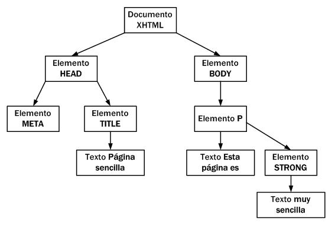
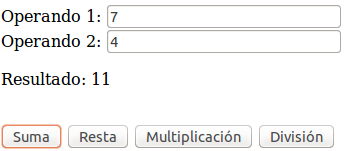

# Introducción a JavaScript

JavaScript (comunmente abreviado como "js") es un lenguaje de programación que se utiliza principalmente para crear páginas web dinámicas. Una página web dinámica es aquella que incorpora efectos como texto que aparece y desaparece, animaciones, acciones que se activan al pulsar botones y ventanas con mensajes de aviso al usuario.

Se utiliza principalmente en su forma del lado del cliente (_client-side_), aunque existe una forma de JavaScript del lado del servidor (_Server-side JavaScript o SSJS_). Su uso en aplicaciones externas a la web, por ejemplo en documentos PDF, aplicaciones de escritorio (mayoritariamente widgets) es también significativo.

Técnicamente, JavaScript es un lenguaje de programación interpretado, por lo que no es necesario compilar los programas para ejecutarlos. En otras palabras, los programas escritos con JavaScript se pueden probar directamente en cualquier navegador sin necesidad de procesos intermedios.

JavaScript no es Java, aunque el nombre incluye la palabra y su sintaxis tenga algo de influencia de dicho lenguaje (también de C). Sin embargo son lenguajes totalmente diferentes, diseñados por personas diferentes, con objetivos diferentes. Conceptualmente Java es un lenguaje estático, el compilador comprueba los tipos de datos, y además es un lenguaje interpretado. JavaScript es dinámico, existen los tipos, pero solo se resuelven en tiempo de ejecución, y no es un lenguaje interpretado.

JavaScript es en general un lenguaje sencillo aunque expresivo, que ha triunfado donde Java ha fallado, en el cliente, y tiene la ventaja de que no necesita instalación, ya que está presente en todos los navegadores.


# Como incluir JavaScript en nuestra página Web

La integración de JavaScript y XHTML es muy flexible, ya que existen al menos tres formas para incluir código JavaScript en las páginas web.

## Incluir desde un archivo externo

Las instrucciones JavaScript se pueden incluir en un archivo externo de tipo JavaScript que los documentos XHTML enlazan mediante la etiqueta `<script>`.

```html
<script type="text/javascript" src="/js/codigo.js"></script>
```

Se pueden crear todos los archivos JavaScript que sean necesarios y cada documento XHTML puede enlazar tantos archivos JavaScript como necesite. La principal ventaja de enlazar un archivo JavaScript externo es que se simplifica el código de la página, que se puede reutilizar el mismo código JavaScript en todas las páginas del sitio web y que cualquier modificación realizada en el archivo JavaScript se ve reflejada inmediatamente en todas las páginas que lo enlazan.

## Incluir en el mismo documento HTML

El código JavaScript se encierra entre etiquetas `<script>` y se incluye en cualquier parte del documento:

```html
<script type="text/javascript">
    alert("Hola mundo!");
</script>
```

Aunque es correcto incluir cualquier bloque de código en cualquier zona de la página, se recomienda definir el código JavaScript dentro de la cabecera del documento (sección `<head>`) o al final de la página (antes de la etiqueta de cierre `</body>`. Con esta segunda opción se consigue mejorar el tiempo de carga de la página, ya que primero se mostrará todo el contenido de la web y por último se cargarán los javascript.


## Incluir en los elementos HTML

Consiste en incluir trozos de JavaScript dentro del código HTML de la página, por ejemplo:

```html
<p onclick="alert('Un mensaje de prueba')">Un párrafo de texto.</p>
```

El principal inconveniente de este método es que ensucia innecesariamente el código HTML de la página y complica el mantenimiento del código JavaScript.


# Etiqueta _noscript_

Algunos navegadores no disponen de soporte completo de JavaScript, otros permiten bloquearlo parcialmente e incluso algunos usuarios bloquean completamente el uso de JavaScript porque creen que así navegan de forma más segura.

En estos casos, es habitual que si la página web requiere JavaScript para su correcto funcionamiento, se incluya un mensaje de aviso al usuario indicándole que debería activar JavaScript para disfrutar completamente de la página.

```html
<noscript>
    <p>Bienvenido a Mi Sitio</p>
    <p>La página que estás viendo requiere para su funcionamiento el uso de
    JavaScript. Si lo has deshabilitado intencionadamente,
    por favor vuelve a activarlo.</p>
</noscript>
```

# Consideraciones sobre el lenguaje JavaScript

Algunas consideraciones a tener en cuenta sobre el lenguaje JavaScript antes de empezar a ver su sintaxis son:

* No se tienen en cuenta los espacios en blanco y las nuevas líneas.
* Se distinguen las mayúsculas y minúsculas.
* No se define el tipo de las variables: una misma variable puede almacenar diferentes tipos de datos durante la ejecución del script.
* No es necesario terminar cada sentencia con el carácter de punto y coma (;), pero sí que es muy recomendable.
* Se pueden incluir comentarios con "`//`" y con "`/* */`".
* La lista de palabras reservadas que no se pueden utilizar libremente para definir variables o funciones son: _break, case, catch, continue, default, delete, do, else, finally, for, function, if, in, instanceof, new, return, switch, this, throw, try, typeof, var, void, while, with_.


# Variables

Las variables en JavaScript se crean mediante la palabra reservada `var`, que solamente es necesario utilizarla la primera vez (al declarar la variable), de la forma:

```javascript
var numero1 = 2;
var numero2 = 3;
var resultado = numero1 + numero2;
```

En javascript no es necesario declarar las variables con `var`, y en este caso lo que hace es crear una variable global a la que asigna el valor correspondiente. Por esta razón se recomienda declarar siempre las variables y llevar cuidado con esta característica.

El nombre de la variable solo puede estar formado por letas, números, el símbolo de dólar "$" y el guión bajo "_", además la primera letra del nombre no puede ser un número. A continuación se incluyen algunos ejemplos de nombres válidos e incorrectos:

```javascript
// Ejemplos correctos
var $numero1;
var _$letra;
var $$$otroNumero;
var $_a__$4;

// Ejemplos incorrectos
var 1numero;  // Empieza por un número
var numero;1_12.3;  // Contiene los carácteres ";" y "."
```


## Tipos de variables

Dado que todas las variables se crean de la misma forma (mediante la palabra reservada `var`), el tipo de la variable vendrá definido según el valor que se le asigne o almacene en ella. A continuación se detallan los diferentes tipos de variables posibles:


### Variables numéricas

Si a una variable se le asigna un entero o un valor decimal dicha variable se convertirá a tipo numérico, por ejemplo:

```javascript
var num1 = 16;
var num2 = 3.1415;
```

### Variables tipo cadenas de texto

Se utilizan para almacenar caracteres, palabras y/o frases de texto. Para asignar el valor a la variable, se encierra el valor entre comillas dobles o simples, para delimitar su comienzo y su final, por ejemplo:

```javascript
var mensaje = "Bienvenido a nuestro sitio web";
var nombreProducto = 'Producto ABC';
var letraSeleccionada = 'c';
var texto1_1 = "Una frase con 'comillas simples' dentro";
var texto1_2 = 'Una frase con \'comillas simples\' dentro';
var texto2_1 = 'Una frase con "comillas dobles" dentro';
var texto2_2 = "Una frase con \"comillas dobles\" dentro";
```

### Booleanos

Una variable de tipo boolean almacena un tipo especial de valor que solamente puede tomar dos valores: true (verdadero) o false (falso). Por ejemplo:

```javascript
var clienteRegistrado = false;
var ivaIncluido = true;
```


### Arrays

Para definir un array, se utilizan los caracteres `[` y `]` para delimitar su comienzo y su final y se utiliza el carácter `,` (coma) para separar sus elementos:

```javascript
var nombre_array = [valor1, valor2, ..., valorN];
```

Un nuevo array se puede declarar asignado valores iniciales (como en el ejemplo anterior), o vacío haciendo `var array1 = new Array();` o también `var array2 = [];` y después asignarle valores:

```javascript
var array1 = new Array();
array1[0] = "hola";
array1[1] = "mundo";

var saludo = array1[0];  // Obtener el valor de un elemento del array
```

Las posiciones o índices del array empiezan en 0 y terminan en el tamaño del array menos uno.


### Tipo de una variable

En JavaScript se puede comprobar el tipo de una variable mediante el operador `typeof`, por ejemplo:

```javascript
typeof "John"                // string
typeof 3.14                  // number
typeof false                 // boolean
typeof [1,2,3,4]             // object
```

JavaScript define los siguientes tipos primitivos de variables: _undefined, null, boolean, number, string_ y _object_. Los dos primeros (equivalentes) se utilizan para identificar cuando se accede a una variable que está sin definir. Los tipos _boolean, number_ y _string_ ya los hemos visto en las secciones anteriores, pero hay que destacar que el tipo _object_ se utiliza para definir tanto a los arrays como a los objectos (los cuales no se tratarán en este manual de iniciación).


## Operadores

Los operadores permiten manipular el valor de las variables, realizar operaciones matemáticas con sus valores y comparar diferentes variables. De esta forma, los operadores permiten a los programas realizar cálculos complejos y tomar decisiones lógicas en función de comparaciones y otros tipos de condiciones.

**Asignación**
Este operador se utiliza para guardar un valor específico en una variable.

```javascript
var numero1 = 3;
var numero2 = 4;
var numero3 = numero1 + numero2;
```

**Incremento y decremento**
Estos dos operadores solamente son válidos para las variables numéricas y se utilizan para incrementar (++) o decrementar (--) en una unidad el valor de una variable.

```javascript
var numero = 5;
++numero;   // Pre-incremento
numero++;   // Post-incremento
--numero;   // Pre-decremento
numero--;   // Post-decremento
```

Si el operador se utiliza como prefijo el decremento o incremento se realiza antes de la operación, si por el contrario se utiliza como sufijo se realizará después, por ejemplo:

```javascript
var numero1 = 5;
var resultado = 2 + numero1++;
// resultado = 7

var numero1 = 5;
var resultado = 2 + ++numero1;
// resultado = 8
```

**Operadores lógicos**
El resultado de cualquier operación que utilice operadores lógicos siempre es un valor lógico o booleano.

* **Negación**: Se utiliza para obtener el valor contrario al valor de la variable: `var negacion = !valor_booleano;`

* **And**: El operador se indica mediante el símbolo `&&` y su resultado solamente es _true_ si los dos operandos son _true_: `var resultado = valor1 && valor2;`

* **Or**: El operador se indica mediante el símbolo || y su resultado es _true_ si alguno de los dos operandos es _true_: `var resultado = valor1 || valor2;`


**Operadores matemáticos**
Los operadores definidos son: suma ( + ), resta ( - ), multiplicación ( * ), división ( / ) y módulo ( % ). A continuación se incluyen algunos ejemplos:

```javascript
var numero1 = 10;
var numero2 = 5;
var resultado = numero1 / numero2;  // resultado 2
resultado = 3 + numero1;   // resultado 13
resultado = numero2 – 4;   // resultado 1
resultado = numero1 * numero2; // resultado 10
resultado = numero1 % numero2; // resultado 0
```

Los operadores matemáticos también se pueden combinar con el operador de asignación para abreviar su notación:

```javascript
var numero1 = 5;
numero1 += 3; // numero1 = numero1 + 3 = 8
numero1 -= 1; // numero1 = numero1 - 1 = 4
numero1 *= 2; // numero1 = numero1 * 2 = 10
numero1 /= 5; // numero1 = numero1 / 5 = 1
numero1 %= 4; // numero1 = numero1 % 4 = 1
```

**Operadores relacionales o de comparación**
Los operadores relacionales definidos por JavaScript son idénticos a los que definen las matemáticas: mayor que ( > ), menor que ( < ), mayor o igual ( >= ), menor o igual ( <= ), igual que ( == ) y distinto de ( != ). El resultado de todos estos operadores siempre es un valor booleano:

```javascript
var numero1 = 3;
var numero2 = 5;
resultado = numero1 > numero2; // resultado = false
resultado = numero1 < numero2; // resultado = true

numero1 = 5;
numero2 = 5;
resultado = numero1 >= numero2; // resultado = true
resultado = numero1 <= numero2; // resultado = true
resultado = numero1 == numero2; // resultado = true
resultado = numero1 != numero2; // resultado = false
```


## Estructuras de control de flujo
Las estructuras de control permiten modificar el flujo de ejecución de las instrucciones de un programa.

**Estructura if**
Se emplea para tomar decisiones en función de una condición. Su definición
formal es:

```javascript
if(condicion) {
    ...
}
```

Si la condición se cumple (es decir, si su valor es true ) se ejecutan todas las instrucciones que se encuentran dentro de `{...}`. Si la condición no se cumple (es decir, si su valor es false ) no se ejecuta ninguna instrucción contenida en `{...}` y el programa continúa ejecutando el resto de instrucciones del script.

La condición se evaluará de forma booleana y por lo tanto podemos utilizar cualquiera de los operadores que hemos visto para ello: !, &&, ||, >, <, ==, etc.

Esta estructura permite añadir una sección `else` que se ejecutará en caso de que no se cumpla la condición anterior e incluso concatenar varias sentencias `if` para realizar varias comprobaciones. A continuación se incluyen algunos ejemplos:

```javascript
var nombre = "";
if(nombre == "") {
    alert("Aún no nos has dicho tu nombre");
}
else {
    alert("Hemos guardado tu nombre");
}

// If ... else if anidado
var valor = 3;
if( valor == 1 )
    alert( "La variable vale 1" );
else if( valor == 2 )
    alert( "La variable vale 2" );
else if( valor == 3 )
    alert( "La variable vale 3" );
else
    alert( "La variable tiene otro valor" );
```


**Estructura switch**
La estructura `switch` se utiliza para agilizar la toma de decisiones múltiples, trabaja de la misma manera que lo harían sucesivos `if`, `if else` anidados en el que según el valor de una variable entraría en uno de los casos definidos o en el caso por defecto:

```javascript
switch (variable) {     // La variable puede ser cualquier tipo de dato
    case "ok":
        // si variable == "ok"
        break;
    case 1:
        // si variable == "1"
        break;
    default:
        // Si no es igual a ninguno de los casos anteriores
        break;
}
´´´

El ejemplo anterior sería igual a hacer:

```javascript
if( variable == "ok" ) {
    // si variable == "ok"
}
else if( variable == 1 ) {
    // si variable == "1"
}
else {
    // Si no es igual a ninguno de los casos anteriores
}
```


**Estructura for**
Esta estructura permite realizar una serie de repeticiones (también llamado bucle) mientras se cumpla una condición:

```javascript
for(inicializacion; condicion; actualizacion) {
    ...
}
```

Donde:
* La "inicialización" es la zona en la que se establece los valores iniciales de las variables que controlan la repetición.
* La "condición" es el único elemento que decide si continua o se detiene la repetición.
* La "actualización" es el nuevo valor que se asigna después de cada repetición a las variables que controlan la repetición.

Ejemplo de uso con un array:

```javascript
var dias = ["Lunes", "Martes", "Miércoles", "Jueves", "Viernes", "Sábado", "Domingo"];
for(var i=0; i<7; i++) {
    alert(dias[i]);
}
```

**Estructura while**
Es similar a `for`, repetirá el contenido del bucle mientras se cumpla la condición inicial:

```javascript
while (condicion) {
    ...
}
```

**Estructura do...while**
Esta estructura es similar al bucle tipo `while` pero evalua la condición al final del bucle, con lo que se asegura que al menos se ejecutará una iteración:

```javascript
do {
    ...
} while (condicion);
```


**Estructura for...in**
Este tipo de bucle, derivado de la estructura tipo `for`, permite iterar entre los elementos de un array o de un objeto (no tratados en esta introducción) de una forma muy sencilla:

```javascript
var dias = ["Lunes", "Martes", "Miércoles", "Jueves", "Viernes", "Sábado", "Domingo"];

for(i in dias) {
    alert(dias[i]);
}
```


## Funciones útiles de JavaScript
JavaScript incorpora una serie de herramientas y utilidades para el manejo de las variables.

**Funciones útiles para mostrar resultados**

* La función "`alert(texto);`" nos permite mostrar un valor o cadena en una ventana emergente.
* La función "`console.log(texto);`" nos permite mostrar un valor o cadena en la consola del sistema. Esta función se suele utilizar para depuración.


**Funciones útiles para cadenas de texto**

* Longitud de una cadena: se obtiene a partir de su propiedad "`.length`"
* Concatenación de cadenas: operador "`+`"
* Convertir en mayúsculas: `toUpperCase()`
* Convertir en minúsculas: `toLowerCase()`
* Obtener un carácter de la cadena: `charAt(posicion)`

Ejemplos:

```javascript
var mensaje = "Hola Mundo";
var numeroLetras = mensaje.length; // numeroLetras = 10
var concatenacion = "¡" + mensaje + "!";
var mayusculas = mensaje.toUpperCase();
var letra = mensaje.charAt(0); // letra = H
```


** Funciones útiles para arrays**

* Longitud del array:  se obtiene a partir de su propiedad "`.length`"
* Añadir un elemento al final del array: "`push(valor)`"

Ejemplos:

```javascript
var array = [1, 2, 3];
var numeroElementos = array.length; // numeroElementos = 3
array.push(4);  // contenido del array = [1, 2, 3, 4]
```

** Funciones útiles para números **

* Comprobar posibles valores numéricos no definidos: "`isNaN(valor)`"
* Comprobar si el valor es finito: "`isFinite(valor)`"
* Formatear / redondear números decimales: "`.toFixed(digitos)`"

Ejemplos:

```javascript
var valor1 = 3.14159265358979323846;
var valor2 = 0;

if( isNaN(valor1/valor2) || !isFinite(result) )
    alert("La división no está definida para los números indicados");

var valor3 = valor1.toFixed(2); // 3.14
```


<!-- *********************************************************************** -->
## Funciones

Una función es un conjunto de instrucciones que se agrupan para realizar una tarea concreta y que se pueden reutilizar fácilmente. Las funciones en JavaScript se definen mediante la palabra reservada `function`, seguida del nombre de la función. Su definición formal es la siguiente:

```javascript
function nombre_funcion() {
    ...
}
```

El nombre de la función se utiliza para llamar a esa función cuando sea necesario. A continuación se incluye un ejemplo de función y su llamada:

```javascript
<script>
function calculaSuma() {
    var valor1 = 3;
    var valor2 = 7;
    var resultado = valor1 + valor2;
    alert( "El resultado es " + resultado );
}
calculaSuma();  // llamada a la función "calculaSuma"
</script>
```

Igual que en otros lenguajes, a las funciones se le pueden pasar valores o _argumentos_ de entrada y pueden devolver un valor como resultado:

```javascript
function calculaSuma(valor1, valor2) {
    var resultado = valor1 + valor2;
    return resultado;
}
var resultado = calculaSuma(10, 4);  // llamada a la función "calculaSuma"
alert( resultado );
```

Es importante saber que:
* Se puede utilizar un número ilimitado de argumentos.
* El número de argumentos que se pasa a una función debería ser el mismo que el número de argumentos que ha indicado la función. No obstante, JavaScript no muestra ningún error si se pasan más o menos argumentos de los necesarios. En caso de que un argumento no esté definido tendrá el valor "undefined".


### Ámbito de las variables

Con respecto al ámbito de las variables tenemos que tener en cuenta las siguientes consideraciones:

* Si una variable se define con `var` dentro de una función el ámbito de dicha variable será local.
* Si una variable se define fuera de una función su ámbito será global, y por lo tanto serán accesibles desde dentro de las funciones.
* Si una variable se define dentro de una función pero sin usar la palabra reservada `var` el ámbito de dicha variable será global.

Ejemplos:

```javascript
var global1 = "Variable Global 1";

function mostrarMensaje() {
    var local1 = "Variable local 1";
    global2 = "Variable Global 2";
    console.log( global1 );  // mostrará "Variable Global 1"
}
mostrarMensaje();
console.log(local1);  // error, no existe la variable "local1"
console.log(global2); // mostrará "Variable Global 2"
```


<!-- *********************************************************************** -->
## DOM

El _Document Object Model_ o DOM ('Modelo de Objetos del Documento' o 'Modelo en Objetos para la Representación de Documentos') es esencialmente una interfaz que proporciona un conjunto estándar de objetos para representar documentos HTML y XML, aportando una interfaz estándar para acceder a ellos y manipularlos. A través del DOM se pueden acceder y modificar el contenido, estructura y estilo de los documentos HTML y XML, y es para lo que se diseñó principalmente.

DOM transforma todos los documentos XHTML en un conjunto de elementos llamados nodos, que están interconectados y que representan los contenidos de las páginas web y las relaciones entre ellos. Por su aspecto, la unión de todos los nodos se llama "árbol de nodos".

Por ejemplo, la siguiente página HTML:

```html
<html xmlns="http://www.w3.org/1999/xhtml">
<head>
    <meta http-equiv="Content-Type" content="text/html; charset=iso-8859-1" />
    <title>Página sencilla</title>
</head>
<body>
    <p>Esta página es <strong>muy sencilla</strong></p>
</body>
</html>
```

Se transformaría en el siguiente árbol de nodos:




Una vez construido automáticamente el árbol completo de nodos DOM, ya es posible utilizar las funciones DOM para acceder de forma directa a cualquier nodo del árbol. Como acceder a un nodo del árbol es equivalente a acceder a "un trozo" de la página, por lo que es posible manipular de forma sencilla la página: acceder al valor de un elemento, establecer el valor de un elemento, mover un elemento de la página, crear y añadir nuevos elementos, etc.

DOM proporciona dos métodos alternativos para acceder a un nodo específico: acceso a través de sus nodos padre y acceso directo.

Las funciones que proporciona DOM para acceder a un nodo a través de sus nodos padre consisten en acceder al nodo raíz de la página y después a sus nodos hijos y a los nodos hijos de esos hijos y así sucesivamente hasta el último nodo de la rama terminada por el nodo buscado.

Sin embargo, cuando se quiere acceder a un nodo específico, es mucho más rápido acceder directamente a ese nodo y no llegar a él descendiendo a través de todos sus nodos padre.


### Acceso a nodos del árbol DOM

#### getElementsByTagName()

Obtiene todos los elementos de la página HTML cuya etiqueta sea igual que el parámetro que se le pasa a la función, por ejemplo:

```javascript
var parrafos = document.getElementsByTagName("p");
```

El valor que se indica delante del nombre de la función (en este caso _document_, que sería la raíz del árbol DOM) es el nodo a partir del cual se realiza la búsqueda de los elementos. En este caso, como se quieren obtener
todos los párrafos de la página, se utiliza el valor _document_ como punto de partida de la búsqueda.

El valor que devuelve la función es un array con todos los nodos que cumplen la condición de que su etiqueta coincide con el parámetro proporcionado. El valor devuelto es un array de nodos del DOM, no un array de cadenas de texto o un array de objetos normales.

De este modo, se puede obtener el primer párrafo de la página de la siguiente manera:

```javascript
var primerParrafo = parrafos[0];
```

De la misma forma, se podrían recorrer todos los párrafos de la página con el siguiente código:

```javascript
for(var i=0; i<parrafos.length; i++) {
    var parrafo = parrafos[i];
}
```

La función `getElementsByTagName()` se puede aplicar de forma recursiva sobre cada uno de los nodos devueltos por la función. En el siguiente ejemplo, se obtienen todos los enlaces del primer párrafo de la página:

```javascript
var parrafos = document.getElementsByTagName("p");
var primerParrafo = parrafos[0];
var enlaces = primerParrafo.getElementsByTagName("a");
```


#### getElementsByName()

Esta función es similar a la anterior, pero en este caso se buscan los
elementos cuyo atributo `name` sea igual al parámetro proporcionado. En el siguiente ejemplo, se obtiene directamente el único párrafo con el nombre indicado:

```javascript
var parrafoEspecial = document.getElementsByName("especial");
<p name="prueba">...</p>
<p name="especial">...</p>
<p>...</p>
```

Internet Explorer 6.0 no implementa de forma correcta esta función, ya que sólo la tiene en cuenta para los elementos de tipo `<input>` y ``. Además, también tiene en consideración los elementos cuyo atributo id sea igual al parámetro de la función.


#### getElementById()

Esta es la función más utilizada cuando se desarrollan aplicaciones web
dinámicas ya que permite acceder directamente a un nodo y poder leer o
modificar sus propiedades.

La función `getElementById()` devuelve el elemento HTML cuyo atributo `id` coincide con el parámetro indicado en la función. Como el atributo `id` debe ser único en toda la página, la función devuelve únicamente el nodo deseado.

```javascript
var cabecera = document.getElementById("cabecera");
<div id="cabecera">
<a href="/" id="logo">...</a>
</div>
```

Internet Explorer 6.0 también interpreta incorrectamente esta función, ya que devuelve también aquellos elementos cuyo atributo name coincida con el parámetro proporcionado a la función.


### Creación y eliminación de nodos

Con JavaScript también se pueden añadir y eliminar elementos dinámicamente del árbol DOM. Para esto se utilizan las funciones `createElement(etiqueta)`, `createTextNode(text)`, `appendChild(child)` y `removeChild(child)`.

Dado que su uso se queda fuera de los contenidos de este curso, si se desea obtener más información se puede consultar la web:

* http://www.w3schools.com/jsref/met_document_createelement.asp
* http://www.w3schools.com/jsref/met_document_createtextnode.asp
* http://www.w3schools.com/jsref/met_node_appendchild.asp
* http://www.w3schools.com/dom/met_element_removechild.asp


### Acceso a atributos de un nodo

Una vez que se ha accedido a un nodo, el siguiente paso natural consiste en acceder y/o modificar sus atributos y propiedades. Mediante DOM, es posible acceder de forma sencilla a todos los atributos y todas las propiedades CSS de cualquier elemento de la página.

Los atributos de los elementos de la página se transforman automáticamente en propiedades de los nodos. Para acceder a su valor, simplemente se indica el nombre del atributo detrás del nombre del nodo.

El siguiente ejemplo obtiene de forma directa la dirección a la que enlaza el enlace:

```javascript
// HTML
<a id="enlace" href="http://www.ua.es">Universidad de Alicante</a>

<p id="parrafo" style="font-weight: bold;" class="destacado">Texto</p>

// JavaScript
var enlace = document.getElementById("enlace");
var imagen = document.getElementById("imagen");
var parrafo = document.getElementById("parrafo");

console.log(enlace.id);       // muestra "enlace"
console.log(enlace.href);     // muestra "http://www.ua.es"
console.log(enlace.innerHTML);// muestra "Universidad de Alicante"

console.log(imagen.id);       // muestra "imagen"
console.log(imagen.src);      // muestra "logo.png"
console.log(imagen.style.margin); // muestra "0px"
console.log(imagen.style.border); // muestra "0px none"

console.log(parrafo.id);               // muestra "parrafo"
console.log(parrafo.innerHTML);        // muestra "Texto"
console.log(parrafo.style.fontWeight); // muestra "bold"
console.log(parrafo.className);        // muestra "destacado"
```

Es importante destacar que si el nombre de una propiedad o estilo es compuesto, como "font-weight", que tiene un guión "-" en el medio, para acceder dicho guión se elimina y además se escribe en mayúsculas la primera letra se la siguiente palabra, por ejemplo:

* _font-weight_ se transforma en _fontWeight_
* _line-height_ se transforma en _lineHeight_
* _border-top-style_ se transforma en _borderTopStyle_
* _list-style-image_ se transforma en _listStyleImage_

También es importante destacar que como la palabra `class` está reservada por JavaScript, no es posible utilizarla para acceder al atributo `class` del elemento XHTML. En su lugar, DOM utiliza el nombre `className` para acceder.


<!-- *********************************************************************** -->
## Eventos

Los eventos permiten ejecutar acciones cuando sucede un determinado evento o se realiza una determinada acción sobre un elemento HTML de nuestra página Web. La forma de definirlos es similar a los atributos HTML (`evento="acción"`), donde la acción hará referencia a una función o método en lenguaje JavaScript:

```html
<div onclick="CODIGO-JAVASCRIPT"></div>
```

Algunos de los eventos que podemos utilizar son:

* **onload**: se activa cuando el navegador termina de cargar todos los elementos de la página.

* **onunload**: se activa al cerrar una página.

* **onclick**: cuando se presiona el botón del ratón sobre un elemento.

* **ondblclick**: se activa al hacer doble clic sobre un elemento.

* **onmousedown**: se activa al presionar el botón del ratón (mientras que está presionado).

* **onmouseup**: cuando el botón del ratón es liberado.

* **onmouseover**: se dispara cuando el cursor del ratón pasa sobre un elemento.

* **onmousemove**: cuando se mueve el cursor del ratón mientras está sobre un elemento.

* **onmouseout**: se activa cuando el cursor del ratón sale fuera de un elemento (sobre el que estaba).

* **onfocus**: ocurre cuando un elemento recibe el enfoque (el cursor de escritura), ya sea con el puntero o con mediante la tecla tabulador.

* **onblur**: se dispara cuando un elemento pierde el enfoque (ya sea por hacer clic fuera o por presionar la tecla tabulador).

* **onkeypress**: ocurre cuando se presiona una tecla (dentro de un elemento, por ejemplo un campo de escritura).

* **onkeydown**: se dispara cuando una tecla es presionada (dentro de un elemento)

* **onkeyup**: cuando una tecla es soltada.

* **onsubmit**: se activa cuando un formulario es enviado.

* **onreset**: ocurre cuando un formulario es reseteado.

* **onselect**: cuando el usuario selecciona un texto en un campo de texto.

* **onchange**: ocurre cuando un control pierde el enfoque y su valor ha sido modificado desde que recibió el enfoque.


Ejemplos de uso:

```html
<!-- Dos eventos en una misma etiqueta... -->
<div onclick="alert('Has hecho click');" onmouseover="alert('Acabas de pasar por encima');">
    Puedes pinchar sobre este elemento o simplemente pasar el ratón por encima
</div>

<!-- Comprobar que la página se ha cargado... -->
<body onload="alert('La página se ha cargado completamente');">
    ...
</body>

<!-- Tambień se pueden llamar a funciones desde los eventos... -->
<script type="text/javascript">
   function saveText() {
      // acciones JavaScript
   }
</script>

<textarea id="myarea" cols="80" rows="15" onkeyup="saveText()"></textarea>
```


## Eventos y la variable _this_

JavaScript define una variable especial llamada _this_ que se crea automáticamente y que se emplea en algunas técnicas avanzadas de programación. En los eventos, se puede utilizar la variable _this_ para referirse al elemento que ha provocado el evento.

Esta variable es muy útil para ejemplos como el siguiente: queremos que al pasar por encima de un `<div>` el color del borde cambie, y al salir del contenedor restablezca el color inicial. Si no usamos la variable _this_ el código sería el siguiente:

```html
<div id="contenidos" style="width:150px; height:60px; border:thin solid silver"
onmouseover="document.getElementById('contenidos').style.borderColor='black';"
onmouseout="document.getElementById('contenidos').style.borderColor='silver';">
    Sección de contenidos...
</div>
```

Sin embargo, usando la variable _this_ quedaría mucho más claro:

```html
<div id="contenidos" style="width:150px; height:60px; border:thin solid silver"
onmouseover="this.style.borderColor='black';"
onmouseout="this.style.borderColor='silver';">
    Sección de contenidos...
</div>
```

Si quisieramos llamar a una función externa, también es posible usar la variable _this_ para pasarle como parámetro el elemento sobre el cual se quiere actuar, por ejemplo:

```html
<script>
function setColor(element, color) {
    element.style.borderColor = color;
}
</script>

<div id="contenidos" style="width:150px; height:60px; border:thin solid silver"
onmouseover="setColor(this,'black');" onmouseout="setColor(this,'silver');">
    Sección de contenidos...
</div>
```


<!-- *********************************************************************** -->
## Detección de errores con Firefox y Chrome

Firefox y Chrome proporcionan herramientas para ayuda al desarrollador que están incluidas por defecto y que son de gran utilidad a la hora de depurar y detectar errores en una web en desarrollo.

Para abrir estas utilidades se puede pulsar sobre la opción correspondiente del menú (en la sección "Herramientas") o directamente pulsando la tecla de función F12.

La consola de errores permite diferenciar los mensajes de información, los mensajes de aviso y los mensajes de error. Además, permite visualizar todos los errores de la página simultáneamente. Por cada error detectado se indica la posible solución mediante un mensaje en inglés y se muestra el trozo de código del script donde se ha producido el error. Además, pulsando sobre el enlace incluido se accede a la línea concreta del archivo concreto donde se ha
producido el error.

Firefox permite instalar pequeñas mejoras y ampliaciones en el navegador, que se
conocen con el nombre de extensiones. Una de las extensiones más interesantes para los desarrolladores de aplicaciones web es Firebug, que se puede descargar gratuitamente desde http://www.getfirebug.com/


<!-- *********************************************************************** -->
# Ejercicios sobre JavaScript

## Ejercicio 1 - Calculadora sencilla (1 punto)

Para practicar con javascript vamos a crear una calculadora sencilla como la que se muestra en el siguiente esquema:



Para ellos seguiremos los pasos:

* En primer lugar escribiremos el código HTML para diseñar una calculadora como la que se muestra en el esquema de la imagen. Es importante que asignemos un identificador único a los campos tipo "`input`" de entrada de datos y al campo en el que se mostrará el resultado (para este campo podemos asignar un identificador a una etiqueta `span` vacía).
* Crearemos una función para cada operación que se llamará en el evento "`onclick`" de cada botón.
* Las funciones deben comprobar que se haya escrito algún valor en los campos y en caso de error mostrar un aviso. Además, en la función de división se deberá de comprobar que el resultado sea correcto (finito) y en caso de error se mostará también un mensaje.

> Para obtener o asignar valor a los campos tipo `input` usaremos su propiedad `.value`, mientrar que para asignar un valor a otro tipo de elementos HTML (como párrafos (p), cajas (div), span, etc.) utilizaremos su propiedad `.innerHTML`.

> Al obtener el valor de un `input` se obtiene con tipo cadena, para realizar las operaciones correctamente tendréis que convertirlo a decimal mediante la función `parseFloat(valor)`.


## Ejercicio 2 - Calculadora avanzada (1 punto)

En este ejercicio vamos a crear una calculadora un poco más avanzada que la del ejercicio anterior. En primer lugar escribiremos el código HTML para crear una calculadora con un diseño similar al de la siguiente figura:


Nos podemos ayudar de una tabla de HTML para la disposición de los elementos. La pantalla de la calculadora será un campo DIV al cual asignaremos valores mediante la función `.innerHTML`.

El código JavaScript constará de 3 funciones:

* Una función "`limpiar()`" que se llamará al pulsar la tecla "C" y que borrará el contenido de la pantalla.
* Una función "`setValue(valor)`" que añadirá el valor pasado por parámetro al contenido ya existente en la pantalla. Esta función se utilizará tanto para añadir números (`setValue(2)`) como para añadir las operaciones (`setValue('+')`) y el separador decimal (`setValue('.')`).
* Una función "`calcular()`" que calculará la operación introducida en la pantalla y mostrará el resultado de la misma. Para realizar los cálculos haremos uso de la función de javascript `eval`, la cual evalua la expresión que recibe por parámetro y devuelve el resultado. Además, dado que la expresión puede contener errores es necesario introducirla en un bloque `try...catch` como el siguiente:

```javascript
try {
    pantalla.innerHTML = eval( expr );
} catch (e) {
    // error
}
```

Notas:
* Es necesario controlar los siguientes errores:
  * Cuando se llame a "`calcular()`" y no haya nada introducido en la pantalla.
  * Si se produce una excepción al evaluar la expresión.
  * Si el resultado de la operación no es un número o no es finito.
* En caso de error se mostrará el aviso "ERROR" por la pantalla.
* Después de un error, si se pulsa limpiar o se introduce un valor se borrará el aviso.


## Ejercicio 3 - Validación de un formulario (1 punto)

En este último ejercicio vamos a crear un formulario para el acceso a la sección privada de una web mediante usuario y contraseña, esto nos valdrá para practicar con la funcionalidad de javascript validando sus campos.

En primer lugar crearemos el HTML del formulario de login, el cual deberá ser similar al de la siguiente imagen:


* El fondo de la web tendrá el color "_gray_".
* La caja contenedora tendrá un ancho de 400px y estará centrada en la pantalla. Su color de fondo será #ccc y tendrá un _border_ de 2px de color _silver_. Además tendrá un espaciado interior de 30px.
* Se tendrá que adaptar también el resto de elementos para que se muestren con un aspecto y disposición similar al de la figura.

Se aconseja crear una sección de estilos CSS para agrupar los estilos del formulario.

A continuación crearemos una función de JavaScript para realizar la validación del formulario, la cual mostará los errores que hubiera o indicará que se ha validado correctamente. Para incluir los mensajes de error se pueden incluir directamente en el HTML inicial del formulario, pero se marcarán como ocultos usando la propiedad CSS: `display:none` y cuando se quierdan mostrar se cambiará a `display:block`.

> Nota: para cambiar el estilo de un campo en JavaScript se puede hacer accediendo a su propiedad `style` de la forma: `campo.style.display = 'block';`

Al pulsar sobre el botón "Entrar" se llamará a una función "`validar()`" que realizará las siguientes acciones:

* Si alguno de los campos está vacío mostrará un mensaje de error indicándolo.
* Si el campo no está vacío pero la longitud es inferior a 3 caracteres también se mostará un error indicándolo (ver la imagen inferior).
* Si no se produce ningún error aparecerá el aviso: "¡Validación correcta!


Notas:
* Si se pulsa varias veces el botón "Entrar" hay que actualizar los errores: si un error anterior ya no se produce el aviso tendrá que desaparecer.
* Solo se podrá mostrar un mensaje de error por cada campo: campo requerido o longitud mínima incorrecta.


