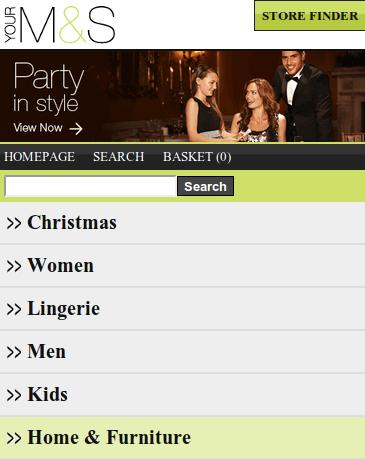
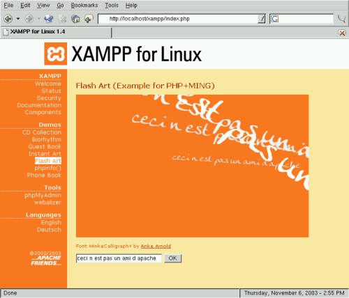
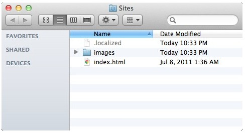
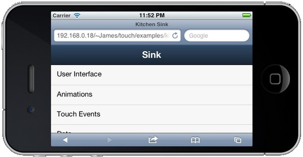

# Introducción al desarrollo Web para móviles


<!-- ********************************************************************* -->
## Introducción

La Web móvil es la misma Web que la de escritorio, utiliza la misma arquitectura básica y muchas de las mismas tecnologías. Pero existen claras diferencias que impiden que su funcionamiento y manejo sea el mismo, como son: el tamaño de la pantalla, las diferentes formas de uso (táctil, teclado del móvil, etc.) y el ancho de banda.

Otra diferencia que se debería de tener en cuenta es que es "móvil". Accedemos a Internet desde lugares en los que sería imposible hacerlo con un ordenador de sobremesa o incluso un portátil. Esto influye también en el uso que le damos, se hacen más búsquedas o consultas, además de que la información se debe de disponer de forma más clara y directa.

Debido a todo esto, al programar una Web para móvil debemos de tener en cuenta que ni el contenido, ni la apariencia, ni la estructura de la web va a ser la misma que la que podríamos hacer para un ordenador de escritorio. Hemos de diseñar muy bien este tipo de aplicaciones y orientarlas al uso principal que le va a dar el usuario. Para esto se suele referir a la _regla del 20%_: el 80% del contenido del sitio web de escritorio no es válido para una web móvil. Por lo que hemos de centrarnos en ese 20% restante, averiguar cual es, y optimizar nuestro sitio para este uso.


<!-- ********************************************************************* -->
### Aplicación móvil vs. Aplicación nativa

Los desarrolladores de aplicaciones nativas tienen la ventaja de poder usar funciones no disponibles para la web móvil:

* El uso de interfaces nativas que proveen los propios SDK como iPhone o Android.

* El uso de bases de datos locales. Aunque en HTML 5 se pueden usar el almacenamiento local, hay que reconocer que estas tecnologías están más avanzadas en los sistemas nativos.

* Notificaciones push. A esto se refiere con los avisos centralizados que muestran las aplicaciones, aún cuando están ocultas. Una fuerte razón que no puede ser implementada en una web móvil.

* Geolocalización. Hemos visto algunos ejemplos de geolocalización a través de HTML5, pero que no acaban de alcanzar la misma experiencia de usuario que una aplicación móvil. Podemos interactuar con el mapa o con las funcionalidades asociadas a la localización del usuario, pero no ir mucho más allá.

* Soporte para cámara o vídeo. Las funciones multimedia están perfectamente acopladas a las aplicaciones nativas, pudiendo añadir funcionalidades especificas a nuestra aplicación.


Sin embargo estas diferencias cada vez se van haciendo menores:

* Gracias al uso de HTML5, CSS3 y JavaScript cada vez se pueden hacer más cosas y obtener mejores resultados.

* Cada vez hay mejores frameworks de desarrollo para aplicaciones móviles, como JQuery Mobile, Sencha Touch o Ionic. Estos nos permiten crear webs con apariencia cercana a las de las aplicaciones nativas, pero a su vez con toda la potencia de la Web. Estos framework nos permiten adaptar el contenido según el dispositivo usado y sus posibilidades técnicas: pantalla táctil, reproducción de vídeos o resolución de pantalla. Por lo que podríamos decir que una Web móvil es mucho más adaptable (además de multiplataforma) que una aplicación móvil.

* La web sigue siendo el negocio principal de muchas empresas de Internet. El desarrollo web no ha muerto por la inclusión de las aplicaciones móviles, sino que se ve afectado por un proceso de cambio hacía la adopción de tecnologías nuevas como HTML5.

* La inclusión de la tecnología _PhoneGap_ también está recortando más estas diferencias. _PhoneGap_ es la posibilidad de crear una aplicación nativa instalable a partir de una página Web móvil, permitiendo además su distribución en _Android Market_ o en la _App Store_. Además estas tecnologías facilitan el uso de funcionalidades del dispositivo móvil directamente a través de código JavaScript, como puede ser el acceso a la cámara, acelerómetro, geolocalización, listado de contactos, comprobar el estado de la conexión, etc.


<!-- *********************************************************************** -->
### Reglas de usabilidad

A la hora de iniciar el desarrollo de una Web para móvil es importante tener en cuenta una serie de reglas básicas:


**1. Reducir la cantidad de contenido**

Las aplicaciones móviles deben de ser optimizadas dado que el espacio visual es mucho más limitado que en una pantalla de ordenador. Cada píxel cuenta, y no todo lo que es válido para una Web de escritorio lo es para una Web móvil.

Solo debemos de incluir el contenido y las características principales y más importantes. Los contenidos con menor importancia deben de ser eliminados, como contenidos secundarios, normalmente localizados en columnas laterales o en la parte inferior.

La web móvil debe de estar enfocada a este contenido principal. Facilitar su lectura y navegación, así como mejorar los tiempos de carga reduciendo imágenes y contenidos.


**2. Usar una sola columna**

Las páginas Web anchas y con varias columnas dificultan la navegación y lectura en un dispositivo móvil. Incluso en los terminales móviles con pantallas más grandes hay que realizar zoom para moverse y ver bien el contenido. Esta es una práctica que debemos evitar, pues tener que ir realizando zoom añade más pasos a la navegación, y en algunos dispositivos no es tan fácil de realizar como en un iPhone.

Lo mejor es tener nuestro contenido en una sola columna que use todo el ancho de la pantalla. Para añadir contenido lo deberemos de hacer hacia abajo (o creando una página nueva), nunca hacia los lados (o creando columnas). Esto nos asegura que el contenido se va a visualizar correctamente, además es mucho más intuitivo realizar _scroll_ hacia abajo para ir leyendo.


**3. Muestra los enlaces de navegación de forma diferente**

No pongas todos los enlaces de navegación en la parte superior de la pantalla. Si hay muchos desplazarán todo el contenido hacia abajo, y es posible que los tengas que poner muy reducidos.

La página principal debería de contener los enlaces al resto del contenido junto con un buscador (si fuese necesario). El contenido debería de estar en páginas secundarias bien organizado. Por ejemplo, cuando un usuario entra en un sitio de _eCommerce_ suelen tener una categoría de producto en mente que quiere consultar, la cual la podrían encontrar usando el buscador o directamente a partir del menú. Es decir, la página principal debe facilitar el acceso rápido a la información más importante de la web.

También hay otras opciones para colocar el menú de navegación, como una lista desplegable o al final de la página. Son muy cómodas las barras de herramientas estáticas que ofrecen las opciones principales (volver a la página inicial, botones principales, etc.).


**4. Minimiza la cantidad de datos solicitados**

Escribir texto utilizando un terminal móvil es mucho más difícil que hacerlo utilizando el teclado de un ordenador de sobremesa. Además los usuarios suelen escribir mucho más lento y cometer más errores. Por estas razones tenemos que intentar minimizar la cantidad de texto solicitado.

Una forma de conseguir esto es permitir almacenar los datos (usuario, contraseñas, configuración, direcciones, etc.), o aprovechar algunas de las funcionalidades que incorporan los dispositivos móviles (como veremos más adelante).


**5. Decide si necesitas más de una Web para móvil**

El tamaño de pantalla, la capacidad de procesamiento y de usabilidad varía enormemente de un terminal a otro. Por esta razón a veces debemos de considerar crear varios sitios web con el mismo contenido pero adaptado a diferentes necesidades. Por ejemplo, Facebook tiene <a href="m.facebook.com">m.facebook.com</a> como sitio web principal para móviles, pero además tiene una versión optimizada para pantallas táctiles (<a href="touch.facebook.com">touch.facebook.com</a>) y una versión optimizada para conexiones más lentas (<a href="0.facebook.com">0.facebook.com</a>).


**6. Diseña para pantallas táctiles, pero también para teléfonos no-táctiles**

La forma de navegar por las páginas web es muy diferente según el dispositivo: pantallas táctiles, _trackball_, _joystick_, teclado, etc. Estas características también son importantes a la hora de realizar el diseño. Por ejemplo, la principal dificultad está en la selección y pulsado sobre textos o enlaces pequeños. En las pantallas táctiles además se dificulta pulsar sobre elementos que estén muy juntos.

Por esta razón, los enlaces o elementos que puedan ser seleccionados deben de ocupar un mayor espacio en pantalla, incluirlos en botones o cuadros más grandes, que puedan ser pulsados con facilidad.


**7. Aprovecha las funcionalidades que incorporan los móviles**

Los teléfonos móviles tienen algunas ventajas sobre los PCs, las cuales pueden facilitar la realización de algunas tareas. Algunas de estas funcionalidades añadidas son:

Realizar llamadas: puede parecer evidente pero es una funcionalidad muy útil que los PCs no pueden realizar tan fácilmente. Por esta razón debemos de aprovecharla para, por ejemplo, llamar directamente al presionar sobre un número de teléfono, facilitar el contacto con un servicio técnico, etc.

Uso de mapas y posición actual: es posible dar la opción al usuario de seleccionar una dirección y que automáticamente se abra en la aplicación de mapas del dispositivo móvil. También es muy interesante el uso de la posición actual para mostrar puntos de interés cercanos, calcular rutas, etc.

Solicitud de información de forma innovadora: como por ejemplo los códigos QR, que se han usado en algunas campañas de publicidad, etc.

Al cumplir esta serie de reglas se incrementa el público que puede acceder a los contenidos, creando sitios Web eficaces y haciendo la navegación accesible desde más dispositivos.


<!-- *********************************************************************** -->
### Dominio

Existen diferentes alternativas sobre el dominio que podemos usar. En definitiva esta es una decisión personal, pues todas ellas tienen sus ventajas e inconvenientes. La única recomendación que se suele hacer es tener varias opciones disponibles, con la intención de facilitar al máximo el acceso.

Podemos tener un subdominio de nuestro sitio Web especializado para dispositivos móviles. Por ejemplo, si nuestro sitio Web es _www.midominio.com_, el sitio para dispositivos móviles podría ser _m.midominio.com_. Por ejemplo, Facebook tiene disponibles los sitios <a href="m.facebook.com">m.facebook.com</a>
(como sitio web para dispositivos móviles) y <a href="touch.facebook.com">touch.facebook.com</a> (para dispositivos táctiles).

También podemos usar el dominio principal y diferenciar (desde el cliente o desde el servidor) si se trata de un dispositivo móvil. En este caso el usuario accedería a la misma dirección pero sería redirigido al sitio correspondiente o se le devolvería un contenido diferente.

Otra opción es comprar un dominio "_.mobi_" (especial para web móvil) con el mismo nombre que la web principal.

Si optamos por dar diferentes opciones de acceso deberemos crear redirecciones
301 al dominio principal seleccionado para manejar ese contenido, de la forma:

```php
<?php
header("HTTP/1.1 301 Moved Permanently");
header("location:http://www.nueva_url.com");
?>
```


<!-- *********************************************************************** -->
### Detección del navegador

Un dilema a la hora de desarrollar contenidos para móviles es cómo diferenciar entre dispositivos móviles y navegadores de escritorio. Esto se puede hacer fácilmente mediante una función de comprobación que nos indique el tipo de navegador que ha solicitado la web. Una vez obtenido el navegador tenemos varias opciones, como se comentaba en la sección anterior: redireccionar al dominio correspondiente, o adaptar el código de nuestra página según el cliente.

A continuación se incluye una función en PHP que nos devuelve un número positio si detecta que el navegador es un dispositivo móvil, y 0 en caso de ser un navegador de escritorio.

```php
public static function mobileBrowser()
{
	$mobile_browser = '0';

	//$_SERVER['HTTP_USER_AGENT'] -> el agente de usuario que está
	// accediendo a la página.
	if(preg_match('/(up.browser|up.link|mmp|symbian|smartphone|midp|wap|phone)/i',
			strtolower($_SERVER['HTTP_USER_AGENT'])))
	{
	    $mobile_browser++;
	}

	//$_SERVER['HTTP_ACCEPT'] -> Indica los tipos MIME que el cliente puede recibir.
	if((strpos(strtolower($_SERVER['HTTP_ACCEPT']),'application/vnd.wap.xhtml+xml')>0)
		or
		((isset($_SERVER['HTTP_X_WAP_PROFILE']) or isset($_SERVER['HTTP_PROFILE']))))
	{
	    $mobile_browser++;
	}

	$mobile_ua = strtolower(substr($_SERVER['HTTP_USER_AGENT'],0,4));
	$mobile_agents = array(
	    'w3c ','acs-','alav','alca','amoi','audi','avan','benq','bird','blac',
	    'blaz','brew','cell','cldc','cmd-','dang','doco','eric','hipt','inno',
	    'ipaq','java','jigs','kddi','keji','leno','lg-c','lg-d','lg-g','lge-',
	    'maui','maxo','midp','mits','mmef','mobi','mot-','moto','mwbp','nec-',
	    'newt','noki','oper','palm','pana','pant','phil','play','port','prox',
	    'qwap','sage','sams','sany','sch-','sec-','send','seri','sgh-','shar',
	    'sie-','siem','smal','smar','sony','sph-','symb','t-mo','teli','tim-',
	    'tosh','tsm-','upg1','upsi','vk-v','voda','wap-','wapa','wapi','wapp',
	    'wapr','webc','winw','winw','xda','xda-');

	//buscar agentes en el array de agentes
	if(in_array($mobile_ua, $mobile_agents)) {
	    $mobile_browser++;
	}

	//$_SERVER['ALL_HTTP'] -> Todas las cabeceras HTTP
	if(strpos(strtolower($_SERVER['ALL_HTTP']),'OperaMini')>0) {
	    $mobile_browser++;
	}
	if(strpos(strtolower($_SERVER['HTTP_USER_AGENT']),'windows')>0) {
	    $mobile_browser=0;
	}

	return $mobile_browser;
}

```


También existen librerías un poco más completas para detectar el cliente usando código PHP como por ejemplo: http://mobiledetect.net/ Esta librería nos permite determinar si el cliente es un ordenador de escritorio, un tablet o un móvil, el sistema operativo que utiliza (Android, iOS, Linux, Windows, etc.), el navegador, versiones, etc.


<!-- *********************************************************************** -->
### Ejemplos de Webs para móviles

Cuando se empieza en el desarrollo de webs para dispositivos móviles es bueno buscar inspiración, ir a ver que ha hecho gente con más experiencia en el campo. A continuación se incluye una pequeña lista de ejemplos:

<table>
    <tr>
        <td> 
            http://m.diesel.com 
            <br/> 
            
        </td>
        <td>
            http://m.flickr.com/ 
            <br/> 
            
        </td>
    </tr>
    <tr>
        <td>
            http://mobile.walmart.com/ 
            <br/> 
             
        </td>
        <td>
            http://m.marksandspencer.com/
            <br/> 
            
        </td>
    </tr>
    <tr>
        <td>
            http://iphonetoolbox.com/dailywallpaper
            <br/>
            
        </td>
        <td>
        </td>
   </tr>
</table>


En todos de ellos debemos de considerar la adaptación que se ha hecho del contenido entre la web de escritorio y la web para dispositivos móviles. En la siguiente imagen se puede ver una comparación en la que varía la disposición. Pero como hemos dicho, los cambios no son únicamente de disposición, tenemos que recordar la regla del 20%.


<!-- *********************************************************************** -->
<!-- *********************************************************************** -->
<!-- *************************** SERVIDOR WEB ****************************** -->
<!-- *********************************************************************** -->
<!-- *********************************************************************** -->


<!-- *********************************************************************** -->
## Instalación de un servidor Web

En la programación Web, una de las herramientas principales que necesitamos es un servidor Web o servidor HTTP. Este es el encargado de compilar el código (según el lenguaje de programación que utilicemos) y enviarlo al cliente utilizando el protocolo de transferencia HTTP.

Dado que instalar un servidor Web completo y configurarlo correctamente es una tarea bastante costosa, para el desarrollo y testeo de aplicaciones en local se suele utilizar un servidor XAMPP. Este es un paquete software de fácil instalación que incluye todo lo necesario para la ejecución de un servidor Web.

Es independiente de plataforma, software libre (licencia GNU), y consiste principalmente en la base de datos MySQL, el servidor web Apache y los intérpretes para lenguajes de script: PHP y Perl. El nombre proviene del acrónimo formado por **X** (para cualquiera de los diferentes sistemas operativos), **A**pache, **M**ySQL, **P**HP y **P**erl. Actualmente XAMPP está disponible para Microsoft Windows (WAMPP), GNU/Linux (LAMPP), Solaris y MacOS X (MAMPP).


<!-- *********************************************************************** -->
### XAMPP para Linux

Para su instalación en Linux tendremos que seguir los siguientes pasos:

* En primer lugar descargamos el software desde: <a href="http://www.apachefriends.org/en/xampp-linux.html">http://www.apachefriends.org/en/xampp-linux.html</a>

* Abrimos una consola y ejecutamos:

```html
sudo tar xvfz xampp-linux-1.7.7.tar.gz -C /opt
```

Ahora ya tenemos instalado el servidor en la ruta ’/opt/lampp’.

* Para inicializar el servidor escribimos:<br/>

```html
sudo /opt/lampp/lampp start
```

Veremos algo como:

```html
Starting XAMPP 1.7.7...
LAMPP: Starting Apache...
LAMPP: Starting MySQL...
LAMPP started.
```

Con esto ya tenemos listo nuestro servidor Apache con MySQL.

* Para comprobar que todo ha ido correctamente abrimos un navegador y escribimos la dirección "<a href="http://localhost">http://localhost</a>", debería de abrirse una página similar a la siguiente:





El directorio raíz de Apache es `/opt/lampp/htdocs`, que será donde colocaremos nuestras páginas Web.

El servidor viene por defecto sin ninguna opción de seguridad activada (ya que se va a usar en local para pruebas), pero si quisiéramos activarlas tendríamos que escribir:

```html
sudo /opt/lampp/lampp security
```

Por último, para detener el servidor Web simplemente ejecutamos en una consola:

```html
sudo /opt/lampp/lampp stop
```


<!-- *********************************************************************** -->
### XAMPP para Windows

Los pasos para instalar XAMPP en Windows son los siguientes:

* Descargamos la última versión del software desde: <a href="http://www.apachefriends.org/en/xampp-windows.html">http://www.apachefriends.org/en/xampp-windows.html</a>

Existen diferentes opciones de descarga, la más sencilla y la que seguiremos aquí es utilizar el "instalador".

* Ejecutamos el instalador utilizando los valores por defecto:


* Después de la instalación abrimos el Panel de Control de XAMPP (se encuentra en el menú de Inicio > Programas > XAMPP). Desde aquí podemos iniciar y detener cada uno de los servicios individualmente.


* Para comprobar que el servidor está instalado correctamente abrimos un navegador y escribimos la dirección "<a href="http://localhost/">http://localhost/</a>" (o también "<a href="http://127.0.0.1/">http://127.0.0.1/</a>"), donde se nos abriá una página web como la siguiente:


Si nos avisa el Firewall del sistema tendremos que desbloquear o permitir el acceso a Apache.

En Windows, el directorio raíz de Apache para el contenido Web está en `C:\xampp\htdocs`, que será donde colocaremos nuestras páginas Web.

El servidor viene por defecto sin ninguna opción de seguridad activada (ya que se va a usar en local para pruebas), pero estas opciones se pueden configurar directamente desde un navegador accediendo a la dirección <a href="http://localhost/security/">http://localhost/security/</a>.


<!-- *********************************************************************** -->
### Instalar un servidor Web para Mac

Existen ciertas ventajas del uso de un Mac para el desarrollo de aplicaciones para móviles. Para empezar, el sistema operativo viene con un servidor web Apache instalado. El navegador por defecto, Safari, renderiza correctamente las aplicaciones basadas en WebKit. Y, por su puesto, tiene un excelente simulador para iOS como parte de Xcode.

Si queremos instalar un servidor XAMPP para Mac podemos acceder a la dirección <a href="http://www.apachefriends.org/en/xampp-macosx.html">http://www.apachefriends.org/en/xampp-macosx.html</a> y seguir los pasos de instalación, muy similares a los ya vistos para Linux y Windows.

Para este ejemplo vamos a explicar la configuración del servidor Apache que viene con el sistema operativo. En primer lugar abrimos las "Preferencias del Sistema" y vamos al panel "Sharing", en el cual deberemos de habilitar la opción "Web Sharing":


Dependiendo de la versión del sistema operativo que tengamos, aparecerá un botón para abrir la carpeta con el contenido Web y un enlace desde donde podremos comprobar que el servidor se está ejecutando correctamente.

Si lo queremos comprobar nosotros directamente, desde el navegador tendremos que acceder a la dirección IP de nuestra máquina en la red seguida de nuestro nombre de usuario, como podemos ver en la imagen inferior:


Si estuviésemos utilizando un servidor XAMPP desde el navegador podríamos haber accedido directamente a la dirección: "<a href="http://localhost">http://localhost</a>".

El directorio para el contenido Web se encuentra normalmente dentro de la carpeta principal con el nombre de "_Sites_":




<!-- *********************************************************************** -->
### Acceso mediante un dispositivo móvil real

Si estamos trabajando con el servidor Web disponible en **Mac**, podremos acceder a nuestras páginas Webs de forma externa simplemente conectándonos a la misma red WiFi. Para esto nos tendremos que asegurar que en el ordenador que hace de servidor no se esté ejecutando ningún Firewall que pueda bloquear el acceso desde un cliente remoto. La dirección que tendremos que utilizar será igual que la que usaríamos desde un navegador ejecutado en el mismo ordenador: la dirección IP del servidor en esa red seguida de nuestro nombre de usuario, como podemos ver en la imagen inferior:



Si nuestro servidor está corriendo en una máquina con **Linux o Windows**, entonces tendremos que seguir los siguientes pasos. En primer lugar también nos tendremos que asegurar de que no se esté ejecutando ningún Firewall que pueda bloquear el acceso (si fuera así tendríamos que darle acceso). A continuación obtendremos la dirección IP del servidor. Para esto abrimos un terminal y ejecutaremos el comando `ipconfig` (desde Windows) o `ifconfig` (desde Linux), obteniendo un resultado similar a:


Utilizando esta dirección IP y estando conectados a la misma red WiFi, ya podremos acceder a nuestro servidor Web desde un dispositivo móvil externo. Simplemente tendremos que escribir la dirección formada como "<a href="http://172.16.125.128/mi_web">http://172.16.125.128/mi_web</a>". Donde en primer lugar colocamos la dirección IP seguida del nombre de la carpeta donde se encuentre nuestro proyecto Web.

Es posible que obtengamos un error de seguridad como el siguiente:


En este caso tendríamos que abrir el fichero `httpd-xampp.conf` que contiene la configuración de nuestro servidor XAMPP. Lo encontraremos en `C:\xampp\apache\conf\extra` en nuestro servidor Windows y en la ruta `/opt/lampp/etc/extra` en Linux. Al final de este fichero podremos ver el siguiente trozo de texto:

```html
<LocationMatch "^/(?i:(?:xampp|security|licenses|phpmyadmin|webalizer|server-status|server-info))">
   Order deny,allow
   Deny from all
   Allow from 127.0.0.0/8
   ErrorDocument 403 /error/HTTP_XAMPP_FORBIDDEN.html.var
</LocationMatch>
```

Si no nos importa la seguridad (pues es una red local), podemos abrir el acceso a todos los usuarios cambiando la cuarta línea por `Allow from All`, quedando de la forma:

```html
<LocationMatch "^/(?i:(?:xampp|security|licenses|phpmyadmin|webalizer|server-status|server-info))">
   Order deny,allow
   Deny from all
   Allow from all
   ErrorDocument 403 /error/HTTP_XAMPP_FORBIDDEN.html.var
</LocationMatch>
```

Tendremos que reiniciar nuestro servidor Apache para que los cambios tengan efecto (ver en las secciones anteriores) y ya tendremos acceso desde nuestro dispositivo móvil.


<!-- *********************************************************************** -->
### Instalación del SDK de Android

Si queremos utilizar el emulador de Android para testear nuestras Webs tendremos que instalar el SDK de Android completo. Para esto descargamos el software desde "<a href="http://developer.android.com/sdk/index.html">http://developer.android.com/sdk/index.html</a>" y procedemos a su instalación. Este proceso simplemente requiere que descomprimamos el archivo descargado en una carpeta y ejecutemos el SDK Manager (tools/android) para empezar a trabajar.

Para poder realizar simulaciones y visualizar nuestras páginas Web tendremos que crear un dispositivo virtual de Android (Android Virtual Device o AVD).

Si utilizamos Eclipse como entorno de desarrollo, podemos instalar el plugin de Android para Eclipse (ADT Plugin), el cual lo podremos encontrar en la dirección "<a href="http://developer.android.com/sdk/eclipse-adt.html">http://developer.android.com/sdk/eclipse-adt.html</a>". Este plugin integrará el SDK y nuestro simulador en Eclipse.


<!-- *********************************************************************** -->
### Instalar Xcode

Si trabajamos con el sistema operativo de Mac podremos hacer uso del IDE Xcode y de los emuladores de iPhone e iPad que incorpora para testear nuestras aplicaciones en local. Este software lo podemos descargar desde el Apple Developer Center accediendo a la dirección "<a href="http://developer.apple.com/xcode/">http://developer.apple.com/xcode/</a>".


<!-- *********************************************************************** -->
### Simuladores y Emuladores

Los simuladores solo tratan de reproducir el comportamiento, para que el resultado se parezca al que obtendríamos con una ejecución real. Los emuladores, por su parte, modelan de forma precisa el dispositivo (hardware y S.O.), de manera que este funcione como si estuviese siendo usado en el aparato original.

Podemos encontrar algunos simuladores online mediante los cuales realizar pruebas rápidas de nuestros proyectos, como:

* iPhone 4 Simulator: http://iphone4simulator.com

* Test iPhone: http://www.testiphone.com

* iPhone Tester: http://iphonetester.com

* Opera Mini Simulator: http://www.opera.com/developer/tools/mini/

* Emuladores para Nokia N70 y Sony K750: http://mtld.mobi/emulator.php


Para poder usar estos simuladores tendremos que tener nuestro proyecto en un servidor Web para poder acceder a través de la dirección de localhost o de la IP.

Para una completa guía de los emuladores disponibles podemos consultar: <a href="http://www.mobilexweb.com/emulators">http://www.mobilexweb.com/emulators</a>.


<!-- *********************************************************************** -->
<!-- *********************************************************************** -->
<!-- *************************** CSS 3 ************************************* -->
<!-- *********************************************************************** -->
<!-- *********************************************************************** -->


<!-- *********************************************************************** -->
## CSS3

La especificación de CSS3 viene con interesantes novedades que permitirán hacer webs más elaboradas y más dinámicas, con mayor separación entre estilos y contenidos. Dará soporte a muchas necesidades de las webs actuales, sin tener que recurrir a trucos de diseñadores o lenguajes de programación.


Aunque CSS3 está todavía en fase de desarrollo, la mayoría de navegadores ya dan soporte a casi todos los nuevos estilos, como Firefox, Chrome o Safari. Por el contrario Internet Explorer no ha empezado a incorporar estos nuevos elementos hasta la versión 9.

Las principales propiedades nuevas en CSS3 son:

* Selectores de atributos y propiedades
* Nuevas pseudo-clases
* Formatos de color: colores HSL, colores HSLA, colores RGBA, Opacidad
* Bordes: border-color, border-image, border-radius, box-shadow
* Fondos: background-origin, background-clip, background-size, capas con múltiples imágenes de fondo
* Texto: text-shadow, text-overflow, rotura de palabras largas, Web Fonts, creación de múltiples columnas de texto
* Modelo de caja básico: overflow
* Transiciones y transformaciones


A continuación veremos con más detalle cada una de estas nuevas propiedades.


<!-- *********************************************************************** -->
### Nuevos selectores de atributos

En primer lugar encontramos 3 nuevos selectores de atributos:

* **elemento[atributo^="valor"]**: Selecciona los elementos con ese atributo y que su valor comienza por la cadena de texto indicada en "valor".
* **elemento[atributo$="valor"]**: Selecciona los elementos con ese atributo y que su valor termina por la cadena de texto indicada en "valor".
* **elemento[atributo*="valor"]**: Selecciona los elementos con ese atributo y que su valor contiene la cadena de texto indicada en "valor".

Por ejemplo:

```css
// Selecciona todos los enlaces que apunten a una dirección de correo:
a[href^="mailto:"]{...}

// Selecciona todos los enlaces que apuntan a páginas .php
a[href$=".php"]{...}

// Selecciona todos los enlaces que lleven a una página que contenga la palabra ejemplo:
a[href*="ejemplo"]{...}
```

También incorpora nuevas formas de seleccionar etiquetas adyacentes:

* **h1 + h2{...}**: Etiquetas inmediatamente adyacentes.
* **h1 ~ h2{...}**: Selector general de hermanos. Válido cuando `<h2>` se encuentre después de `<h1>`, pero puede haber otras etiquetas de por medio.

Ejemplo:

```html
<h1>Título</h1>
<h2>Subtítulo adyacente</h2>

<h1>Título</h1>
<p> párrafo de separación</p>
<h2>Subtítulo con selector general de hermanos</h2>
```

También podemos indicar atributos específicos de una etiqueta, con:

* **etiqueta1[atributo1="valor1"]**: seleccionaría todas las etiquetas "etiqueta1" que contengan un atributo llamado "atributo1" cuyo valor sea igual a "valor1". Por ejemplo, si queremos indicar un estilo para todas las etiquetas input que sean de tipo texto:


```css
input[type="text"] {
   background: #eee;
}
```


<!-- *********************************************************************** -->
### Nuevas pseudo-clases

Una pseudo-clase es un estado o uso predefinido de un elemento al que se le puede aplicar un estilo independientemente del estilo aplicado al de su estado por defecto. En CSS3 se han añadido muchas nuevas pseudo-clases para facilitar a los programadores el uso de algunos estilos avanzados en el diseño de páginas Web. Las nuevas pseudo-clases son:

* **:nth-child(n)** - Fija el aspecto de una ocurrencia específica del elemento nodo hijo especificado. Por ejemplo, el tercer elemento nodo hijo de una lista sería "li:nth-child(3)". Además se pueden usar pequeñas expresiones como parámetro para por ejemplo seleccionar todos los elementos impares: "nth-child(2n+1)" los pares "nth-child(2n)", etc. Los elementos impares y pares también se pueden seleccionar usando "nth-child(odd)" y "nth-child(even)"

* **:nth-last-child(n)** - igual que ":nth-child(n)"** **pero empezando a contar desde el final.

* **:nth-of-type(n)** - Fija la apariencia de una ocurrencia específica del elemento con el tipo de selector especificado en un elemento padre. Por ejemplo la segunda lista no ordenada sería ul:nth-of-type(2). También permite los mismos parámetros que ":nth-child(#)".

* **:nth-last-of-type(n)** - igual que ":nth-of-type(n)" pero empezando a contar desde el final.

* **:first-child** - Fija el aspecto del primer elemento de un tipo de selector solo si es el primer nodo hijo de su elemento padre, por ejemplo la primera etiqueta `<li>` de una lista `<ol>`.

* **:last-child** - Ultimo elemento de una lista de elementos de un tipo dado.

* **:first-of-type** - Selecciona el primer elemento de un tipo concreto dentro de la lista de hijos.

* **:last-of-type** - Selecciona el último elemento de un tipo.

* **:only-child** - Selecciona el elemento si es el único elemento hijo.

* **:only-of-type** - Selecciona el elemento si es el único elemento hijo de ese tipo.

* **:empty** - Selecciona los elementos que no tienen hijos (incluyendo nodos de texto).

* **:enabled** - Selecciona los elementos de la interfaz que tengan el estado "enable".

* **:disabled** - Selecciona los elementos de la interfaz que tengan un estado "disabled".

* **:not(s)** - Selecciona los elementos que no coincidan con el selector especificado.

* **:lang(language)** - nos permite especificar estilos que dependen del idioma especificado por la propiedad language (en, sp, etc.)


Ejemplos de uso:

```css
tr:nth-child(even) {
   background: silver;
}
tr:nth-child(odd) {
   background: white;
}
p:lang(en) {
   color: gray;
   font-style: italic;
}
```


**Formularios**

Además también se han añadido nuevas pseudo-clases que podemos usar en los formularios para aplicar un formato según el estado de un campo. Estas propiedades van en concordancia con los nuevos campos introducidos en HTML5 (ver la sección de formularios de HTML5). estas son:

* **:valid** - campo válido (dependerá del tipo de campo).
* **:invalid** - campo inválido (dependerá del tipo de campo).
* **:required** - campo requerido (marcado con el atributo "required").
* **:optional** - campo opcional (campo no marcado con el atributo "required").
* **:checked** - elemento marcado (o checked, válido para radio button o checkbox).
* **:in-range** - valor dentro del rango indicado (para campos numéricos o de rango).
* **:out-of-range** - valor fuera de rango (para campos numéricos o de rango).
* **:read-only** - campo de solo lectura.
* **:read-write** - campo de lectura / escritura.


Algunos ejemplos de uso:

```html
<head>
   <style>
      #form1 input:valid { background:lightgreen; }
      #form1 input:invalid  { border-color:red; }
      #form1 specialInput input:valid { background:green; }
   </style>
</head>
<body>
   <form id="form1" name="form1" method="post" action="formaction.php">
      <p>Nombre:
       <input type="text" name="nombre" id="nombre" required/>
      <p/>
      <p>Usuario:
         <specialInput>
         <input type="text" name="usuario" id="usuario" required/>
         </specialInput>
      <p/>
   </form>
</body>
```

En este ejemplo cabe destacar la etiqueta "specialInput", que no es ninguna etiqueta existente, sino una nueva etiqueta que hemos creado para aplicar un formato especial.

Además podemos aplicar estas pseudo-clases en cadena y hacer cosas como:

```css
input:focus:required:invalid {
   background: pink url(ico_validation.png) 379px 3px no-repeat;
}
input:required:valid {
   background-color: #fff; background-position: 379px -61px;
}
```

Dado que Internet Explorer 6-8 no soporta la mayoría de pseudo-clases se han desarrollado algunas librerías de JavaScript que realizan las mismas funciones para estos navegadores, como "select[ivizr]" que podréis descargar de su página oficial "<a href="http://selectivizr.com/">http://selectivizr.com/</a>".


<!-- *********************************************************************** -->
### Color

En CSS3 se han incorporado nuevas formas para definir los colores:

* **rgba( red, green, blue, opacity );** - Color RGBA. El valor de opacidad debe de estar entre 0 y 1, siendo 0 totalmente transparente. Por ejemplo, podemos usarlo de la forma:

```css
background-color: rgba(255, 115, 135, 0.5);
color: rgba(255, 115, 135, 0.5);
```

* **hsl( hue, saturation, lightness );** - Modelo de color HSL.
* **hsla(hue, saturation, lightness, alpha);** - Modelo de color HSLA.
* **cmyk(cyan, magenta, yellow, black);** - Modelo de color CMYK.
* **opacity: 0.5;** - También podemos indicar el valor de transparencia u opacidad por separado, debiendo de estar este valor entre 0 y 1, siendo 0 totalmente transparente y 1 totalmente opaco. Para dar también soporte a Internet Explorer usaremos: "_filter:alpha(opacity=50);_".


<!-- *********************************************************************** -->
### Bordes

En CSS3 se han incorporado cuatro nuevas propiedades para dar formato a los bordes de una caja. Estas propiedades no están todavía plenamente soportadas en todos los navegadores, por lo que para que funcione en la mayoría de ellos tendremos que usar también las propiedades nativas del navegador (simplemente añadiremos los prefijos -webkit- y -moz-). Las nuevas propiedades son:

* **border-radius**: permite crear cajas con esquinas redondeadas. Hasta ahora esto solo se podía hacer insertando imágenes que simularan esta característica. Ahora lo podemos hacer de una forma mucho más sencilla:

```css
-webkit-border-radius: 30px;
-moz-border-radius: 30px;
border-radius: 30px;
```

Además también podemos indicar cada uno de los bordes por separado:

```css
-moz-border-radius-topleft: 10px;
-moz-border-radius-topright: 20px;
-moz-border-radius-bottomright: 30px;
-moz-border-radius-bottomleft: 40px;
-webkit-border-radius: 10px 20px 30px 40px;
border-radius: 10px 20px 30px 40px;
```

* **border-image**: este nuevo estilo nos permite usar una imagen como borde de una caja. Tenemos que indicar tres atributos: la imagen a utilizar, el grosor y la forma de aplicar la imagen (stretch, repeat, round, none). Ejemplo de uso:

```css
-webkit-border-image: url(imagen.png) 27 repeat;
-moz-border-image: url(imagen.png) 27 repeat;
border-image: url(imagen.png) 27 repeat;
```

El resultado dependerá de la imagen que utilicemos para el borde, pero por ejemplo podríamos obtener resultados como el siguiente:


* **border-color**: Permite crear degradados en los bordes de una caja indicando la secuencia de colores del degradado (píxel a píxel y de dentro hacia fuera), de la forma:

```css
-webkit-border-bottom-colors:#555 #666 #777 #888 #999 #aaa #bbb #ccc;
-webkit-border-top-colors:#555 #666 #777 #888 #999 #aaa #bbb #ccc;
-webkit-border-left-colors:#555 #666 #777 #888 #999 #aaa #bbb #ccc;
-webkit-border-right-colors:#555 #666 #777 #888 #999 #aaa #bbb #ccc;
-moz-border-bottom-colors:#555 #666 #777 #888 #999 #aaa #bbb #ccc;
-moz-border-top-colors:#555 #666 #777 #888 #999 #aaa #bbb #ccc;
-moz-border-left-colors:#555 #666 #777 #888 #999 #aaa #bbb #ccc;
-moz-border-right-colors:#555 #666 #777 #888 #999 #aaa #bbb #ccc;
border: 8px solid #000;
```

Con lo que obtendríamos un resultado similar a:


* **box-shadow**: Permite dar sombra a elementos de bloque. Tiene 4 atributos: la distancia horizontal de la sombra, la distancia vertical de la sombra, el desenfoque (blur) y el color de la sombra. Además podemos usar valores negativos para las distancias horizontal y vertical para crear sombras en otros sentidos. Un ejemplo de sombra en color gris:


```css
-moz-box-shadow:3px 3px 6px #888888;
-webkit-box-shadow:3px 3px 6px #888888;
box-shadow:3px 3px 6px #888888;
```

Con lo que obtendríamos un resultado similar a:


<!-- *********************************************************************** -->
### Fondos

CSS3 también ha introducido nuevas propiedades para definir el estilo de las imágenes de fondo:

* **background-origin: border-box | padding-box | content-box** - permite definir el origen de coordenadas sobre el que se va a colocar la imagen de fondo. Acepta tres posible valores: "border-box" para que el fondo empiece desde el mismo borde del elemento, "padding-box" para que la imagen de fondo se coloque a partir del espaciado de padding, y por último "content-box" para que la imagen de fondo se coloque donde empieza el contenido del elemento, sin tener en cuenta el borde ni el padding.

* **background-clip: border-box | padding-box | content-box** - define el área sobre la que se extiende la imagen de fondo, puede tomar tres valores: "border-box" se extiende por toda el área dentro de la zona definida a partir del borde, "padding-box" se extiende a partir del espaciado de padding y "content-box" el fondo se extiende solo dentro del área de contenido.

* **background-size**: Permite indicar el tamaño de la imagen de fondo. Acepta diferentes atributos:

  * background-size: 200px; // especifica ancho y alto a la vez
  * background-size: 200px 100px; // 200px de ancho y 100px de alto
  * background-size: auto 200px; // ajustar la anchura automáticamente
  * background-size: 50% 25%; // También podemos indicar el tamaño con porcentajes
  * background-size: contain; // Escalar la imagen al tamaño máximo posible (conservando las proporciones originales) para que quepa dentro del área asignada.
  * background-size: cover; // Escalar la imagen para que cubra completamente el área asignada (conservando las proporciones originales).
  * Capas con múltiples imágenes de fondo: Con la propiedad **background** ahora podemos indicar varias imágenes de fondo, simplemente separándolas con comas. Para cada propiedad background debemos definir cuatro valores: imagen de fondo, posición vertical, posición horizontal, modo de repetición (repeat, repeat-x, repeat-y, no-repeat). Ejemplo:

```css
background: url(imagen1.png) 10px center no-repeat,
            url(imagen2.png) 0 center repeat-x;
```

Dado que estas propiedades no son soportadas todavía en todos los navegadores, deberemos de definirlas también añadiendo los prefijos "-webkit-" y "-moz-" para dar un mayor soporte.


<!-- *********************************************************************** -->
### Texto

Las nuevas propiedades de CSS3 para dar formato a textos son:

* **text-shadow**: Permite dar sombra a un texto. Sus propiedades son distancia horizontal, distancia vertical, desenfoque (_blur_) y color de la sombra. Por ejemplo:

```css
text-shadow: 2px 2px 2px #9e9e9e;
filter: dropshadow(color=#9e9e9e, offx=2, offy=2);
```

Con lo que obtendríamos un resultado similar a:


* **word-wrap: break-word;** - Permite separar palabras muy largas dentro de un elemento de bloque. Por defecto toma el valor "normal", por lo que las palabras largas se saldrían del borde del elemento. Con el valor "break-word" indicamos que las palabras pueden ser partidas para que quepan en el ancho de la caja, de la forma:


* **text-overflow: clip | ellipsis;** - Indica la forma de partir texto cuando excede el tamaño de su contenedor. Con "clip" el texto sobrante será cortado directamente aunque se quede una palabra por la mitad, mientras que "ellipsis" quitará la última palabra que no quepa y pondrá en su lugar unos puntos suspensivos. Esta propiedad de momento no funciona en Firefox.


* **font-face**: Permite utilizar tipografías diferentes a las estándar, que serán importadas desde un fichero indicado. De momento soporta los formatos: .eot, .ttf y .otf. Para importar una fuente hay que seguir la siguiente sintaxis:


```css
@font-face{
   font-family: <nombre-fuente>;
   src: <source>;
   [font-weight: <weigth>];
   [font-style: <style>];
}
```

Con "font-family" indicamos el nombre que le damos a la fuente, y "src" nos permite seleccionar el fichero a cargar. Los otros dos parámetros son opcionales y tendrán valor "normal" por defecto. Por ejemplo:


```css
@font-face {
   font-family: ’LeagueGothic’;
   src: url(LeagueGothic.otf);
}

// Ahora ya podemos usar esta fuente:
p {
   font-family: ’LeagueGothic’;
}
```


<!-- *********************************************************************** -->
### Columnas

Se han añadido nuevas propiedades que nos permiten crear columnas directamente a partir de un texto, estas son:

* **column-count:** Define el número de columnas en el que se va a dividir el texto. El texto será dividido de la mejor forma posible para que ocupe todo el espacio.
* **column-width:** Define el ancho de la columna (en unidades CSS).
* **column-gap:** Define el espacio entre las columnas (en unidades CSS).
* **column-rule:** Mediante esta propiedad podemos añadir una línea separadora entre las columnas, si no especificamos esta propiedad no se añadirá ninguna línea. Debemos de indicarle tres valores: ancho de la línea (en unidades CSS), estilo de la línea (solid, dotted, double, etc.) y color de la línea.


Para dar un mayor soporte antepondremos los prefijos -webkit- y -moz-, de la forma:

```css
-webkit-column-count: 3;
-webkit-column-rule: 1px solid silver;
-webkit-column-gap: 10px;
-moz-column-count: 3;
-moz-column-rule: 1px solid silver;
-moz-column-gap: 10px;
column-count: 3;
column-rule: 1px solid silver;
column-gap: 10px;
```

Con lo que obtendríamos un resultado similar a:


<!-- *********************************************************************** -->
### Modelo de caja básico

Se han añadido nuevas propiedades para la disposición de elementos dentro de una caja:

* **overflow: visible | hidden | scroll | auto;** - permite indicar que ocurrirá si el contenido excede el área de un elemento, acepta cuatro posibles valores:
  * _visible_: No se recorta el contenido, la parte que quede fuera será visible. Es el valor por defecto.
  * _hidden_: El contenido que sobresalga será ocultado y tampoco se mostrará la barra de scroll.
  * _scroll_: El contenido se recorta y el navegador muestra la barra de scroll para ver el resto del contenido.
  * _auto_: Si el contenido se recorta el navegador mostrará una barra para ver el resto del contenido.
* **overflow-x**: igual que overflow pero indicaremos solo la propiedad en horizontal.
* **overflow-y**: igual que overflow pero solo para vertical.
* **resize: none | horizontal | vertical | both;** - habilita la posibilidad de redimensionar "manualmente" una caja. Puede tomar los valores: none, horizontal (permitir redimensionar solo en horizontal), vertical (solo en vertical), o both (redimensionar ambas dimensiones). Se recomienda además añadir la propiedad "overflow: hidden" para ocultar los elementos al redimensionar. Por ejemplo:

```css
resize:both;
overflow:auto;
```


<!-- *********************************************************************** -->
### Transiciones

Una de las propiedades más novedosas que incorpora CSS3 es la posibilidad de crear animaciones mediante transiciones y transformaciones. Se pueden aplicar transiciones a la mayoría de propiedades (posiciones, fondo, color, tamaño, etc.). Desafortunadamente, no todos los navegadores usan los nombres estándares, por lo que tendremos que añadir los prefijos "-webkit-", "-moz-" y "-o-" para dar un mayor soporte. La buena noticia es que la sintaxis para los valores en todos ellos es consistente:

* **transition-property: propertyName;** - Indica la propiedad sobre la que se aplicará la transición. Se puede aplicar sobre casi todas las propiedades: background, color, height, width, border, etc. Además también podemos usar el valor "all" para que se aplique sobre todas las propiedades disponibles, por ejemplo:

```css
-webkit-transition-property: all;
-moz-transition-property: all;
-o-transition-property: all;
transition-property: all;
```

* **transition-duration: duration;** - Indica el tiempo que debe durar la transición en segundos (0.5s) o en milisegundos (500ms):

```css
-webkit-transition-duration: 1s;
-moz-transition-duration: 1s;
-o-transition-duration: 1s;
transition-duration: 1s;
```

* **transition-timing-function: timingFunction;** - Es la función de tiempo que seguirá la transición, indica los cambios de velocidad a lo largo de la animación. Puede tomar cinco valores diferentes: ease (valor por defecto), linear, ease-in, ease-out, ease-in-out y cubic-bezier(cp1x, cp1y, cp2x, cp2y). Por ejemplo:

```css
-webkit-transition-timing-function: linear;
-moz-transition-timing-function: linear;
-o-transition-timing-function: linear;
transition-timing-function: linear;
```

* **transition-delay: delay;** - Permite establecer un retraso inicial antes de ejecutar la transición. El tiempo de retraso se debe de indicar en segundos (0.5s) o en milisegundos (500ms):

```css
-webkit-transition-delay: 0.2s;
-moz-transition-delay: 0.2s;
-o-transition-delay: 0.2s;
transition-delay: 0.2s;
```

* **transition: propertyName duration timingFunction delay;** - También podemos indicar las cuatro propiedades explicadas en una sola línea:

```css
-webkit-transition: all 1s linear 0.2s;
-moz-transition: all 1s linear 0.2s;
-o-transition: all 1s linear 0.2s;
transition: all 1s linear 0.2s;
```

En general, lo mejor es declarar la transición en la propiedad base, sin pseudo-clases. De esta forma conseguiremos que se ejecute en ambas direcciones, por ejemplo:

```css
.btn1 {
   background: #9c3;
   -webkit-transition: background 0.3s ease;
   -moz-transition: background 0.3s ease;
   -o-transition: background 0.3s ease;
   transition: background 0.3s ease;
}
.btn1:hover {
   background: #690;
}
```


<!-- *********************************************************************** -->
### Transformaciones

La propiedad "**transform**" nos permite aplicar transformaciones 2D o 3D a un elemento. Por ejemplo nos permite rotar, escalar, mover, etc. el elemento indicado. Esta propiedad todavía no es soportada por todos los navegadores, por lo que tendremos que añadir los prefijos "-ms-", "webkit-", "-moz-" y "-o-" para dar un mayor soporte. Algunas de las funciones de transformación que podemos utilizar son:

* **none:** Indica que no se tiene que aplicar ninguna transformación.
* **translate(x,y): ** Define una traslación 2D.
* **translateX(x):** Traslación en la coordenada X.
* **translateY(y):** Traslación en la coordenada Y.
* **scale(x,y):** Define una transformación de escalado 2D, deberemos de indicar valores entre 0.1 y 2.
* **scaleX(x):** Escalado en la coordenada X, deberemos de indicar valores entre 0.1 y 2.
* **scaleY(y):** Escalado en la coordenada Y, deberemos de indicar valores entre 0.1 y 2.
* **rotate(angle):** Aplica una rotación, el ángulo debe ser indicado en grados (ejem: "30deg").
* **skew(x-angle,y-angle):** Define una transformación 2D de sesgo (o torsión), indicada en grados (deg).
* **skewX(angle):** Define una transformación de sesgo sobre la coordenada X (indicada en grados).
* **skewY(angle):** Define una transformación de sesgo sobre la coordenada Y (indicada en grados).

Además también podemos indicar varias transformaciones en una misma línea, de la forma:

```css
#myDIV {
   -moz-transform: scale(1.2) rotate(9deg) translate(5px, 2px) skew(5deg, 5deg);
   -webkit-transform: scale(1.2) rotate(9deg) translate(5px, 2px) skew(5deg, 5deg);
   -o-transform: scale(1.2) rotate(9deg) translate(5px, 2px) skew(5deg, 5deg);
   -ms-transform: scale(1.2) rotate(9deg) translate(5px, 2px) skew(5deg, 5deg);
   transform: scale(1.2) rotate(9deg) translate(5px, 2px) skew(5deg, 5deg);
}
```

Hay muchos más tipos de transformaciones, aunque algunas de ellos no son funcionales todavía (sobre todo las funciones 3D), para más información consulta: "<a href="http://www.w3schools.com/cssref/css3_pr_transform.asp">http://www.w3schools.com/cssref/css3_pr_transform.asp</a>".


<!-- *********************************************************************** -->
## Más información

Para obtener una referencia mucho más completa sobre las hojas de estilo podemos consultar alguna de las siguientes Webs:

* Referencia detallada de todos los estilos: http://www.w3schools.com/cssref/default.asp
* Especificaciones: http://www.w3.org/Style/CSS/
* Tutoriales: http://www.desarrolloweb.com/manuales/manual-css-hojas-de-estilo.html


Sobre CSS3 podemos obtener más información en:

* http://www.w3schools.com/css3/default.asp
* http://www.w3.org/TR/2001/WD-css3-roadmap-20010523/


Además, existen algunas páginas Web que proporcionan "generadores de estilos CSS" que nos pueden ayudar, como:

* http://css3generator.com/
* http://www.colorzilla.com/gradient-editor/


<!-- *********************************************************************** -->
<!-- *********************************************************************** -->
<!-- *********************************************************************** -->
<!-- *********************************************************************** -->

<!-- *********************************************************************** -->
# Ejercicios - Introducción al desarrollo web para móviles

En esta primera sesión vamos a realizar algunos ejercicios para practicar con las distintas versiones de HTML, HTML5, CSS y CSS3. Descarga la plantilla para los ejercicios de los materiales.


<!-- *********************************************************************** -->
## Ejercicio 1 - Estructura en HTML (0.6 puntos)

En este primer ejercicio vamos a hacer una pequeña Web de ejemplo utilizando las etiquetas DIV para estructurar el contenido. Nuestra Web va estar dividida en cuatro apartados, cada uno tendrá un identificador único: _header, nav, content, footer_. El resultado final tendrá que ser similar al de la siguiente imagen:


En la parte superior vamos a crear un campo DIV con identificador "header", en el que incluiremos el logo del curso (logo.jpg, con un alto de 50px) y el texto "PHDM" (color blanco con tamaño de 16 puntos).
A continuación incluiremos la barra de navegación, otro campo DIV con identificador "nav". Dentro de este a su vez crearemos 3 cajas tio DIV con la **clase** "navElement". Las cajas tendrán los textos "Inicio", "Contenidos" y "Profesorado". Como estilo indicaremos que la clase "navElement" tenga el color de fondo "#f0f0f0" y que cambie al color "#005682" cuando el ratón pase por encima.

La sección central la crearemos también mediante una etiqueta DIV con el identificador "content". Esta sección contendrá una lista no ordenada (del tipo `UL`), el contenido de esta lista lo podemos obtener del fichero con la plantilla para este ejercicio.

El pie de página lo crearemos también utilizando una etiqueta DIV con el identificador "footer" y el texto "Dept. Ciencia de la Computaci&oacute;n e IA". Como estilo le aplicaremos el color de texto gris.

Por último tenemos que terminar de ajustar los estilos CSS para que la página se vea correctamente. Para los elementos "header", "nav", "content" y "footer" definiremos un ancho del 100% e indicaremos que no se permiten elementos por su lado izquierdo (es decir, que deben de estar en una nueva línea, esto lo haremos mediante `clear:left;`). Para el estilo "navElement" indicaremos que se tiene que situar a continuación del anterior (en la misma línea, esto lo haremos mediante `float: left;`).


<!-- *********************************************************************** -->
## Ejercicio 2 - Terminando la Web de ejemplo (0.6 puntos)

En este ejercicio vamos a terminar la web del ejercicio 1, añadiéndole el contenido de los enlaces que faltan. En primer lugar copiamos el fichero resultado del ejercicio anterior y lo renombramos a "ejercicio2.html". En este fichero vamos a modificar las opciones de menú para añadir enlaces a _Inicio_ (un enlace a este mismo fichero), _Contenidos_ (enlace a "ejercicio2\_contenidos.html") y _Profesorado_ (enlace a "ejercicio2\_profesorado.html").

Al añadir estos enlaces se modificará su apariencia, por lo que tendremos que modificar la hoja de estilo. Añadimos dos nuevos estilos "`.navElement a`" para indicar que el color de los enlaces es negro y que no se dibuje la línea de subrayado del enlace (`text-decoration: none;`). Y otro estilo "`.navElement a:hover`" para que el enlace cambie a color blanco cuando el ratón pase por encima.

El siguiente paso es pasar todos estos estilos a un fichero independiente, llamado "ejercicio2\_css.css". Simplemente tendremos que crear este fichero y cortar y pegar en él todos los estilos que ya tenemos creados. En el fichero principal HTML tendremos que cargar esta hoja de estilo, quedando solo una línea (`<link href="ejercicio2_css.css" rel="stylesheet" type="text/css" />`).

Ahora vamos a crear los dos ficheros HTML que faltan. Para esto realizamos dos copias del fichero HTML principal y las renombraremos a "ejercicio2_contenidos.html" y "ejercicio2_profesorado.html". En cada una de estas copias solo tendremos que cambiar el contenido de la zona central. Para el fichero de contenidos buscaremos el índice general de contenidos del curso y lo añadiremos en una lista no numerada (UL). Y para el fichero de profesorado añadiremos también en una lista no numerada los nombres de los profesores.

Por último vamos a hacer que al cambiar de sección se quede marcado el enlace correspondiente. Esto lo haremos añadiendo la clase "visited" solo al enlace de la sección actual, es decir, en cada página (inicio, contenidos o profesorado), añadiremos la clase "visited" solo a la opción del menú que está abierta en ese momento.

Nota: Para añadir más de un clase a un elemento HTML lo podemos hacer separando las clases con espacios, de la forma: `<div class="navElement visited">`. Finalmente definimos el estilo ".visited" en la hoja de estilo con el color de fondo "#005682" y el color de texto blanco.


<!-- *********************************************************************** -->
## Ejercicio 3 - Estructura de HTML 5 (0.6 puntos)

En este ejercicio vamos a modificar la web que hemos hecho en el ejercicio anterior para aplicarle las nuevas etiquetas semánticas de HTML5. Para esto seguiremos los siguientes pasos:

* Copiamos los ficheros del ejercicio anterior y los renombramos por "ejercicio3".
* Cambiamos la dirección de los enlaces y la inclusión del fichero CSS en la cabecera para que apunten correctamente a los nuevos ficheros.
* En cada uno de los ficheros HTML cambiamos las etiquetas DIV principales (con identificadores _header, nav, content, footer_) y las sustituimos por las etiquetas semánticas de HTML5 (_header, nav, article y footer_).
* Modificamosel fichero CSS para aplicar los estilos sobre las nuevas etiquetas semánticas de HTML5 (simplemente tendremos que cambiar los identificadores por los nombres de estas etiquetas, por ejemplo: "#header" por "header").


<!-- *********************************************************************** -->
## Ejercicio 4 - Canvas (0.2 puntos)

Para practicar con el elemento Canvas vamos a dibujar unas sencillas figuras geométricas. En primer lugar, en el cuerpo del documento, tenemos que crear el canvas con identificador "myCanvas" y dimensiones de 360x240.

En el código JavaScript btendremos la instancia del canvas a partir de su identificador "myCanvas" y adquiriremos su contexto 2D. Definiremos un estilo de relleno con color '#0000ff', un color de borde '#ff0000' y un grosor de línea de 4 píxeles.

Dibujamos un rectángulo relleno en las coordenadas (0, 0, 150, 50), y otro rectángulo usando solo el borde en las coordenadas (0, 60, 150, 50). Por último dibujaremos un triángulo usando la herramienta trazo (path). Iniciamos el trazo (beginPath), definimos el primer punto en (160, 0) y los siguientes puntos en (270, 0), (160, 110) y (160, 0). Por último indicamos que rellene la figura y que cierre el trazo.


<!-- *********************************************************************** -->
## Ejercicio 5 - Geolocalización (0.2 puntos)

En este ejercicio solo tenemos que añadir una línea, y es el comando necesario para obtener la posición actual, al cual le pasaremos como parámetro el nombre de la función "showPosition". Esta función será la encargada de mostrar nuestras coordenadas (utilizando la API de Google Maps).

Nota: si no funciona correctamente es posible que sea por problemas de permisos si abrimos el fichero html directamente. Para solucionarlo podemos colocar el ejercicio en un servidor web local y acceder a él a través del _localhost_.


<!-- *********************************************************************** -->

## Ejercicio 6 - Almacenamiento Offline (0.3 puntos)

Para practicar con la nueva funcionalidad de almacenamiento Offline vamos a hacer un pequeño ejemplo que guarde de forma automática una nota. Si abrimos la plantilla correspondiente solo tenemos que definir las funciones de cargar, guardar y borrar la nota. Para esto utilizaremos el almacenamiento en local (localStorage) y el identificador 'savedNote', y para el borrado eliminaremos todo el contenido directamente (clear). Además en la sección de estilo CSS indicaremos para el "contenedor-nota" que utilice la imagen de fondo "imgs/stickynote.jpg".

Nota: si no funciona correctamente es posible que sea por problemas de permisos si abrimos el fichero html directamente. Para solucionarlo podemos colocar el ejercicio en un servidor web local y acceder a él a través del _localhost_.


<!-- *********************************************************************** -->
## Ejercicio 7 - CSS3 (0.5 puntos)

En este ejercicio vamos a probar algunas de las funcionalidades nuevas de CSS3. Para todos los ejemplos recuerda indicar los nombres de las propiedades usando también los nombres nativos de los navegadores con los prefijos -webkit-, -moz- y -o-.

En el primer ejemplo "borderRadius" vamos a indicar que el cuadro tenga bordes redondeados con un radio de 30 píxeles.

En el segundo ejemplo (borderShadow) crearemos una sombra para el borde, con los siguientes atributos: distancia horizontal de la sombra de 5px, distancia vertical de la sombra 5px, desenfoque de 6px y color de la sombra grisáceo (#888888).

En el tercer ejemplo (textShadow) vamos a crear una sombra para el texto de 2px para sus distancias horizontal y vertical, de 2 píxeles para el desenfoque y "#9e9e9e" como color de sombra.

En el cuarto ejemplo (multiColumn) vamos a probar la funcionalidad de columnas. Aquí solo tendremos que indicar que el número de columnas es de 2 y que el espacio entre las columnas es de 15px.

En el último ejemplo (boxTransition) vamos a crear un efecto de transición. Usando la propiedad "transition" (para establecer todos los valores en una sola línea), indicaremos que vamos a realizar la transición sobre "margin-left", con una duración de 3s, y usando la función de tiempo "ease-in-out".


