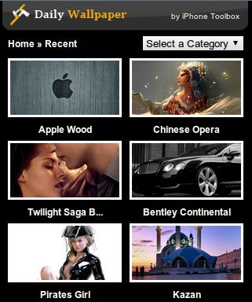
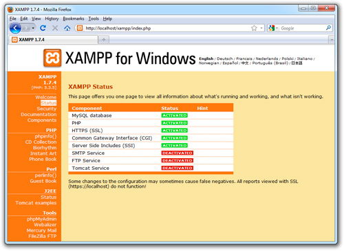
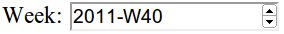
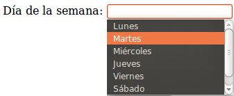
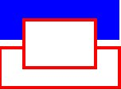
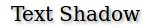

# Introducción al desarrollo Web para móviles


<!-- ********************************************************************* -->
## Introducción

La Web móvil es la misma Web que la de escritorio, utiliza la misma arquitectura básica y muchas de las mismas tecnologías. Pero existen claras diferencias que impiden que su funcionamiento y manejo sea el mismo, como son: el tamaño de la pantalla, las diferentes formas de uso (táctil, teclado del móvil, etc.) y el ancho de banda.

Otra diferencia que se debería de tener en cuenta es que es "móvil". Accedemos a Internet desde lugares en los que sería imposible hacerlo con un ordenador de sobremesa o incluso un portátil. Esto influye también en el uso que le damos, se hacen más búsquedas o consultas, además de que la información se debe de disponer de forma más clara y directa.

Debido a todo esto, al programar una Web para móvil debemos de tener en cuenta que ni el contenido, ni la apariencia, ni la estructura de la web va a ser la misma que la que podríamos hacer para un ordenador de escritorio. Hemos de diseñar muy bien este tipo de aplicaciones y orientarlas al uso principal que le va a dar el usuario. Para esto se suele referir a la _regla del 20%_: el 80% del contenido del sitio web de escritorio no es válido para una web móvil. Por lo que hemos de centrarnos en ese 20% restante, averiguar cual es, y optimizar nuestro sitio para este uso.


<!-- ********************************************************************* -->
### Aplicación móvil vs. Aplicación nativa

Los desarrolladores de aplicaciones nativas tienen la ventaja de poder usar funciones no disponibles para la web móvil:

* El uso de interfaces nativas que proveen los propios SDK como iPhone o Android.

* El uso de bases de datos locales. Aunque en HTML 5 se pueden usar el almacenamiento local, hay que reconocer que estas tecnologías están más avanzadas en los sistemas nativos.

* Notificaciones push. A esto se refiere con los avisos centralizados que muestran las aplicaciones, aún cuando están ocultas. Una fuerte razón que no puede ser implementada en una web móvil.

* Geolocalización. Hemos visto algunos ejemplos de geolocalización a través de HTML5, pero que no acaban de alcanzar la misma experiencia de usuario que una aplicación móvil. Podemos interactuar con el mapa o con las funcionalidades asociadas a la localización del usuario, pero no ir mucho más allá.

* Soporte para cámara o vídeo. Las funciones multimedia están perfectamente acopladas a las aplicaciones nativas, pudiendo añadir funcionalidades especificas a nuestra aplicación.


Sin embargo estas diferencias cada vez se van haciendo menores:

* Gracias al uso de HTML5, CSS3 y JavaScript cada vez se pueden hacer más cosas y obtener mejores resultados.

* Cada vez hay mejores frameworks de desarrollo para aplicaciones móviles, como JQuery Mobile, Sencha Touch o Ionic. Estos nos permiten crear webs con apariencia cercana a las de las aplicaciones nativas, pero a su vez con toda la potencia de la Web. Estos framework nos permiten adaptar el contenido según el dispositivo usado y sus posibilidades técnicas: pantalla táctil, reproducción de vídeos o resolución de pantalla. Por lo que podríamos decir que una Web móvil es mucho más adaptable (además de multiplataforma) que una aplicación móvil.

* La web sigue siendo el negocio principal de muchas empresas de Internet. El desarrollo web no ha muerto por la inclusión de las aplicaciones móviles, sino que se ve afectado por un proceso de cambio hacía la adopción de tecnologías nuevas como HTML5.

* La inclusión de la tecnología _PhoneGap_ también está recortando más estas diferencias. _PhoneGap_ es la posibilidad de crear una aplicación nativa instalable a partir de una página Web móvil, permitiendo además su distribución en _Android Market_ o en la _App Store_. Además estas tecnologías facilitan el uso de funcionalidades del dispositivo móvil directamente a través de código JavaScript, como puede ser el acceso a la cámara, acelerómetro, geolocalización, listado de contactos, comprobar el estado de la conexión, etc.


<!-- *********************************************************************** -->
### Reglas de usabilidad

A la hora de iniciar el desarrollo de una Web para móvil es importante tener en cuenta una serie de reglas básicas:


**1. Reducir la cantidad de contenido**

Las aplicaciones móviles deben de ser optimizadas dado que el espacio visual es mucho más limitado que en una pantalla de ordenador. Cada píxel cuenta, y no todo lo que es válido para una Web de escritorio lo es para una Web móvil.

Solo debemos de incluir el contenido y las características principales y más importantes. Los contenidos con menor importancia deben de ser eliminados, como contenidos secundarios, normalmente localizados en columnas laterales o en la parte inferior.

La web móvil debe de estar enfocada a este contenido principal. Facilitar su lectura y navegación, así como mejorar los tiempos de carga reduciendo imágenes y contenidos.


**2. Usar una sola columna**

Las páginas Web anchas y con varias columnas dificultan la navegación y lectura en un dispositivo móvil. Incluso en los terminales móviles con pantallas más grandes hay que realizar zoom para moverse y ver bien el contenido. Esta es una práctica que debemos evitar, pues tener que ir realizando zoom añade más pasos a la navegación, y en algunos dispositivos no es tan fácil de realizar como en un iPhone.

Lo mejor es tener nuestro contenido en una sola columna que use todo el ancho de la pantalla. Para añadir contenido lo deberemos de hacer hacia abajo (o creando una página nueva), nunca hacia los lados (o creando columnas). Esto nos asegura que el contenido se va a visualizar correctamente, además es mucho más intuitivo realizar _scroll_ hacia abajo para ir leyendo.


**3. Muestra los enlaces de navegación de forma diferente**

No pongas todos los enlaces de navegación en la parte superior de la pantalla. Si hay muchos desplazarán todo el contenido hacia abajo, y es posible que los tengas que poner muy reducidos.

La página principal debería de contener los enlaces al resto del contenido junto con un buscador (si fuese necesario). El contenido debería de estar en páginas secundarias bien organizado. Por ejemplo, cuando un usuario entra en un sitio de _eCommerce_ suelen tener una categoría de producto en mente que quiere consultar, la cual la podrían encontrar usando el buscador o directamente a partir del menú. Es decir, la página principal debe facilitar el acceso rápido a la información más importante de la web.

También hay otras opciones para colocar el menú de navegación, como una lista desplegable o al final de la página. Son muy cómodas las barras de herramientas estáticas que ofrecen las opciones principales (volver a la página inicial, botones principales, etc.).


**4. Minimiza la cantidad de datos solicitados**

Escribir texto utilizando un terminal móvil es mucho más difícil que hacerlo utilizando el teclado de un ordenador de sobremesa. Además los usuarios suelen escribir mucho más lento y cometer más errores. Por estas razones tenemos que intentar minimizar la cantidad de texto solicitado.

Una forma de conseguir esto es permitir almacenar los datos (usuario, contraseñas, configuración, direcciones, etc.), o aprovechar algunas de las funcionalidades que incorporan los dispositivos móviles (como veremos más adelante).


**5. Decide si necesitas más de una Web para móvil**

El tamaño de pantalla, la capacidad de procesamiento y de usabilidad varía enormemente de un terminal a otro. Por esta razón a veces debemos de considerar crear varios sitios web con el mismo contenido pero adaptado a diferentes necesidades. Por ejemplo, Facebook tiene <a href="m.facebook.com">m.facebook.com</a> como sitio web principal para móviles, pero además tiene una versión optimizada para pantallas táctiles (<a href="touch.facebook.com">touch.facebook.com</a>) y una versión optimizada para conexiones más lentas (<a href="0.facebook.com">0.facebook.com</a>).


**6. Diseña para pantallas táctiles, pero también para teléfonos no-táctiles**

La forma de navegar por las páginas web es muy diferente según el dispositivo: pantallas táctiles, _trackball_, _joystick_, teclado, etc. Estas características también son importantes a la hora de realizar el diseño. Por ejemplo, la principal dificultad está en la selección y pulsado sobre textos o enlaces pequeños. En las pantallas táctiles además se dificulta pulsar sobre elementos que estén muy juntos.

Por esta razón, los enlaces o elementos que puedan ser seleccionados deben de ocupar un mayor espacio en pantalla, incluirlos en botones o cuadros más grandes, que puedan ser pulsados con facilidad.


**7. Aprovecha las funcionalidades que incorporan los móviles**

Los teléfonos móviles tienen algunas ventajas sobre los PCs, las cuales pueden facilitar la realización de algunas tareas. Algunas de estas funcionalidades añadidas son:

Realizar llamadas: puede parecer evidente pero es una funcionalidad muy útil que los PCs no pueden realizar tan fácilmente. Por esta razón debemos de aprovecharla para, por ejemplo, llamar directamente al presionar sobre un número de teléfono, facilitar el contacto con un servicio técnico, etc.

Uso de mapas y posición actual: es posible dar la opción al usuario de seleccionar una dirección y que automáticamente se abra en la aplicación de mapas del dispositivo móvil. También es muy interesante el uso de la posición actual para mostrar puntos de interés cercanos, calcular rutas, etc.

Solicitud de información de forma innovadora: como por ejemplo los códigos QR, que se han usado en algunas campañas de publicidad, etc.

Al cumplir esta serie de reglas se incrementa el público que puede acceder a los contenidos, creando sitios Web eficaces y haciendo la navegación accesible desde más dispositivos.


<!-- *********************************************************************** -->
### Dominio

Existen diferentes alternativas sobre el dominio que podemos usar. En definitiva esta es una decisión personal, pues todas ellas tienen sus ventajas e inconvenientes. La única recomendación que se suele hacer es tener varias opciones disponibles, con la intención de facilitar al máximo el acceso.

Podemos tener un subdominio de nuestro sitio Web especializado para dispositivos móviles. Por ejemplo, si nuestro sitio Web es _www.midominio.com_, el sitio para dispositivos móviles podría ser _m.midominio.com_. Por ejemplo, Facebook tiene disponibles los sitios <a href="m.facebook.com">m.facebook.com</a>
(como sitio web para dispositivos móviles) y <a href="touch.facebook.com">touch.facebook.com</a> (para dispositivos táctiles).

También podemos usar el dominio principal y diferenciar (desde el cliente o desde el servidor) si se trata de un dispositivo móvil. En este caso el usuario accedería a la misma dirección pero sería redirigido al sitio correspondiente o se le devolvería un contenido diferente.

Otra opción es comprar un dominio "_.mobi_" (especial para web móvil) con el mismo nombre que la web principal.

Si optamos por dar diferentes opciones de acceso deberemos crear redirecciones
301 al dominio principal seleccionado para manejar ese contenido, de la forma:

```php
<?php
header("HTTP/1.1 301 Moved Permanently");
header("location:http://www.nueva_url.com");
?>
```


<!-- *********************************************************************** -->
### Detección del navegador

Un dilema a la hora de desarrollar contenidos para móviles es cómo diferenciar entre dispositivos móviles y navegadores de escritorio. Esto se puede hacer fácilmente mediante una función de comprobación que nos indique el tipo de navegador que ha solicitado la web. Una vez obtenido el navegador tenemos varias opciones, como se comentaba en la sección anterior: redireccionar al dominio correspondiente, o adaptar el código de nuestra página según el cliente.

A continuación se incluye una función en PHP que nos devuelve un número positio si detecta que el navegador es un dispositivo móvil, y 0 en caso de ser un navegador de escritorio.

```php
public static function mobileBrowser()
{
	$mobile_browser = '0';

	//$_SERVER['HTTP_USER_AGENT'] -> el agente de usuario que está
	// accediendo a la página.
	if(preg_match('/(up.browser|up.link|mmp|symbian|smartphone|midp|wap|phone)/i',
			strtolower($_SERVER['HTTP_USER_AGENT'])))
	{
	    $mobile_browser++;
	}

	//$_SERVER['HTTP_ACCEPT'] -> Indica los tipos MIME que el cliente puede recibir.
	if((strpos(strtolower($_SERVER['HTTP_ACCEPT']),'application/vnd.wap.xhtml+xml')>0)
		or
		((isset($_SERVER['HTTP_X_WAP_PROFILE']) or isset($_SERVER['HTTP_PROFILE']))))
	{
	    $mobile_browser++;
	}

	$mobile_ua = strtolower(substr($_SERVER['HTTP_USER_AGENT'],0,4));
	$mobile_agents = array(
	    'w3c ','acs-','alav','alca','amoi','audi','avan','benq','bird','blac',
	    'blaz','brew','cell','cldc','cmd-','dang','doco','eric','hipt','inno',
	    'ipaq','java','jigs','kddi','keji','leno','lg-c','lg-d','lg-g','lge-',
	    'maui','maxo','midp','mits','mmef','mobi','mot-','moto','mwbp','nec-',
	    'newt','noki','oper','palm','pana','pant','phil','play','port','prox',
	    'qwap','sage','sams','sany','sch-','sec-','send','seri','sgh-','shar',
	    'sie-','siem','smal','smar','sony','sph-','symb','t-mo','teli','tim-',
	    'tosh','tsm-','upg1','upsi','vk-v','voda','wap-','wapa','wapi','wapp',
	    'wapr','webc','winw','winw','xda','xda-');

	//buscar agentes en el array de agentes
	if(in_array($mobile_ua, $mobile_agents)) {
	    $mobile_browser++;
	}

	//$_SERVER['ALL_HTTP'] -> Todas las cabeceras HTTP
	if(strpos(strtolower($_SERVER['ALL_HTTP']),'OperaMini')>0) {
	    $mobile_browser++;
	}
	if(strpos(strtolower($_SERVER['HTTP_USER_AGENT']),'windows')>0) {
	    $mobile_browser=0;
	}

	return $mobile_browser;
}

```


También existen librerías un poco más completas para detectar el cliente usando código PHP como por ejemplo: http://mobiledetect.net/ Esta librería nos permite determinar si el cliente es un ordenador de escritorio, un tablet o un móvil, el sistema operativo que utiliza (Android, iOS, Linux, Windows, etc.), el navegador, versiones, etc.


<!-- *********************************************************************** -->
### Ejemplos de Webs para móviles

Cuando se empieza en el desarrollo de webs para dispositivos móviles es bueno buscar inspiración, ir a ver que ha hecho gente con más experiencia en el campo. A continuación se incluye una pequeña lista de ejemplos:

<table>
    <tr>
        <td> 
            http://m.diesel.com 
            <br/> 
            
        </td>
        <td>
            http://m.flickr.com/ 
            <br/> 
            
        </td>
    </tr>
    <tr>
        <td>
            http://mobile.walmart.com/ 
            <br/> 
             
        </td>
        <td>
            http://m.marksandspencer.com/
            <br/> 
            
        </td>
    </tr>
    <tr>
        <td>
            http://iphonetoolbox.com/dailywallpaper
            <br/>
            
        </td>
        <td>
        </td>
   </tr>
</table>


En todos de ellos debemos de considerar la adaptación que se ha hecho del contenido entre la web de escritorio y la web para dispositivos móviles. En la siguiente imagen se puede ver una comparación en la que varía la disposición. Pero como hemos dicho, los cambios no son únicamente de disposición, tenemos que recordar la regla del 20%.


<!-- *********************************************************************** -->
<!-- *********************************************************************** -->
<!-- *************************** SERVIDOR WEB ****************************** -->
<!-- *********************************************************************** -->
<!-- *********************************************************************** -->


<!-- *********************************************************************** -->
## Instalación de un servidor Web

En la programación Web, una de las herramientas principales que necesitamos es un servidor Web o servidor HTTP. Este es el encargado de compilar el código (según el lenguaje de programación que utilicemos) y enviarlo al cliente utilizando el protocolo de transferencia HTTP.

Dado que instalar un servidor Web completo y configurarlo correctamente es una tarea bastante costosa, para el desarrollo y testeo de aplicaciones en local se suele utilizar un servidor XAMPP. Este es un paquete software de fácil instalación que incluye todo lo necesario para la ejecución de un servidor Web.

Es independiente de plataforma, software libre (licencia GNU), y consiste principalmente en la base de datos MySQL, el servidor web Apache y los intérpretes para lenguajes de script: PHP y Perl. El nombre proviene del acrónimo formado por **X** (para cualquiera de los diferentes sistemas operativos), **A**pache, **M**ySQL, **P**HP y **P**erl. Actualmente XAMPP está disponible para Microsoft Windows (WAMPP), GNU/Linux (LAMPP), Solaris y MacOS X (MAMPP).


<!-- *********************************************************************** -->
### XAMPP para Linux

Para su instalación en Linux tendremos que seguir los siguientes pasos:

* En primer lugar descargamos el software desde: <a href="http://www.apachefriends.org/en/xampp-linux.html">http://www.apachefriends.org/en/xampp-linux.html</a>

* Abrimos una consola y ejecutamos:

```html
sudo tar xvfz xampp-linux-1.7.7.tar.gz -C /opt
```

Ahora ya tenemos instalado el servidor en la ruta ’/opt/lampp’.

* Para inicializar el servidor escribimos:<br/>

```html
sudo /opt/lampp/lampp start
```

Veremos algo como:

```html
Starting XAMPP 1.7.7...
LAMPP: Starting Apache...
LAMPP: Starting MySQL...
LAMPP started.
```

Con esto ya tenemos listo nuestro servidor Apache con MySQL.

* Para comprobar que todo ha ido correctamente abrimos un navegador y escribimos la dirección "<a href="http://localhost">http://localhost</a>", debería de abrirse una página similar a la siguiente:


El directorio raíz de Apache es `/opt/lampp/htdocs`, que será donde colocaremos nuestras páginas Web.

El servidor viene por defecto sin ninguna opción de seguridad activada (ya que se va a usar en local para pruebas), pero si quisiéramos activarlas tendríamos que escribir:

```html
sudo /opt/lampp/lampp security
```

Por último, para detener el servidor Web simplemente ejecutamos en una consola:

```html
sudo /opt/lampp/lampp stop
```


<!-- *********************************************************************** -->
### XAMPP para Windows

Los pasos para instalar XAMPP en Windows son los siguientes:

* Descargamos la última versión del software desde: <a href="http://www.apachefriends.org/en/xampp-windows.html">http://www.apachefriends.org/en/xampp-windows.html</a>

Existen diferentes opciones de descarga, la más sencilla y la que seguiremos aquí es utilizar el "instalador".

* Ejecutamos el instalador utilizando los valores por defecto:


* Después de la instalación abrimos el Panel de Control de XAMPP (se encuentra en el menú de Inicio > Programas > XAMPP). Desde aquí podemos iniciar y detener cada uno de los servicios individualmente.


* Para comprobar que el servidor está instalado correctamente abrimos un navegador y escribimos la dirección "<a href="http://localhost/">http://localhost/</a>" (o también "<a href="http://127.0.0.1/">http://127.0.0.1/</a>"), donde se nos abriá una página web como la siguiente:




Si nos avisa el Firewall del sistema tendremos que desbloquear o permitir el acceso a Apache.

En Windows, el directorio raíz de Apache para el contenido Web está en `C:\xampp\htdocs`, que será donde colocaremos nuestras páginas Web.

El servidor viene por defecto sin ninguna opción de seguridad activada (ya que se va a usar en local para pruebas), pero estas opciones se pueden configurar directamente desde un navegador accediendo a la dirección <a href="http://localhost/security/">http://localhost/security/</a>.


<!-- *********************************************************************** -->
### Instalar un servidor Web para Mac

Existen ciertas ventajas del uso de un Mac para el desarrollo de aplicaciones para móviles. Para empezar, el sistema operativo viene con un servidor web Apache instalado. El navegador por defecto, Safari, renderiza correctamente las aplicaciones basadas en WebKit. Y, por su puesto, tiene un excelente simulador para iOS como parte de Xcode.

Si queremos instalar un servidor XAMPP para Mac podemos acceder a la dirección <a href="http://www.apachefriends.org/en/xampp-macosx.html">http://www.apachefriends.org/en/xampp-macosx.html</a> y seguir los pasos de instalación, muy similares a los ya vistos para Linux y Windows.

Para este ejemplo vamos a explicar la configuración del servidor Apache que viene con el sistema operativo. En primer lugar abrimos las "Preferencias del Sistema" y vamos al panel "Sharing", en el cual deberemos de habilitar la opción "Web Sharing":


Dependiendo de la versión del sistema operativo que tengamos, aparecerá un botón para abrir la carpeta con el contenido Web y un enlace desde donde podremos comprobar que el servidor se está ejecutando correctamente.

Si lo queremos comprobar nosotros directamente, desde el navegador tendremos que acceder a la dirección IP de nuestra máquina en la red seguida de nuestro nombre de usuario, como podemos ver en la imagen inferior:


Si estuviésemos utilizando un servidor XAMPP desde el navegador podríamos haber accedido directamente a la dirección: "<a href="http://localhost">http://localhost</a>".

El directorio para el contenido Web se encuentra normalmente dentro de la carpeta principal con el nombre de "_Sites_":


<!-- *********************************************************************** -->
### Acceso mediante un dispositivo móvil real

Si estamos trabajando con el servidor Web disponible en **Mac**, podremos acceder a nuestras páginas Webs de forma externa simplemente conectándonos a la misma red WiFi. Para esto nos tendremos que asegurar que en el ordenador que hace de servidor no se esté ejecutando ningún Firewall que pueda bloquear el acceso desde un cliente remoto. La dirección que tendremos que utilizar será igual que la que usaríamos desde un navegador ejecutado en el mismo ordenador: la dirección IP del servidor en esa red seguida de nuestro nombre de usuario, como podemos ver en la imagen inferior:


Si nuestro servidor está corriendo en una máquina con **Linux o Windows**, entonces tendremos que seguir los siguientes pasos. En primer lugar también nos tendremos que asegurar de que no se esté ejecutando ningún Firewall que pueda bloquear el acceso (si fuera así tendríamos que darle acceso). A continuación obtendremos la dirección IP del servidor. Para esto abrimos un terminal y ejecutaremos el comando `ipconfig` (desde Windows) o `ifconfig` (desde Linux), obteniendo un resultado similar a:


Utilizando esta dirección IP y estando conectados a la misma red WiFi, ya podremos acceder a nuestro servidor Web desde un dispositivo móvil externo. Simplemente tendremos que escribir la dirección formada como "<a href="http://172.16.125.128/mi_web">http://172.16.125.128/mi_web</a>". Donde en primer lugar colocamos la dirección IP seguida del nombre de la carpeta donde se encuentre nuestro proyecto Web.

Es posible que obtengamos un error de seguridad como el siguiente:


En este caso tendríamos que abrir el fichero `httpd-xampp.conf` que contiene la configuración de nuestro servidor XAMPP. Lo encontraremos en `C:\xampp\apache\conf\extra` en nuestro servidor Windows y en la ruta `/opt/lampp/etc/extra` en Linux. Al final de este fichero podremos ver el siguiente trozo de texto:

```html
<LocationMatch "^/(?i:(?:xampp|security|licenses|phpmyadmin|webalizer|server-status|server-info))">
   Order deny,allow
   Deny from all
   Allow from 127.0.0.0/8
   ErrorDocument 403 /error/HTTP_XAMPP_FORBIDDEN.html.var
</LocationMatch>
```

Si no nos importa la seguridad (pues es una red local), podemos abrir el acceso a todos los usuarios cambiando la cuarta línea por `Allow from All`, quedando de la forma:

```html
<LocationMatch "^/(?i:(?:xampp|security|licenses|phpmyadmin|webalizer|server-status|server-info))">
   Order deny,allow
   Deny from all
   Allow from all
   ErrorDocument 403 /error/HTTP_XAMPP_FORBIDDEN.html.var
</LocationMatch>
```

Tendremos que reiniciar nuestro servidor Apache para que los cambios tengan efecto (ver en las secciones anteriores) y ya tendremos acceso desde nuestro dispositivo móvil.


<!-- *********************************************************************** -->
### Instalación del SDK de Android

Si queremos utilizar el emulador de Android para testear nuestras Webs tendremos que instalar el SDK de Android completo. Para esto descargamos el software desde "<a href="http://developer.android.com/sdk/index.html">http://developer.android.com/sdk/index.html</a>" y procedemos a su instalación. Este proceso simplemente requiere que descomprimamos el archivo descargado en una carpeta y ejecutemos el SDK Manager (tools/android) para empezar a trabajar.

Para poder realizar simulaciones y visualizar nuestras páginas Web tendremos que crear un dispositivo virtual de Android (Android Virtual Device o AVD).

Si utilizamos Eclipse como entorno de desarrollo, podemos instalar el plugin de Android para Eclipse (ADT Plugin), el cual lo podremos encontrar en la dirección "<a href="http://developer.android.com/sdk/eclipse-adt.html">http://developer.android.com/sdk/eclipse-adt.html</a>". Este plugin integrará el SDK y nuestro simulador en Eclipse.


<!-- *********************************************************************** -->
### Instalar Xcode

Si trabajamos con el sistema operativo de Mac podremos hacer uso del IDE Xcode y de los emuladores de iPhone e iPad que incorpora para testear nuestras aplicaciones en local. Este software lo podemos descargar desde el Apple Developer Center accediendo a la dirección "<a href="http://developer.apple.com/xcode/">http://developer.apple.com/xcode/</a>".


<!-- *********************************************************************** -->
### Simuladores y Emuladores

Los simuladores solo tratan de reproducir el comportamiento, para que el resultado se parezca al que obtendríamos con una ejecución real. Los emuladores, por su parte, modelan de forma precisa el dispositivo (hardware y S.O.), de manera que este funcione como si estuviese siendo usado en el aparato original.

Podemos encontrar algunos simuladores online mediante los cuales realizar pruebas rápidas de nuestros proyectos, como:

* iPhone 4 Simulator: http://iphone4simulator.com

* Test iPhone: http://www.testiphone.com

* iPhone Tester: http://iphonetester.com

* Opera Mini Simulator: http://www.opera.com/developer/tools/mini/

* Emuladores para Nokia N70 y Sony K750: http://mtld.mobi/emulator.php


Para poder usar estos simuladores tendremos que tener nuestro proyecto en un servidor Web para poder acceder a través de la dirección de localhost o de la IP.

Para una completa guía de los emuladores disponibles podemos consultar: <a href="http://www.mobilexweb.com/emulators">http://www.mobilexweb.com/emulators</a>.


<!-- ********************************************************************* -->
<!-- ********************************************************************* -->
<!-- ********************************************************************* -->
<!-- ********************************************************************* -->

## Introducción a HTML

HTML, siglas de _HyperText Markup Language_ (Lenguaje de marcado de hipertexto), es el lenguaje de marcado predominante para la elaboración de páginas web. Es usado para describir la estructura y el contenido en forma de texto, así como para complementar el texto con objetos tales como imágenes. El código HTML se escribe en forma de "etiquetas", mediante las cuales podemos describir la estructura lógica y apariencia del contenido. La apariencia que podemos describir con HTML está bastante limitada, pero el código se puede complementar y mejorar mediante el uso de otros lenguajes como JavaScript o CSS.


<!-- *********************************************************************** -->
### Editores HTML

El lenguaje HTML puede ser creado y editado con cualquier editor de textos básico, como puede ser Gedit en Linux o el Bloc de notas de Windows. Existen además otros editores para la realización de sitios web con características WYSIWYG (_What You See Is What You Get_, o en español: "lo que ves es lo que obtienes"). Estos editores permiten ver el resultado de lo que se está editando en tiempo real, a medida que se va desarrollando el documento. Ahora bien, esto no significa una manera distinta de realizar sitios web, sino que una forma un tanto más simple ya que estos programas, además de tener la opción de trabajar con la vista preliminar, tiene su propia sección HTML, la cual va generando todo el código a medida que se va trabajando. Algunos ejemplos de editores son Adobe Dreamweaver, KompoZer o Microsoft FrontPage.

Estos editores aceleran o facilitan la creación de código HTML, pero en algunas ocasiones también generan mucho más código del necesario (como es el caso de Microsoft FrontPage). Lo ideal es tener un control total sobre el código que se escribe y utilizar estos editores sólo como una pequeña ayuda. También podemos utilizar otro tipo de editores que simplemente comprueben que el código HTML escrito es correcto (que las etiquetas y atributos son correctos, las etiquetas se cierran correctamente, etc.).


<!-- *********************************************************************** -->
### Etiquetas

Las etiquetas HTML deben de ir encerradas entre corchetes angulares `<>`, y pueden ser de dos tipos:

* Se abren y se cierran, como por ejemplo: `<b>negrita</b>` o `<p>texto</p>`.

* Se abren y cierran en la misma etiqueta, como: `<br/>` o `<hr/>`.

En caso de que no cerremos una etiqueta que deba ser cerrada se producirá un error en la estructura del documento y probablemente también genere errores en la visualización.

Hay etiquetas que además pueden contener atributos, en este caso los atributos se deben de colocar en la etiqueta de inicio, de la forma:

```html
<etiqueta atributo1="valor1" atributo2="valor2">...</etiqueta>
```

O para las etiquetas de solo apertura:

```html
<etiqueta atributo1="valor1" atributo2="valor2"/>
```


<!-- *********************************************************************** -->
### Estructura básica de una Web

Un documento HTML comienza con la etiqueta `<html>` y termina con `</html>`. Dentro del documento (entre las etiquetas de principio y fin de html) hay dos zonas bien diferenciadas: el encabezamiento, delimitado por `<head>` y `</head>`, que sirve para incluir definiciones iniciales válidas para todo el documento; y el cuerpo, delimitado por `<body>` y `</body>`, donde reside la información del documento.

Las etiquetas básicas o mínimas son:

```html
<!DOCTYPE HTML PUBLIC "-//W3C//DTD HTML 4.01//EN" "http://www.w3.org/TR/html4/strict.dtd">
<html>
<head>
   <title>Ejemplo</title>
</head>
<body>
   ¡Hola mundo!
</body>
</html>
```

La primera línea es el DOCTYPE, o el tipo de documento que viene a continuación. En este caso se usa el estándar de HTML 4.01 (el último estándar adoptado en 1999, ya que HTML5 a fecha de 2011 sigue siendo un borrador). La siguiente etiqueta, `<html>`, define el inicio del documento HTML, e indica que lo que viene a continuación debe ser interpretado como código HTML. Como podemos ver en la última línea, se cierra la etiqueta `</html>`.


<!-- ********************************************************************* -->
### Elementos de la cabecera

La cabecera contiene información sobre el documento que no se muestra directamente al usuario. Como por ejemplo el título de la ventana del navegador, los metadatos o la hoja de estilo utilizada. Dentro de la cabecera `<head></head>` podemos encontrar:

* `<title></title>`: define el título de la página. Por lo general el título aparece en la barra de título encima de la ventana.

* `<link/>`: para vincular el sitio con hojas de estilo (ver la sección de CSS para más información):

```html
<link rel="stylesheet" href="style.css" type="text/css"/>
```

El atributo `rel` es requerido y describe el tipo de documento enlazado (en este caso una hoja de estilo). El atributo `type` es simplemente indicativo del tipo de hoja de estilo enlazada (en este caso CSS).


* `<style></style>`: se utiliza para añadir definición de estilo en línea. No es necesario colocarlo si se va a utilizar una hoja de estilo externa usando la etiqueta `<link/>` (que es lo más habitual y recomendable). El uso correcto sería de la forma:


```html
<html>
<head>
   ...
   <style type="text/css">
      Estilos CSS
   </style>
</head>
<body></body>
</html>

```

Para más información ver la sección CSS del manual.


* `<meta/`: para indicar metadatos como la descripción de la web, los keywords, o el autor:


```html
<meta name="description" content="Descripción de la web" />
<meta name="keywords" content="key1,key2,key3" />
<meta name="author" content="Nombre del autor" />
```


* `<script></script>`: permite incluir un script en la Web. El código se puede escribir directamente entre las etiquetas de `<script>` o cargar desde un fichero externo, indicando mediante el atributo `src="url del script"` la dirección del fichero. Se recomienda incluir el tipo MIME en el atributo type, que en el caso de código JavaScript sería `text/javascript`. Ejemplos:

```html
<script src="fichero.js" type="text/javascript"></script>

<script type="text/javascript">
   Código de un script integrado en la página
</script>
```

Cuando usamos el atributo `src` el contenido de estas etiquetas está vacío (no encierra nada), esto es porque lo carga directamente desde el fichero indicado.


<!-- *********************************************************************** -->
### Etiquetas básicas HTML

Las etiquetas HTML que utilizaremos para crear el contenido de nuestra página deben de ir dentro de la sección `<body></body>`.

Algunas de las etiquetas HTML que más se suelen utilizar son:

* `<h1></h1>` a `<h6></h6>`: encabezados o títulos del documento con diferente relevancia, siendo `<h1>` la cabecera de mayor nivel.

* `<p></p>`: definición de un párrafo.

* `<br/>`: salto de línea.

* `<b></b>`: texto en negrita (etiqueta desaprobada. Se recomienda usar la etiqueta `<strong></strong>`).

* `<i></i>`: texto en cursiva (etiqueta desaprobada. Se recomienda usar la etiqueta `<em></em>`).

* `<s></s>`: texto tachado (etiqueta desaprobada. Se recomienda usar la etiqueta `<del></del>`).

* `<u></u>`: texto subrayado.

* `<center></center>`: texto centrado.

* `<pre></pre>`: texto preformateado, respeta los espacios y saltos de línea.

* `<sup></sup>`: Superíndice.

* `<sub></sub>`: Subíndice.

* `<blockquote></blockquote>`: Indica una cita textual, se representa como un párrafo indexado con respecto al margen.

* `<hr/>`: Línea horizontal, usada, por ejemplo, para separar diferentes secciones.

* `<!-- comentario -->`: Comentarios en HTML. El texto del comentario no será visible en el navegador.

* `<span></span>`: Esta etiqueta no aplica ningún formato por si misma, sino que provee una forma de definir un estilo o formato a un trozo de texto. Se utiliza junto con una hoja de estilo. Por ejemplo, lo podemos utilizar para marcar palabras en algún color o con algún formato especial.


<!-- *********************************************************************** -->
### Listas

Para definir una lista utilizamos las siguientes etiquetas:

* `<ol></ol>`: Lista ordenada (con numeración).
* `<ul></ul>`: Lista con puntos (o viñetas).
* `<li></li>`: Elemento de una lista (tanto numerada como no numerada). Esta etiqueta debe de estar entre las etiquetas `<ol></ol>` o `<ul></ul>`.

Ejemplo de lista:

```html
<ol>
   <li>Elemento 1</li>
   <li>Elemento 2</li>
</ol>
```


<!-- *********************************************************************** -->
### Tablas

Las tablas se definen básicamente mediante tres etiquetas:

* `<table></table>`: define una tabla.
* `<tr></tr>`: fila de una tabla, debe de estar dentro de las etiquetas de una tabla.
* `<td></td>`: celda de una tabla, debe estar dentro de una fila.

Ejemplo de una tabla:

```html
<table>
   <tr>
      <td>Fila 1 izquierda</td>
      <td>Fila 1 derecha</td>
   </tr>
   <tr>
      <td>Fila 2 izquierda</td>
      <td>Fila 2 derecha</td>
   </tr>
</table>
```

Además también podemos utilizar la etiqueta `<th>` en lugar de `<td>` para indicar una celda de "cabecera", de esta forma el contenido será resaltado en negrita y en un tamaño ligeramente superior al normal.

En la etiqueta de apertura `<table>` podemos utilizar los siguientes atributos:

* `border="num"`: Ancho del borde de la tabla en puntos. Si indicamos border="0" tendremos una tabla cuyas divisiones no serán visibles, esta propiedad se suele utilizar para distribuir los elementos en una página Web.

* `cellspacing="num"`: Espacio en puntos que separa las celdas que están dentro de la tabla.

* `cellpadding="num"`: Espacio en puntos que separa el borde de cada celda y el contenido de esta.

* `width="num"`: Indica la anchura de la tabla en puntos o en porcentaje en función del ancho de la ventana. Si no se indica este parámetro, el ancho dependerá de los contenidos de las celdas.

* `height="num"`: Indica la altura de la tabla en puntos o en porcentaje en función del alto de la ventana. Si no se indica este parámetro, la altura dependerá de los contenidos de las celdas.
Este atributo también se puede utilizar en las etiquetas `<tr>` para indicar la altura de cada fila de forma individual.


En las etiquetas de apertura de celda (`<td>` o `<th>`) podemos utilizar los siguientes atributos:

* `align="pos"`: Indica como se debe alinear el contenido de la celda, a la izquierda (left), a la derecha (right), centrado (center) o justificado (justify).

* `valign="pos"`: Indica la alineación vertical del contenido de la celda, en la parte superior (top), en la inferior (bottom), o en el centro (middle).

* `rowspan="num"`: Indica el número de filas que ocupará la celda. Por defecto ocupa una sola fila. Este atributo se utiliza para crear celdas "multifila", es decir, una celda que por ejemplo ocupe 3 filas. Tendremos que tener en cuenta que esa celda no se deberá de definir en las siguientes 2 filas (para esas filas se definirá una celda menos).

* `colspan="num"`: Indica el número de columnas que ocupará la celda. Por defecto ocupa una sola columna. Este atributo se utiliza para crear celdas "multicolumna", es decir, una celda que por ejemplo ocupe 3 columnas. Tendremos que tener en cuenta que en esa fila tendremos que definir 2 celdas menos.

* `width="num"`: Indica la anchura de la columna en puntos o en porcentaje en función del ancho de la ventana. Si no se indica este parámetro, el ancho dependerá del tamaño de los contenidos.


<!-- *********************************************************************** -->
### Cajas (etiqueta `<div>`)

La etiqueta `<div></div>` permite crear cajas contenedoras. Estas cajas se utilizan para organizar la disposición de los elementos en la página. Es muy sencillo indicar su posición de forma absoluta o relativa en la página y crear divisiones del espacio para distribuir los elementos. Estas cajas pueden contener cualquier tipo de elemento (texto, imágenes, etc.) u otras etiquetas `<div>` para crear subdivisiones. Se recomienda su uso junto con CSS, en vez de la etiqueta `<table>`, cuando se desea alinear contenido. Para más información consultar la sección sobre CSS.


<!-- *********************************************************************** -->
### Enlaces

Los enlaces permiten vincular partes del documento con otros documentos o con otras partes del mismo documento. Por ejemplo, que al pulsar con el ratón sobre un texto o sobre una imagen se nos redirija a una nueva Web con un contenido diferente.

Para crear un enlace se utiliza la etiqueta `<a href=""></a>` cuyo atributo href establece la dirección URL a la que apunta el enlace. Por ejemplo, un enlace a la Wikipedia sería de la forma:

```html
<a href="es.wikipedia.org">Wikipedia</a>
```

También se pueden crear enlaces sobre otros objetos, tales como imágenes, de la forma:

```html
<a href="dirección_URL"></a>
```

La etiqueta de enlace `<a>` también permite el atributo `target="_blank"`, mediante el cual indicamos que el enlace se tiene que abrir en una nueva ventana o en una pestaña nueva del navegador.


<!-- *********************************************************************** -->
### Imágenes

Para incluir una imagen se utiliza la etiqueta ``, la cual requiere el atributo `src` con la ruta en la que se encuentra la imagen. Es conveniente poner siempre el atributo `alt="texto alternativo"`, el cual indica el texto a mostrar en caso de no poder cargar la imagen y también se utiliza para opciones de accesibilidad.

Por ejemplo, para cargar una imagen de cabecera:

```html

```

Además existen otros atributos interesantes como `width` y `height` para redefinir el ancho y la altura de la imagen.


<!-- *********************************************************************** -->
### Formularios

Los formularios permiten solicitar información al visitante de una página Web. Están compuestos por campos de diferente tipo, cuya información se enviará a una dirección URL (indicada en el código) al pulsar el botón de envío.

La declaración de formulario queda recogida por las etiquetas `<form></form>`, los cuales deben encerrar la definición de todos los campos del formulario. En la etiqueta de apertura `<form>` tenemos que indicar los atributos básicos:

* `action=""`: Entre comillas se indica la acción a realizar al enviar el formulario. En general se indicará el nombre de un fichero alojado en el servidor, el cual se encargará de procesar la información. Aunque también se le puede indicar una dirección de correo para que envíe directamente todo el contenido, de la forma: `mailto:direccion_de_correo`.

* `method=""` (post o get): Indica el método de transferencia de las variables. El método "post" envía los datos de forma no visible, mientras que el método "get" los adjunta a la URL a la que se redirige.

* `enctype= ""`: Especifica el tipo de codificación de la información enviada. Con `method="get"` no se realiza codificación, solo se cambian caracteres especiales como el espacio, por lo que no es necesario indicar `enctype`. Cuando el valor del atributo "method" es "post", podemos utilizar los siguientes valores:

* `application/x-www-form-urlencoded`: Es el valor predeterminado. Codifica todos los caracteres antes de enviarlos.

* `multipart/form-data`: Es requerido al enviar archivos mediante un formulario. No codifica la información.

* `text/plain`: No codifica la información, solo cambia los espacios por el símbolo "+".


**Tipos de campos básicos**

Para añadir campos al formulario se utiliza la etiqueta `<input/>`, esta etiqueta debe de tener siempre dos atributos:

* `name=""`: Indica el nombre que se asigna a un determinado campo. Este nombre no aparece visible en la Web, pues se utiliza para poder distinguir cada campo al enviar la información al servidor o por correo. Es como si fuera el nombre de la variable a la que se asigna el valor del campo.

* `type=""`: Indica el tipo de campo a utilizar. Puede ser de muchos tipos: text, password, checkbox, radio, file, hidden, submit, reset.

A continuación se describen más detalladamente los diferentes tipos de campos `<input/>` según su valor `type`:

* `type="text"`: campo de tipo texto de una línea. Sus atributos son:

    * `maxlenght=""`: Seguido de un valor que limitará el número máximo de caracteres.

    * `size=""`: Seguido de un valor que limitará el número de caracteres a mostrar en pantalla. A diferencia de maxlenght este atributo no limita la longitud del texto que se puede introducir, sino que modifica el tamaño visible del campo.

    * `value=""`: Indica el valor inicial del campo.


* `type="password"`: Este campo funciona exactamente igual que el de tipo "text", pero ocultará el texto introducido cambiando las letras por asteriscos o puntos. Sus atributos son los mismos que para "text".

* `type="checkbox"`: Este campo mostrará una casilla cuadrada que nos permitirá marcar opciones de una lista (podremos marcar varias opciones a la vez). Para indicar que varias casillas pertenecen al mismo grupo se les debe de dar el mismo nombre para el atributo "name". El texto que queramos que aparezca a continuación de la casilla del "checkbox" se tendrá que escribir después de cerrar la etiqueta `<input/>`. Sus atributos son:

    * `value=""`: Define el valor que será enviado si la casilla está marcada.

    * `checked`: Este atributo es opcional, y hace que la casilla aparezca marcada por defecto. No necesita indicarle ningún valor.

      Ejemplo:

```html
<input type="checkbox" name="option1" value="leche"/> Leche<br/>
<input type="checkbox" name="option1" value="pan" checked/> Pan<br/>
<input type="checkbox" name="option1" value="queso"/> Queso<br/>
```


* `type="radio"`: El campo se elegirá marcando de entre varias opciones una casilla circular. Al marcar una casilla el resto de casillas de ese grupo de desmarcarán automáticamente. Para indicar que varias casillas pertenecen al mismo grupo se les debe de dar el mismo nombre para el atributo "name" (ver ejemplo). Además debemos de indicar:

    * `value=""`: Define el valor que será enviado si la casilla está marcada.

    * `checked`: Este atributo es opcional, y hace que la casilla aparezca marcada por defecto. Solo se podrá usar para una casilla. No necesita indicarle ningún valor.

      Ejemplo:

```html
<input type="radio" name="group1" value="leche"/> Leche<br/>
<input type="radio" name="group1" value="pan" checked/> Pan<br/>
<input type="radio" name="group1" value="queso"/> Queso<br/>
```


* `type="file"`: El atributo file permite al usuario subir archivos. Necesitaremos un programa que gestione estos archivos en el servidor mediante un lenguaje diferente al HTML. El único atributo opcional que podemos utilizar es `size=""` mediante el cual podremos indicar la anchura visual de este campo. Ejemplo:

```html
<input type="file" name="datafile" size="40"/>
```

* `type="hidden"`: Este valor no puede ser modificado, pues permanece oculto. Se suele utilizar para enviar al método encargado de procesar el formulario algún dato adicional necesario para su procesamiento. Para indicar el valor de este campo utilizamos el atributo: `value = "valor"`.

* `type="submit"`: Representa el botón de "Enviar". Al pulsar este botón la información de todos los campos se enviará realizando la acción indicada en `<form>`. Mediante el atributo:

    * `value="texto"`: podemos indicar el texto que aparecerá en el botón.

* `type="reset"`: Al pulsar este botón se borra el contenido de todos los campos del formulario. Mediante el atributo:

    * `value="texto"`: podemos indicar el texto que aparecerá en el botón.


**Campos de Selección**

Mediante la etiqueta `<select></select>` podemos crear listas de opciones, que nos permitirán seleccionar entre una o varias de ellas. Sus atributos son:

* `name=""`: Nombre del campo.

* `size=""`: Número de opciones visibles a la vez. Si se indica 1 se presentará como un menú desplegable, si se se indica mas de uno aparecerá como una lista con barra de desplazamiento.

* `multiple`: Permite seleccionar mas de un valor para el campo.

Las diferentes opciones de la lista se indicarán mediante la etiqueta `<option></option>`. El nombre que se visualizará debe de indicarse dentro de estas etiquetas. Mediante el atributo `value=""` podemos indicar el valor que se enviará con el formulario. También podemos utilizar el atributo `selected` para indicar la opción seleccionada por defecto. Si no lo especificamos, siempre aparecerá como seleccionado el primer elemento de la lista.

```html
<select name="Colores" multiple>
   <option value="r">Rojo</option>
   <option value="g">Verde</option>
   <option value="b">Azul</option>
</select>
<select name="Colores" SIZE="1">
   <option value="r">Rojo</option>
   <option value="g" selected>Verde</option>
   <option value="b">Azul</option>
</select>
```


**Áreas de texto**

Mediante las etiquetas `<textarea></textarea>` podemos crear un campo de texto de múltiples líneas. Los atributos que podemos utilizar son:

* `name=""`: Nombre del campo.
* `cols="num"`: Número de columnas de texto visibles.
* `rows="num"`: Número de filas de texto visibles.


<!-- *********************************************************************** -->
### Eventos

Los eventos permiten ejecutar acciones cuando sucede un determinado evento o se realiza una determinada acción. La forma de definirlos es similar a los atributos (`evento="acción"`), la acción hará referencia a una función o método en lenguaje JavaScript. Algunos de los eventos que podemos utilizar son:

* **onload**: se activa cuando el navegador termina de cargar todos los elementos de la página.

* **onunload**: se activa al cerrar una página.

* **onclick**: cuando se presiona el botón del ratón sobre un elemento.

* **ondblclick**: se activa al hacer doble clic sobre un elemento.

* **onmousedown**: se activa al presionar el botón del ratón (mientras que está presionado).

* **onmouseup**: cuando el botón del ratón es liberado.

* **onmouseover**: se dispara cuando el cursor del ratón pasa sobre un elemento.

* **onmousemove**: cuando se mueve el cursor del ratón mientras está sobre un elemento.

* **onmouseout**: se activa cuando el cursor del ratón sale fuera de un elemento (sobre el que estaba).

* **onfocus**: ocurre cuando un elemento recibe el enfoque (el cursor de escritura), ya sea con el puntero o con mediante la tecla tabulador.

* **onblur**: se dispara cuando un elemento pierde el enfoque (ya sea por hacer clic fuera o por presionar la tecla tabulador).

* **onkeypress**: ocurre cuando se presiona una tecla (dentro de un elemento, por ejemplo un campo de escritura).

* **onkeydown**: se dispara cuando una tecla es presionada (dentro de un elemento)

* **onkeyup**: cuando una tecla es soltada.

* **onsubmit**: se activa cuando un formulario es enviado.

* **onreset**: ocurre cuando un formulario es reseteado.

* **onselect**: cuando el usuario selecciona un texto en un campo de texto.

* **onchange**: ocurre cuando un control pierde el enfoque y su valor ha sido modificado desde que recibió el enfoque.


Ejemplo de uso:

```html
<script type="text/javascript">
   function saveText() {
      // acciones JavaScript
   }
</script>

<textarea id="myarea" cols="80" rows="15" onkeyup="saveText()"></textarea>
```


<!-- *********************************************************************** -->
### Símbolos HTML

Los caracteres especiales como signo de puntuación, letras con tilde o diéresis, o símbolos del lenguaje; se deben convertir en entidades HTML para que se muestren correctamente en un navegador. La siguiente es una lista de caracteres españoles junto con algunos símbolos especiales y su correspondiente entidad HTML:

| Caracter          | Código     || Caracter       | Código     |
| ----------------- | ---------- | -- | ---------- | ---------- |
| á                 | `&aacute;` | | Á             | `&Aacute;` |
| é                 | `&eacute;` | | É             | `&Eacute;` |
| í                 | `&iacute;` | | Í             | `&Iacute;` |
| ó                 | `&oacute;` | | Ó             | `&Oacute;` |
| ú                 | `&uacute;` | | Ú             | `&Uacute;` |
| ü                 | `&uuml;  ` | | Ü             | `&Uuml;  ` |
| ñ                 | `&ntilde;` | | Ñ             | `&Ntilde;` |
| espacio en blanco | `&nbsp;`   | | €             | `&euro;`   |
| `<` (Menor que)   | `&lt;`     ||`>` (Mayor que) | `&gt;`     |
| &                 | `&amp;`    | | º (grados)    | `&deg;`    |

Algunos servidores realizan esta conversión automáticamente, pero en general es aconsejable escribir los símbolos directamente. Para obtener una lista mucho más completa de símbolos podemos buscar en Google: "HTML symbols" o visitar la siguiente dirección http://www.ascii.cl/htmlcodes.htm.


<!-- ********************************************************************** -->
<!-- ********************************************************************** -->
<!-- ********************************* CSS ******************************** -->
<!-- ********************************************************************** -->
<!-- ********************************************************************** -->

<!-- ********************************************************************** -->
## CSS

El nombre hojas de estilo en cascada viene del inglés _Cascading Style Sheets_, del que toma sus siglas. CSS es un lenguaje usado para definir la presentación o la apariencia de un documento estructurado escrito en HTML o XML (y por extensión en XHTML). CSS se creó para separar el contenido de la forma, a la vez que permite a los diseñadores mantener un control mucho más preciso sobre la apariencia de las páginas. El W3C (_World Wide Web Consortium_) es el encargado de formular la especificación de las hojas de estilo que sirven de estándar para los navegadores.

En versiones antiguas de HTML se debía de añadir el formato dentro de las propias etiquetas, para indicar por ejemplo su color o tamaño. Esto obligaba a tener que especificar el mismo formato en todas las etiquetas para tener un diseño consistente, además, al cambiar un formato también había que cambiarlo para todas las etiquetas.

Cuando se utiliza CSS, las etiquetas HTML no deberían proporcionar información sobre cómo serán visualizadas. La información de la hoja de estilo será la que especifique cómo se han de mostrar: color, fuente, alineación del texto, tamaño, etc.

Las ventajas de utilizar CSS (u otro lenguaje de estilo) son:

* Control centralizado de la apariencia de un sitio web completo, con lo que se agiliza de forma considerable la actualización del mismo.

* Los navegadores permiten a los usuarios especificar su propia hoja de estilo local, que será aplicada a un sitio web, con lo que aumenta considerablemente la accesibilidad. Por ejemplo, personas con deficiencias visuales pueden configurar su propia hoja de estilo para aumentar el tamaño del texto o remarcar más los enlaces.

* Una página puede disponer de diferentes hojas de estilo según el dispositivo que la muestre o, incluso, a elección del usuario. Por ejemplo, para ser impresa o mostrada en un dispositivo móvil.

* El documento HTML en si mismo es más claro de entender y se consigue reducir considerablemente su tamaño.


<!-- *********************************************************************** -->
### Adjuntar una hoja de estilo

La información de estilo puede ser adjuntada de tres formas diferentes:

* **Hoja de estilo externa**: es una hoja de estilo que está almacenada en un archivo diferente al archivo HTML (por ejemplo llamado "estilo.css"). Esta es la manera de programar más potente y la que deberemos de utilizar por defecto, porque separa completamente las reglas de formateo para la página HTML. La hoja de estilo debe de ser enlazada con el código HTML de la forma:

```html
<html>
<head>
   <link rel="stylesheet" type="text/css" href="estilo.css"/>
   ...
</head>
...
```

* **Hoja de estilo interna**: es una hoja de estilo que está incrustada dentro del documento HTML. En general, la única vez que se usa una hoja de estilo interna, es cuando se quiere diferenciar con algún estilo uno de los ficheros HTML de nuestra Web. Este código debe de estar incluido en la sección de cabecera y entre las etiquetas `<style>`. Las etiquetas de comentario "`<!-- ... -->`" sirven para que los navegadores antiguos, que no soportan CSS, no incluyan ese texto en el cuerpo de la página. La forma de incluir este código sería de la forma:

```html
<html>
<head>
   <STYLE type="text/css">
      <!--
      H1 {color:blue; text-align:center}
      // -->
   </STYLE>
</head>
...
```

* **Estilo en línea (inline):** es un método para insertar el lenguaje de CSS directamente dentro de una etiqueta HTML. Esta manera de proceder no es totalmente adecuada. El incrustar la descripción del formateo dentro del documento de la página Web, a nivel de código, se convierte en una manera larga, tediosa y poco elegante de resolver el problema de la programación de la página. Este modo de trabajo se podría usar de manera ocasional si se pretende aplicar un formateo con prisa, al vuelo. La forma de incluir un estilo inline sería:

```html
<h1 style="color:blue; text-align:center">...</h1>
```


<!-- *********************************************************************** -->
### Definición de estilos para etiquetas HTML

Si lo que queremos es dar formato o redefinir una etiqueta HTML existente, usaríamos la sintaxis:

```css
etiqueta {
   estilo CSS 1;
   estilo CSS 2;
   ...
}
```

En "etiqueta" pondríamos el nombre de la etiqueta (por ejemplo "`h1`", "`p`", etc. pero sin los signos `< >`) y los estilos que definirían esa etiqueta irían encerrados entre las llaves "`{...}`".

También podemos redefinir varias etiquetas a la vez, separándolas por comas, de la forma:

```css
etiqueta1, etiqueta2, etiqueta3 {
   estilos CSS
}
```

O redefinir etiquetas "dentro" de otras etiquetas. En este caso el estilo CSS solo se aplicará cuando la etiqueta redefinida se encuentre dentro de la etiqueta contenedora:

```css
contenedor etiqueta {
   estilos CSS
}
```

Por ejemplo, una etiqueta `<span>` dentro de una sección `<p>`:

```css
p span {
   estilos CSS
}
```


<!-- *********************************************************************** -->
### Identificadores y Clases

A veces tenemos varias etiquetas del mismo tipo pero queremos aplicar diferentes estilos según donde estén. Para esto usamos los identificadores y las clases.

La principal diferencia entre ellos es que los identificadores tienen que ser únicos en todo el documento HTML mientras que las clases pueden repetirse todas las veces que queramos. Los identificadores se suelen usar con etiquetas "neutras" como `<div>` o `<span>` para marcar partes de un documento y después aplicar diferentes estilos a cada una (como por ejemplo identificar la cabecera, un logotipo, el menú principal, etc.).

En el siguiente ejemplo podemos ver como podemos indicar el identificador o la clase de una etiqueta HTML. Esto se hace con los parámetros "`id`" y "`class`" respectivamente, y se pueden aplicar a cualquier etiqueta:

```html
<div id="capitulo2">
   <p>...</p>
   <p class="parrafogris">....</p>
   <p>...</p>
   <p class="parrafogris">....</p>
</div>
```

En este ejemplo "capitulo2" sería una sección única marcada en el documento en la cual podemos aplicar un estilo concreto. El estilo de la clase "parrafogris" se aplicaría sobre las etiquetas "`p`" indicadas.

En nuestra hoja de estilos, para indicar los estilos que definen un identificador tenemos que escribir el nombre del identificador precedido por una almohadilla "`#`", de la forma:

```css
#identificador {
   estilos CSS
}
```

Esta definición de estilos se puede combinar con lo que hemos visto en la sección anterior. Por ejemplo, para aplicar un estilo en concreto a la etiqueta "etiqueta1" que esté dentro del "identificador1":

```css
#identificador1 etiqueta1 {
   estilos CSS
}
```

Para aplicar estilos a clases es parecido pero precediendo el nombre de la clase con un punto "." en vez de una almohadilla. Por ejemplo:

```css
.clase {
   estilos CSS
}
```

La definición de una clase también la podemos combinar con lo que hemos visto en la sección anterior. Además también podemos aplicar los estilos de la clase sólo a una determinada etiqueta:

```css
etiqueta1.clase1 {
   estilos CSS
}
```

En este caso sólo se aplicaría el estilo a las etiquetas "etiqueta1" que se marque que son de la clase "clase1", por ejemplo: `<etiqueta1 class="clase1">...</etiqueta1>`. Si intentáramos aplicar esta clase a una etiqueta diferente no funcionaría.


<!-- *********************************************************************** -->
### Estilos CSS básicos

La sintaxis básica para definir un estilo es:

```css
atributo: valor;
```

Los diferentes estilos siempre se separan con punto y coma, y después del nombre se pone dos puntos (y no un igual "=", que es un error típico al confundirse con el HTML).

Muchos de los valores que podemos aplicar a un atributo de estilo son **unidades de medida**, por ejemplo, el valor del tamaño de un margen o el tamaño de la fuente. Las unidades de medida que podemos utilizar son: pixels (px), puntos (pt), centímetros (cm) y pulgadas (in).

A continuación se incluye un resumen de los principales estilos CSS y los valores que se les pueden aplicar:


**FUENTES:**

* **color:** valor RGB o nombre de color<br/>
Ejemplos: color: #009900; color: red;<br/>
Sirve para indicar el color del texto. Lo admiten casi todas las etiquetas de HTML. No todos los nombres de colores son admitidos en el estándar, es aconsejable entonces utilizar el valor RGB. Algunos de los principales nombres de colores son: white, black, gray, blue, red, green o yellow, para más nombres podemos consultar la dirección "<a href="http://www.w3schools.com/cssref/css_colornames.asp">http://www.w3schools.com/cssref/css_colornames.asp</a>".

* **font-size:** xx-small|x-small|small|medium|large|x-large|xx-large|Unidades CSS<br/>
Ejemplos: font-size: 12pt; font-size: x-large; <br/>
Sirve para indicar el tamaño de las fuentes de manera más rígida y con mayor exactitud.

* **font-family:** serif | sans-serif | cursive | fantasy | monospace | Etc. <br/>
Ejemplos: font-family: arial,helvetica; font-family: fantasy; <br/>
Con este atributo indicamos la familia de tipografía del texto. Los primeros valores son genéricos (serif, sans-serif, etc.), es decir, los navegadores las comprenden y utilizan las fuentes que el usuario tenga en su sistema.<br/>
También se pueden definir con tipografías normales. Si el nombre de una fuente tiene espacios se utilizan comillas para que se entienda bien.

* **font-weight:** normal | bold | bolder | lighter | 100 | 200 | 300 | ... | 900 <br/>
Ejemplos: font-weight: bold; font-weight: 200; <br/>
Sirve para definir la anchura de los caracteres, o dicho de otra manera, para poner negrita con total libertad. <br/>
Normal y 400 son el mismo valor, así como bold y 700.

* **font-style:** normal | italic | oblique <br/>
Ejemplos: font-style: normal; font-style: italic; <br/>
Es el estilo de la fuente, que puede ser normal, itálica u oblicua. El estilo "oblique" es similar al "italic".


**PÁRRAFOS:**

* **line-height:** normal | unidades CSS <br/>
Ejemplos: line-height: 12px; line-height: normal; <br/>
El alto de una línea, y por tanto, el espaciado entre líneas. Es una de esas características que no se podían modificar utilizando HTML.

* **text-decoration:** none | underline | overline | line-through <br/>
Ejemplos: text-decoration: none; text-decoration: underline; <br/>
Establece la decoración de un texto, si está subrayado, sobre-rayado o tachado.

* **text-align:** left | right | center | justify <br/>
Ejemplos: text-align: right; text-align: center;<br/>
Sirve para indicar la alineación del texto. Es interesante destacar que las hojas de estilo permiten el justificado de texto, aunque recuerda que no tiene por que funcionar en todos los sistemas.

* **text-indent:** Unidades CSS<br/>
Ejemplos: text-indent: 10px; text-indent: 2in; <br/>
Un atributo que sirve para hacer sangrado o márgenes en las páginas.

* **text-transform:** capitalize | uppercase | lowercase | none <br/>
Ejemplos: text-transform: none; text-transform: capitalize; <br/>
Nos permite transformar el texto, para que tenga la primera letra en mayúsculas de todas las palabras, o todo en mayúsculas o minúsculas.


**FONDO:**

* **background-color:** Un color, con su nombre o su valor RGB<br/>
Ejemplos: background-color: green; background-color: #000055;<br/>
Sirve para indicar el color de fondo de un elemento de la página.

* **background-image:** El nombre de la imagen con su camino relativo o absoluto<br/>
Ejemplos: background-image: url(mármol.gif); background-image: url(http://www.url.com/fondo.gif)<br/>
Permite colocar una imagen de fondo en cualquier elemento de la página.


**CAJAS** (`<div>` o `<table>`)**:**

* **width:** Unidades CSS | Porcentaje<br/>
**height:** Unidades CSS | Porcentaje<br/>
Ejemplos: width: 50px; width: 100%; height: 15px;<br/>
Permiten indicar el ancho y altura de un elemento. Se pueden aplicar sobre muchos elementos, como tablas, etiquetas div, imágenes, párrafos "p", etc. Con algunas etiquetas no funciona, tampoco sirve para indicar espaciado (padding), bordes o márgenes.

* **margin-left:** Unidades CSS <br/>
Ejemplos: margin-left: 1cm; margin-left: 0,5in; <br/>
Indica el tamaño del margen izquierdo.

* **margin-right:** Unidades CSS<br/>
Ejemplos: margin-right: 5%; margin-right: 1in; <br/>
Define el tamaño del margen derecho.

* **margin-top:** Unidades CSS <br/>
Ejemplos: margin-top: 0px; margin-top: 10px; <br/>
Indica el tamaño del margen superior.

* **margin-bottom:** Unidades CSS <br/>
Ejemplos: margin-bottom: 0pt; margin-top: 1px; <br/>
Indica el tamaño del margen inferior.

* **margin:** `<arriba> <derecha> <abajo> <izquierda>` | `<arriba> <derecha> <abajo>` | `<arriba-abajo> <izquierda-derecha>` | `<los 4 márgenes>`<br/>
Ejemplos: margin: 4px 2px 1px 2px; margin: 4px;<br/>
También podemos utilizar el estilo "margin" para indicar todos los márgenes a la vez, esta etiqueta nos permite indicarle desde 4 valores (para cada uno de los márgenes), hasta 1 valor (para aplicarlo sobre todos los márgenes).

* **padding-left:** Unidades CSS <br/>
Ejemplos: padding-left: 0.5in; padding-left: 1px; <br/>
Indica el espacio insertado, por la izquierda, entre el borde del elemento-continente y el contenido de este. Es parecido a el atributo cellpadding de las tablas. El espacio insertado tiene el mismo fondo que el fondo del elemento-continente.

* **padding-right:** Unidades CSS <br/>
Ejemplos: padding-right: 0.5cm; padding-right: 1pt; <br/>
Indica el espacio insertado, en este caso por la derecha, entre el borde del elemento-continente y el contenido de este. Es parecido a el atributo cellpadding de las tablas. El espacio insertado tiene el mismo fondo que el fondo del elemento-continente.

* **padding-top:** Unidades CSS <br/>
Ejemplos: padding-top: 10pt; padding-top: 5px; <br/>
Indica el espacio insertado, por arriba, entre el borde del elemento-continente y el contenido de este.

* **padding-bottom:** Unidades CSS <br/>
Ejemplos: padding-bottom: 0.5cm; padding-bottom: 1pt; <br/>
Indica el espacio insertado, en este caso por abajo, entre el borde del elemento-continente y el contenido de este.

* **padding:** `<arriba> <derecha> <abajo> <izquierda>` | `<arriba> <derecha> <abajo>` | `<arriba-abajo> <izquierda-derecha>` | `<los 4 márgenes>`<br/>
Ejemplos: padding: 4px 2px 1px 2px; padding: 4px;<br/>
Al igual que para "margin", esta etiqueta nos permite indicarle desde 4 valores (espaciado hasta cada uno de los bordes por separado), hasta 1 valor (para indicar el mismo espaciado hasta todos los bordes).

* **border-color:** color RGB o nombre de color <br/>
Ejemplos: border-color: red; border-color: #ffccff; <br/>
Para indicar el color del borde del elemento de la página al que se lo aplicamos. Se puede poner colores por separado con los atributos border-top-color, border-right-color, border-bottom-color, border-left-color.

* **border-style:** none | dotted | solid | double | groove | ridge | inset | outset <br/>
Ejemplos: border-style: solid; border-style: double; <br/>
El estilo del borde, los valores significan: none=ningún borde, dotted=punteado, solid=solido, double=doble borde, desde groove hasta outset son bordes con varios efectos 3D.

* **border-width:** Unidades CSS <br/>
Ejemplos: border-width: 10px; border-width: 0.5in; <br/>
El tamaño del borde del elemento al que lo aplicamos.

* **border:** `<grosor> <tipo> <color>`<br/>
Ejemplo: border: 2px solid red;<br/>
De esta forma podemos indicar las tres propiedades del borde a la vez. También podemos utilizar border-top, border-right, border-bottom y border-left para indicar estas tres propiedades para un borde en concreto.

* **float:** none | left | right <br/>
Ejemplo: float: right; <br/>
Sirve para alinear un elemento a la izquierda o la derecha haciendo que el texto se agrupe alrededor de dicho elemento.

* **clear:** none | right | left <br/>
Ejemplo: clear: right; <br/>
Indica que no se permiten elementos por ese lado del objeto. Por ejemplo, si tenemos varias cajas una a continuación de otra, al poner "clear:left" en la última caja, esta pasaría a la siguiente línea.


<!-- *********************************************************************** -->
### Pseudo-clases

Una pseudo-clase te permite tener en cuenta diferentes condiciones o eventos al definir una propiedad para una etiqueta HTML, por ejemplo si un enlace ha sido visitado o si el cursor del ratón está sobre un elemento. Algunas de las pseudo-clases que podemos utilizar son:

* _a:link_ - enlace que no ha sido explorado por el usuario.
* _a:visited_ - se refiere a los enlaces ya visitados.
* _a:active_ - enlace seleccionado con el ratón.
* _a:hover_ - enlace con el puntero del ratón encima, pero no seleccionado.
* _a:focus_ - enlace con el foco del sistema. También puede ser usado para un input.
* _p:first-letter_ - primera letra de un párrafo.
* _p:first-line_ - primera línea de un párrafo.

Utilizando estos elementos podemos configurar por ejemplo:

```css
a:hover { color: blue; }
a:visited { color: darkgreen; }
p:first-letter {color: green; font-size: x-large;}
```


<!-- *********************************************************************** -->
### Capas

Normalmente la posición de los elementos de una página es **relativa**, es decir, depende de los demás elementos de la página. Por ejemplo, un párrafo estará más abajo si antes de él hay más párrafos o elementos. Debido a esto, normalmente cuando se quería colocar elementos en un sitio concreto, se recurría al uso de tablas (invisibles, solo para estructurar).

Con CSS podemos colocar los elementos en posición **absoluta**, es decir, indicando el tamaño y coordenadas exactas en las que queremos que se coloque. Para organizar la disposición en una Web con CSS se suele usar el elemento `<div>`. Además se le suele dar un identificador único a cada uno, mediante el cual, desde la hoja de estilo, podemos configurar su disposición. También podemos colocar estos elementos con posición relativa a otro elemento que lo contenga, por ejemplo, un `<div>` dentro de otro.

Es común en el diseño Web crear contenedores `<div>` generales en una posición absoluta o centrados en la página, con un tamaño definido, los cuales se utilizarán para contener y disponer el resto de elementos de nuestra Web. Estos otros elementos se pueden alinear de forma sencilla con una alineación "relativa" a sus contenedores. Por ejemplo un contenedor para la cabecera que contenga un par de contenedores para la disposición de logotipo y el texto de cabecera.


**Distribución**

Para indicar el tipo de distribución o disposición de un elemento lo hacemos mediante el atributo "**position: valor**". El cual puede tomar los valores:

* _absolute_: La posición del elemento no depende de ninguna otra etiqueta. Esta posición se calcula desde la esquina superior izquierda de la página.
* _fixed_: Al igual que el anterior la posición es absoluta, pero el elemento se queda fijo en el sitio al hacer "scroll".
* _relative_: Posición relativa a su elemento contenedor. Es la propiedad predeterminada.
* _static_: Al igual que el anterior la posición es relativa, pero no podemos redimensionar (por ejemplo) el objeto.


**Posición**

Para indicar la posición concreta de una capa utilizamos los atributos: _top_, _bottom_, _left_ y _right_, de la forma:

```css
top: <posición>;
left: <posición>;
```

Normalmente sólo se utilizan un par de ellos, como _top_ y _left_, o _botton_ y _right_. La posición se especifica mediante unidades de CSS, como por ejemplo en "px", aunque también admite porcentajes.

Un ejemplo de la definición de una capa sería:


```css
#micapa {
   position: absolute;
   top: 200px;
   left: 150px;
   width: 175px;
   height: 175px;
   border: solid 1px blue;
   text-align: center;
   color: gray;
}
```


En nuestro documento HTML tendremos un elemento definido de la forma: `<div id="micapa"> ... </div>`, dentro del cual colocaremos texto u otros elementos.


**Orden**

A veces tenemos varias capas, unas por encima de otras, y queremos especificar un orden, para poder controlar las ocultaciones entre capas. Para esto usamos el z-index, de la forma:

```css
z-index: <índice>;
```

Las capas con un índice de Z-index mayor aparecerán por encima de las capas con un z-index menor.


<!-- *********************************************************************** -->
<!-- *********************************************************************** -->
<!-- ******************************  HTML 5  ******************************* -->
<!-- *********************************************************************** -->
<!-- *********************************************************************** -->


<!-- *********************************************************************** -->
## HTML 5

La quinta revisión del lenguaje de programación HTML pretende remplazar al actual (X)HTML, corrigiendo problemas con los que los desarrolladores web se encuentran, así como rediseñar el código y actualizándolo a nuevas necesidades que demanda la web de hoy en día.


Actualmente se encuentra en modo experimental, lo cual indica la misma W3C; aunque ya es usado por múltiples desarrolladores web por sus avances, mejoras y ventajas.

A diferencia de otras versiones de HTML, los cambios en HTML5 comienzan añadiendo semántica y accesibilidad implícitas. Establece una serie de nuevos elementos y atributos que reflejan el uso típico de los sitios web modernos. Algunos de ellos son técnicamente similares a las etiquetas `<div>` y `<span>`, pero tienen un significado semántico, como por ejemplo `<nav>` (bloque de navegación del sitio web) o `<footer>`. Otros elementos proporcionan nuevas funcionalidades a través de una interfaz estandarizada, como los elementos `<audio>` y `<video>`.

Algunos elementos de HTML 4.01 han quedado obsoletos, incluyendo elementos puramente de presentación, como `<font>` y `<center>`, cuyos efectos se deben de realizar utilizando CSS. También hay un renovado énfasis en la importancia del scripting DOM para el comportamiento de la web.


<!-- *********************************************************************** -->
### Navegadores que lo soportan

Actualmente, de los navegadores de escritorio, el que mayor soporte da es Google Chrome, seguido muy de cerca por Mozilla Firefox y Apple Safari. El que menor compatibilidad ofrece es Internet Explorer.

Para comprobar la compatibilidad de un navegador podemos visitar la Web "<a href="http://www.html5test.com/">http://www.html5test.com/</a>" donde se realiza un test de todas las funcionalidades de HTML5.


<!-- *********************************************************************** -->
### Doctype

El doctype es el encargado de indicarle al navegador el tipo de documento que está abriendo, con el fin de renderizar la pagina de manera correcta. Por ejemplo, el doctype de HTML 4 es:

```html
<!DOCTYPE HTML PUBLIC "-//W3C//DTD HTML 4.01//EN" "http://www.w3.org/TR/html4/strict.dtd">
```


Para HTML 5 el doctype se ha simplificado mucho y además es compatible con las versiones anteriores de HTML:

```html
<!DOCTYPE html>
```


<!-- *********************************************************************** -->
### Mejor estructura

Hasta ahora se utilizaba de forma abusiva la etiqueta `<div>` y las tablas para estructurar una web en bloques. El HTML5 nos brinda nuevas etiquetas que perfeccionan esta estructuración. Estas nuevas etiquetas introducen un nuevo nivel semántico que hace que la estructura de la web sea más coherente y fácil de entender. Además los navegadores podrán darle más importancia a determinadas secciones, facilitándole además la tarea a los buscadores, así como cualquier otra aplicación que interprete sitios Web. En la siguiente imagen se puede ver una comparación entre la estructuración realizada con HTML (hasta la versión 4) y HTML 5:


Las Webs se dividirán en los siguientes elementos:

* `<section></section>`: Se utiliza para representar una sección “general” dentro de un documento o aplicación, como un capítulo de un libro. Puede contener subsecciones y si lo acompañamos de las etiquetas `<h1>..<h6>` podemos estructurar mejor toda la página creando jerarquías del contenido, algo muy favorable para el buen posicionamiento web. Por ejemplo:

```html
<section>
   <h1>Introducción al elemento section</h1>
   <p>El elemento section se usa para agrupar
   contenido relacionado entre si.</p>
   <p>...</p>
</section>
```

* `<article></article>`: Se usa para definir contenido autónomo e independiente, con la intención de ser reutilizable de modo aislado. El elemento article puede contener uno o varios elementos section. Si por ejemplo nuestro contenido puede ser redistribuido como RSS y sigue manteniendo íntegro su significado, entonces, probablemente es un elemento article. De hecho, el elemento article está especialmente indicado para sindicación. El elemento article es especialmente útil para posts en blogs, noticias en prensa digital, comentarios y posts en foros.<br/>
La especificación de HTML5 añade además que el elemento article debe ser usado por widgets autónomos como; calculadoras, relojes, marcos de clima y cosas por el estilo. Hay que analizar si el contenido de un widget es autónomo, independiente y puede ser reutilizable o incluso sindicado.


* `<aside></aside>`: Representa una sección de la página que abarca un contenido no directamente relacionado con el contenido que lo rodea, por lo que se le puede considerar un contenido independiente. Dentro de este elemento pueden incluirse: elementos publicitarios, barras laterales, grupos de elementos de la navegación, efectos tipográficos, u otro contenido que se considere separado del contenido principal de la página.

* `<header></header>`: Es la cabecera de la página o de una sección. Existe una diferencia clave entre el elemento header y el uso habitual del término header (o cabecera) utilizado comúnmente para situar los elementos del encabezado de un sitio web.<br/>
Una página web debe definir un header principal donde normalmente irá el logo o el nombre del sitio y seguramente un menú de navegación, pero además puede —y debe— definir otros elementos `<header>` dentro de los elementos `<section>`:


```html
<section>
   <header>
      <h1>Cabecera se sección</h1>
   </header>
   <p>...</p>
</section>
```


* `<nav></nav>`: Contiene información sobre la navegación por el sitio web, usualmente una lista de enlaces. Este elemento debe de ser utilizado solo para la navegación principal del sitio y no para enlaces externos por ejemplo. Normalmente el elemento nav aparece dentro de un elemento _header_ o _footer_.

* `<footer></footer>`: Representa el pié de una sección o la parte inferior de una página Web, contiene información acerca de la página/sección que poco tiene que ver con el contenido de la página, como el autor, el copyright, la fecha de última modificación, etc. Igual que con la etiqueta `<header>`, este elemento también se puede utilizar dentro de una sección para indicar información como: quien lo ha escrito, información de propiedad intelectual, enlaces, etc.

Es muy importante tener en cuenta que estas etiquetas no indican su posición en la página Web, sino su valor semántico. Por ejemplo, las etiquetas _header, footer o aside_ no indican que esos elementos tengan que ir en la parte superior, inferior o lateral del contenido principal, sino que indican su función en esa sección o en esa página.


Además debemos tener en cuenta que estas nuevas etiquetas se comportan igual que una etiqueta de caja `<div>` por lo que podemos aplicarles los mismos estilos CSS. Podemos redefinir la propia etiqueta o aplicarle una clase, por ejemplo:


```css
header { width: 100%; padding: 10px; margin-bottom: 20px; }
.webheader { height: 30px; border: 1px solid gray; background-color: silver; }
.sectionheader { font-size: 20px; }
```


<!-- *********************************************************************** -->
### Formularios

La estructura de los formularios con HTML 5 no varía con respecto a las anteriores de HTML. Pero sí que se añaden muchos nuevos tipos de campos que podemos utilizar, cada uno específico para cada tipo de dato.

En el caso de que utilicemos estas características y el navegador no sea compatible, simplemente las ignorará sin causarnos mayores problemas. También podemos detectar si el navegador soporta una determinada característica y en caso negativo emularla mediante código JavaScript (para más información ver la sección "Detectar funcionalidades de HTML5").

Los nuevos tipos de campos son:


* **search**: se utiliza para crear cajas de búsqueda. Tiene un aspecto similar a un campo de tipo texto. Además podemos utilizar el atributo _results="num"_ para añadir un histórico de búsquedas con "num" resultados. De momento no funciona ni en Firefox ni en Chrome.


```html
<label for="busqueda">Búsqueda con histórico: </label>
<input type="search" name="busqueda" id="busqueda" results="5"/>
```


* **number**: campo numérico, incorpora dos botones para para incrementar o decrementar el valor del campo. Además podemos usar atributos para asignar restricciones, como _min=""_, _max=""_ o _step=""_. El valor es almacenado en el atributo _value=""_.


* **range**: campo numérico que permite seleccionar mediante una barra de desplazamiento un valor entre dos valores predeterminados, especificados mediante min="" y max="". El valor actual es almacenado en el atributo _value=""_. Además podemos indicar el incremento mínimo al desplazar la barra con _step=""_.


* **color**: permite seleccionar un color. De momento solo funciona en Opera 11.

* **tel**: es un campo de texto normal pero valida si el valor introducido es un número telefónico (todavía no funciona).

* **url**: valida direcciones web. De momento requiere "http://" o "http:" simplemente. En algunos navegadores cambia el aspecto del cambio.

* **email**: valida direcciones de email. Funciona en algunos navegadores, mostrando además un aspecto diferenciado. Para iPhone además adapta el teclado.

* **date**: seleccionar un día en un calendario. En algunos navegadores (para móvil) aparece un calendario desplegable (como en Opera).


* **month**: selector para meses. En algunos navegadores (para móvil) aparece un calendario desplegable.


* **week**: selector para semanas. En algunos navegadores (para móvil) aparece un calendario desplegable.



* **time**: campo con formato para hora.


* **datetime**: permite seleccionar fecha y hora.


* **datetime-local**: permite seleccionar fechas y hora local.


* **output**: este campo se utiliza para visualizar valores, por ejemplo el valor de un campo "range". De momento solo funciona en Opera. Se suele utilizar junto con la propiedad "onformchange" para actualizar su valor:


```html
<output onformchange="value = rango.value">0</output>
```


Además, junto con estos nuevos tipos de campos, también se han incorporado nuevos tipos de atributos. Estos nuevos atributos son aplicables a la mayoría de los campos:

* **Autocomplete**: La mayoría de los navegadores incorporan la funcionalidad de autocompletar algunos campos de los formularios con valores introducidos anteriormente. Esta funcionalidad no siempre resulta útil, sobre todo si alguien nos roba nuestro portátil o dispositivo móvil. La nueva especificación de HTML5 nos permite desactivar el autocompletado en un formulario completo o solo en campos específicos. El atributo _autocomplete_ nos permite definir dos valores: "on" o "off".


```html
<form action="formaction.php" autocomplete="off">
   ...
</form>
```


El código anterior desactivaría el autocompletado de todo el formulario. Si por el contrario solo queremos desactivar el autocompletado de un solo campo podemos especificarlo así:

```html
<input type="text" name="cuentadelbancosupersecreta" autocomplete="off" />
```


Esta funcionalidad no se puede emular mediante código JavaScript.

* **Placeholder**: El atributo _placeholder="texto"_ se utiliza para colocar el valor de su texto dentro del campo a modo de ayuda. Si se focaliza dicho campo, se elimina el _placeholder_. Si abandonamos el campo sin añadir ningún valor, se vuelve a añadir el _placeholder_. Esta funcionalidad siempre ha requerido del uso de JavaScript para ser llevado a cabo, pero con la nueva especificación este comportamiento puede definirse de la forma:


```html
<label for="referer">Nombre</label>
<input id="referer" name="referer" type="text"
			placeholder="Escribe tu nombre completo" />
```


Obteniendo como resultado:


* **Required**: Una de las tareas de validación más extendidas es la de los campos requeridos. La nueva especificación de HTML5 incluye el atributo _required_ que nos sirve para definir si un campo es requerido o no. Si un campo requerido está en blanco el formulario no será enviado y además avisará con un mensaje:

```html
<label for="username">Su nombre de usuario</label>
<input id="username" name="username" type="text" required/>
```

_NOTA_: Es un error grave de seguridad validar los formularios únicamente desde el lado del cliente, es imprescindible además realizar la validación en el servidor.


* **Autofoco**: El atributo de autofoco asigna el foco (cursor de escritura) al campo indicado en cuando la página se ha cargado. Sólo se puede asignar a un elemento de la página. De momento este atributo solo lo soportan Safari, Chrome y Opera. Firefox e IE, lo ignoran, pero se puede emular fácilmente mediante código JavaScript (ver la siguiente sección "Detectar funcionalidades de HTML5").


```html
<input name="b" autofocus/>
```


* **List**: Usando el atributo list con un elemento `<input>` podemos especificar una lista de opciones. Esto permite al usuario seleccionar un valor de la lista o escribir uno que no esté en ella (este tipo de elemento se suele llamar _Combo Boxes_). Los elementos de la lista se deben de indicar utilizando otro nuevo elemento de HTML5, el `<datalist>`. El cual simplemente nos permite crear una lista de valores. En algunos navegadores estas funcionalidades todavía no funcionan, como en Chrome.


```html
<label for="diasemana">Día de la semana:</label>
<input type="text" name="diasemana" id="diasemana" list="dias"/>
<datalist id="dias">
   <option value="Lunes" />
   <option value="Martes" />
   <option value="Miércoles" />
   <option value="Jueves" />
   <option value="Viernes" />
   <option value="Sábado" />
   <option value="Domingo" />
</datalist>
```


Con este código obtendríamos un resultado similar al de la siguiente imagen:




* **Pattern (formatting)**: Este atributo se utiliza para validar la entrada del usuario mediante expresiones regulares. En la dirección "<a href="http://es.wikipedia.org/wiki/Expresi%C3%B3n_regular">http://es.wikipedia.org/wiki/Expresi%C3%B3n_regular</a>" podemos obtener más información sobre las expresiones regulares. Ejemplo de uso (en Firefox y Chrome funciona):


```html
<label for="cp">Código Postal</label>
<input id="cp" name="cp" pattern="[\d]{5}(-[\d]{4})" />
```


<!-- *********************************************************************** -->
### Mark

HTML5 también introduce un conjunto nuevo de elementos _inline_, solo que ya no se llaman elementos inline sino _text-level semantics_ o semántica a nivel de texto. Uno de ellos es la etiqueta mark. Cuando realizamos una búsqueda en ciertos sitios, los elementos encontrados en la página aparecen remarcados para facilitar su localización. Hasta ahora el estilo se aplicaba con etiquetas `<span>`, pero esta solución no es semántica. Es ahí donde entra en escena la nueva etiqueta `<mark>`:


```html
<h1>Resultados de la búsqueda de la palabra ’anillo’</h1>
<ol>
   <li>El señor de los <mark>anillo</mark>s...</li>
   <li>el cliente compró este <mark>anillo</mark></li>
</ol>
```

Si queremos podemos redefinir el estilo de esta nueva etiqueta de la misma forma que lo hacíamos con las etiquetas de HTML, por ejemplo, para cambiar el color de fondo a rojo:


```css
mark { background-color: red; }
```


<!-- *********************************************************************** -->
### Canvas

El elemento canvas puede definirse como un entorno para crear imágenes dinámicas. Utilizando su API en JavaScript podemos manipular el elemento canvas para dibujar en él y crear gráficos dinámicos de todo tipo (incluidas interfaces de aplicaciones web completas). La API, aunque de momento está en desarrollo, la podemos encontrar en: <a href="http://www.whatwg.org/specs/web-apps/current-work/multipage/the-canvas-element.html">http://www.whatwg.org/specs/web-apps/current-work/multipage/the-canvas-element.html</a>

Para empezar a usarlo lo único que hay que especificar son sus dimensiones. El texto que escribamos entre la apertura y cierre de la etiqueta canvas solamente será interpretado por navegadores que no soporten esta etiqueta:


```html
<canvas id="myCanvas" width="360" height="240">
   <p>Tu navegador no soporta canvas</p>
</canvas>
```

El resto de trabajo con canvas se ha de realizar con código JavaScript. Primero debemos referenciar este elemento y adquirir su contexto (que de momento solo está disponible para 2D):


```javascript
var canvas = document.getElementById(’myCanvas’);
var context = canvas.getContext(’2d’);
```

Una vez adquirimos el contexto podemos empezar a dibujar. La API bidimensional ofrece muchas de las herramientas que podemos encontrar en cualquier aplicación de diseño gráfico: trazos, rellenos, gradientes, sombras, formas y curvas Bézier. Los principales métodos disponibles son:

* **fillRect(x, y, width, height)**: dibuja un rectángulo relleno de color según el estilo activado.
* **strokeRect(x, y, width, height)**: dibuja solo el borde de un rectángulo, el interior será transparente.
* **clearRect(x, y, width, height)**: borra el área indicada.
* **beginPath()**: inicializa el dibujado de un "trazo".
* **closePath()**: cierra la figura creando una línea desde el último punto hasta el primero.
* **moveTo(x, y)**: mueve el puntero del trazo hasta las coordenadas indicadas (para poder seguir dibujando).
* **lineTo(x, y)**: dibuja un trazo desde la posición actual hasta las coordenadas indicadas.
* **stroke()**: dibuja el trazo indicado desde el último "beginPath()".
* **fill()**: cierra el trazo definido desde el último "beginPath()" y lo rellena.
* **arc(x, y, radius, startAngle, endAngle, anticlockwise)**: dibuja un arco con centro en "x, y" y el radio definido. Los ángulos se definen en radianes (radianes = (PI/180)*grados) y el último parámetro es un valor booleano.
* **quadraticCurveTo(controlx, controly, x, y)**: dibuja una curva de bezier cuadrática.
* **bezierCurveTo( control1x, control1y, control2x, control2y, x, y)**: dibuja una curva de bezier cúbica.
* **drawImage(x, y)**: dibuja una imagen (como objeto JavaScript) en el canvas.
* **createImageData(width, height)**:** **crea un objeto ImageData como un array de píxeles para ser manipulado como un array de enteros.
* **getImageData(x, y, w, h)**: carga un objeto ImageData a partir del dibujo actual para ser manipulado.
* **putImageData(imageData, x, y)**: mapea los valores de un objeto ImageData en el dibujo actual.
* **strokeText(string, x, y)**: dibuja una cadena de texto usando solo su borde.
* **fillText(string, x, y)**: dibuja una cadena de texto.


A continuación mostramos un ejemplo de dibujado en un objeto canvas una vez capturado su contexto:


```javascript
// Primero definimos las propiedades con las que vamos a dibujar
context.fillStyle   = ’#0000ff’; // color de relleno azul
context.strokeStyle = ’#ff0000’; // color de borde rojo
context.lineWidth   = 4;         // grosor de línea

// Y a continuación dibujar algunas figuras
context.fillRect  (0,   0, 150, 50);   // rectángulo relleno
context.strokeRect(0,  60, 150, 50);   // rectángulo solo borde
context.clearRect (30, 25,  90, 60);   // borrar área del canvas
context.strokeRect(30, 25,  90, 60);   // Orden de coordenadas: izqda, arriba, ancho, largo
```


Obteniendo finalmente un resultado similar a:




Webs muy importantes están cambiando sus contenidos a canvas y dejando de usar Flash, como Slideshare (ver <a href="http://www.slideshare.net/AmitRanjan/slideshare-is-html5-now">http://www.slideshare.net/AmitRanjan/slideshare-is-html5-now</a>).


<!-- *********************************************************************** -->
### Audio

El nuevo elemento audio permite insertar archivos sonoros en diferentes formatos, incluyendo mp3 y ogg. Además provee de una interfaz de control sobre la reproducción del mismo con una API en JavaScript sin necesidad de plugins de ningún tipo (como Flash). Añadir un reproductor de audio en HTML5 es muy simple:

```html
<audio src="archivo.mp3" controls>
   <p>Tu navegador no soporta el elemento audio</p>
</audio>
```

En Firefox obtendríamos un resultado similar a:


El texto que se encuentra entre las etiquetas audio solo es tenido en cuenta por navegadores que no soporten la nueva etiqueta. El atributo "controls" indica al navegador que muestre los controles de reproducción. En caso de no activarlo no se visualizaría nada, pero podríamos controlar la reproducción mediante funciones JavaScript, de la forma:


```html
<audio id="player" src="archivo.mp3"></audio>
<button onclick="document.getElementById(’player’).play();">Reproducir</button>
<button onclick="document.getElementById(’player’).pause();">Pausa</button>
<button onclick="document.getElementById(’player’).volume += 0.1;">Subir Volumen</button>
<button onclick="document.getElementById(’player’).volume -= 0.1;">Bajar Volumen</button>
```

También podemos usar los atributos "autoplay" y "loop" para que se auto-reproduzca y para que se cree un bucle de reproducción infinito:

```html
<audio src="archivo.mp3" autoplay loop></audio>
```

El formato de audio a utilizar vendrá impuesto por el navegador usado y no por el estándar:


| Códec      | IE>=9 | Firefox | Chrome | Safari | Opera |
| --         | --    | --      | --     | --     | --    |
| Ogg Vorbis | no    | sí      | sí     | no     | sí    |
| WAV PCM    | no    | sí      | sí     | sí     | sí    |
| MP3        | sí    | no      | sí     | sí     | sí    |
| AAC        | sí    | no      | sí     | sí     | sí    |
| Speex      | no    | no      | sí     | no     | no    |


Como puede verse, combinando Vorbis y MP3 podremos ofrecer audio a todos los navegadores mayoritarios. Existe una forma de definir más de un archivo de audio para la etiqueta audio, en lugar de usar el atributo "src", utilizaremos la etiqueta "source" para poder definir múltiples archivos. Estas etiquetas se irán leyendo de arriba a abajo hasta que el navegador encuentre un formato soportado. De esta manera podremos complacer las necesidades de todos los usuarios sin discriminar a ningún navegador.


```html
<audio controls>
   <source src="archivo.ogg" type="audio/ogg" />
   <source src="archivo.mp3" type="audio/mpeg" />
   <object type="application/x-shockwave-flash" data="player.swf?soundFile=archivo.mp3">
      <param name="movie" value="player.swf?soundFile=archivo.mp3" />
      <a href="archivo.mp3">Descarga el archivo de audio</a>
   </object>
</audio>
```

En este ejemplo hemos añadido además una tercera línea con un reproductor Flash por si no fuesen soportados ninguno de los formatos anteriores, y un link directo de descarga para aquellos que tampoco soporten Flash. Así estaremos ofreciendo nuestro contenido a todos los navegadores y dispositivos manteniendo unas buenas prácticas en cuanto a accesibilidad del contenido se refiere.


<!-- *********************************************************************** -->
### Vídeo

La nueva especificación de HTML5 soporta la inclusión de vídeo empotrado en las páginas web de forma nativa. El elemento _video_ no especifica el formato del mismo sino que el uso de uno u otro vendrá impuesto por el fabricante del navegador:

| Códec      | IE>=9 | Firefox | Chrome | Safari | Opera |
| --         | --    | --      | --     | --     | --    |
| Ogg Theora | no    | sí      | sí     | no     | sí    |
| H.264      | sí    | no      | no     | sí     | no    |
| VP8        | no    | sí      | sí     | no     | sí    |

El elemento _video_ dispone de los atributos "_autoplay_", "_loop_" y "_preload_", para activar la auto-reproducción, para indicar que se reproduzca en bucle y para activar/desactivar la precarga del vídeo. Asimismo puedes utilizar los controles que te ofrece el navegador de forma nativa utilizando el atributo _controls_ o bien puedes ofrecer tus propios controles en JavaScript. Dado que el vídeo ocupa un espacio, también podremos definir sus dimensiones con los atributos "_width_" y "_height_". E incluso podemos indicar una imagen para que se muestre antes de la reproducción mediante el atributo "poster":


```html
<video src="archivo.mp4" controls width="360" height="240" poster="poster.jpg"> </video>
```

Con lo que obtendríamos un resultado similar a:


Para dar soporte a todos los navegadores, podemos especificar diferentes archivos en diferentes formatos. Además podemos usar el mismo truco que usábamos con el elemento audio para seguir dando soporte al _plugin_ de Flash a través de la etiqueta _object_, e incluso incluir un link de descarga:


```html
<video controls width="360" height="240" poster="poster.jpg">
   <source src="archivo.ogv" type="video/ogg" />
   <source src="archivo.mp4" type="video/mp4" />
   <object type="application/x-shockwave-flash" width="360" height="240"
					data="player.swf?file=archivo.mp4">
      <param name="movie" value="player.swf?file=archivo.mp4" />
      <a href="archivo.mp4">Descarga la película</a>
   </object>
</video>
```


<!-- *********************************************************************** -->
### Geolocalización

La geolocalización es la forma de obtener tu posición en el mundo y si quieres, compartir esta información. Existen muchas maneras de descubrir donde te encuentras, por tu dirección IP, la conexión de red inalámbrica, la torre de telefonía móvil por la que se conecta tu móvil, o usando directamente el posicionador GPS.

HTML5 incorpora una nueva funcionalidad para facilitar esta tarea, que dependerá de que el navegador le de soporte. Está disponible a partir de las versiones de Opera 10.6, Firefox 3.5, Chrome 5, Safari 5 e Internet Explorer 9.

```javascript
if (navigator.geolocation)
{
   navigator.geolocation.getCurrentPosition(showPosition);
}

function showPosition( position )
{
      var lat = position.coords.latitude;
      var lng = position.coords.longitude;

      alert( "Latitud: " + lat + ", longitud: " + lng );
}
```


<!-- *********************************************************************** -->
### Almacenamiento Offline

El almacenamiento web está ampliamente soportado por los navegadores modernos, tanto en plataforma escritorio como en plataforma móvil, Android 2.1+, iPhone 3.1+, iPad 4.2+, Opera Mobile 11.00+, Palm WebOS 1.4+ y BlackBerry 6.0+, Crome 4.0+, Firefox 3.5+, IE 8.0+, Opera 10.5+ y Safari 4.0+.


**Tipos de almacenamiento**

El almacenamiento web ofrece dos áreas de almacenamiento diferentes, el almacenamiento local (localStorage) y el almacenamiento por sesión (sessionStorage), que difieren en alcance y tiempo de vida. Los datos alojados en un almacenamiento local es solo accesible por dominio y persiste aún cuando se cierre el navegador. El almacenamiento por sesión es por ventana y su tiempo de vida está limitado a lo que dure la ventana (o pestaña).

Los datos se almacenan de forma muy sencilla, por pares clave/valor, de la forma:


```javascript
// Para almacenamiento persistente en local:
localStorage.setItem("miValor", valor);

// Para almacenamiento por sesión:
sessionStorage.setItem("miValor", valor);
```


Para recuperarlos posteriormente solo tenemos que hacer:


```javascript
var miValor = localStorage.getItem("miValor");
var miValor = sessionStorage.getItem("miValor");
```

Las variables guardadas con sessionStorage sólo se mantendrían en caso de que cambiemos de página o que el navegador se refresque, mientras que localStorage guardaría los datos aunque el navegador sea cerrado.


También podemos borrar los valores almacenados, indicando un valor en concreto o todos ellos:

```javascript
localStorage.remove("miValor");
localStorage.clear();
```


**Offline Application Cache (appCache)**

Esta nueva característica de HTML5 permite ejecutar aplicaciones Web aun cuando no estamos conectados a Internet. Al visitar por primera vez una página web (que use appCache) el navegador descarga y guarda todos los archivos necesarios para esa página. La siguiente vez que la visitemos el navegador usará directamente los archivos descargados (a no ser que estemos conectados y se compruebe que hay una versión más actual de la Web).

El principal componente del appCache es el archivo de manifiesto (manifest file), un archivo de texto con la lista de archivos que el navegador cliente debe almacenar. En primer lugar, para usar esta característica debemos de indicar el archivo de manifiesto en la etiqueta de apertura HTML:

```html
<html manifest="app.manifest">
```

Este fichero debe de empezar con el texto `CACHE MANIFEST`. A continuación en cada nueva línea indicaremos un recurso a almacenar (usando URLs absolutas o relativas), además podemos poner comentarios anteponiendo el símbolo "#".

```html
CACHE MANIFEST
# Esto es un comentario
index.html
js/scripts.js
css/estilos.css
imgs/logo.gif
imgs/image1.jpg
```

Una vez cargada la página, la única petición que realizará el navegador será por el fichero de _manifiest_. Aunque solo haya cambiado un letra del fichero, se descargarán todos los recursos de nuevo. Para asegurarnos que servimos la última versión de nuestra página cuando realizamos cambios, la forma más sencilla y segura es actualizar el fichero de manifiesto con un comentario indicando la fecha de la última actualización (o un número de versión, etc.), de la forma:

```html
CACHE MANIFEST
# Actualizado el 2011-10-12
```

Para más información podéis consultar las fuentes:

* http://www.w3.org/TR/offline-webapps/

* http://www.w3.org/TR/html5/offline.html


<!-- *********************************************************************** -->
### Detectar funcionalidades de HTML5

_Modernizr_ es una librería de JavaScript con licencia MIT de código abierto que detecta si son compatibles elementos de HTML5 y CSS3. Podemos descargar la librería desde "<a href="http://www.modernizr.com/">http://www.modernizr.com/</a>". Para utilizarla solo hay que incluir en el `<head>` de tu página de la forma:


```html
<head>
   <script src="modernizr.min.js"></script>
</head>
```

_Modernizr_ se ejecuta automáticamente, no es necesario llamar a ninguna función. Cuando se ejecuta, se crea una objeto global llamado _Modernizr_, que contiene un _set_ de propiedades _Boleanas_ para cada elemento que detecta. Por ejemplo si su navegador soporta elementos _canvas_, la propiedad de la librería "_Modernizr.canvas_" será “_true_”. Si tu navegador no soporta los elementos _canvas_, la propiedad será “_false_”, de la forma:


```javascript
if (Modernizr.canvas) {
   // sí que hay soporte
} else {
   // no hay soporte para canvas
}
```

Para comprobar elementos de un formulario también podemos crearnos dos simples funciones que validan el soporte para diferentes tipos de inputs y atributos:


**Comprobar si un input es soportado**

Con la siguiente función podemos comprobar si un navegador soporta o no los nuevos tipos de inputs:

```javascript
function inputSupports(tipo) {
   var input = document.createElement(’input’);
   input.setAttribute(’type’, tipo);
   if (input.type == ’text’) {
      return false;
   } else {
      return true;
   }
}
```

Por lo que podemos usarlo de la siguiente forma:

```javascript
if (!inputSupports(’range’)) {
   // Input tipo range no soportado
}
```


**Comprobar si un atributo es soportado**

Para comprobar si hay soporte para un atributo

```javascript
function attrSupports(el, attr) {
   var telement = document.createElement(el);
   if (attr in telement) {
      return true;
   } else {
      return false;
   }
}
```


Por lo que podemos usarlo para comprobar, por ejemplo, los atributos autofocus, placeholder o required:

```javascript
if (!attrSupports(’input’, ’autofocus’)) {
   document.getElementById(’search_string’).focus();
}
if (!attrSupports(’input’, ’placeholder’)) {
   // Atributo placeholder no soportado
}
if (!attrSupports(‘input’, ‘required’)) {
   // Atributo required no soportado
}
```


<!-- *********************************************************************** -->
<!-- *********************************************************************** -->
<!-- *************************** CSS 3 ************************************* -->
<!-- *********************************************************************** -->
<!-- *********************************************************************** -->


<!-- *********************************************************************** -->
## CSS3

La especificación de CSS3 viene con interesantes novedades que permitirán hacer webs más elaboradas y más dinámicas, con mayor separación entre estilos y contenidos. Dará soporte a muchas necesidades de las webs actuales, sin tener que recurrir a trucos de diseñadores o lenguajes de programación.


Aunque CSS3 está todavía en fase de desarrollo, la mayoría de navegadores ya dan soporte a casi todos los nuevos estilos, como Firefox, Chrome o Safari. Por el contrario Internet Explorer no ha empezado a incorporar estos nuevos elementos hasta la versión 9.

Las principales propiedades nuevas en CSS3 son:

* Selectores de atributos y propiedades
* Nuevas pseudo-clases
* Formatos de color: colores HSL, colores HSLA, colores RGBA, Opacidad
* Bordes: border-color, border-image, border-radius, box-shadow
* Fondos: background-origin, background-clip, background-size, capas con múltiples imágenes de fondo
* Texto: text-shadow, text-overflow, rotura de palabras largas, Web Fonts, creación de múltiples columnas de texto
* Modelo de caja básico: overflow
* Transiciones y transformaciones


A continuación veremos con más detalle cada una de estas nuevas propiedades.


<!-- *********************************************************************** -->
### Nuevos selectores de atributos

En primer lugar encontramos 3 nuevos selectores de atributos:

* **elemento[atributo^="valor"]**: Selecciona los elementos con ese atributo y que su valor comienza por la cadena de texto indicada en "valor".
* **elemento[atributo$="valor"]**: Selecciona los elementos con ese atributo y que su valor termina por la cadena de texto indicada en "valor".
* **elemento[atributo*="valor"]**: Selecciona los elementos con ese atributo y que su valor contiene la cadena de texto indicada en "valor".

Por ejemplo:

```css
// Selecciona todos los enlaces que apunten a una dirección de correo:
a[href^="mailto:"]{...}

// Selecciona todos los enlaces que apuntan a páginas .php
a[href$=".php"]{...}

// Selecciona todos los enlaces que lleven a una página que contenga la palabra ejemplo:
a[href*="ejemplo"]{...}
```

También incorpora nuevas formas de seleccionar etiquetas adyacentes:

* **h1 + h2{...}**: Etiquetas inmediatamente adyacentes.
* **h1 ~ h2{...}**: Selector general de hermanos. Válido cuando `<h2>` se encuentre después de `<h1>`, pero puede haber otras etiquetas de por medio.

Ejemplo:

```html
<h1>Título</h1>
<h2>Subtítulo adyacente</h2>

<h1>Título</h1>
<p> párrafo de separación</p>
<h2>Subtítulo con selector general de hermanos</h2>
```

También podemos indicar atributos específicos de una etiqueta, con:

* **etiqueta1[atributo1="valor1"]**: seleccionaría todas las etiquetas "etiqueta1" que contengan un atributo llamado "atributo1" cuyo valor sea igual a "valor1". Por ejemplo, si queremos indicar un estilo para todas las etiquetas input que sean de tipo texto:


```css
input[type="text"] {
   background: #eee;
}
```


<!-- *********************************************************************** -->
### Nuevas pseudo-clases

Una pseudo-clase es un estado o uso predefinido de un elemento al que se le puede aplicar un estilo independientemente del estilo aplicado al de su estado por defecto. En CSS3 se han añadido muchas nuevas pseudo-clases para facilitar a los programadores el uso de algunos estilos avanzados en el diseño de páginas Web. Las nuevas pseudo-clases son:

* **:nth-child(n)** - Fija el aspecto de una ocurrencia específica del elemento nodo hijo especificado. Por ejemplo, el tercer elemento nodo hijo de una lista sería "li:nth-child(3)". Además se pueden usar pequeñas expresiones como parámetro para por ejemplo seleccionar todos los elementos impares: "nth-child(2n+1)" los pares "nth-child(2n)", etc. Los elementos impares y pares también se pueden seleccionar usando "nth-child(odd)" y "nth-child(even)"

* **:nth-last-child(n)** - igual que ":nth-child(n)"** **pero empezando a contar desde el final.

* **:nth-of-type(n)** - Fija la apariencia de una ocurrencia específica del elemento con el tipo de selector especificado en un elemento padre. Por ejemplo la segunda lista no ordenada sería ul:nth-of-type(2). También permite los mismos parámetros que ":nth-child(#)".

* **:nth-last-of-type(n)** - igual que ":nth-of-type(n)" pero empezando a contar desde el final.

* **:first-child** - Fija el aspecto del primer elemento de un tipo de selector solo si es el primer nodo hijo de su elemento padre, por ejemplo la primera etiqueta `<li>` de una lista `<ol>`.

* **:last-child** - Ultimo elemento de una lista de elementos de un tipo dado.

* **:first-of-type** - Selecciona el primer elemento de un tipo concreto dentro de la lista de hijos.

* **:last-of-type** - Selecciona el último elemento de un tipo.

* **:only-child** - Selecciona el elemento si es el único elemento hijo.

* **:only-of-type** - Selecciona el elemento si es el único elemento hijo de ese tipo.

* **:empty** - Selecciona los elementos que no tienen hijos (incluyendo nodos de texto).

* **:enabled** - Selecciona los elementos de la interfaz que tengan el estado "enable".

* **:disabled** - Selecciona los elementos de la interfaz que tengan un estado "disabled".

* **:not(s)** - Selecciona los elementos que no coincidan con el selector especificado.

* **:lang(language)** - nos permite especificar estilos que dependen del idioma especificado por la propiedad language (en, sp, etc.)


Ejemplos de uso:

```css
tr:nth-child(even) {
   background: silver;
}
tr:nth-child(odd) {
   background: white;
}
p:lang(en) {
   color: gray;
   font-style: italic;
}
```


**Formularios**

Además también se han añadido nuevas pseudo-clases que podemos usar en los formularios para aplicar un formato según el estado de un campo. Estas propiedades van en concordancia con los nuevos campos introducidos en HTML5 (ver la sección de formularios de HTML5). estas son:

* **:valid** - campo válido (dependerá del tipo de campo).
* **:invalid** - campo inválido (dependerá del tipo de campo).
* **:required** - campo requerido (marcado con el atributo "required").
* **:optional** - campo opcional (campo no marcado con el atributo "required").
* **:checked** - elemento marcado (o checked, válido para radio button o checkbox).
* **:in-range** - valor dentro del rango indicado (para campos numéricos o de rango).
* **:out-of-range** - valor fuera de rango (para campos numéricos o de rango).
* **:read-only** - campo de solo lectura.
* **:read-write** - campo de lectura / escritura.


Algunos ejemplos de uso:

```html
<head>
   <style>
      #form1 input:valid { background:lightgreen; }
      #form1 input:invalid  { border-color:red; }
      #form1 specialInput input:valid { background:green; }
   </style>
</head>
<body>
   <form id="form1" name="form1" method="post" action="formaction.php">
      <p>Nombre:
       <input type="text" name="nombre" id="nombre" required/>
      <p/>
      <p>Usuario:
         <specialInput>
         <input type="text" name="usuario" id="usuario" required/>
         </specialInput>
      <p/>
   </form>
</body>
```

En este ejemplo cabe destacar la etiqueta "specialInput", que no es ninguna etiqueta existente, sino una nueva etiqueta que hemos creado para aplicar un formato especial.

Además podemos aplicar estas pseudo-clases en cadena y hacer cosas como:

```css
input:focus:required:invalid {
   background: pink url(ico_validation.png) 379px 3px no-repeat;
}
input:required:valid {
   background-color: #fff; background-position: 379px -61px;
}
```

Dado que Internet Explorer 6-8 no soporta la mayoría de pseudo-clases se han desarrollado algunas librerías de JavaScript que realizan las mismas funciones para estos navegadores, como "select[ivizr]" que podréis descargar de su página oficial "<a href="http://selectivizr.com/">http://selectivizr.com/</a>".


<!-- *********************************************************************** -->
### Color

En CSS3 se han incorporado nuevas formas para definir los colores:

* **rgba( red, green, blue, opacity );** - Color RGBA. El valor de opacidad debe de estar entre 0 y 1, siendo 0 totalmente transparente. Por ejemplo, podemos usarlo de la forma:

```css
background-color: rgba(255, 115, 135, 0.5);
color: rgba(255, 115, 135, 0.5);
```

* **hsl( hue, saturation, lightness );** - Modelo de color HSL.
* **hsla(hue, saturation, lightness, alpha);** - Modelo de color HSLA.
* **cmyk(cyan, magenta, yellow, black);** - Modelo de color CMYK.
* **opacity: 0.5;** - También podemos indicar el valor de transparencia u opacidad por separado, debiendo de estar este valor entre 0 y 1, siendo 0 totalmente transparente y 1 totalmente opaco. Para dar también soporte a Internet Explorer usaremos: "_filter:alpha(opacity=50);_".


<!-- *********************************************************************** -->
### Bordes

En CSS3 se han incorporado cuatro nuevas propiedades para dar formato a los bordes de una caja. Estas propiedades no están todavía plenamente soportadas en todos los navegadores, por lo que para que funcione en la mayoría de ellos tendremos que usar también las propiedades nativas del navegador (simplemente añadiremos los prefijos -webkit- y -moz-). Las nuevas propiedades son:

* **border-radius**: permite crear cajas con esquinas redondeadas. Hasta ahora esto solo se podía hacer insertando imágenes que simularan esta característica. Ahora lo podemos hacer de una forma mucho más sencilla:

```css
-webkit-border-radius: 30px;
-moz-border-radius: 30px;
border-radius: 30px;
```

Además también podemos indicar cada uno de los bordes por separado:

```css
-moz-border-radius-topleft: 10px;
-moz-border-radius-topright: 20px;
-moz-border-radius-bottomright: 30px;
-moz-border-radius-bottomleft: 40px;
-webkit-border-radius: 10px 20px 30px 40px;
border-radius: 10px 20px 30px 40px;
```

* **border-image**: este nuevo estilo nos permite usar una imagen como borde de una caja. Tenemos que indicar tres atributos: la imagen a utilizar, el grosor y la forma de aplicar la imagen (stretch, repeat, round, none). Ejemplo de uso:

```css
-webkit-border-image: url(imagen.png) 27 repeat;
-moz-border-image: url(imagen.png) 27 repeat;
border-image: url(imagen.png) 27 repeat;
```

El resultado dependerá de la imagen que utilicemos para el borde, pero por ejemplo podríamos obtener resultados como el siguiente:


* **border-color**: Permite crear degradados en los bordes de una caja indicando la secuencia de colores del degradado (píxel a píxel y de dentro hacia fuera), de la forma:

```css
-webkit-border-bottom-colors:#555 #666 #777 #888 #999 #aaa #bbb #ccc;
-webkit-border-top-colors:#555 #666 #777 #888 #999 #aaa #bbb #ccc;
-webkit-border-left-colors:#555 #666 #777 #888 #999 #aaa #bbb #ccc;
-webkit-border-right-colors:#555 #666 #777 #888 #999 #aaa #bbb #ccc;
-moz-border-bottom-colors:#555 #666 #777 #888 #999 #aaa #bbb #ccc;
-moz-border-top-colors:#555 #666 #777 #888 #999 #aaa #bbb #ccc;
-moz-border-left-colors:#555 #666 #777 #888 #999 #aaa #bbb #ccc;
-moz-border-right-colors:#555 #666 #777 #888 #999 #aaa #bbb #ccc;
border: 8px solid #000;
```

Con lo que obtendríamos un resultado similar a:


* **box-shadow**: Permite dar sombra a elementos de bloque. Tiene 4 atributos: la distancia horizontal de la sombra, la distancia vertical de la sombra, el desenfoque (blur) y el color de la sombra. Además podemos usar valores negativos para las distancias horizontal y vertical para crear sombras en otros sentidos. Un ejemplo de sombra en color gris:


```css
-moz-box-shadow:3px 3px 6px #888888;
-webkit-box-shadow:3px 3px 6px #888888;
box-shadow:3px 3px 6px #888888;
```

Con lo que obtendríamos un resultado similar a:


<!-- *********************************************************************** -->
### Fondos

CSS3 también ha introducido nuevas propiedades para definir el estilo de las imágenes de fondo:

* **background-origin: border-box | padding-box | content-box** - permite definir el origen de coordenadas sobre el que se va a colocar la imagen de fondo. Acepta tres posible valores: "border-box" para que el fondo empiece desde el mismo borde del elemento, "padding-box" para que la imagen de fondo se coloque a partir del espaciado de padding, y por último "content-box" para que la imagen de fondo se coloque donde empieza el contenido del elemento, sin tener en cuenta el borde ni el padding.

* **background-clip: border-box | padding-box | content-box** - define el área sobre la que se extiende la imagen de fondo, puede tomar tres valores: "border-box" se extiende por toda el área dentro de la zona definida a partir del borde, "padding-box" se extiende a partir del espaciado de padding y "content-box" el fondo se extiende solo dentro del área de contenido.

* **background-size**: Permite indicar el tamaño de la imagen de fondo. Acepta diferentes atributos:

  * background-size: 200px; // especifica ancho y alto a la vez
  * background-size: 200px 100px; // 200px de ancho y 100px de alto
  * background-size: auto 200px; // ajustar la anchura automáticamente
  * background-size: 50% 25%; // También podemos indicar el tamaño con porcentajes
  * background-size: contain; // Escalar la imagen al tamaño máximo posible (conservando las proporciones originales) para que quepa dentro del área asignada.
  * background-size: cover; // Escalar la imagen para que cubra completamente el área asignada (conservando las proporciones originales).
  * Capas con múltiples imágenes de fondo: Con la propiedad **background** ahora podemos indicar varias imágenes de fondo, simplemente separándolas con comas. Para cada propiedad background debemos definir cuatro valores: imagen de fondo, posición vertical, posición horizontal, modo de repetición (repeat, repeat-x, repeat-y, no-repeat). Ejemplo:

```css
background: url(imagen1.png) 10px center no-repeat,
            url(imagen2.png) 0 center repeat-x;
```

Dado que estas propiedades no son soportadas todavía en todos los navegadores, deberemos de definirlas también añadiendo los prefijos "-webkit-" y "-moz-" para dar un mayor soporte.


<!-- *********************************************************************** -->
### Texto

Las nuevas propiedades de CSS3 para dar formato a textos son:

* **text-shadow**: Permite dar sombra a un texto. Sus propiedades son distancia horizontal, distancia vertical, desenfoque (_blur_) y color de la sombra. Por ejemplo:

```css
text-shadow: 2px 2px 2px #9e9e9e;
filter: dropshadow(color=#9e9e9e, offx=2, offy=2);
```

Con lo que obtendríamos un resultado similar a:




* **word-wrap: break-word;** - Permite separar palabras muy largas dentro de un elemento de bloque. Por defecto toma el valor "normal", por lo que las palabras largas se saldrían del borde del elemento. Con el valor "break-word" indicamos que las palabras pueden ser partidas para que quepan en el ancho de la caja, de la forma:


* **text-overflow: clip | ellipsis;** - Indica la forma de partir texto cuando excede el tamaño de su contenedor. Con "clip" el texto sobrante será cortado directamente aunque se quede una palabra por la mitad, mientras que "ellipsis" quitará la última palabra que no quepa y pondrá en su lugar unos puntos suspensivos. Esta propiedad de momento no funciona en Firefox.


* **font-face**: Permite utilizar tipografías diferentes a las estándar, que serán importadas desde un fichero indicado. De momento soporta los formatos: .eot, .ttf y .otf. Para importar una fuente hay que seguir la siguiente sintaxis:


```css
@font-face{
   font-family: <nombre-fuente>;
   src: <source>;
   [font-weight: <weigth>];
   [font-style: <style>];
}
```

Con "font-family" indicamos el nombre que le damos a la fuente, y "src" nos permite seleccionar el fichero a cargar. Los otros dos parámetros son opcionales y tendrán valor "normal" por defecto. Por ejemplo:


```css
@font-face {
   font-family: ’LeagueGothic’;
   src: url(LeagueGothic.otf);
}

// Ahora ya podemos usar esta fuente:
p {
   font-family: ’LeagueGothic’;
}
```


<!-- *********************************************************************** -->
### Columnas

Se han añadido nuevas propiedades que nos permiten crear columnas directamente a partir de un texto, estas son:

* **column-count:** Define el número de columnas en el que se va a dividir el texto. El texto será dividido de la mejor forma posible para que ocupe todo el espacio.
* **column-width:** Define el ancho de la columna (en unidades CSS).
* **column-gap:** Define el espacio entre las columnas (en unidades CSS).
* **column-rule:** Mediante esta propiedad podemos añadir una línea separadora entre las columnas, si no especificamos esta propiedad no se añadirá ninguna línea. Debemos de indicarle tres valores: ancho de la línea (en unidades CSS), estilo de la línea (solid, dotted, double, etc.) y color de la línea.


Para dar un mayor soporte antepondremos los prefijos -webkit- y -moz-, de la forma:

```css
-webkit-column-count: 3;
-webkit-column-rule: 1px solid silver;
-webkit-column-gap: 10px;
-moz-column-count: 3;
-moz-column-rule: 1px solid silver;
-moz-column-gap: 10px;
column-count: 3;
column-rule: 1px solid silver;
column-gap: 10px;
```

Con lo que obtendríamos un resultado similar a:


<!-- *********************************************************************** -->
### Modelo de caja básico

Se han añadido nuevas propiedades para la disposición de elementos dentro de una caja:

* **overflow: visible | hidden | scroll | auto;** - permite indicar que ocurrirá si el contenido excede el área de un elemento, acepta cuatro posibles valores:
  * _visible_: No se recorta el contenido, la parte que quede fuera será visible. Es el valor por defecto.
  * _hidden_: El contenido que sobresalga será ocultado y tampoco se mostrará la barra de scroll.
  * _scroll_: El contenido se recorta y el navegador muestra la barra de scroll para ver el resto del contenido.
  * _auto_: Si el contenido se recorta el navegador mostrará una barra para ver el resto del contenido.
* **overflow-x**: igual que overflow pero indicaremos solo la propiedad en horizontal.
* **overflow-y**: igual que overflow pero solo para vertical.
* **resize: none | horizontal | vertical | both;** - habilita la posibilidad de redimensionar "manualmente" una caja. Puede tomar los valores: none, horizontal (permitir redimensionar solo en horizontal), vertical (solo en vertical), o both (redimensionar ambas dimensiones). Se recomienda además añadir la propiedad "overflow: hidden" para ocultar los elementos al redimensionar. Por ejemplo:

```css
resize:both;
overflow:auto;
```


<!-- *********************************************************************** -->
### Transiciones

Una de las propiedades más novedosas que incorpora CSS3 es la posibilidad de crear animaciones mediante transiciones y transformaciones. Se pueden aplicar transiciones a la mayoría de propiedades (posiciones, fondo, color, tamaño, etc.). Desafortunadamente, no todos los navegadores usan los nombres estándares, por lo que tendremos que añadir los prefijos "-webkit-", "-moz-" y "-o-" para dar un mayor soporte. La buena noticia es que la sintaxis para los valores en todos ellos es consistente:

* **transition-property: propertyName;** - Indica la propiedad sobre la que se aplicará la transición. Se puede aplicar sobre casi todas las propiedades: background, color, height, width, border, etc. Además también podemos usar el valor "all" para que se aplique sobre todas las propiedades disponibles, por ejemplo:

```css
-webkit-transition-property: all;
-moz-transition-property: all;
-o-transition-property: all;
transition-property: all;
```

* **transition-duration: duration;** - Indica el tiempo que debe durar la transición en segundos (0.5s) o en milisegundos (500ms):

```css
-webkit-transition-duration: 1s;
-moz-transition-duration: 1s;
-o-transition-duration: 1s;
transition-duration: 1s;
```

* **transition-timing-function: timingFunction;** - Es la función de tiempo que seguirá la transición, indica los cambios de velocidad a lo largo de la animación. Puede tomar cinco valores diferentes: ease (valor por defecto), linear, ease-in, ease-out, ease-in-out y cubic-bezier(cp1x, cp1y, cp2x, cp2y). Por ejemplo:

```css
-webkit-transition-timing-function: linear;
-moz-transition-timing-function: linear;
-o-transition-timing-function: linear;
transition-timing-function: linear;
```

* **transition-delay: delay;** - Permite establecer un retraso inicial antes de ejecutar la transición. El tiempo de retraso se debe de indicar en segundos (0.5s) o en milisegundos (500ms):

```css
-webkit-transition-delay: 0.2s;
-moz-transition-delay: 0.2s;
-o-transition-delay: 0.2s;
transition-delay: 0.2s;
```

* **transition: propertyName duration timingFunction delay;** - También podemos indicar las cuatro propiedades explicadas en una sola línea:

```css
-webkit-transition: all 1s linear 0.2s;
-moz-transition: all 1s linear 0.2s;
-o-transition: all 1s linear 0.2s;
transition: all 1s linear 0.2s;
```

En general, lo mejor es declarar la transición en la propiedad base, sin pseudo-clases. De esta forma conseguiremos que se ejecute en ambas direcciones, por ejemplo:

```css
.btn1 {
   background: #9c3;
   -webkit-transition: background 0.3s ease;
   -moz-transition: background 0.3s ease;
   -o-transition: background 0.3s ease;
   transition: background 0.3s ease;
}
.btn1:hover {
   background: #690;
}
```


<!-- *********************************************************************** -->
### Transformaciones

La propiedad "**transform**" nos permite aplicar transformaciones 2D o 3D a un elemento. Por ejemplo nos permite rotar, escalar, mover, etc. el elemento indicado. Esta propiedad todavía no es soportada por todos los navegadores, por lo que tendremos que añadir los prefijos "-ms-", "webkit-", "-moz-" y "-o-" para dar un mayor soporte. Algunas de las funciones de transformación que podemos utilizar son:

* **none:** Indica que no se tiene que aplicar ninguna transformación.
* **translate(x,y): ** Define una traslación 2D.
* **translateX(x):** Traslación en la coordenada X.
* **translateY(y):** Traslación en la coordenada Y.
* **scale(x,y):** Define una transformación de escalado 2D, deberemos de indicar valores entre 0.1 y 2.
* **scaleX(x):** Escalado en la coordenada X, deberemos de indicar valores entre 0.1 y 2.
* **scaleY(y):** Escalado en la coordenada Y, deberemos de indicar valores entre 0.1 y 2.
* **rotate(angle):** Aplica una rotación, el ángulo debe ser indicado en grados (ejem: "30deg").
* **skew(x-angle,y-angle):** Define una transformación 2D de sesgo (o torsión), indicada en grados (deg).
* **skewX(angle):** Define una transformación de sesgo sobre la coordenada X (indicada en grados).
* **skewY(angle):** Define una transformación de sesgo sobre la coordenada Y (indicada en grados).

Además también podemos indicar varias transformaciones en una misma línea, de la forma:

```css
#myDIV {
   -moz-transform: scale(1.2) rotate(9deg) translate(5px, 2px) skew(5deg, 5deg);
   -webkit-transform: scale(1.2) rotate(9deg) translate(5px, 2px) skew(5deg, 5deg);
   -o-transform: scale(1.2) rotate(9deg) translate(5px, 2px) skew(5deg, 5deg);
   -ms-transform: scale(1.2) rotate(9deg) translate(5px, 2px) skew(5deg, 5deg);
   transform: scale(1.2) rotate(9deg) translate(5px, 2px) skew(5deg, 5deg);
}
```

Hay muchos más tipos de transformaciones, aunque algunas de ellos no son funcionales todavía (sobre todo las funciones 3D), para más información consulta: "<a href="http://www.w3schools.com/cssref/css3_pr_transform.asp">http://www.w3schools.com/cssref/css3_pr_transform.asp</a>".


<!-- *********************************************************************** -->
## Más información

Para obtener una referencia mucho más completa sobre las hojas de estilo podemos consultar alguna de las siguientes Webs:

* Referencia detallada de todos los estilos: http://www.w3schools.com/cssref/default.asp
* Especificaciones: http://www.w3.org/Style/CSS/
* Tutoriales: http://www.desarrolloweb.com/manuales/manual-css-hojas-de-estilo.html


Sobre CSS3 podemos obtener más información en:

* http://www.w3schools.com/css3/default.asp
* http://www.w3.org/TR/2001/WD-css3-roadmap-20010523/


Además, existen algunas páginas Web que proporcionan "generadores de estilos CSS" que nos pueden ayudar, como:

* http://css3generator.com/
* http://www.colorzilla.com/gradient-editor/


<!-- *********************************************************************** -->
<!-- *********************************************************************** -->
<!-- *********************************************************************** -->
<!-- *********************************************************************** -->

<!-- *********************************************************************** -->
# Ejercicios - Introducción al desarrollo web para móviles

En esta primera sesión vamos a realizar algunos ejercicios para practicar con las distintas versiones de HTML, HTML5, CSS y CSS3. Descarga la plantilla para los ejercicios de los materiales.


<!-- *********************************************************************** -->
## Ejercicio 1 - Estructura en HTML (0.6 puntos)

En este primer ejercicio vamos a hacer una pequeña Web de ejemplo utilizando las etiquetas DIV para estructurar el contenido. Nuestra Web va estar dividida en cuatro apartados, cada uno tendrá un identificador único: _header, nav, content, footer_. El resultado final tendrá que ser similar al de la siguiente imagen:


En la parte superior vamos a crear un campo DIV con identificador "header", en el que incluiremos el logo del curso (logo.jpg, con un alto de 50px) y el texto "PHDM" (color blanco con tamaño de 16 puntos).
A continuación incluiremos la barra de navegación, otro campo DIV con identificador "nav". Dentro de este a su vez crearemos 3 cajas tio DIV con la **clase** "navElement". Las cajas tendrán los textos "Inicio", "Contenidos" y "Profesorado". Como estilo indicaremos que la clase "navElement" tenga el color de fondo "#f0f0f0" y que cambie al color "#005682" cuando el ratón pase por encima.

La sección central la crearemos también mediante una etiqueta DIV con el identificador "content". Esta sección contendrá una lista no ordenada (del tipo `UL`), el contenido de esta lista lo podemos obtener del fichero con la plantilla para este ejercicio.

El pie de página lo crearemos también utilizando una etiqueta DIV con el identificador "footer" y el texto "Dept. Ciencia de la Computaci&oacute;n e IA". Como estilo le aplicaremos el color de texto gris.

Por último tenemos que terminar de ajustar los estilos CSS para que la página se vea correctamente. Para los elementos "header", "nav", "content" y "footer" definiremos un ancho del 100% e indicaremos que no se permiten elementos por su lado izquierdo (es decir, que deben de estar en una nueva línea, esto lo haremos mediante `clear:left;`). Para el estilo "navElement" indicaremos que se tiene que situar a continuación del anterior (en la misma línea, esto lo haremos mediante `float: left;`).


<!-- *********************************************************************** -->
## Ejercicio 2 - Terminando la Web de ejemplo (0.6 puntos)

En este ejercicio vamos a terminar la web del ejercicio 1, añadiéndole el contenido de los enlaces que faltan. En primer lugar copiamos el fichero resultado del ejercicio anterior y lo renombramos a "ejercicio2.html". En este fichero vamos a modificar las opciones de menú para añadir enlaces a _Inicio_ (un enlace a este mismo fichero), _Contenidos_ (enlace a "ejercicio2\_contenidos.html") y _Profesorado_ (enlace a "ejercicio2\_profesorado.html").

Al añadir estos enlaces se modificará su apariencia, por lo que tendremos que modificar la hoja de estilo. Añadimos dos nuevos estilos "`.navElement a`" para indicar que el color de los enlaces es negro y que no se dibuje la línea de subrayado del enlace (`text-decoration: none;`). Y otro estilo "`.navElement a:hover`" para que el enlace cambie a color blanco cuando el ratón pase por encima.

El siguiente paso es pasar todos estos estilos a un fichero independiente, llamado "ejercicio2\_css.css". Simplemente tendremos que crear este fichero y cortar y pegar en él todos los estilos que ya tenemos creados. En el fichero principal HTML tendremos que cargar esta hoja de estilo, quedando solo una línea (`<link href="ejercicio2_css.css" rel="stylesheet" type="text/css" />`).

Ahora vamos a crear los dos ficheros HTML que faltan. Para esto realizamos dos copias del fichero HTML principal y las renombraremos a "ejercicio2_contenidos.html" y "ejercicio2_profesorado.html". En cada una de estas copias solo tendremos que cambiar el contenido de la zona central. Para el fichero de contenidos buscaremos el índice general de contenidos del curso y lo añadiremos en una lista no numerada (UL). Y para el fichero de profesorado añadiremos también en una lista no numerada los nombres de los profesores.

Por último vamos a hacer que al cambiar de sección se quede marcado el enlace correspondiente. Esto lo haremos añadiendo la clase "visited" solo al enlace de la sección actual, es decir, en cada página (inicio, contenidos o profesorado), añadiremos la clase "visited" solo a la opción del menú que está abierta en ese momento.

Nota: Para añadir más de un clase a un elemento HTML lo podemos hacer separando las clases con espacios, de la forma: `<div class="navElement visited">`. Finalmente definimos el estilo ".visited" en la hoja de estilo con el color de fondo "#005682" y el color de texto blanco.


<!-- *********************************************************************** -->
## Ejercicio 3 - Estructura de HTML 5 (0.6 puntos)

En este ejercicio vamos a modificar la web que hemos hecho en el ejercicio anterior para aplicarle las nuevas etiquetas semánticas de HTML5. Para esto seguiremos los siguientes pasos:

* Copiamos los ficheros del ejercicio anterior y los renombramos por "ejercicio3".
* Cambiamos la dirección de los enlaces y la inclusión del fichero CSS en la cabecera para que apunten correctamente a los nuevos ficheros.
* En cada uno de los ficheros HTML cambiamos las etiquetas DIV principales (con identificadores _header, nav, content, footer_) y las sustituimos por las etiquetas semánticas de HTML5 (_header, nav, article y footer_).
* Modificamosel fichero CSS para aplicar los estilos sobre las nuevas etiquetas semánticas de HTML5 (simplemente tendremos que cambiar los identificadores por los nombres de estas etiquetas, por ejemplo: "#header" por "header").


<!-- *********************************************************************** -->
## Ejercicio 4 - Canvas (0.2 puntos)

Para practicar con el elemento Canvas vamos a dibujar unas sencillas figuras geométricas. En primer lugar, en el cuerpo del documento, tenemos que crear el canvas con identificador "myCanvas" y dimensiones de 360x240.

En el código JavaScript btendremos la instancia del canvas a partir de su identificador "myCanvas" y adquiriremos su contexto 2D. Definiremos un estilo de relleno con color '#0000ff', un color de borde '#ff0000' y un grosor de línea de 4 píxeles.

Dibujamos un rectángulo relleno en las coordenadas (0, 0, 150, 50), y otro rectángulo usando solo el borde en las coordenadas (0, 60, 150, 50). Por último dibujaremos un triángulo usando la herramienta trazo (path). Iniciamos el trazo (beginPath), definimos el primer punto en (160, 0) y los siguientes puntos en (270, 0), (160, 110) y (160, 0). Por último indicamos que rellene la figura y que cierre el trazo.


<!-- *********************************************************************** -->
## Ejercicio 5 - Geolocalización (0.2 puntos)

En este ejercicio solo tenemos que añadir una línea, y es el comando necesario para obtener la posición actual, al cual le pasaremos como parámetro el nombre de la función "showPosition". Esta función será la encargada de mostrar nuestras coordenadas (utilizando la API de Google Maps).

Nota: si no funciona correctamente es posible que sea por problemas de permisos si abrimos el fichero html directamente. Para solucionarlo podemos colocar el ejercicio en un servidor web local y acceder a él a través del _localhost_.


<!-- *********************************************************************** -->

## Ejercicio 6 - Almacenamiento Offline (0.3 puntos)

Para practicar con la nueva funcionalidad de almacenamiento Offline vamos a hacer un pequeño ejemplo que guarde de forma automática una nota. Si abrimos la plantilla correspondiente solo tenemos que definir las funciones de cargar, guardar y borrar la nota. Para esto utilizaremos el almacenamiento en local (localStorage) y el identificador 'savedNote', y para el borrado eliminaremos todo el contenido directamente (clear). Además en la sección de estilo CSS indicaremos para el "contenedor-nota" que utilice la imagen de fondo "imgs/stickynote.jpg".

Nota: si no funciona correctamente es posible que sea por problemas de permisos si abrimos el fichero html directamente. Para solucionarlo podemos colocar el ejercicio en un servidor web local y acceder a él a través del _localhost_.


<!-- *********************************************************************** -->
## Ejercicio 7 - CSS3 (0.5 puntos)

En este ejercicio vamos a probar algunas de las funcionalidades nuevas de CSS3. Para todos los ejemplos recuerda indicar los nombres de las propiedades usando también los nombres nativos de los navegadores con los prefijos -webkit-, -moz- y -o-.

En el primer ejemplo "borderRadius" vamos a indicar que el cuadro tenga bordes redondeados con un radio de 30 píxeles.

En el segundo ejemplo (borderShadow) crearemos una sombra para el borde, con los siguientes atributos: distancia horizontal de la sombra de 5px, distancia vertical de la sombra 5px, desenfoque de 6px y color de la sombra grisáceo (#888888).

En el tercer ejemplo (textShadow) vamos a crear una sombra para el texto de 2px para sus distancias horizontal y vertical, de 2 píxeles para el desenfoque y "#9e9e9e" como color de sombra.

En el cuarto ejemplo (multiColumn) vamos a probar la funcionalidad de columnas. Aquí solo tendremos que indicar que el número de columnas es de 2 y que el espacio entre las columnas es de 15px.

En el último ejemplo (boxTransition) vamos a crear un efecto de transición. Usando la propiedad "transition" (para establecer todos los valores en una sola línea), indicaremos que vamos a realizar la transición sobre "margin-left", con una duración de 3s, y usando la función de tiempo "ease-in-out".


