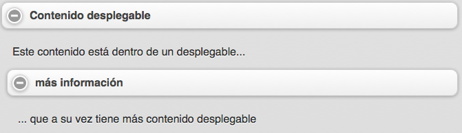

<!-- ********************************************************************* -->
### Barras de herramientas

Las barras de herramientas son utilizadas habitualmente en las cabeceras y los pies de nuestras aplicaciones en cualquier aplicación web móvil. Por este motivo, jQuery Mobile nos ofrece una serie de componentes ya preparados para ser utilizados en nuestras aplicaciones.


<!-- ********************************************************************* -->
### Tipos de barras de herramientas

En una aplicación jQuery Mobile estándar, veremos dos tipos de barras de herramientas: las cabeceras (_headers_) y los pies de página (_footers_):

* La **barra de herramientas de la cabecera** se utiliza para indicar el título de la página actual, casi siempre es lo primero que se muestra en la aplicación y es aconsejable que como mucho tenga dos botones, uno a la izquierda del título y otro a la derecha.

* La **barra de herramientas del pie de página** es habitualmente el último elemento en cada página y los desarrolladores la pueden utilizar de diversas formas, aunque lo normal es que haya una combinación entre texto y botones.

También es muy habitual que las aplicaciones realizadas con jQuery Mobile utilicen una navegación horizontal que suele estar incluida en la cabecera y/o en el pie de página. Para ello, jQuery Mobile introduce una barra de navegación predeterminada que convierte una lista desordenada de enlaces en una barra horizontal del siguiente estilo:


Para facilitarnos aún más el trabajo con estas barras de herramientas, jQuery Mobile facilita incluso el posicionamiento de éstas en una aplicación. Por defecto, estas barras se colocan una detrás de la otra del mismo modo en el que se definen en nuestro documento html en lo que se conoce como posición _inline_.

Sin embargo, en ocasiones deseamos que una determinada barra de herramientas esté siempre visible en nuestra aplicación para facilitar su uso por parte del usuario en lo que se conoce como posición _fixed_. La barra de herramientas aparecerá en la misma posición como si hubiera sido definida de tipo _inline_, pero en cuanto el usuario haga _scroll_ en la aplicación, la barra de herramientas se desplazará para ocupar una posición visible en la aplicación.

Incluso estas barras de herramientas desaparecerán y aparecerán de nuestra aplicación con cada contacto que el usuario haga en el dispositivo móvil. Para indicar que una barra de herramientas debe tener este tipo de posición podemos poner el atributo `data-position="fixed"`.

Por otro lado, jQuery Mobile también dispone del modo a _pantalla completa_ para las barras de herramientas. Básicamente funcionan de la misma forma que la posición _fixed_, salvo que ésta ya no se muestra al inicio o al final de la página y sólo se muestra cuando el usuario hace clic sobre la página. Este tipo de posicionamiento es muy útil en aplicaciones donde se muestren fotos o vídeos, en los cuales queremos cargar el contenido a pantalla completa y esta barra de herramientas únicamente se mostrará cuando el usuario toque la pantalla.

Para habilitar esta característica en nuestras aplicaciones debemos especificar el atributo `data-fullscreen="true"` al elemento `div` que contiene el atributo `data-role="page"` y además, debemos indicar también el atributo `data-position="fixed"` en la cabecera y en el pie de la página.


<!-- ********************************************************************* -->
#### Cabeceras

Como comentábamos anteriormente, la cabecera se sitúa al inicio de las páginas y habitualmente contiene un título y opcionalmente puede tener hasta dos botones a los lados del título. Para el título de la cabecera habitualmente se utiliza el encabezado `<h1>`, aunque también posible utilizar cualquiera de los otros encabezados (_h1-h6_). Por ejemplo, un documento html multi-página puede tener un título de tipo _h1_ en la primera página y un título _h2_ en la segunda, sin embargo, por defecto, jQuery Mobile los mostrará con el mismo estilo por motivos de consistencia visual. Comentar también que por defecto, las cabeceras utilizan el estilo _a_ (fondo negro y letras en blanco).


<!-- ********************************************************************* -->
### Botones

En la configuración estándar de las cabeceras se ha dejado un espacio para añadir hasta dos botones a ambos lados del título y habitualmente se utilizan enlaces como botones. jQuery Mobile localiza el primero de estos enlaces y lo coloca automáticamente a la izquierda del título y el segundo enlace (en caso de que lo haya), a la derecha del título.

```html
<div data-role="header" data-position="inline">
	<a href="index.html" data-icon="delete">Cancel</a>
	<h1>Edit Contact</h1>
	<a href="index.html" data-icon="check">Save</a>
</div>
```


Los botones automáticamente adoptan el mismo estilo que la barra que los contiene, pero tal y como hemos visto antes, podemos modificar este diseño para mostrar otro diseño a los usuarios.

```html
<div data-role="header" data-position="inline">
	<a href="index.html" data-icon="delete">Cancel</a>
	<h1>Edit Contact</h1>
	<a href="index.html" data-icon="check" data-theme="b">Save</a>
</div>
```


Pero, ¿qué pasa si queremos controlar la posición donde se pinta el botón? Pues que la gente de jQuery Mobile ya ha pensado en esto y simplemente añadiendo el atributo `class` con los valores `ui-btn-left` o `ui-btn-right` al enlace en cuestión podremos indicar donde queremos que aparezca el botón.


```html
<div data-role="header" data-position="inline">
	<h1>Page Title</h1>
	<a href="index.html" data-icon="gear" class="ui-btn-right">Options</a>
</div>
```


Además de estos botones, jQuery Mobile también pone a disposición de los desarrolladores la posibilidad de que automáticamente se cree un botón para volver atrás en las páginas de nuestras aplicaciones. Sin embargo, por defecto esta opción está desactivada. Para activarla únicamente debemos especificar en aquellas páginas donde queramos insertar automáticamente este botón el atributo `data-add-back-btn="true"`

Esto colocará un botón a la izquierda del título que permitirá al usuario volver atrás. Sin embargo, este texto aparecerá en inglés, cosa que no siempre será lo deseado. Vamos a poder modificar el texto que aparece indicando el atributo `data-back-btn-text="Atrás"` en la página en cuestión. De igual forma también podremos modificar el tema por defecto de este botón Atrás con el atributo `data-back-btn-theme="e"`.

Pero además de esta forma, también podemos crear nosotros mismos nuestros botones para volver atrás simplemente especificando el atributo `data-rel="back"` a un enlace en cuestión. Además, recuerda que también tenemos la posibilidad de mostrar una transición inversa con el atributo `data-direction="reverse"`.


<!-- ********************************************************************* -->
### Pies de página

Ahora que ya conocemos como podemos modificar el comportamiento de las cabeceras con jQuery Mobile, pasemos a ver en profundidad los pies de página, que básicamente tienen la misma estructura que las cabeceras con la salvedad, claro está, del atributo `data-role="footer"`.

```html
<div  data-role="footer">
	<h4>Pie de página</h4>
</div>
```

Estructuralmente, los pies de páginas son muy parecidos a las cabeceras, con la salvedad que en los pies de página, jQuery Mobile no añade automáticamente esos botones que veíamos anteriormente a ambos lados del título, con lo que si queremos mostrar botones, los vamos a tener que pintar nosotros mismos.

Cualquier enlace válido añadido en el pie de página podemos convertirlo automáticamente en un botón en nuestra aplicación. Para ello debemos utilizar el atributo `data-role="button"`. Por defecto, jQuery Mobile no añade ningún tipo de espaciado entre los botones y los laterales del navegador, con lo que si queremos que no aparezcan demasiado pegados a esos laterales, podemos utilizar el atributo `class="ui-bar"`.

```html
<div data-role="footer" class="ui-bar">
	<a href="index.html" data-role="button" data-icon="delete">Remove</a>
	<a href="index.html" data-role="button" data-icon="plus">Add</a>
	<a href="index.html" data-role="button" data-icon="arrow-u">Up</a>
	<a href="index.html" data-role="button" data-icon="arrow-d">Down</a>
</div>
```


Incluso podemos agrupar los botones con los atributos `data-role="controlgroup"` y `data-type="horizontal"`.


```html
<div data-role="footer" class="ui-bar">
	<div data-role="controlgroup" data-type="horizontal">
		<a href="index.html" data-role="button" data-icon="delete">Remove</a>
		<a href="index.html" data-role="button" data-icon="plus">Add</a>
		<a href="index.html" data-role="button" data-icon="arrow-u">Up</a>
		<a href="index.html" data-role="button" data-icon="arrow-d">Down</a>
	</div>
</div>
```


<!-- ********************************************************************* -->
## Barras de navegación

jQuery Mobile tiene también una característica que permite añadir barras de navegación en nuestras aplicaciones. Estas barras permiten hasta cinco botones con la posibilidad incluso de añadir iconos y normalmente se sitúan dentro de la cabecera o del pie de página.

Una barra de navegación no es más que una lista desordenada de enlaces que se encuentra dentro de elemento con el atributo `data-role="navbar"`. Si queremos marcar una determinada opción de esta barra de navegación como activa podemos especificar el atributo `class="ui-btn-active"` en el enlace.

```html
<div data-role="footer">
	<div data-role="navbar">
		<ul>
			<li><a href="a.html" class="ui-btn-active">One</a></li>
			<li><a href="b.html">Two</a></li>
		</ul>
	</div><!-- /navbar -->
</div><!-- /footer -->
```


A medida que vayamos aumentando el número de botones en la barra de navegación, jQuery Mobile se encargará automáticamente de posicionarlos correctamente en el navegador, tal y como vemos en las siguientes imágenes.


Comentar también que los botones de nuestras barras de navegación pueden ir acompañados de iconos que mejoren la experiencia del usuario final. Estos iconos se pueden añadir a los enlaces mediante el atributo `data-icon` especificándole un valor de entre los siguientes:

* arrow-l
* arrow-r
* arrow-u
* arrow-d
* delete
* plus
* minus
* check
* gear
* refresh
* forward
* back
* grid
* star
* alert
* info
* home
* search

Por último, comentar también que estos iconos aparecen por defecto a la izquierda del texto, pero si queremos colocarlos en cualquier otro lugar podemos utilizar el atributo `data-iconpos` con cualquiera de estos valores:

* left
* right
* top
* bottom


<!-- ********************************************************************* -->
### Formateo de contenido

El contenido de las páginas de una aplicación desarrollada con jQuery Mobile es totalmente abierto, aunque como siempre, siguiendo una serie de convenciones, el framework nos ayudará muchísimo en nuestra tarea.	En esta sección veremos algunos aspectos interesantes como son los paneles desplegables y los diseños para múltiples columnas que nos facilitarán el formateo de contenido para aplicaciones móviles.


<!-- ********************************************************************* -->
### HTML básico

Lo más importante de jQuery Mobile es que para formatear contenido no tenemos más que aplicar los conocimientos del lenguaje HTML. Por su parte, el framework se encargará de modificar la apariencia de nuestras aplicaciones.

Por defecto, jQuery Mobile utiliza los estilos y tamaños estándar de HTML, tal y como se muestran en los siguientes ejemplos:

```html
<h1>Cabecera H1</h1>
<h2>Cabecera H2</h2>
<h3>Cabecera H3</h3>
<h4>Cabecera H4</h4>
<h5>Cabecera H5</h5>
<h6>Cabecera H6</h6>
```


```html
<ol>
	<li>Lista desordenada item 1</li>
	<li>Lista desordenada item 2</li>
	<li>Lista desordenada item 3</li>
</ol>
```


```html
<table>
	<thead>
		<tr>
			<th>ISBN</th>
			<th>Título</th>
			<th>Autor</th>
		</tr>
	</thead>
	<tbody>
		<tr>
			<td>843992688X</td>
			<td>La colmena</td>
			<td>Camilo José Cela Trulock</td>
		</tr>
		<tr>
			<td>0936388110</td>
			<td>La galatea</td>
			<td>Miguel de Cervantes Saavedra</td>
		</tr>
		<tr>
			<td>8437624045</td>
			<td>La dragontea</td>
			<td>Félix Lope de Vega y Carpio</td>
		</tr>
	</tbody>
</table>
```


Como puedes observar, la apariencia de la mayoría de los componentes HTML no difieren prácticamente en nada de lo que ya conoces del desarrollo de aplicaciones web de _escritorio_.

Sin embargo, a continuación vamos a ver algunos componentes HTML que enmarcados dentro de une web desarrollada con jQuery Mobile facilitará la labor de estructuración de la información en una aplicación web para móviles.


<!-- ********************************************************************* -->
### Diseños por columnas

Aunque el diseño por columnas no es muy habitual verlo en aplicaciones web para móviles debido a la propia idiosincrasia de los dispositivos móviles y su amplitud, en algunas ocasiones este tipo de diseños se hace necesario para aprovechar al máximo esta amplitud.

jQuery Mobile tiene como convención para este tipo de diseños una clase llamada _ui-grid_ y que básicamente utiliza una serie de diseños CSS para generar un diseño por columnas, en el que se permiten hasta un máximo de 5 columnas.

En función del número de columnas que necesitemos en nuestro diseños, la capa contenedora debe tener el atributo `class` a uno de estos valores:

* 2 columnas: ui-grid-a
* 3 columnas: ui-grid-b
* 4 columnas: ui-grid-c
* 5 columnas: ui-grid-d

Veamos el siguiente código y analicémoslo:

```html
<div class="ui-grid-a">
	<div class="ui-block-a"><div class="ui-bar ui-bar-a">Block A</div></div>
	<div class="ui-block-b"><div class="ui-bar ui-bar-b">Block B</div></div>
</div>
<br/>
<div class="ui-grid-b">
	<div class="ui-block-a"><div class="ui-bar ui-bar-a">Block A</div></div>
	<div class="ui-block-b"><div class="ui-bar ui-bar-b">Block B</div></div>
	<div class="ui-block-c"><div class="ui-bar ui-bar-c">Block C</div></div>
</div>
<br/>

<div class="ui-grid-c">
	<div class="ui-block-a"><div class="ui-bar ui-bar-a">Block A</div></div>
	<div class="ui-block-b"><div class="ui-bar ui-bar-b">Block B</div></div>
	<div class="ui-block-c"><div class="ui-bar ui-bar-c">Block C</div></div>
	<div class="ui-block-d"><div class="ui-bar ui-bar-d">Block D</div></div>
</div>
<br/>

<div class="ui-grid-d">
	<div class="ui-block-a"><div class="ui-bar ui-bar-a">Block A</div></div>
	<div class="ui-block-b"><div class="ui-bar ui-bar-b">Block B</div></div>
	<div class="ui-block-c"><div class="ui-bar ui-bar-c">Block C</div></div>
	<div class="ui-block-d"><div class="ui-bar ui-bar-d">Block D</div></div>
	<div class="ui-block-e"><div class="ui-bar ui-bar-e">Block E</div></div>
</div>
```

Este código HTML produciría la siguiente salida:


Como vemos en la imagen, cada bloque está identificado por el atribudo `class="ui-grid"` diferente en función del número de columnas. Posteriormente, cada elemento debe estar a su vez contenido por una capa con el atributo `class="ui-block"` que indicará la posición del contenido en el diseño por columnas. Por último, tener en cuenta que el diseño del contenido mostrado, dependerá del atributo `class="ui-bar"` especificado, tal y como se muestra en la imagen.

Por último comentar también que la idea de los diseños por columnas es organizar en filas una serie de elementos. En ocasiones, nos puede interesar agrupar en un diseño de tres columnas a nueve elementos, con lo que jQuery Mobile metería tres elementos por cada fila tal y como vemos en el siguiente ejemplo.


```html
<div class="ui-grid-b">
	<div class="ui-block-a"><div class="ui-bar ui-bar-e">Block 1</div></div>
	<div class="ui-block-b"><div class="ui-bar ui-bar-e">Block 2</div></div>
	<div class="ui-block-c"><div class="ui-bar ui-bar-e">Block 3</div></div>
	<div class="ui-block-a"><div class="ui-bar ui-bar-e">Block 4</div></div>
	<div class="ui-block-b"><div class="ui-bar ui-bar-e">Block 5</div></div>
	<div class="ui-block-c"><div class="ui-bar ui-bar-e">Block 6</div></div>
	<div class="ui-block-a"><div class="ui-bar ui-bar-e">Block 7</div></div>
	<div class="ui-block-b"><div class="ui-bar ui-bar-e">Block 8</div></div>
	<div class="ui-block-c"><div class="ui-bar ui-bar-e">Block 9</div></div>
</div>
```


<!-- ********************************************************************* -->
### Contenido desplegable

jQuery Mobile permite incluso agrupar contenido que se mostrará en forma de desplegable cuando el usuario haga clic sobre el mismo. El formato de este tipo de contenidos es muy sencillo y simplemente debemos utilizar el atributo `data-role="collapsible"` seguido de un elemento de encabezado, como por ejemplo `<h3/>` y el contenido a mostrar. jQuery Mobile se encargará incluso de pintar un botón para que el usuario detecte que puede hacer clic sobre éste, tal y como vemos en el siguiente ejemplo.


```html
<div data-role="collapsible">
	<h3>Contenido desplegable</h3>
	<p>
		Este contenido puede ser mostrado y
		ocultado por el usuario simplemente haciendo
		clic en la cabecera
	</p>
</div>
```


Como puedes observar, este contenido aparece desplegado al cargar la página. Si quieres que el mismo aparezca contraído debes añadir el atributo `data-collapsed="true"` de la siguiente forma:


```html
<div data-role="collapsible" data-collapsed="true"></div>
```

Comentar por último que el contenido de estos desplegables puede ir desde un simple párrafo hasta incluso un formulario y que incluso vamos a poder insertar un contenido desplegable dentro de otro, tal y como vemos en este ejemplo.


```html
<div data-role="collapsible">
	<h3>Contenido desplegable</h3>
	<p>Este contenido está dentro de un desplegable...</p>
	<div data-role="collapsible">
		<h4>más información</h4>
		<p>... que a su vez tiene más contenido desplegable</p>
	</div>
</div>
```




<!-- *********************************************************************** -->
### Contenidos desplegables agrupados (acordeones)

Los acordeones no son más que un conjunto de contenidos desplegables de tal forma que al hacer clic sobre uno de ellos, el resto se ocultarán automáticamente, con lo que nunca podrá haber más de uno elemento desplegado al mismo tiempo.

La sintaxis de estos acordeones es prácticamente la misma que veíamos anteriormente salvo que ahora debemos añadir un elemento que agrupará a todos estos contenidos desplegables y al cual le debemos asignar el atributo `data-role="collapsible-set"`. Si queremos mostrar de inicio alguno de estos desplegables, debemos asignar el atributo `data-collapsed="false"`.

```html
<div data-role="collapsible-set">
	<div data-role="collapsible" data-collapsed="true">
		<h3>Sección A</h3>
		<p>Contenido desplega para A.</p>
	</div>
	<div data-role="collapsible" data-collapsed="true">
		<h3>Sección B</h3>
		<p>Contenido desplega para B.</p>
	</div>
	<div data-role="collapsible" data-collapsed="false">
		<h3>Sección C</h3>
		<p>Contenido desplega para C.</p>
	</div>
	<div data-role="collapsible" data-collapsed="true">
		<h3>Sección D</h3>
		<p>Contenido desplega para D.</p>
	</div>
</div>
```


<!-- *********************************************************************** -->
<!-- *********************************************************************** -->
<!-- *********************************************************************** -->
<!-- *********************************************************************** -->


