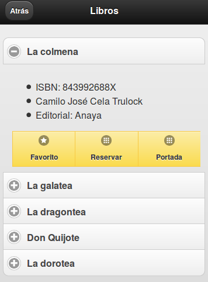

<!-- ********************************************************************* -->
## Páginas en jQuery Mobile


<!-- ********************************************************************* -->
### Anatomía de una página

En jQuery Mobile tenemos dos posibilidades para organizar una aplicación web. Por un lado podemos tener páginas individuales y utilizar los típicos enlaces para navegar entre las diferentes páginas de la aplicación, pero por otro lado, jQuery Mobile también nos da la posibilidad de tener varias páginas web en un sólo documento html. De esta forma, nuestra página tardará un poco más en cargar pero la navegación por parte del usuario final será más amena.

Pero empecemos creando una página básica con jQuery Mobile analizando de esta forma la estructura. En primer lugar, debemos empezar especificando el `doctype` de HTML5. No te preocupes si tu dispositivo no soporta HTML5 porque directamente ignorará esta directiva. Lo siguiente que debemos hacer es referenciar a las librería tanto de jQuery como de jQuery Mobile en la etiqueta `head` así como al archivo css de jQuery Mobile. Es aconsejable referenciar estos archivos en algún CDN para conseguir una mejor experiencia por parte del usuario, ya que si estos archivos ya han sido cacheados al acceder a otra aplicación implementada en jQuery Mobile, el acceso a nuestra aplicación será mucho más rápida. Con estos datos, nuestra página web podría ser así:


```html
<!DOCTYPE html>
<html>
<head>
    <title>Título de la página</title>
	<meta charset="utf-8"/>
    <meta name="viewport" content="width=device-width, initial-scale=1"/>

    <link rel="stylesheet" href="http://code.jquery.com/mobile/1.4.5/jquery.mobile-1.4.5.min.css">
    <link rel="stylesheet" href="http://demos.jquerymobile.com/1.4.5/theme-classic/theme-classic.css" />
<script src="http://code.jquery.com/jquery-1.11.1.min.js"></script>
<script src="http://code.jquery.com/mobile/1.4.5/jquery.mobile-1.4.5.min.js"></script>

</head>
<body>
    ...aquí iría el contenido...
</body>
</html>
```

Quizás te llame la atención la utilización de la etiqueta `<meta name="viewport" content="width=device-width, initial-scale=1"/>`. Con esta etiqueta, muchos navegadores ajustan el nivel de zoom de la página al tamaño correcto.

Si cargásemos esta página en un móvil, notaríamos como jQuery Mobile se encarga automáticamente de hacer desaparecer la barra de la dirección url para aprovechar al máximo el espacio disponible en la pantalla del dispositivo con lo que veríamos la siguiente página.


Pero sigamos creando la base de nuestra aplicación web para móviles. En jQuery Mobile cada página de nuestra aplicación debe estar en un elemento HTML de tipo `div` al cual le tenemos que pasar un atributo llamado `data-role` indicándole que su valor será `page`.


```html
<div data-role="page">
	....
</div>
```

Dentro de esta capa se puede utilizar cualquier elemento HTML válido, sin embargo lo más habitual en nuestras aplicaciones con jQuery Mobile será que utilicemos otras capas con el atributo `data-role` con los valores `header`, `content` y `footer`.


```html
<div data-role="page">
	<div data-role="header">Título</div>
	<div data-role="content">Contenido</div>
	<div data-role="footer">Pie de página</div>
</div>
```


Hasta el momento, en nuestro documento html únicamente hemos creado una página web, pero tal y como comentábamos anteriormente, podemos tener más de una página web en un único documento html para que la navegación entre las páginas de nuestra aplicación sea más eficiente. Si queremos hacer esto, en cada bloque `div` con el atributo `data-role` a `page` debemos añadir el atributo `id`, que deberá tener un valor único en cada documento html. Posteriormente, los enlaces entre las páginas se debe hacer especificando dicho identificador precedido del símbolo `#` de la siguiente forma `<a href="#acercade">`.


```html
<body>

<!-- Inicio de la primera página -->
<div data-role="page" id="home">

	<div data-role="header">
		<h1>Home</h1>
	</div>

	<div data-role="content">
		<p>
			Esta es mi primera aplicación con jQuery Mobile
			y ha sido creada por <a href="#author">el autor</a>
		</p>
	</div>

	<div data-role="footer">
		<h4>Pie de página</h4>
	</div>
</div><!-- /page -->

<!-- Inicio de la segunda página -->
<div data-role="page" id="author">

	<div data-role="header">
		<h1>Nombre del autor</h1>
	</div>

	<div data-role="content">
		<p>Mi nombre es ...... y soy programador de aplicaciones web.</p>
		<p><a href="#home">Volver al inicio</a></p>
	</div>

	<div data-role="footer">
		<h4>Pie de página</h4>
	</div>
</div><!-- /page -->

</body>
```


Cuando en un documento html coexisten más de un elemento `div` con el atributo `data-role` a `page`, jQuery Mobile mostrará únicamente la primera página encontrada. Si ahora probamos nuestra aplicación con un dispositivo móvil, comprobaremos que si hacemos clic sobre el enlace del autor de la aplicación, ésta se muestra mediante una transición animada.

Hay que tener en cuenta que con jQuery Mobile no es posible enlazar directamente a una "página" con un enlace del tipo `<a href="index.html#foo">`. Esto es debido a que jQuery Mobile intentará buscar una "página" con un identificador `#foo` en lugar del comportamiento nativo de hacer scroll directo hasta el ancla en cuestión.

Comentar también que todos los elementos vistos hasta el momento son opcionales, sin embargo, puede ser una buena forma de estructurar nuestra aplicación web.


<!-- ********************************************************************* -->
### Títulos de las páginas

Cuando en una página desarrollada con jQuery Mobile cargamos una página, hacemos clic en un enlace o envíamos un formulario, jQuery Mobile utiliza Ajax para cargar el contenido de la página destino. El problema de esta forma de trabajar es que el título de la página siempre será el de la primera página cargada. Sin embargo, jQuery Mobile se encarga de recoger el título de la nueva página cargada y sustituirlo por la página que ha realizado la llamada Ajax.

Algo parecido sucede con los documentos con más de una página, en los cuales, el título de la misma se comparte en todas ellas. Sin embargo, jQuery Mobile nos permite cambiar este título añadiendo un nuevo atributo en la página en cuestión llamado `data-title`.


```html
<div data-role="page" id="foo" data-title="Page Foo">
    ...
</div>
```


<!-- ********************************************************************* -->
#### Enlaces entre páginas

jQuery Mobile está especialmente diseñado para funcionar de forma muy sencilla con una serie de convenciones a la hora de enlazar páginas y lo mejor es que esa convención no supone ningún cambio en la forma habitual de trabajar y será jQuery Mobile el encargado de gestionar esas llamadas a otras páginas (utilizando Ajax siempre que sea posible) para generar el comportamiento deseado.

En algunos casos no es posible realizar esta llamada Ajax como por ejemplo en aquellos enlaces a otros dominios o bien cuando se especifique directamente en los atributos del enlace (esto lo veremos más adelante). En estos casos, se realizará una petición http normal y corriente.

La idea de este modelo es permitir a los desarrolladores crear aplicaciones web con jQuery Mobile sin ninguna configuración especial pero que al mismo tiempo parezcan aplicaciones nativas.


<!-- ********************************************************************* -->
#### Comportamiento básico de los enlaces: Ajax

Para permitir las transiciones entre las páginas, todos los enlaces que apunten a una página externa, se cargarán vía Ajax y para que esto sea lo menos intrusivo posible, jQuery Mobile recoge la página destino, la procesa y la añade al DOM de la página actual. Mientras esto se está realizando, se mostrará la típica imagen que indica que el contenido de la página se está cargando en estos momentos. En caso de que la nueva página, se cargue correctamente, ésta se muestra mediante una transición.

En caso de que en la petición Ajax se produzca un error, jQuery Mobile mostrará un pequeño mensaje de error que desaparecerá a los pocos segundos.


<!-- ********************************************************************* -->
#### Enlaces sin utilizar Ajax

En algunas ocasiones, jQuery Mobile no cargará los enlaces de nuestras aplicaciones utilizando Ajax. Estos casos son los siguientes:

* Enlaces que apunten a dominios externos.
* Enlaces que tengan el atributo `rel="external"`.
* Enlaces que tengan el atributo `data-ajax="false"`.
* Enlaces que utilicen el atributo `target`.

En estos casos, las páginas no se cargarán con Ajax y por lo tanto la página se recargará por completo y por supuesto, sin animación. Es necesario sin embargo diferenciar que el atributo `rel="external"` se debe utilizar cuando se enlaza a otro sitio o dominio, mientras que el atributo `data-ajax="false"` se utilizará en aquellos casos en que por cualquier motivo necesitemos cargar una página en nuestra aplicación sin utilizar Ajax.


<!-- ********************************************************************* -->
#### Enlaces en un documento multi-página

Como hemos comentado anteriormente, un único documento HTML puede contener una o varias páginas únicamente especificando diversos elemento de tipo `div` con el atributo `data-role="page"` y un valor diferente para cada página del atributo `id`. Esto hace que podamos tener una aplicación completa en un único documento HTML. Cuando un usuario acceda a nuestra aplicación, jQuery Mobile mostrará la primera página que encuentre.

Si un enlace de un documento multi-página apunta a un ancla, como por ejemplo `#foo`, jQuery Mobile buscará un elemento de tipo `div` con el atributo `id="foo"`. En caso de que lo encuentre, se mostrará el contenido de esa página mostrando anteriormente una transición. Del mismo modo podemos tener también enlaces a otros documentos HTML y la única diferencia en este caso es que jQuery Mobile mostrará una imagen al usuario indicando que la página se está cargando. En ambos casos, la url se actualizará de tal forma que el usuario pueda utilizar el botón para volver atrás, enlazar directamente un determinado contenido o bien utilizar la opción de favoritos del navegador.

> Es importante saber que si estamos enlazando desde una página que fue cargada vía AJAX a un documento HTML con varias páginas, es necesario añadir el atributo `rel="external"` o `data-ajax="false"`. Esto indicará a jQuery Mobile que la página debe ser cargada por completo. Si no hacemos esto, el usuario experimentará problemas a la hora de navegar por nuestra aplicación, especialmente si utiliza el botón para volver atrás.


```html
<a href="multipagina.html" rel="external">Multi-página</a>
```


<!-- ********************************************************************* -->
### Botón Atrás

En jQuery Mobile implementar la posibilidad de que el usuario pueda volver atrás en nuestra aplicación es muy sencillo y podemos conseguirlo simplemente especificando el atributo `data-rel="back"` en un enlace. jQuery Mobile se encargará de obviar el valor del atributo `href`.

Hay que tener en cuenta también que si únicamente se desea que se realice una transición que simule una vuelta atrás podemos utilizar el atributo `data-direction="reverse"`.

> Hay que tener cuidado con el atributo `data-rel="back"` porque si nuestra aplicación no es secuencial y podemos saltar a diversas partes de la misma desde un mismo punto, esta característica que implementa el botón atrás automáticamente puede darnos problemas.


<!-- ********************************************************************* -->
### Transiciones entre páginas

Actualmente, jQuery Mobile permite hasta seis tipos de transiciones en nuestras aplicaciones. Estas transiciones están implementadas mediante CSS y se pueden aplicar a cualquier objeto o página. Por defecto, siempre se aplica la transición que muestra el nuevo contenido de derecha a izquierda.

Para especificar una transición diferente, se puede añadir el atributo `data-transition` al enlace en cuestión. Los posibles valores de este atributo son los siguientes:

* _fade_, se mostrará el nuevo contenido con una transición que se mostrará desvaneciendo al contenido antiguo y mostrando poco a poco el nuevo.

* _pop_, se mostrará el nuevo contenido con una transición que empieza desde el centro de la página.

* _flip_, se mostrará el nuevo contenido con una transición que simula la apertura de una puerta. Mencionar que esta transición no funciona en algunas versiones de Android por carecer de transformaciones 3D con CSS.

* _turn_, realizará un efecto en 3D girando la página.

* _flow_, realiza un efecto combinado en 3D.

* _slideface_, efecto de transición combinado entre _slide_ y _face_.

* _slide_, se mostrará el nuevo contenido con una transición de derecha a izquierda.

* _slideup_, se mostrará el nuevo contenido con una transición de arriba a abajo.

* _slidedown_, se mostrará el nuevo contenido con una transición de abajo a arriba.

* _none_, desactivará los efectos de transiciones.


Comentar por último que también es posible forzar una transición de "vuelta atrás" especificando el atributo `data-direction="reverse"`.

A continuación se incluye un código de ejemplo:

```html
<a href="#author" data-transition="slide">Autor</a>

<a href="#" data-rel="back" data-direction="reverse">Volver</a>
```


<!-- ********************************************************************* -->
### Diálogos

jQuery Mobile permite simular la creación de cuadros de diálogo en nuestras aplicaciones.


<!-- ********************************************************************* -->
#### Creando cuadros de diálogos

Cualquier página de nuestras aplicaciones con jQuery Mobile pueden ser mostradas como un cuadro de diálogo simplemente añadiendo el atributo `data-rel="dialog"` al enlace que muestra la página destino. Cuando se detecta este atributo, jQuery Mobile se encarga de poner unos bordes redondeados a la nueva página, crear automáticamente unos márgenes alrededor de la página y poner un fondo oscuro para que parezca que la nueva página está suspendida por encima de la página que lo carga.


```html
<a href="foo.html" data-rel="dialog">
	Abrir cuadro de diálogo
</a>
```


<!-- ********************************************************************* -->
#### Transiciones

Por defecto, el dialogo se abre con una transición del tipo _pop_, pero como en todas las páginas, se puede especificar cualquier otra transición simplemente añadiendo el atributo `data-transition` y especificar cualquiera de los valores que veíamos anteriormente. Para que simular lo más posible los efectos de los cuadros de diálogo, se aconseja utilizar las transiciones _pop_, _slideup_ o _flip_.


```html
<a href="foo.html" data-rel="dialog" data-transition="pop">
	Abrir cuadro de diálogo
</a>
```


<!-- ********************************************************************* -->
#### Cerrando cuadros de diálogos

Al hacer clic en cualquier enlace dentro de un cuadro de diálogo, jQuery Mobile se encargará automáticamente de cerrarlo y mostrar la transición correcta. Sin embargo, si queremos generar el típico botón de _Cerrar_ en un cuadro de diálogo, simplemente debemos añadir el atributo `data-rel="back"`.


<!-- ********************************************************************* -->
### Historial y botón Atrás

Habitualmente, los cuadros de diálogo se generan en el contexto de otras páginas. jQuery Mobile se encarga de no incluir estos cuadros de diálogo en el historial de navegación de nuestro navegador. Del mismo modo, cuando un usuario haga clic en el botón Atrás del navegador, no será posible llegar de nuevo a un cuadro de diálogo, con lo que no tenemos preocuparnos en absoluto por este tema.


<!-- ********************************************************************* -->
#### Precarga y caché de páginas

A continuación vamos a ver algunas técnicas presentes en jQuery Mobile para mejorar la experiencia del usuario a la hora de navegar por nuestra aplicación.


<!-- ********************************************************************* -->
#### Precarga de páginas

Si en tu aplicación utilizas un documento html con una sola página web, pero sin embargo, prefieres cargar el contenido de determinadas páginas sin mostrar la típica imagen de _"Cargando..."_, podemos hacer una precarga de estas páginas simplemente añadiendo el atributo `data-prefetch` a cualquier enlace que queremos precargar. jQuery Mobile se encargará de cargar el contenido de esta página enlazada sin que el usuario vea nada. Este podría ser un ejemplo:

```html
<a href="enlaceprecargado.html" data-prefetch>Enlace precargado</a>
```

Así es como funciona internamente jQuery Mobile en estas precargas. Una vez la página principal se ha cargado por completo, jQuery Mobile buscará entre todos los enlaces aquellos que tengan el atributo `data-prefetch` para automáticamente cargar el contenido de esos enlaces. De esta forma, cuando el usuario haga clic en estos enlaces, la carga del contenido se hará mucho más rápida que se haría si no hubiéramos hecho esta precarga. Además, la imagen de _"Cargando..."_ ya no volverá a aparecer salvo que por cualquier motivo, el contenido de la página enlazada todavía no se haya podido cargar en nuestra aplicación.

Es importante saber que estas precargas realizarán una serie de peticiones que en ocasiones nunca se utilizarán, con lo que debemos sólo utilizar esta precarga en determinadas situaciones y cuando sepamos con un alto grado de certeza que el usuario hará clic en ese enlace.


<!-- ********************************************************************* -->
### Caché de páginas

Cuando se realizan las transiciones entre las diferentes páginas de nuestra aplicación, debemos tener en cuenta que ambas páginas deben estar cargadas en el DOM y que conforme vamos navegando por las mismas, más páginas se irán añadiendo a este DOM, lo que en versiones anteriores de jQuery Mobile provocaba en ocasiones que el rendimiento de la aplicación bajara o que incluso el navegador se cerrara inesperadamente.

Para solucionar este problema, jQuery Mobile se encarga de gestionar las páginas almacenadas en el DOM y lo hace añadiendo un _flag_ a estas páginas una vez ya hemos accedido a otra página del DOM. En caso de que volvamos a una página que ya haya sido eliminada del DOM previamente, el navegador intentará cargar la página de su propia caché o será de nuevo solicitada al servidor. Esto sucede únicamente con aquellas páginas que se cargan vía Ajax y no con los documentos html multi-páginas.

Sin embargo, jQuery Mobile también especifica una forma de gestionar nosotros mismos la caché de determinadas páginas de nuestra aplicación que consideremos interesantes. Esta gestión de la caché del DOM, supone que nosotros somos quienes deberemos encargarnos de controlar que el tamaño del mismo no exceda unos determinados límites.

Podemos hacerlo de dos formas. Por un lado aplicando esta gestión de la caché a toda nuestra aplicación.

```java
$.mobile.page.prototype.options.domCache = true;
```

O bien especificarlo únicamente en determinadas páginas mediante el atributo `data-dom-cache="true"`.


```html
<a href="foo/bar/baz" data-dom-cache="true">link text</a>
```


<!-- ********************************************************************* -->
## Estilo de los componentes jQuery Mobile

jQuery Mobile dispone de un sistema muy robusto y sencillo para estilizar nuestra aplicación de varias formas. Cada componente de jQuery Mobile tiene la posibilidad de ser estilizado de una forma diferente. Para aplicar estos estilos, estos componentes pueden añadir el atributo `data-theme` y puede tomar los valores, _a, b, c, d o e_ para elegir cualquiera de los cinco temas de los que dispone actualmente jQuery Mobile. Cada uno de estos temas, utiliza una serie de combinaciones de colores y formas diferentes. Por defecto, jQuery Mobile utiliza una combinación de estos temas tal y como vemos en las siguientes imágenes.

**Tema por defecto**


**Tema A**


**Tema B**


**Tema C**


**Tema D**


**Tema E**


**Nota:** A partir de la versión 1.4 de JQuery Mobile solo se incluyen los temas A y B en la hoja de estilo por defecto. Para incluir el resto de temas tenemos que cargar la siguiente hoja de estilo:

```css
<link rel="stylesheet" href="http://demos.jquerymobile.com/1.4.5/theme-classic/theme-classic.css" />
```

Otra opción es generar nuestros propios temas mediante la utilidad _Theme Roller_ de JQuery Mobile: http://themeroller.jquerymobile.com/ Esta utilidad nos permite crear temas basándonos en alguno de los ya predefinidos y después personalizarlos o directamente generar nuestro propio tema. Por último nos da la opción de descargar la hoja de estilo.


<!-- ********************************************************************* -->
### Barras de herramientas

Las barras de herramientas son utilizadas habitualmente en las cabeceras y los pies de nuestras aplicaciones en cualquier aplicación web móvil. Por este motivo, jQuery Mobile nos ofrece una serie de componentes ya preparados para ser utilizados en nuestras aplicaciones.


<!-- ********************************************************************* -->
### Tipos de barras de herramientas

En una aplicación jQuery Mobile estándar, veremos dos tipos de barras de herramientas: las cabeceras (_headers_) y los pies de página (_footers_):

* La **barra de herramientas de la cabecera** se utiliza para indicar el título de la página actual, casi siempre es lo primero que se muestra en la aplicación y es aconsejable que como mucho tenga dos botones, uno a la izquierda del título y otro a la derecha.

* La **barra de herramientas del pie de página** es habitualmente el último elemento en cada página y los desarrolladores la pueden utilizar de diversas formas, aunque lo normal es que haya una combinación entre texto y botones.

También es muy habitual que las aplicaciones realizadas con jQuery Mobile utilicen una navegación horizontal que suele estar incluida en la cabecera y/o en el pie de página. Para ello, jQuery Mobile introduce una barra de navegación predeterminada que convierte una lista desordenada de enlaces en una barra horizontal del siguiente estilo:


Para facilitarnos aún más el trabajo con estas barras de herramientas, jQuery Mobile facilita incluso el posicionamiento de éstas en una aplicación. Por defecto, estas barras se colocan una detrás de la otra del mismo modo en el que se definen en nuestro documento html en lo que se conoce como posición _inline_.

Sin embargo, en ocasiones deseamos que una determinada barra de herramientas esté siempre visible en nuestra aplicación para facilitar su uso por parte del usuario en lo que se conoce como posición _fixed_. La barra de herramientas aparecerá en la misma posición como si hubiera sido definida de tipo _inline_, pero en cuanto el usuario haga _scroll_ en la aplicación, la barra de herramientas se desplazará para ocupar una posición visible en la aplicación.

Incluso estas barras de herramientas desaparecerán y aparecerán de nuestra aplicación con cada contacto que el usuario haga en el dispositivo móvil. Para indicar que una barra de herramientas debe tener este tipo de posición podemos poner el atributo `data-position="fixed"`.

Por otro lado, jQuery Mobile también dispone del modo a _pantalla completa_ para las barras de herramientas. Básicamente funcionan de la misma forma que la posición _fixed_, salvo que ésta ya no se muestra al inicio o al final de la página y sólo se muestra cuando el usuario hace clic sobre la página. Este tipo de posicionamiento es muy útil en aplicaciones donde se muestren fotos o vídeos, en los cuales queremos cargar el contenido a pantalla completa y esta barra de herramientas únicamente se mostrará cuando el usuario toque la pantalla.

Para habilitar esta característica en nuestras aplicaciones debemos especificar el atributo `data-fullscreen="true"` al elemento `div` que contiene el atributo `data-role="page"` y además, debemos indicar también el atributo `data-position="fixed"` en la cabecera y en el pie de la página.


<!-- ********************************************************************* -->
#### Cabeceras

Como comentábamos anteriormente, la cabecera se sitúa al inicio de las páginas y habitualmente contiene un título y opcionalmente puede tener hasta dos botones a los lados del título. Para el título de la cabecera habitualmente se utiliza el encabezado `<h1>`, aunque también posible utilizar cualquiera de los otros encabezados (_h1-h6_). Por ejemplo, un documento html multi-página puede tener un título de tipo _h1_ en la primera página y un título _h2_ en la segunda, sin embargo, por defecto, jQuery Mobile los mostrará con el mismo estilo por motivos de consistencia visual. Comentar también que por defecto, las cabeceras utilizan el estilo _a_ (fondo negro y letras en blanco).


<!-- ********************************************************************* -->
### Botones

En la configuración estándar de las cabeceras se ha dejado un espacio para añadir hasta dos botones a ambos lados del título y habitualmente se utilizan enlaces como botones. jQuery Mobile localiza el primero de estos enlaces y lo coloca automáticamente a la izquierda del título y el segundo enlace (en caso de que lo haya), a la derecha del título.

```html
<div data-role="header" data-position="inline">
	<a href="index.html" data-icon="delete">Cancel</a>
	<h1>Edit Contact</h1>
	<a href="index.html" data-icon="check">Save</a>
</div>
```


Los botones automáticamente adoptan el mismo estilo que la barra que los contiene, pero tal y como hemos visto antes, podemos modificar este diseño para mostrar otro diseño a los usuarios.

```html
<div data-role="header" data-position="inline">
	<a href="index.html" data-icon="delete">Cancel</a>
	<h1>Edit Contact</h1>
	<a href="index.html" data-icon="check" data-theme="b">Save</a>
</div>
```


Pero, ¿qué pasa si queremos controlar la posición donde se pinta el botón? Pues que la gente de jQuery Mobile ya ha pensado en esto y simplemente añadiendo el atributo `class` con los valores `ui-btn-left` o `ui-btn-right` al enlace en cuestión podremos indicar donde queremos que aparezca el botón.


```html
<div data-role="header" data-position="inline">
	<h1>Page Title</h1>
	<a href="index.html" data-icon="gear" class="ui-btn-right">Options</a>
</div>
```


Además de estos botones, jQuery Mobile también pone a disposición de los desarrolladores la posibilidad de que automáticamente se cree un botón para volver atrás en las páginas de nuestras aplicaciones. Sin embargo, por defecto esta opción está desactivada. Para activarla únicamente debemos especificar en aquellas páginas donde queramos insertar automáticamente este botón el atributo `data-add-back-btn="true"`

Esto colocará un botón a la izquierda del título que permitirá al usuario volver atrás. Sin embargo, este texto aparecerá en inglés, cosa que no siempre será lo deseado. Vamos a poder modificar el texto que aparece indicando el atributo `data-back-btn-text="Atrás"` en la página en cuestión. De igual forma también podremos modificar el tema por defecto de este botón Atrás con el atributo `data-back-btn-theme="e"`.

Pero además de esta forma, también podemos crear nosotros mismos nuestros botones para volver atrás simplemente especificando el atributo `data-rel="back"` a un enlace en cuestión. Además, recuerda que también tenemos la posibilidad de mostrar una transición inversa con el atributo `data-direction="reverse"`.


<!-- ********************************************************************* -->
### Pies de página

Ahora que ya conocemos como podemos modificar el comportamiento de las cabeceras con jQuery Mobile, pasemos a ver en profundidad los pies de página, que básicamente tienen la misma estructura que las cabeceras con la salvedad, claro está, del atributo `data-role="footer"`.

```html
<div  data-role="footer">
	<h4>Pie de página</h4>
</div>
```

Estructuralmente, los pies de páginas son muy parecidos a las cabeceras, con la salvedad que en los pies de página, jQuery Mobile no añade automáticamente esos botones que veíamos anteriormente a ambos lados del título, con lo que si queremos mostrar botones, los vamos a tener que pintar nosotros mismos.

Cualquier enlace válido añadido en el pie de página podemos convertirlo automáticamente en un botón en nuestra aplicación. Para ello debemos utilizar el atributo `data-role="button"`. Por defecto, jQuery Mobile no añade ningún tipo de espaciado entre los botones y los laterales del navegador, con lo que si queremos que no aparezcan demasiado pegados a esos laterales, podemos utilizar el atributo `class="ui-bar"`.

```html
<div data-role="footer" class="ui-bar">
	<a href="index.html" data-role="button" data-icon="delete">Remove</a>
	<a href="index.html" data-role="button" data-icon="plus">Add</a>
	<a href="index.html" data-role="button" data-icon="arrow-u">Up</a>
	<a href="index.html" data-role="button" data-icon="arrow-d">Down</a>
</div>
```


Incluso podemos agrupar los botones con los atributos `data-role="controlgroup"` y `data-type="horizontal"`.


```html
<div data-role="footer" class="ui-bar">
	<div data-role="controlgroup" data-type="horizontal">
		<a href="index.html" data-role="button" data-icon="delete">Remove</a>
		<a href="index.html" data-role="button" data-icon="plus">Add</a>
		<a href="index.html" data-role="button" data-icon="arrow-u">Up</a>
		<a href="index.html" data-role="button" data-icon="arrow-d">Down</a>
	</div>
</div>
```


<!-- ********************************************************************* -->
## Barras de navegación

jQuery Mobile tiene también una característica que permite añadir barras de navegación en nuestras aplicaciones. Estas barras permiten hasta cinco botones con la posibilidad incluso de añadir iconos y normalmente se sitúan dentro de la cabecera o del pie de página.

Una barra de navegación no es más que una lista desordenada de enlaces que se encuentra dentro de elemento con el atributo `data-role="navbar"`. Si queremos marcar una determinada opción de esta barra de navegación como activa podemos especificar el atributo `class="ui-btn-active"` en el enlace.

```html
<div data-role="footer">
	<div data-role="navbar">
		<ul>
			<li><a href="a.html" class="ui-btn-active">One</a></li>
			<li><a href="b.html">Two</a></li>
		</ul>
	</div><!-- /navbar -->
</div><!-- /footer -->
```


A medida que vayamos aumentando el número de botones en la barra de navegación, jQuery Mobile se encargará automáticamente de posicionarlos correctamente en el navegador, tal y como vemos en las siguientes imágenes.


Comentar también que los botones de nuestras barras de navegación pueden ir acompañados de iconos que mejoren la experiencia del usuario final. Estos iconos se pueden añadir a los enlaces mediante el atributo `data-icon` especificándole un valor de entre los siguientes:

* arrow-l
* arrow-r
* arrow-u
* arrow-d
* delete
* plus
* minus
* check
* gear
* refresh
* forward
* back
* grid
* star
* alert
* info
* home
* search

Por último, comentar también que estos iconos aparecen por defecto a la izquierda del texto, pero si queremos colocarlos en cualquier otro lugar podemos utilizar el atributo `data-iconpos` con cualquiera de estos valores:

* left
* right
* top
* bottom


<!-- ********************************************************************* -->
### Formateo de contenido

El contenido de las páginas de una aplicación desarrollada con jQuery Mobile es totalmente abierto, aunque como siempre, siguiendo una serie de convenciones, el framework nos ayudará muchísimo en nuestra tarea.	En esta sección veremos algunos aspectos interesantes como son los paneles desplegables y los diseños para múltiples columnas que nos facilitarán el formateo de contenido para aplicaciones móviles.


<!-- ********************************************************************* -->
### HTML básico

Lo más importante de jQuery Mobile es que para formatear contenido no tenemos más que aplicar los conocimientos del lenguaje HTML. Por su parte, el framework se encargará de modificar la apariencia de nuestras aplicaciones.

Por defecto, jQuery Mobile utiliza los estilos y tamaños estándar de HTML, tal y como se muestran en los siguientes ejemplos:

```html
<h1>Cabecera H1</h1>
<h2>Cabecera H2</h2>
<h3>Cabecera H3</h3>
<h4>Cabecera H4</h4>
<h5>Cabecera H5</h5>
<h6>Cabecera H6</h6>
```


```html
<ol>
	<li>Lista desordenada item 1</li>
	<li>Lista desordenada item 2</li>
	<li>Lista desordenada item 3</li>
</ol>
```


```html
<table>
	<thead>
		<tr>
			<th>ISBN</th>
			<th>Título</th>
			<th>Autor</th>
		</tr>
	</thead>
	<tbody>
		<tr>
			<td>843992688X</td>
			<td>La colmena</td>
			<td>Camilo José Cela Trulock</td>
		</tr>
		<tr>
			<td>0936388110</td>
			<td>La galatea</td>
			<td>Miguel de Cervantes Saavedra</td>
		</tr>
		<tr>
			<td>8437624045</td>
			<td>La dragontea</td>
			<td>Félix Lope de Vega y Carpio</td>
		</tr>
	</tbody>
</table>
```


Como puedes observar, la apariencia de la mayoría de los componentes HTML no difieren prácticamente en nada de lo que ya conoces del desarrollo de aplicaciones web de _escritorio_.

Sin embargo, a continuación vamos a ver algunos componentes HTML que enmarcados dentro de une web desarrollada con jQuery Mobile facilitará la labor de estructuración de la información en una aplicación web para móviles.


<!-- ********************************************************************* -->
### Diseños por columnas

Aunque el diseño por columnas no es muy habitual verlo en aplicaciones web para móviles debido a la propia idiosincrasia de los dispositivos móviles y su amplitud, en algunas ocasiones este tipo de diseños se hace necesario para aprovechar al máximo esta amplitud.

jQuery Mobile tiene como convención para este tipo de diseños una clase llamada _ui-grid_ y que básicamente utiliza una serie de diseños CSS para generar un diseño por columnas, en el que se permiten hasta un máximo de 5 columnas.

En función del número de columnas que necesitemos en nuestro diseños, la capa contenedora debe tener el atributo `class` a uno de estos valores:

* 2 columnas: ui-grid-a
* 3 columnas: ui-grid-b
* 4 columnas: ui-grid-c
* 5 columnas: ui-grid-d

Veamos el siguiente código y analicémoslo:

```html
<div class="ui-grid-a">
	<div class="ui-block-a"><div class="ui-bar ui-bar-a">Block A</div></div>
	<div class="ui-block-b"><div class="ui-bar ui-bar-b">Block B</div></div>
</div>
<br/>
<div class="ui-grid-b">
	<div class="ui-block-a"><div class="ui-bar ui-bar-a">Block A</div></div>
	<div class="ui-block-b"><div class="ui-bar ui-bar-b">Block B</div></div>
	<div class="ui-block-c"><div class="ui-bar ui-bar-c">Block C</div></div>
</div>
<br/>

<div class="ui-grid-c">
	<div class="ui-block-a"><div class="ui-bar ui-bar-a">Block A</div></div>
	<div class="ui-block-b"><div class="ui-bar ui-bar-b">Block B</div></div>
	<div class="ui-block-c"><div class="ui-bar ui-bar-c">Block C</div></div>
	<div class="ui-block-d"><div class="ui-bar ui-bar-d">Block D</div></div>
</div>
<br/>

<div class="ui-grid-d">
	<div class="ui-block-a"><div class="ui-bar ui-bar-a">Block A</div></div>
	<div class="ui-block-b"><div class="ui-bar ui-bar-b">Block B</div></div>
	<div class="ui-block-c"><div class="ui-bar ui-bar-c">Block C</div></div>
	<div class="ui-block-d"><div class="ui-bar ui-bar-d">Block D</div></div>
	<div class="ui-block-e"><div class="ui-bar ui-bar-e">Block E</div></div>
</div>
```

Este código HTML produciría la siguiente salida:


Como vemos en la imagen, cada bloque está identificado por el atribudo `class="ui-grid"` diferente en función del número de columnas. Posteriormente, cada elemento debe estar a su vez contenido por una capa con el atributo `class="ui-block"` que indicará la posición del contenido en el diseño por columnas. Por último, tener en cuenta que el diseño del contenido mostrado, dependerá del atributo `class="ui-bar"` especificado, tal y como se muestra en la imagen.

Por último comentar también que la idea de los diseños por columnas es organizar en filas una serie de elementos. En ocasiones, nos puede interesar agrupar en un diseño de tres columnas a nueve elementos, con lo que jQuery Mobile metería tres elementos por cada fila tal y como vemos en el siguiente ejemplo.


```html
<div class="ui-grid-b">
	<div class="ui-block-a"><div class="ui-bar ui-bar-e">Block 1</div></div>
	<div class="ui-block-b"><div class="ui-bar ui-bar-e">Block 2</div></div>
	<div class="ui-block-c"><div class="ui-bar ui-bar-e">Block 3</div></div>
	<div class="ui-block-a"><div class="ui-bar ui-bar-e">Block 4</div></div>
	<div class="ui-block-b"><div class="ui-bar ui-bar-e">Block 5</div></div>
	<div class="ui-block-c"><div class="ui-bar ui-bar-e">Block 6</div></div>
	<div class="ui-block-a"><div class="ui-bar ui-bar-e">Block 7</div></div>
	<div class="ui-block-b"><div class="ui-bar ui-bar-e">Block 8</div></div>
	<div class="ui-block-c"><div class="ui-bar ui-bar-e">Block 9</div></div>
</div>
```


<!-- ********************************************************************* -->
### Contenido desplegable

jQuery Mobile permite incluso agrupar contenido que se mostrará en forma de desplegable cuando el usuario haga clic sobre el mismo. El formato de este tipo de contenidos es muy sencillo y simplemente debemos utilizar el atributo `data-role="collapsible"` seguido de un elemento de encabezado, como por ejemplo `<h3/>` y el contenido a mostrar. jQuery Mobile se encargará incluso de pintar un botón para que el usuario detecte que puede hacer clic sobre éste, tal y como vemos en el siguiente ejemplo.


```html
<div data-role="collapsible">
	<h3>Contenido desplegable</h3>
	<p>
		Este contenido puede ser mostrado y
		ocultado por el usuario simplemente haciendo
		clic en la cabecera
	</p>
</div>
```


Como puedes observar, este contenido aparece desplegado al cargar la página. Si quieres que el mismo aparezca contraído debes añadir el atributo `data-collapsed="true"` de la siguiente forma:


```html
<div data-role="collapsible" data-collapsed="true"></div>
```

Comentar por último que el contenido de estos desplegables puede ir desde un simple párrafo hasta incluso un formulario y que incluso vamos a poder insertar un contenido desplegable dentro de otro, tal y como vemos en este ejemplo.


```html
<div data-role="collapsible">
	<h3>Contenido desplegable</h3>
	<p>Este contenido está dentro de un desplegable...</p>
	<div data-role="collapsible">
		<h4>más información</h4>
		<p>... que a su vez tiene más contenido desplegable</p>
	</div>
</div>
```


<!-- *********************************************************************** -->
### Contenidos desplegables agrupados (acordeones)

Los acordeones no son más que un conjunto de contenidos desplegables de tal forma que al hacer clic sobre uno de ellos, el resto se ocultarán automáticamente, con lo que nunca podrá haber más de uno elemento desplegado al mismo tiempo.

La sintaxis de estos acordeones es prácticamente la misma que veíamos anteriormente salvo que ahora debemos añadir un elemento que agrupará a todos estos contenidos desplegables y al cual le debemos asignar el atributo `data-role="collapsible-set"`. Si queremos mostrar de inicio alguno de estos desplegables, debemos asignar el atributo `data-collapsed="false"`.

```html
<div data-role="collapsible-set">
	<div data-role="collapsible" data-collapsed="true">
		<h3>Sección A</h3>
		<p>Contenido desplega para A.</p>
	</div>
	<div data-role="collapsible" data-collapsed="true">
		<h3>Sección B</h3>
		<p>Contenido desplega para B.</p>
	</div>
	<div data-role="collapsible" data-collapsed="false">
		<h3>Sección C</h3>
		<p>Contenido desplega para C.</p>
	</div>
	<div data-role="collapsible" data-collapsed="true">
		<h3>Sección D</h3>
		<p>Contenido desplega para D.</p>
	</div>
</div>
```


<!-- *********************************************************************** -->
<!-- *********************************************************************** -->
<!-- *********************************************************************** -->
<!-- *********************************************************************** -->


<!-- *********************************************************************** -->
# Ejercicios - Introducción a jQuery Mobile

En esta sección de ejercicios vamos a desarrollar una primera parte de una aplicación destinada a la gestión de una biblioteca de un centro educativo. Esta biblioteca básicamente contará por supuesto con _libros_ y con una serie de tipos de _usuario_ que podrán realizar una serie de _operaciones_.


## Ejercicio 1 - Inicio de la aplicación (1 punto)

En este primer ejercicio vamos a empezar por preparar la interfaz de usuario de lo que será nuestra aplicación y a definir el comportamiento de determinadas pantallas de la misma. Empecemos creando la página que será la portada de nuestra aplicación. Esta página debe contener una cabecera indicando el nombre de nuestra aplicación que llamaremos "iBiblioteca".

A continuación, vamos a definir lo que será el contenido de esa página de inicio. Aquí vamos a redactar un pequeño texto formateado explicando brevemente el funcionamiento de la aplicación. Que no se te olvide indicar también quien ha desarrollado esta aplicación.

> Las páginas de inicio en el mundo de las aplicaciones web para móvil no son nada deseables ya que lo más recomendable es que el usuario pueda directamente interactuar con la aplicación sin necesidad de aterrizar en una página de inicio que siempre muestra la misma información.

Por último, crear también un pie de página con una barra de navegación que nos servirá para tener siempre disponible una serie de opciones en cada página de nuestra aplicación. En esta primera página de la aplicación las opciones que vamos a añadir serán las siguientes:

* Botón para configurar una serie de ajustes en nuestra aplicación.
* Botón para mostrar una pequeña ayuda de lo que nuestra aplicación puede hacer.

No olvides poner unos iconos de acuerdo a la funcionalidad de cada botón y asegúrate también que esta barra de herramientas está siempre visible por el usuario. De momento estos botones no tienen que funcionar.

A continuación se incluye una captura de esta primera pantalla:


El archivo html creado en este ejercicio se debe llamar _index.html_ y debe estar en la raíz de un directorio llamado ibiblioteca.


## Ejercicio 2 - Página del autor (1 punto)

En el ejercicio anterior hemos indicado en la página de bienvenida a la aplicación quien es el autor de la misma, sin embargo, no hemos añadido más información sobre el mismo. En este ejercicio vamos a crear un nuevo documento html con toda la información del autor y en él practicaremos con la estructura de navegación para que el usuario pueda moverse por la aplicación sin problemas.

Este nuevo documento html relativo al autor tendrá más de una página (documento multipágina) y en cada una de ellas añadiremos unos datos diferentes. En la primera página se indicará el nombre completo, dirección de email y los teléfonos de contacto. Además habrá dos botones que os llevarán a una fotografía del autor y a su currículum. A continuación se incluye una captura de ejemplo:


Al pulsar sobre el botón de fotografía se abrirá un diálogo que únicamente tendrá el título "Fotografía" y una imagen. Y al pulsar sobre el botón de currículum nos llevará a una segunda página con información relativa a nuestro puesto actual (estudiante, programador, analista, arquitecto, etc) y un pequeño listado de los estudios o puestos ocupados recientemente, cada uno de ellos con un enlace que nos llevarán a su vez a una tercera página donde se explicará con más detalle el puesto ocupado o los estudios realizados. Se han de incluir como mínimo 3 enlaces de este tipo.

Ten en cuenta que siempre debemos volver atrás en todas las pantallas de nuestra aplicación. Recuerda también especificar una transición idónea para estos enlaces y añadir el enlace que nos llevé desde la página de "_index.html_" de bienvenida a esta nueva página.

El archivo html creado en este ejercicio se debe llamar _author.html_ y debe estar en la raíz de un directorio llamado ibiblioteca. Para la fotografía del autor, crea un directorio llamado _images_ y ponla en la raíz de este directorio.


## Ejercicio 3 - Listado de libros (1 punto)

En este ejercicio vamos a preparar una página en la que mostrar todos los libros de nuestra biblioteca y para ello utilizaremos los _acordeones_. En estos acordeones presentaremos en primer lugar el título del libro y una vez hagamos clic en ellos, mostraremos otras opciones de los libros como son el autor, el isbn y la editorial.

En la plantilla de estos ejercicios tenéis disponible un xml con libros de ejemplo y sus correspondientes imágenes de las portadas de los libros.

En cada libro, además mostraremos una barra de navegación (tipo _navbar_) con tres opciones: ver la portada del libro (la cual se tendrá que abrir en un diálogo), reservar el libro o marcarlo como favorito (estos dos botones últimos botones no funcionarán). Utiliza un tema diferente en estos enlaces (de tipo "e") para resaltar las opciones. A continuación se incluye una captura de como tiene que quedar esta sección:



El archivo html creado en este ejercicio se debe llamar _books.html_ y debe estar en la raíz de un directorio llamado ibiblioteca. Actualiza también la pantalla principal de la aplicación para que al pulsar sobre el enlace del listado de libros nos lleve a esta nueva pantalla.


