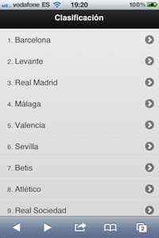
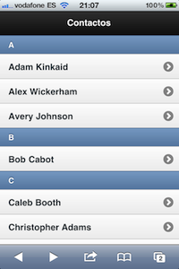
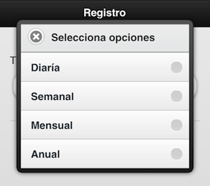

## Listados de elementos

Uno de los aspectos más importantes en cualquier aplicación web para móviles es la forma en la que se muestran los listados. Debemos tener siempre en cuenta el espacio limitado que tenemos en una pantalla de un dispositivo móvil, con lo que estos listados deben aprovechar al máximo este espacio.

Los listados de elementos nos servirán entre otras cosas para mostrar datos, para crear un sistema de navegación, para mostrar listas de resultados e incluso para crear sistemas de entrada de información. jQuery Mobile tiene una gran variedad de tipos de listas que cubrirán la mayoría de nuestras necesidades. Pasemos a ver estos tipos de listas y todas sus características.


<!-- *********************************************************************** -->
### Listados básicos con enlaces

Un listado en jQuery Mobile no es más que una lista desordenada en la que sus elementos son enlaces y que tiene el atributo `data-role="listview"`. Cuando jQuery Mobile detecte este elemento del DOM lo transformará en una lista adaptada a los dispositivos móviles y le añadirá incluso una flecha a la parte derecha para indicar al usuario que en ese elemento es posible hacer clic.

Cuando el usuario haga clic en el enlace, éste se cargará vía AJAX mostrando una transición de página. Veamos un poco de código:

```html
<ul data-role="listview" data-theme="g">
	<li><a href="audi.html">Audi</a></li>
	<li><a href="bmw.html">BMW</a></li>
	<li><a href="volkswagen.html">Volkswagen</a></li>
</ul>
```


<!-- *********************************************************************** -->

### Listados anidados

El concepto de listados anidados es tan simple como incluir una lista dentro de otra. En estos casos, jQuery Mobile se encargará de mostrar las listas de forma separada. Esto es, en primer lugar se mostrará la lista principal y al pinchar en cada uno de los elementos se mostrará la sublista incluida en ese elemento. Veamos un ejemplo:

```html
<ul data-role="listview" data-theme="g">
	<li>
		Audi
		<ul data-role="listview">
			<li>A1</li>
			<li>A2</li>
			<li>A3</li>
		</ul>
	</li>
	<li>
		BMW
		<ul data-role="listview">
			<li>Serie 1</li>
			<li>Serie 2</li>
			<li>Serie 3</li>
		</ul>
	</li>
	<li>
		Volkswagen
		<ul>
			<li>Golf</li>
			<li>Passat</li>
			<li>Touran</li>
		</ul>
	</li>
</ul>
```


<!-- *********************************************************************** -->
### Listados numerados

Hasta ahora siempre hemos visto los listados no numerados, sin embargo, en jQuery Mobile también es posible utilizar los listados numerados. Un típico caso de listado numerado puede ser el resultado de una búsqueda o para indicar por la clasificación de un torneo cualquiera.

```html
<ol data-role="listview" data-theme="g">
	<li><a href="barca.html">Barcelona</a></li>
	<li><a href="levante.html">Levante</a></li>
	<li><a href="realmadrid.html">Real Madrid</a></li>
	<li><a href="malaga.html">Málaga</a></li>
	<li><a href="valencia.html">Valencia</a></li>
	<li><a href="sevilla.html">Sevilla</a></li>
	<li><a href="betis.html">Betis</a></li>
	<li><a href="atletico.html">Atlético</a></li>
	<li><a href="rsociedad.html">Real Sociedad</a></li>
	<li><a href="mallorca.html">Mallorca</a></li>
</ol>
```




<!-- *********************************************************************** -->
### Listados de solo lectura

Por supuesto, no siempre necesitaremos que un elemento de una lista haga una determinada acción y simplemente vamos a querer mostrar determinada información en este listado. En este tipo de listados vamos a poder tanto listas ordenadas como listas desordenadas.


<!-- *********************************************************************** -->
#### Listados simples

En este tipo de listados no hay posibilidad de hacer clic sobre los elementos de la lista e incluso el tamaño del texto es considerablemente más pequeño que en las listas con  enlaces. Imagina por ejemplo un simple listado de alumnos.

```html
<ul data-role="listview" data-theme="g">
	<li>Alacid Magán, Emilio</li>
	<li>Blasco López, Sonia</li>
	<li>Gabaldón Santander, Nicolas</li>
	<li>García Sánchez, Ana María</li>
	<li>Guerrero Hurtado, Carlos</li>
	<li>Salinas Ruiz, José Manuel</li>
	<li>Sansano Alicante, Lorena</li>
</ul>
```


<!-- *********************************************************************** -->
#### Listados simples con información númerica

En ocasiones, estos listados de solo lectura proporcionan algo de información numérica. Continuando con el ejemplo anterior de los alumnos podríamos tener una nota asociada a los mismos. Para introducir esta información numérica únicamente debemos añadir un elemento de tipo `div` o de tipo `<span>` con el atributo `class="ui-li-count"`.


```html
<ul data-role="listview" data-theme="g">
	<li>Alacid Magán, Emilio <span class="ui-li-count">9,5</span></li>
	<li>Blasco López, Sonia <span class="ui-li-count">6,5</span></li>
	<li>Gabaldón Santander, Nicolas <span class="ui-li-count">5</span></li>
	<li>García Sánchez, Ana María <span class="ui-li-count">7</span></li>
	<li>Guerrero Hurtado, Carlos <span class="ui-li-count">9</span></li>
	<li>Salinas Ruiz, José Manuel <span class="ui-li-count">4</span></li>
	<li>Sansano Alicante, Lorena <span class="ui-li-count">7</span></li>
</ul>
```


<!-- *********************************************************************** -->
#### Listados formateados

Por supuesto, no tenemos porque utilizar elementos de una sola línea sino que éstos pueden estar formados por más de una línea indicando información complementaria al elemento.

```html
<ul data-role="listview">
	<li>
		<h3>Alacid, Emilio</h3>
		<p><strong>Un fenómeno en las matemáticas</strong></p>
		<p>Comentar el incidente de los pinceles</p>
		<p class="ui-li-aside"><strong>17:10</strong></p>
	</li>
	<li>
		<h3>Blasco, Sonia</h3>
		<p><strong>Atiende mucho en clase</strong></p>
		<p>En ocasiones viene sin los deberes hechos</p>
		<p class="ui-li-aside"><strong>17:35</strong></p>
	</li>
	<li>
		<h3>Gabaldón, Nicolas</h3>
		<p><strong>Le encanta el medio ambiente</strong></p>
		<p>Se despista con una mosca</p>
		<p class="ui-li-aside"><strong>18:00</strong></p>
	</li>
</ul>
```


En el ejemplo se puede observar como mediante la clase `ui-li-aside` podemos colocar información en un lateral de la lista.


<!-- *********************************************************************** -->
#### Listados con imágenes

Por supuesto, en los listados también vamos a poder añadir imágenes como si fuera iconos para facilitar la comprensión por parte del usuario. Simplemente debemos añadir la imagen que queramos mostrar e indicarle el atributo `class="ui-li-icon"`.

```html
<ul data-role="listview">
  <li>
    Messi <span class="ui-li-count">8</span>
  </li>
  <li>
    Cristiano <span class="ui-li-count">7</span>
  </li>
  <li>
    Soldado <span class="ui-li-count">5</span>
  </li>
  <li>
    Falcao <span class="ui-li-count">5</span>
  </li>
  <li>
    Higuaín <span class="ui-li-count">5</span>
  </li>
  <li>
    Cazorla <span class="ui-li-count">4</span>
  </li>
</ul>
```


<!-- *********************************************************************** -->
#### Listados con thumbnails

Otro tipo de listado similar al de las imágenes sería aquellos listados que se presentan con una imagen de tipo _thumbnail_ asociada al texto. Piensa por ejemplo un listado de álbumes musicales.


```html
<ul data-role="listview">
	<li>
		
		<h3>Broken Bells</h3>
		<p>Broken Bells</p>
	</li>

	<li>
		
		<h3>Warning</h3>
		<p>Hot Chip</p>
	</li>
	<li>
		
		<h3>Wolfgang Amadeus Phoenix</h3>
		<p>Phoenix</p>
	</li>
</ul>
```

Simplemente siguiendo esta estructura JQuery Mobile formateará los contenidos para que se vean de la forma:


<!-- *********************************************************************** -->
#### Listados divididos y agrupados

Otra posibilidad de los listados es mostrarlos agrupados por ejemplo por orden alfabético. Estos listados se pueden implementar fácilmente simplemente indicando en el elemento divisor el atributo `data-role="list-divider"` tal y como vemos en el siguiente ejemplo.

```html
<ul data-role="listview">
	<li data-role="list-divider">A</li>

	<li><a href="index.html">Adam Kinkaid</a></li>
	<li><a href="index.html">Alex Wickerham</a></li>
	<li><a href="index.html">Avery Johnson</a></li>

	<li data-role="list-divider">B</li>

	<li><a href="index.html">Bob Cabot</a></li>

	<li data-role="list-divider">C</li>

	<li><a href="index.html">Caleb Booth</a></li>
	<li><a href="index.html">Christopher Adams</a></li>
	<li><a href="index.html">Culver James</a></li>
</ul>
```




<!-- *********************************************************************** -->
#### Listados con filtros

jQuery Mobile además incorpora la posibilidad de implementar fácilmente la búsqueda de textos en las listas de nuestras aplicaciones. Esto se puede conseguir simplemente indicando el atributo `data-filter="true"` a la lista en cuestión.

Con esto veremos que jQuery Mobile añadirá una caja de texto para la búsqueda de texto en los elementos de nuestra lista que nos servirá para filtrar únicamente aquellos elementos que contengan el texto buscado. Esta caja de texto vendrá completada con un texto por defecto que podremos cambiar modificando el atributo `data-filter-placeholder="Filtro de búsqueda"`.

```html
<ul data-role="listview" data-filter="true" data-filter-placeholder="Filtro de búsqueda">
    <li>Alacid Magán, Emilio <span class="ui-li-count">9,5</span></li>
    <li>Blasco López, Sonia <span class="ui-li-count">6,5</span></li>
    <li>Gabaldón Santander, Nicolas <span class="ui-li-count">5</span></li>
    <li>García Sánchez, Ana María <span class="ui-li-count">7</span></li>
    <li>Guerrero Hurtado, Carlos <span class="ui-li-count">9</span></li>
    <li>Salinas Ruiz, José Manuel <span class="ui-li-count">4</span></li>
    <li>Sansano Alicante, Lorena <span class="ui-li-count">7</span></li>
</ul>
```


<!-- *********************************************************************** -->
## Formularios

Sin duda, uno de los aspectos más importantes de cualquier aplicación web ya esté dirigida a un entorno móvil o de escritorio es la interacción con el usuario mediante formularios.

En jQuery Mobile, todos los elementos de formulario siguen el estándar de HTML añadiéndole algunas características para hacerlos más atractivos sobre todo a nivel visual y de usabilidad en un dispositivo móvil.

En aquellos navegadores que no soporten las transformaciones oportunas, estos elementos se verán sin ningún problema pero con el diseño habitual de los mismos.


<!-- *********************************************************************** -->
### Conceptos básicos

Por supuesto, para crear un formulario debemos utilizar, como se hace en HTML habitualmente, la etiqueta `form` seguido de los atributos `action` para indicar quien se encargará de procesar esa petición y `method` que nos servirá para señalar como queremos pasar esos datos (habitualmente `GET` o `POST`).

```html
<form action="form.php" method="post">
	...
</form>
```

Por suerte, todo lo que ya conocemos a la hora de crear formularios en HTML nos va a servir cuando creemos formularios con jQuery Mobile. Sin embargo, debemos tener en cuenta que todos los elementos de un formulario **deben especificar el atributo `id`**. Este atributo habitualmente debe ser único en cada página HTML, sin embargo, con jQuery Mobile este atributo no puede repetirse a lo largo de toda la aplicación ya que jQuery Mobile trabaja modificando el DOM y no es posible tener dos elementos cargados con el mismo identificador.

Además, es muy importante que se utilice la etiqueta `label` con el atributo `for` especificando el elemento de formulario que queremos etiquetar.

jQuery Mobile siempre trabaja de la misma forma. Cuando el usuario carga una determinada página, se analiza todo el DOM y se realizan una serie de sustituciones. Por ejemplo, cuando utilizamos un elemento de formulario de tipo `select`, jQuery Mobile utiliza un plugin llamado _selectmenu_ y realiza las sustituciones indicadas en este plugin.

Esto es lo que hace jQuery Mobile por defecto, sin embargo nosotros podemos indicarle a un determinado elemento de formulario que no queremos que se realice ninguna sustitución simplemente añadiéndole el atributo `data-role="none"`, tal y como vemos en el siguiente ejemplo.


```html
<label for="marcacoche">Marca</label>
<select name="marcacoche" id="marcacoche" data-role="none">
	<option value="audi" >Audi</option>
	<option value="bmw" >BMW</option>
	<option value="volkswagen" >Volkswagen</option>
</select>
```

Algo también muy interesante es como se organizan los diversos elementos de un formulario y es que jQuery Mobile trata de posicionar todos estos elementos para aprovechar al máximo el ancho de un dispositivo móvil.

Por ejemplo, en aquellos dispositivos estrechos, los elementos `label` se situan justo encima del elemento de formulario al que etiquetan. Sin embargo, en los dispositivos más anchos, estas etiquetas aparecen a la izquierda de su elemento de formulario.

Por último, comentar también que para mejorar la experiencia del usuario con los formularios, es aconsejable utilizar elementos de tipo `div` o `fieldset` con el atributo `data-role="fieldcontain"` para envolver todos los elementos del formulario.

A continuación se incluye un código de ejemplo de un formulario básico con un campo de texto:

```html
<form action="form.php" method="post">
    <div data-role="fieldcontain">
        <label for="name">Nombre</label>
        <input type="text" name="name" id="name" value=""  />
    </div>
</form>
```


<!-- *********************************************************************** -->
### Elementos de formularios

Veamos a continuación detalladamente todos los elementos de formulario y sus características específicas en jQuery Mobile.


<!-- *********************************************************************** -->
#### Cajas de texto

Las cajas de texto de una sola línea se insertan como si fuera HTML normal y jQuery Mobile se encargará de hacerlos más atractivos y fáciles de utilizar para un usuario con un dispositivo móvil, tal y como vemos en el siguiente ejemplo:

```html
<div data-role="fieldcontain">
    <label for="name">Nombre</label>
    <input type="text" name="name" id="name" value=""  />
</div>
```


Además, en jQuery Mobile también podemos utilizar cualquiera de los nuevos tipos introducidos en HTML5 (`password, email, tel, number, url`, etc).

```html
<div data-role="fieldcontain">
    <label for="email">Correo electrónico</label>
    <input type="email" name="email" id="email" value=""  />
    <label for="password">Contraseña</label>
    <input type="password" name="password" id="password" value=""  />
    <label for="age">Edad</label>
    <input type="number" name="age" id="age" value=""  />
    <label for="url">Url</label>
    <input type="url" name="url" id="url" value=""  />
    <label for="telephone">Teléfono</label>
    <input type="tel" name="telephone" id="telephone" value=""  />
</div>
```


Si compruebas este ejemplo, verás que al intentar editar cada una de las cajas de texto el método de entrada será diferente.

También podemos utilizar las cajas de texto multilínea `textarea` que también siguen el mismo formato que en HTML y es jQuery Mobile quien se encargará de ajustar la altura para evitar tener que pintar un scroll innecesario a medida que el usuario va escribiendo.

```html
<div data-role="fieldcontain">
	<label for="description">Descripción</label>
	<textarea name="description" id="description"></textarea>
</div>
```

Por último, en HTML5 se ha añadido un nuevo tipo llamado `search`, que como su nombre indica nos servirá para introducir cajas de texto que se utilizarán para implementar búsquedas en nuestra aplicación.


```html
<div data-role="fieldcontain">
    <label for="search">Buscar</label>
    <input type="search" name="search" id="search"
        placeholder="texto a buscar" value="" />
</div>
```


<!-- *********************************************************************** -->
#### Deslizadores

Uno de los elementos introducidos en la especificación del HTML5 ha sido la posibilidad de utilizar el elemento de formulario de tipo `range`. El usuario podrá deslizar fácilmente este elemento y al mismo irá tomando un valor diferente para cada posición.

En estos elementos debemos especificar los atributos `min` y `max` que servirán para indicar un valor mínimo y un máximo y por otro lado, también podemos indicarle un valor actual con el atributo `value`.

```html
<div data-role="fieldcontain">
   <label for="age">Edad</label>
   <input type="range" name="age" id="age" value="25" min="0" max="100"  />
</div>
```


Como vemos en la imagen, a la izquierda del deslizador aparece una caja de texto de tal forma que el usuario podrá escribir el texto directamente, lo que se verá automáticamente reflejado en el deslizador.


<!-- *********************************************************************** -->
#### Switchers

En jQuery Mobile tenemos también la posibilidad de añadir un elemento de formulario nuevo que nos permitirá indicar al usuario que debe elegir entre dos valores, como pueden ser _on/off_ o _true/false_. Este elemento se mostrará de tal forma que el usuario podrá con sus dedos cambiar el estado del mismo fácilmente.

Estos elementos se definen como si fuera un elemento de tipo `select` con dos opciones. Además, el `select` debe tener el atributo `data-role="slider"`. El primer elemento del `select` será tratado como el estado _off_ o _false_, mientras que el segundo será _on_ o _true_.


```html
<div data-role="fieldcontain">
	<label for="casado">Casado</label>
	<select name="casado" id="casado" data-role="slider">
		<option value="no">No</option>
		<option value="yes">Sí</option>
	</select>
</div>
```


<!-- *********************************************************************** -->
#### Elementos de tipo radio

Este tipo de elementos se utilizan para proporcionar al usuario una serie de elementos de los cuales éste debe seleccionar solamente uno. En las aplicaciones de escritorio este tipo de elementos no están optimizados para el uso en dispositivos móviles, pero con jQuery Mobile éstos se nos mostrarán mucho más accesibles.

Para crear un conjunto de elementos de tipo radio simplemente debemos añadir la etiqueta `input` con el atributo `type="radio"` y su correspondiente `label`.

Es aconsejable además que todos los elementos de tipo radio queden envueltos en las etiquetas `fieldset` y `legend`. Esta última actuará como título del elemento.

Por último, la etiqueta `fieldset` debe quedar envuelta a su vez por una etiqueta `div` con el atributo `data-role="controlgroup"`, tal y como vemos en el siguiente ejemplo.

```html
<div data-role="fieldcontain">
    <fieldset data-role="controlgroup">
    	<legend>Marca de coche</legend>
         	<input type="radio" name="radio-choice-1" id="radio-choice-1"
         	    value="audi" checked="checked" />
         	<label for="radio-choice-1">Audi</label>

         	<input type="radio" name="radio-choice-1" id="radio-choice-2"
         	    value="bmw"  />
         	<label for="radio-choice-2">BMW</label>

         	<input type="radio" name="radio-choice-1" id="radio-choice-3"
         	    value="seat"  />
         	<label for="radio-choice-3">Seat</label>

         	<input type="radio" name="radio-choice-1" id="radio-choice-4"
         	    value="volkswagen"  />
         	<label for="radio-choice-4">Volkswagen</label>
    </fieldset>
</div>
```


En el ejemplo anterior, el grupo de elementos aparece de forma vertical, pero también es posible que aparezcan horizontalmente simplemente especificando el atributo `data-type="horizontal"` a la etiqueta `fieldset`.


```html
<div data-role="fieldcontain">
    <fieldset data-role="controlgroup" data-type="horizontal">
    	<legend>Modelo de Audi</legend>
         	<input type="radio" name="radio-choice-1" id="radio-choice-1" value="a1" checked="checked" />
         	<label for="radio-choice-1">A1</label>

         	<input type="radio" name="radio-choice-1" id="radio-choice-2" value="a2"  />
         	<label for="radio-choice-2">A2</label>

         	<input type="radio" name="radio-choice-1" id="radio-choice-3" value="a3"  />
         	<label for="radio-choice-3">A3</label>
    </fieldset>
</div>
```


<!-- *********************************************************************** -->
#### Elementos de tipo checkbox

Este tipo de elementos se utilizan para proporcionar al usuario una serie de opciones de las cuales puede seleccionar más de una. Al igual que los elementos de tipo radio, los elementos de tipo checkbox utilizan la misma sintaxis que en HTML normal y es jQuery Mobile el encargado de realizar las transformaciones oportunas para adaptarlas a un entorno móvil.

Para añadir uno de estos elementos debemos utilizar la etiqueta `input` con el atributo `type="checkbox"` y su correspondiente etiqueta `label` con el atributo `for` correctamente asociado al identificador del `checkbox`.

Por último y al igual que sucedia con los elementos de tipo `radio`, tenemos que agrupar los campos en un `fieldset` con el atributo `data-role="controlgroup"`, y también podemos usar la etiqueta `legend` para indicar el título:


```html
<div data-role="fieldcontain">
 	<fieldset data-role="controlgroup">
		<legend>De acuerdo con los términos del contrato:</legend>
		<input type="checkbox" name="checkbox-1" id="checkbox-1" class="custom" />
		<label for="checkbox-1">Sí, estoy de acuerdo</label>
    </fieldset>
</div>
```


Por defecto, los elementos de tipo checkbox aparecerán agrupados de forma vertical, tal y como se muestra en el siguiente ejemplo.


```html
<div data-role="fieldcontain">
 	<fieldset data-role="controlgroup">
		<legend>Indíquenos sus hobbies</legend>
		<input type="checkbox" name="musica" id="musica"/>
		<label for="musica">Música</label>
		<input type="checkbox" name="deporte" id="deporte"/>
		<label for="deporte">Deportes</label>
		<input type="checkbox" name="television" id="television"/>
		<label for="television">Televisión</label>
		<input type="checkbox" name="cine" id="cine"/>
		<label for="cine">Cine</label>
    </fieldset>
</div>
```


Por último, si en lugar de mostrarlos de forma vertical queremos hacerlo de forma horizontal, podemos añadir el atributo `data-type="horizontal"`.


```html
<div data-role="fieldcontain">
    <fieldset data-role="controlgroup" data-type="horizontal">
    	<legend>Estilo:</legend>
    	<input type="checkbox" name="bold" id="bold"/>
		<label for="bold">b</label>
		<input type="checkbox" name="cursive" id="cursive"/>
		<label for="cursive"><em>i</em></label>
		<input type="checkbox" name="underline" id="underline"/>
		<label for="underline">u</label>
    </fieldset>
</div>
```


<!-- *********************************************************************** -->
#### Elementos de tipo select

Para terminar con los diferentes tipos de elementos de formulario, vamos a ver el elemento de tipo `select`. Este tipo nos permitirá seleccionar un solo elemento de una lista.

Como los elemementos de tipo radio y checkbox, éstos también tienen la sintaxis típica de HTML y será nuevamente jQuery Mobile quien se encargue de realizar las transformaciones oportunas para mejorar la experiencia del usuario de dispositivos móviles.

Para añadir un elemento de este tipo debemos utilizar la etiqueta `select` con una serie de elementos de tipo `option`. Debemos también relacionar este elemento con una etiqueta de tipo `label`. Además, tenemos que agrupar este elemento dentro de un elemento tipo `div` con el atributo `data-role="fieldcontain"`. Veamos un ejemplo:

```html
<div data-role="fieldcontain">
   <label for="tiposuscripcion">Tipo de suscripción:</label>
   <select name="tiposuscripcion" id="tiposuscripcion">
      <option value="diaria">Diaría</option>
      <option value="semanal">Semanal</option>
      <option value="mensual">Mensual</option>
      <option value="anual">Anual</option>
   </select>
</div>
```


Como podemos comprobar en la imagen, este tipo de elementos se mostrarán de forma nativa en los diferentes dispositivos donde carguemos nuestra aplicación. Si queremos modificar este comportamiento y mostrar las opciones siempre de la misma forma y con algo más de estilo propio, podemos utilizar el atributo `data-native-menu="false"` en el elemento `select` obteniendo lo siguiente:


Si necesitas además en tu aplicación que tus usuarios puedan utilizar la sección múltiple, jQuery Mobile también nos va a facilitar esta labor. Únicamente debemos añadir a la etiqueta `select` el atributo `multiple="multiple"`.

Además, también debemos añadir un primer elemento **sin valor** que se mostrará como una cabecera del `select` o cuando no haya nada seleccionado.


```html
<div data-role="fieldcontain">
   <label for="tiposuscripcion">Tipo de suscripción:</label>
   <select name="tiposuscripcion" id="tiposuscripcion" multiple="multiple" data-native-menu="false">
	  <option>Selecciona opciones</option>
      <option value="diaria">Diaría</option>
      <option value="semanal">Semanal</option>
      <option value="mensual">Mensual</option>
      <option value="anual">Anual</option>
   </select>
</div>
```




Como vemos en la imagen, jQuery Mobile se encarga de poner un encabezado con la primera opción del `select` que además podremos cerrar con un botón también añadido automáticamente.


<!-- *********************************************************************** -->
### Botones

Una vez vistos todos los elementos de formulario, pasemos a ver los botones en jQuery Mobile. Los botones con jQuery Mobile se especifican como si fuera HTML normal, pero como siempre éstos se presentarán de una forma más atractiva para los clientes móviles.

También existe la posibilidad de pintar botones en nuestras aplicaciones a partir de un enlace simplemente añadiendoles el atributo `data-role="button"`.

```html
<a href="index.html" data-role="button">Botón con enlace</a>
```


Por otro lado, si utilizamos la sintaxis típica para los botones en HTML, tenemos las siguientes representaciones:


```html
<button>Elemento button</button>
<input type="button" value="Input type=button" />
<input type="submit" value="Input type=submit" />
<input type="reset" value="Input type=reset" />
<input type="image" data-role="none" src="image-filename.png" value="Input type=image" />
```


Por defecto, los botones se muestra a nivel de bloque, esto es que ocuparán todo el ancho posible de la página. Si queremos pintar más de un botón en una misma línea, debemos utilizar el atributo `data-inline="true"` a cada botón.


```html
<a href="index.html" data-role="button" data-inline="true">Cancelar</a>
<a href="index.html" data-role="button" data-inline="true" data-theme="b">Guardar</a>
```


Pero además, jQuery Mobile nos permite agrupar botones tanto de forma vertical.


```html
<div data-role="controlgroup">
	<a href="index.html" data-role="button">Sí</a>
	<a href="index.html" data-role="button">No</a>
	<a href="index.html" data-role="button">Quizás</a>
</div>
```


Y en el caso que queramos mostrar los botones de forma horizontal, deberemos añadir el atributo `data-type="horizontal"` al contenedor con el atributo `data-role="controlgroup"`.


```html
<div data-role="controlgroup" data-type="horizontal">
	<a href="index.html" data-role="button">Sí</a>
	<a href="index.html" data-role="button">No</a>
	<a href="index.html" data-role="button">Quizás</a>
</div>
```


<!-- *********************************************************************** -->
### Envío de formularios

Y por último, ahora que ya conocemos ampliamente como podemos preparar todo tipo de formularios con jQuery Mobile, vamos a pasar a ver como se envía la información cumplimentada en estos formularios a un servidor que la procese.

jQuery Mobile por defecto procesa el envío de los formularios mediante llamadas Ajax, creando incluso una transición entre el formulario y la página resultante. Para asegurarnos de que nuestro formulario se procesa correctamente, debemos especificar los atributos `action` y `method`. En caso de que no especifiquemos estos valores, el método pasado será `GET` y el atributo `action` será la misma página que contiene el formulario.

Los formularios incluso aceptan otros parámetros como `data-transition="pop"` y `data-direction="reverse"`. Incluso, si no queremos que el formulario sea procesado vía Ajax, podemos desactivar este comportamiento especificando el atributo `data-ajax="false"`. Además, también podemos especificar el atributo `target="_blank"`.


<!-- *********************************************************************** -->
<!-- *********************************************************************** -->
<!-- *********************************************************************** -->
<!-- *********************************************************************** -->

<!-- *********************************************************************** -->
# Ejercicios - Aspectos avanzados de jQuery Mobile


<!-- *********************************************************************** -->
## Ejercicio 1: Listado de libros mejorado (1 punto)

En el último ejercicio de la sesión anterior preparábamos un listado de libros que ahora vamos a mejorar. A partir de los datos del listado anterior, crearemos una nueva forma de listar los libros de la biblioteca siguiendo el modelo que hemos visto de listados básicos.

En este nuevo listado únicamente mostraremos el título y cuando el usuario haga clic o toque el elemento en cuestión cargaremos los datos de dicho libro en una nueva página (todas estas páginas pueden estar en el mismo documento html).

Incorpora también la característica que permite buscar elementos de una lista que hemos visto en la sección de _Listados con filtros_.

La página donde se mostrarán los datos del libro seleccionado será un listado simple de solo lectura en donde se mostrarán los datos relativos al autor, el año de edición, el isbn y la editorial.

Agregar por último un pie de página cuando el usuario está viendo los detalles de un libro de tal forma que pueda realizar la reserva del libro en cuestión y además pueda marcarlo como favorito (esto enlaces de momento no tienen que funcionar). Añadir también una opción a este menú inferior para que el usuario pueda ver la portada del libro en forma de cuadro de diálogo.

A continuación se incluyen unas capturas de la aplicación:


<!-- *********************************************************************** -->
## Ejercicio 2: Registro de usuarios (1 punto)

En nuestra aplicación biblioteca, una parte de la misma serán los alumnos y serán ellos mismos quienes se registren en la aplicación rellenando un sencillo formulario que vamos a diseñar en este ejercicio.

Para esta nueva página de registro crearemos un documento "registro.html". Para acceder a esta página tendremos que añadir una nueva opción a la barra de navegación que teníamos en el _footer_ de la página inicial, de la forma:


Veamos que datos vamos a solicitarles en esta nueva página: En primer lugar, necesitaremos los datos típicos de cualquier registro, estos son nombre y apellidos, correo electrónico y una contraseña. Por otro lado, también le pediremos al alumno que nos indique que curso está estudiando para lo que tendrá que elegir una opción de entre las siguientes:

* 1º ESO
* 2º ESO
* 3º ESO
* 4º ESO
* 1º BAT
* 2º BAT

Por último, el alumno deberá marcar que ha leído las condiciones del registro que podrá leer gracias a un enlace que cargará estas condiciones en forma de cuadro de diálogo. Para las condiciones crearemos una nueva página llamada "legal.html" y que simplemente contendrá una cabecera con el título "Nota legal", el texto con las condiciones que podemos encontrar en las plantillas de estos ejercicios (en el fichero "legal.txt"), y un botón al final que pondrá "Aceptar" y volverá a la pantalla anterior.

Además, en el formulario de registro, incluiremos un botón tipo "submit" que pondrá "Registrar" y que enviará el formulario (este botón no funcionará). A continuación se incluye una captura de como tiene que quedar esta pantalla:


<!-- *********************************************************************** -->
## Ejercicio 3: Terminando la aplicación (1 punto)

En primer lugar vamos a revisar la aplicación y comprobar que en todas las pantallas (excepto en la inicial) haya un botón en la cabecera para volver a la pantalla anterior.

También actualizaremos el botón de "ayuda" que aparece en la barra de navegación del footer de las pantallas para que abra la pantalla "legal.html" en un diálogo.

El resto de botones que nos faltan por completar son los de "Favoritos" y "Reservar" de la barra de herramientas que aparece al visualizar un libro, y el de "Ajustes" que está en la barra de navegación del _footer_ de la pantalla principal. En los tres casos sería necesario estar _logeado_ para realizar dichas operaciones, por lo que vamos a redirigir todos los botones a una nueva pantalla de "login".

Esta nueva pantalla estará en un nuevo documento llamado "login.html" y contendrá un formulario con los campos de "email" y "contraseña", un botón (no funcional) que pondrá "Identificar" y un enlace en la parte inferior con el texto "Si no estás registrado todavía pulsa sobre este enlace", que nos llevará a la pantalla de registro.

Por último, para dar una apariencia algo más similar a una aplicación real aplicaremos transiciones de tipo `data-transition="slide"` a todos los enlaces que no abran un diálogo o que no sean para volver a la pantalla anterior.


