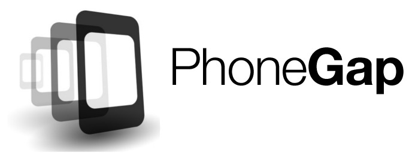
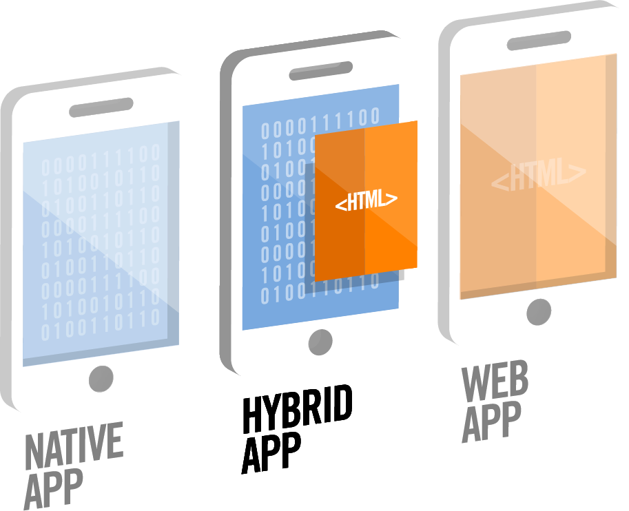
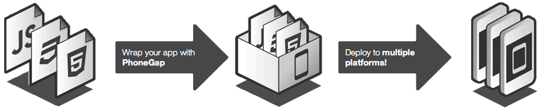
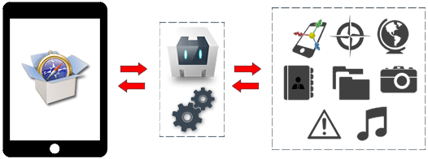

<!-- ********************************************************************* -->
# PhoneGap


<!-- ********************************************************************* -->
## Introducción

PhoneGap es un framework de código abierto para el desarrollo de aplicaciones para móviles. Su principal característica es ser multiplataforma, es decir, con un solo código de aplicación podemos utilizarlo en multitud de plataformas móviles, como Android, iOS o Windows Phone.



Inicialmente PhoneGap fue desarrollado por Nitobi bajo licencia de software libre, pero en Octubre de 2011 Adobe anunció oficialmente la adquisición de Nitobi, pasando así PhoneGap al control del gigante del software. Esto generó una gran incertidumbre entre los desarrolladores, pues el framework podía pasar a ser una tecnología propietaria, pero en una genial estrategia, Adobe donó PhoneGap a la fundación Apache, conservando de esta forma la integridad libre de PhoneGap.

En la actualidad, el proyecto en el sitio web de la fundación Apache esta nombrado como: "Apache Cordova", pero PhoneGap sigue siendo una especie de marca comercial, por lo que aún se sigue usando ese nombre para identificar al popular framework.

El núcleo de las aplicaciones PhoneGap se crea utilizando lenguajes de programación Web, como JavaScript, HTML5, CSS3, y con la ayuda de otros frameworks de desarrollo y de la propia API de PhoneGap. Esta API nos permite acceder mediante código JavaScript a características nativas del móvil, como por ejemplo: Acelerómetro, cámara, contactos, eventos, geolocalización, redes o almacenamiento.

Posteriormente, y para cada una de las plataformas móviles para las que queramos generar nuestra aplicación, tendremos que incluir este núcleo Web como parte de la aplicación nativa. De esta forma podremos generar una aplicación "nativa" para cada plataforma móvil aprovechando para todas ellas el mismo núcleo de la aplicación.

Las aplicaciones desarrolladas con PhoneGap se consideran aplicaciones _híbridas_. Una aplicación es híbrida cuando es una aplicación nativa con una capa intermedia de herramientas que hacen uso de otros lenguajes de programación. Por el contrario se considera nativa cuando ha sido desarrollada íntegramente utilizando la API y lenguaje de programación que proporciona la compañía que vende el producto. Esta técnica de programación tiene varias ventajas: el usuario sentirá que la aplicación es parte del sistema operativo, nos permitirá distribuir la aplicación como una aplicación nativa, y además nos ahorrará muchísimo trabajo.



Puedes encontrar más información de PhoneGap en la dirección <a href="www.phonegap.com">www.phonegap.com</a>, donde podrás descargar la última versión del framework.


<!-- ********************************************************************* -->
## Cómo trabaja PhoneGap

El esquema básico de funcionamiento de PhoneGap es el siguiente:

* Construir la aplicación usando estándares Web: HTML, HTML 5, CSS, CSS3, JavaScript o haciendo uso de otros frameworks para el desarrollo de aplicaciones Web.

* Combinar la aplicación Web con PhoneGap, esto nos dará acceso a las características nativas de los dispositivos móviles.

* Configurar la aplicación en cada una de las plataformas para las que queramos generar la aplicación nativa.

A continuación se incluye un esquema de este proceso:



Es importante utilizar estándares web para que nuestra aplicación funcione en la mayoría de dispositivos móviles. Para el desarrollo de la aplicación, además de poder utilizar lenguajes de programación web HTML 5, CSS 3 y JavaScript, también soporta perfectamente el uso de frameworks de desarrollo web móvil como: Twitter Bootstrap, jQuery Mobile, Sencha Touch, Dojo, jQTouch, SprountCore, GloveBox, XUI, iScroll, entre otros.

Además, a través de la librería de PhoneGap se nos brindará el acceso desde la aplicación web a las diferentes características nativas o hardware de los dispositivos móviles, como por ejemplo el acelerómetro, la cámara, brújula, etc.




<!-- ********************************************************************* -->
## Soporte

Con PhoneGap es posible desarrollar aplicaciones para los siguientes sistemas operativos para móviles:

* Android
* iOS
* Windows Phone
* BlackBerry OS
* Amazon Fire OS
* Firefox OS
* Ubuntu
* Tizen

Permite el acceso a las características nativas o hardware de todas estas plataformas a través de una API en JavaScript que se comunica con el dispositivo. Las características a las que nos permite acceder son:

* Acelerómetro
* Estado de la batería
* Cámara
* Brújula
* Estado de la conexión
* Contactos
* Datos del dispositivo
* Eventos
* Gestión de archivos
* Geolocalización
* Navegador
* Contenido multimedia
* Sistema de notificaciones
* Pantalla de bienvenida o _Splashscreen_
* Almacenamiento
* Vibrador

Sin embargo no todas las plataformas soportan el acceso a todas las características nativas desde una aplicación de este tipo. Los principales sistemas operativos para móvil actuales (Android, iOS, WP) no presentan apenas problemas (aunque sí algunas particularidades de configuración), pero otros como Tizen o Firefox OS no permiten el acceso completo. En la siguiente dirección se puede consultar una tabla con el soporte para cada plataforma:

http://docs.phonegap.com/en/edge/guide_support_index.md.html#Platform%20Support


<!-- ********************************************************************* -->
## Instalación

Entramos a la página de PhoneGap y hacemos click en "Instalar PhoneGap". Como observaremos PhoneGap desde la versión 3.0 cambió y ya se puede instalar como un módulo de _Node.Js_, para poder crear mediante la línea de comandos la estructura de nuestras aplicaciones y posteriormente compilarlas.


<!-- ****************************** -->
### Instalación de Node.Js

Si no tenemos instalado Node.Js entraremos a la página <a href="http://nodejs.org/p">http://nodejs.org/</a> para descargarlo. El automáticamente reconocerá nuestro Sistema Operativo y procederá a bajar la última versión disponible. Los pasos para la instalación son los siguientes:

* Entramos en la página <a href="http://nodejs.org/p">http://nodejs.org/</a> y descargamos la librería.
* Descomprimimos el archivo descargado y accedemos al directorio que se genera.
* Compilamos la librería. Este último paso dependerá del sistema operativo que utilicemos:
  * Si usamos Windows tendremos que ejecutar el _script_:
  ```bash
  vcbuild.bat
  ```
  * Si usamos Linux los siguientes comandos:
  ```bash
  ./configure
  make
  make install
  ```
  * Si usamos Mac simplemente será ejecutar el instalador que se descarga.

Además, si al compilar nos indicara que no encuentra Python tendremos que comprobar que esté correctamente instalado y que lo encuentre en el PATH: `export PYTHON=/path/to/python`. También es posible que nos diese error por cuestión de permisos al realizar la instalación.


<!-- ****************************** -->
### Instalación de PhoneGap

Una vez instalado Node.Js procederemos a descargar PhoneGap. Para esto abrimos una consola (o en Windows la consola de Node.Js llamada "Node.js command prompt") y ejecutamos:

```bash
$ sudo npm install -g phonegap
```

_Nota_: en Windows ejecutaremos el mismo comando pero sin "sudo".

Este comando descargará e instalará automáticamente PhoneGap. Una vez completado el proceso podemos comprobar que esté correctamente instalado ejecutando el comando `phonegap`, el cual debería mostrar una salida similar a la siguiente:

```bash
Usage: phonegap [options] [commands]

Description:

  PhoneGap command-line tool.

Commands:
  ...
  ...
```


<!-- ********************************************************************* -->
## Interfaz de línea de comandos

Una vez tenemos instalado Node.Js y PhoneGap ya podemos crear nuestra primera aplicación. Pero para ello antes debemos conocer el funcionamiento de la interfaz de línea de comandos (CLI) de PhoneGap, el cual utilizaremos para realizar muchas operaciones, como por ejemplo crear nuevos proyectos, compilar, ejecutar, emular, etc. A continuación veremos las opciones más importantes de las que disponemos.


<!-- ****************************** -->
### Ayuda

Para obtener ayuda de todos los comandos disponibles y su sintaxis tenemos que ejecutar:

```bash
$ phonegap help

# O también:
$ phonegap
```

Si queremos ver la ayuda detallada sobre un comando usaremos:

```bash
$ phonegap help <comando>

# O también:
$ phonegap <comando> --help
```

El comando "info" muestra un listado de información de ayuda como la versión del propio CLI de PhoneGap y de Node.Js, las plataformas y plugins instalados, las versiones del SDK de cada plataforma, etc. El ejecutar este comando, además de mostrar la información por pantalla, la guarda en un fichero "info.txt" en la misma carpeta.

```bash
$ phonegap info
```


<!-- ****************************** -->
### Crear una aplicación

Para crear una nueva aplicación abriremos una consola (o en Windows la consola de Node.Js llamada "_Node.js command prompt_") y ejecutamos el siguiente comando:

```bash
$ phonegap create myapp com.example.myapp HelloWorld

# O también podemos ejecutar:
$ phonegap create myapp
```

Donde:

* El primer argumento, "`myapp`", es el nombre de la carpeta donde se generará el contenido. Si el directorio no existe se creará automáticamente.

* El segundo argumento, "`com.example.myapp`", es el nombre del paquete del proyecto usado como identificador. Este argumento es opcional y se puede modificar después desde el fichero "`config.xml`" (pero hay que llevar cuidado ya que se utiliza en el código generado, como en el nombre de los paquetes de Java). El valor por defecto es "com.phonegap.helloworld", por lo que se recomienda asignarle un valor apropiado. Normalmente se suele utilizar el nombre inverso de dominio de la organización, pero añadiendo el nombre de la aplicación. Este nombre no puede contener espacios ni números después de un punto.

* El tercer argumento, "HelloWorld", es el nombre del proyecto que se generará para las distintas plataformas (por ejemplo, el nombre del proyecto que se abrirá en Eclipse o XCode). Este argumento es opcional y también se puede modificar después desde el fichero "`config.xml`" (pero hay que llevar cuidado ya que se utiliza en el código generado). El valor por defecto es "HelloWorld", por lo que se recomienda indicar un valor adecuado. Este nombre no puede contener espacios y debe de empezar con mayúsculas.


Al ejecutar este comando se creará una carpeta con el nombre que le hayamos indicado, "_myapp_" en este caso, con todo el contenido necesario para empezar a desarrollar nuestra aplicación. La estructura de carpetas generada es la siguiente:

* _hooks_ - Esta carpeta se utiliza para añadir _scripts_ que se ejecutarán cuando se produzcan determinados eventos, como por ejemplo antes o después, de la compilación, etc. En la propia carpeta se incluye un fichero con instrucciones para su utilización.
* _merges_ - Esta carpeta se utiliza para añadir código que nos permitirá modificar o personalizar nuestra aplicación para determinadas plataformas.
* _platforms_ - Contiene el código específico de las plataformas móviles para las cuales se va a compilar. El código de esta carpeta es generado y no se ha de modificar manualmente.
* _plugings_ - Contiene los _plugins_ o módulos instalados para nuestra aplicación, los cuales se utilizan para añadir funcionalidad como el acceso a las características nativas del móvil.
* _www_ - Contiene el código fuente de nuestra aplicación web. Esta carpeta es donde tendremos que desarrollar nuestra aplicación web de forma centralizada para después utilizarla en las distintas plataformas móviles que deseemos.

Al crear un nuevo proyecto todas las carpetas se encontrarán vacías a excepción de `www`, la cual incluye una primera aplicación de ejemplo (que mostrará el Hola Mundo de PhoneGap) con una estructura de carpetas básica (css, js, img, etc.). Para empezar a desarrollar un proyecto partiremos de este código de ejemplo, pudiendo modificar todo lo que queramos dentro de la carpeta `www`, incluso las subcarpetas de recursos (css, js, img, etc.).

Además de esta estructura, en la raíz de nuestra aplicación, encontraremos un fichero `config.xml` que se utiliza para la configuración del proyecto.

En las siguientes secciones se tratarán cada uno de estos puntos más en detalle.
> Importante: El resto de comandos que ejecutemos utilizando el CLI de PhoneGap lo tendremos que hacer dentro de la carpeta del proyecto o aplicación, o en una subcarpeta dentro de la misma.


<!-- ****************************** -->
### Gestión de plataformas

Antes de poder compilar el proyecto tenemos que especificar las plataformas para las cuales se va a generar. Las plataformas disponibles dependerán del sistema operativo que utilicemos, si soporta el SDK en cuestión o si lo tiene instalado (y si no lo tiene lo tendremos que instalar). En general soporta las siguientes combinaciones:

|                 | Mac | Linux | Windows |
| --              | --  | --    | --      |
| iOS             | x |   |   |
| Amazon Fire OS  | x | x | x |
| Android         | x | x | x |
| BlackBerry 10   | x | x | x |
| Windows Phone 8 |   |   | x |
| Windows         |   |   | x |
| Firefox OS      | x | x | x |


#### Añadir plataformas

Para añadir una plataforma para la cual queremos compilar nuestro proyecto usaremos el siguiente comando:

```bash
$ phonegap platform add <nombre-de-la-plataforma>
```

Por ejemplo, en un Mac podremos añadir las siguientes plataformas a nuestro proyecto:

```bash
$ phonegap platform add ios
$ phonegap platform add amazon-fireos
$ phonegap platform add android
$ phonegap platform add blackberry10
$ phonegap platform add firefoxos
```

O desde el sistema operativo Windows todas las siguientes:

```bash
$ phonegap platform add wp8
$ phonegap platform add windows
$ phonegap platform add amazon-fireos
$ phonegap platform add android
$ phonegap platform add blackberry10
$ phonegap platform add firefoxos
```


#### _Ejemplo_: Añadir la plataforma Android

Por ejemplo, tras crear nuestro primer proyecto "myapp" en Linux, procedemos a añadir la plataforma Android como destino de la compilación, con el comando:

```bash
$ phonegap platform add android
```

Si nos indicara que el SDK no está instalado en primer lugar tendríamos que descargarlo e instalarlo nosotros manualmente (el CLI de PhoneGap no incluye opciones para realizar la instalación de los distintos SDKs).

También es posible que no encuentre la ruta del SDK:

```bash
Error: ANDROID_HOME is not set and "android" command not in your PATH.
```

Para arreglar este problema tenemos que asignar la ruta del SDK de Android a la variable "`ANDROID_HOME`" y al "`PATH`". Para esto en una consola de Linux ejecutamos:

```bash
export ANDROID_HOME=/<installation location>/sdk
export PATH=$PATH:$ANDROID_HOME/tools:$ANDROID_HOME/platforms-tools
```

Si estamos en un Mac usaremos:

```bash
export ANDROID_HOME=/<installation location>/android-sdk-macosx
export PATH=${PATH}:$ANDROID_HOME/tools:$ANDROID_HOME/platform-tools
```

Para hacer estos cambios permanentes (de otra forma solo estarían disponibles para la consola actual) tendremos que añadir las líneas indicadas al fichero `.bashrc` (o a `.profile` o `.bash_profile`, dependiendo del sistema).

Después de arreglar estos problemas ya tendríamos que poder instalar la plataforma sin problemas.


#### Listar plataformas

Para obtener un listado con las plataformas disponibles para nuestro sistema operativo además de un listado con las plataformas que ya hemos añadido a nuestra aplicación tenemos que ejecutar el comando:

```bash
$ phonegap platforms ls

# O simplemente:
$ phonegap platforms
```

Lo que nos mostraría (en ambos casos):

```bash
Installed platforms: android 3.6.4, ubuntu 3.6.3
Available platforms: amazon-fireos, blackberry10, browser, firefoxos
```

> Nota: las opciones "platform" y "platforms" son equivalentes.


#### Eliminar una plataforma

Para eliminar una plataforma añadida podemos ejecutar alguno de los siguientes comandos (los cuales son equivalentes):

```bash
$ phonegap platform remove android
# O también:
$ phonegap platform rm android
```


#### Contenido de la carpeta "_platforms_"

Al añadir una plataforma o eliminarla únicamente estábamos trabajando sobre la carpeta "_platforms_" de nuestro proyecto. Al añadir una nueva se genera un subdirectorio con el nombre de la plataforma en cuestión, copiando dentro de la misma el contenido de la carpeta "www" (la cual contiene el código de nuestro proyecto). Por ejemplo, para Android se copiaría en la ruta: `platforms/android/assets/www/` o para iOS en la ruta: `platforms/ios/www`.

Por este motivo es importante que no modifiquemos el contenido de nuestro proyecto o aplicación directamente en la carpeta _platforms_, ya que sería **borrado** o sobreescrito en la siguiente compilación. Cualquier cambio que queramos hacer en el mismo lo tendremos que realizar siempre sobre la carpeta base `www`.


<!-- ********************************************************************* -->
### Compilar una aplicación

Para compilar un proyecto ejecutamos el comando:

```bash
$ phonegap build
```

Este comando tiene que se ejecutado dentro de la carpeta del proyecto a compilar y además tienen que haber plataformas añadidas para el mismo, en otro caso nos mostraría el error:

```bash
[phonegap] executing 'cordova build'...
No platforms added to this project. Please use `cordova platform add <platform>`.
```

Al compilar se genera el código del proyecto para todas las plataformas añadidas, en caso de querer compilar solamente para una plataforma lo podríamos indicar de la forma:

```bash
$ phonegap build ios
```

El comando `build` en realidad realiza dos operaciones que son las de preparar el código (copiar el código actual del proyecto desde la carpeta `www` a todas las plataformas destino) y compilarlo. Estos dos comandos también los podríamos ejecutar por separado:

```bash
$ phonegap prepare
$ phonegap compile

# O también para solo una plataforma:
$ phonegap prepare ios
$ phonegap compile ios
```

Después de llamar al comando `prepare` podríamos abrir de forma manual el proyecto desde la carpeta de la plataforma que queramos con el SDK correspondiente, por ejemplo con Xcode, con Eclipse o con Android Studio.

Esta alternativa es interesante si lo que se desea es crear una versión inicial del proyecto mediante el CLI de PhoneGap y después cambiar al IDE del SDK correspondiente. En este caso tenemos que llevar cuidado ya que si volvemos a compilar para actualizar el código de la carpeta `www` es posible que perdiésemos algunos cambios.

Para más información sobre como desarrollar aplicaciones con cada uno del os IDEs soportados podéis consultar la web:

http://docs.phonegap.com/en/edge/guide_platforms_index.md.html#Platform%20Guides

> Nota: en caso de querer abrir nuestro proyecto para Android desde Eclipse tendremos que utilizar la opción "_File &gt; New &gt; Other... &gt; Android &gt; Android project from existing code_" (y no la opción de importar "_Existing projects into workspace_").


<!-- ********************************************************************* -->
### Probar una aplicación en un emulador o dispositivo real

Cada SDK para una plataforma móvil suele incluir un emulador que permite probar las aplicaciones desarrolladas. Estos emuladores también se pueden llamar desde el CLI de PhoneGap mediante el siguiente comando:

```bash
$ phonegap emulate

# O para una plataforma:
$ phonegap emulate android
```

Para que se abra el emulador correspondiente debe de estar bien configurado. Algunas plataformas ya traen uno por defecto (como iPhone), pero en otras será necesario configurar el emulador por defecto a utilizar (como en Android).

Es importante que antes de llamar al emulador ejecutemos el comando `build` el cual copiará la última versión de nuestro código, generará los proyectos correspondientes y los compilará. En otro caso podríamos tener errores.

Si actualizamos el código tendríamos que llamar de nuevo a `build` y a `emulate`, el cual actualizará los emuladores abiertos con la última versión.

También podemos probar nuestro código en un dispositivo real mediante el comando:


```bash
$ phonegap run android
```

El comando `run` en realidad es una combinación de los comandos `build` (por lo que no haría falta llamarlo previamente) e `install` (el cual instala un proyecto en una plataforma). Por defecto `run` instala y ejecuta el proyecto en una plataforma real (lo cual podemos forzar mediante el parámetro `--device`), o también lo podemos utilizar para ejecutar en un emulador añadiendo el parámetro `--emulator`.

Antes de ejecutar en un dispositivo real tenemos que configurarlo para permitir la instalación de aplicaciones de prueba. Este proceso varia para cada plataforma, por ejemplo, para Android tendremos que habilitar las opciones de desarrollador y la depuración a través de USB, además, dependiendo del sistema operativo que utilicemos, es posible que tengamos que instalar drivers o realizar alguna configuración adicional.


<!-- ********************************************************************* -->
## Actualización de PhoneGap

En el futuro, cuando queramos actualizar PhoneGap, también podemos usar el _Package Manager_ de Node.Js (`npm`). Para ello simplemente tenemos que ejecutar en una consola:

```bash
$ sudo npm update -g phonegap
```

Después de ejecutar este comando es posible que tengamos que actualizar también las plataformas de nuestros proyectos. En este caso tendremos que situarnos dentro de la carpeta de cada proyecto que queramos actualizar y ejecutar los siguientes comandos para cada plataforma:

```bash
$ phonegap platform update android
$ phonegap platform update ios
...etc.
```


<!-- ********************************************************************* -->
## Crear nuestra primera aplicación

Una vez instalado Node.Js y PhoneGap ya podemos crear nuestra primera aplicación. Para ello, y como se ha visto en secciones anteriores, tendríamos que ejecutar:

```bash
$ phonegap create myapp com.example.myapp HelloWorld
```

Este comando creará una carpeta llamada `myapp` con las subcarpetas: `hooks`, `platforms`, `plugings` y `www`. La carpeta `www` es la que contendrá el código fuente de nuestra aplicación web, la cual por defecto incluye una aplicación "Hola Mundo" de ejemplo con las subcarpetas _css_, _js_ e _img_ con los recursos correspondientes. El nombre de estas carpetas y código son los que se utilizan de forma común en el desarrollo web, pero se pueden modificar como queramos.

Es importante destacar que todo el contenido que se incluya dentro de la carpeta `www` se copiarán dentro de las aplicaciones que se generen para cada plataforma.

La carpeta y html llamados "_spec_" se utilizan para realizar pruebas unitarias a nuestro código Javascript mediante el _Framework Jasmine_, por lo que si no lo vamos a utilizar se pueden eliminar sin problemas.

El archivo "`index.html`" es el que se abrirá por defecto al iniciar nuestra aplicación. Este archivo, al igual que el resto de contenidos, se pueden modificar como queramos, incluso el nombre del html inicial siempre que lo indiquemos en el fichero de configuración "`config.xml`".

Para el desarrollo de nuestra aplicación lo podemos realizar en HTML nativo (con funcionalidades de HTML5, CSS3, JavaScript, etc.), pero también podemos utilizar algunos de los frameworks existentes para el desarrollo de aplicaciones web para móviles, como por ejemplo:

* Bootstrap: http://getbootstrap.com/
* JQueryMobile: http://jquerymobile.com/
* SenchaTouch: http://www.sencha.com/products/touch/
* Ionic: http://ionicframework.com/
* Kendo UI: http://www.telerik.com/kendo-ui1
* SideTap: http://harvesthq.github.io/Sidetap/
* etc.

Además, para completar el desarrollo de nuestra aplicación podemos utilizar la gestión de eventos que incorpora PhoneGap mediante su librería JavaScript o un gran número de _plugins_ para acceder a las características nativas de los dispositivos móviles, como por ejemplo la cámara, la geolocalización, etc. Estas características se abordarán en el siguiente apartado.


<!-- ********************************************************************* -->
<!-- ********************************************************************* -->
<!-- ********************************************************************* -->
<!-- ********************************************************************* -->

# Ejercicios - PhoneGap


<!-- ********************************************************************* -->
## Ejercicio 1 - Instalación y prueba (1 punto)

En este ejercicio vamos a realizar la instalación de las librerías necesarias para utilizar PhoneGap y a continuación crearemos una primera aplicación de ejemplo y la probaremos. Para ello seguiremos los siguientes pasos:

* Instalar las librerías de Node.Js y de PhoneGap siguiendo los pasos explicados en la teoría.

* Añadir plataformas de compilación para Android e iOS.

* Compilar y probar el código de ejemplo inicial en los emuladores de Android e iOS.

* Modificar el código de ejemplo para que en la página "index.html" únicamente se muestre "¡Hola Mundo!", en grande y centrado en la pantalla. Al pulsar sobre este texto se irá a una segunda página que pondrá "¡Adiós!", también en grande y centrado.

* Importar los proyectos generados para cada plataforma en el IDE correspondiente (Android e iOS) y ejecutar la nueva versión del código.


<!-- ********************************************************************* -->
## Ejercicio 2 - Importar nuestros proyectos (2 puntos)

En este ejercicio vamos a empaquetar como aplicaciones PhoneGap el resultado obtenido en los últimos ejercicios de esta asignatura. En todos los proyectos que vamos a crear tendremos que:

* Instalar las plataformas de Android e iOS, compilar las aplicaciones y probarlas (en emulador o dispositivo real).
* Incluir todos los assets (css, js, imágenes, etc.) que se utilicen dentro de la propia aplicación. Es decir, si por ejemplo algún proyecto accede a alguna librería desde su CDN tendríamos que descargarla, incluirla entre los recursos de la aplicación y modificar el código para que acceda de forma local. De esta forma las aplicaciones podrán funcionar sin necesidad de tener conexión a Internet.
* Es importante que nos aseguremos de haber completado cada uno de los ejercicios correspondientes antes de incluirlos en la aplicación de PhoneGap.


Vamos a crear cuatro nuevos proyectos PhoneGap, con los nombres de carpetas y contenidos siguientes:

* _html_: en este primer proyecto con PhoneGap empaquetaremos el resultado del ejercicio 3 de la primera sección "Introducción al desarrollo Web", llamado "Ejercicio 3 - Estructura de HTML" en el que había que utilizar las nuevas etiquetas semánticas de HTML5.

* _bootstrap_: en esta segunda aplicación usaremos la web realizada en el último ejercicio de la sección sobre Bootstrap en el que había que crear una web de contenido libre que utilizara dicha librería.

* _jquerymobile_: en esta tercera aplicación utilizaremos el resultado del último ejercicio de la sección de JQuery Mobile.

* _senchatouch_: en esta aplicación vamos a incorporar el resultado obtenido del último ejercicio de la parte de programación Web sobre Sencha Touch. En este caso tendremos que seguir unos pasos distintos para realizar la integración con PhoneGap:

  * Sencha Touch viene preparado para integrarse con PhoneGap, para ello en primer lugar tendremos que ejecutar el siguiente comando (dentro de la carpeta del proyecto de Sencha Touch):
<br/>
```bash
$ sencha phonegap init com.mastermoviles.misnotas MisNotas
```
<br/>
Esto creará una nueva carpeta `phonegap` y el fichero `phonegap.local.properties`.

  * Dentro del fichero de propiedades `phonegap.local.properties`, en la sección `phonegap.platform`, indicaremos las plataformas destino para las que vayamos a compilar (separadas por espacio).

  * Por último ejecutaremos la siguiente orden, la cual prepará el proyecto de Sencha Touch, lo copiará a las carpetas correspondientes de PhoneGap, compilará las plataformas indicadas y lanzará los emuladores.
<br/>
```bash
$ sencha app build -run native
```

  * Es probable que al ejecutar obtengamos errores o nos falten recursos. Para poder visualizarlos lo mejor es importar el proyecto en un IDE para poder ver la consola. También tenemos que asegurarnos de copiar todos nuestros recursos propios en la carpeta `phonegap/www/resources`.
  * Si abrimos la app en navegadores antiguos obtendremos errores debido a los últimos cambios introducidos en Sencha Touch. Para solucionar esto, en el fichero `touch\src\event\publisher\TouchGesture.js` de nuestro proyecto, tendremos que sustituir el código:
<br/>
```javascript
if (Ext.feature.has.Touch) {
    // bind handlers that are only invoked when the browser has touchevents
    me.onTargetTouchMove = me.onTargetTouchMove.bind(me);
    me.onTargetTouchEnd = me.onTargetTouchEnd.bind(me);
}
```
<br/>
Por este otro:
<br/>
```javascript
if (Ext.feature.has.Touch) {
    // bind handlers that are only invoked when the browser has touchevents
    me.onTargetTouchMove = Ext.Function.bind(me.onTargetTouchMove, me);
    me.onTargetTouchEnd = Ext.Function.bind(me.onTargetTouchEnd, me);
}
```


> En el caso de Sencha Touch también podríamos haber creado el proyecto de PhoneGap directamente, pero para esto antes tendríamos que haber generado la versión de producción con `sencha app build production` y después haber copiado el código generado en la carpeta `build/production`.

> En ambos casos, tanto si generamos desde dentro de Sencha Touch como desde PhoneGap, habrá que solucionar los errores comentados (copiar recursos y reemplazar el código de la función `bind`).

> Es interesante la posibilidad de integrar PhoneGap con Sencha Touch porque nos permitirá gestionar todo el desarrollo desde dentro del propio proyecto.


