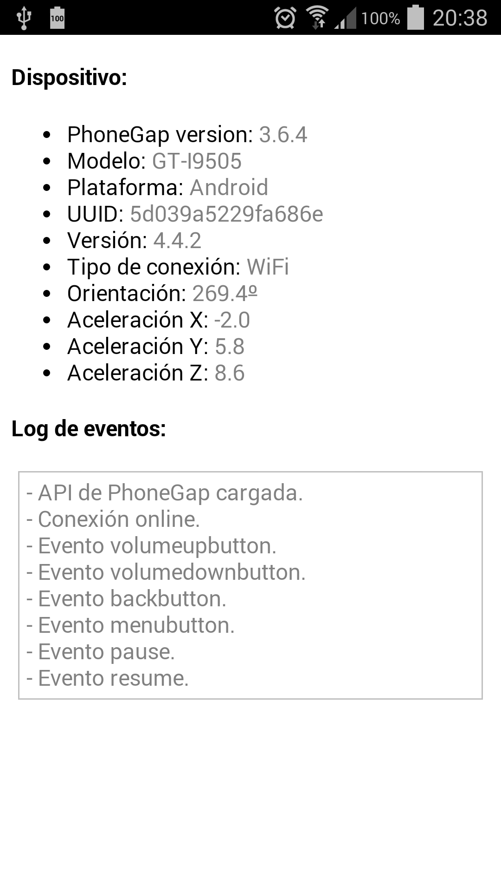

# PhoneGap avanzado

En esta segunda parte vamos a ver como gestionar los _plugins_ de una aplicación, las opciones de configuración, la gestión de eventos y el uso básico de la API de PhoneGap.


<!-- ********************************************************************* -->
## Personalizar plataformas mediante _merges_

En ocasiones se hace necesario especificar algunos recursos de forma separada para una plataforma. En este caso no deberíamos modificar la carpeta correspondiente de `platforms` ya se sobreescribiría en la próxima compilación.

Con este propósito se creo la carpeta _merges_, la cual contiene los assets que se han de copiar o reemplazar para las plataformas especificadas. La estructura de esta carpeta es la siguiente:

* En primer lugar tendremos que crear subcarpetas con el mismo nombre que la carpeta de `platforms` que deseemos sobreescribir.
* Dentro de esa subcarpeta crearemos una estructura espejo a la carpeta `www`, pero únicamente situando los ficheros y carpetas que deseemos reemplazar.

Por ejemplo, el fichero `merges/android/css/overrides.css` sobreescribiría el css situado en `www/css/overrides.css` pero solamente para la plataforma Android.

Si por ejemplo quisieramos especificar un estilo distinto para la plataforma iOS, podríamos almacenar dicho recurso en:

```bash
merges/ios/css/overrides.css
```

El cual cargaríamos desde el fichero `index.html` situado en `www/index.html` de forma normal:

```html
<link rel="stylesheet" type="text/css" href="css/overrides.css" />
```

Además tendríamos que crear un css vacío (o con algún estilo por defecto) en `www/css/overrides.css` que utilicen el resto de plataformas que no sean "iOS" para evitar que apareciera un error de fichero no encontrado.


<!-- ********************************************************************* -->
## Fichero de configuración

En cada proyecto se incluye un fichero de configuración `config.xml` que nos permite establecer las principales opciones de configuración de nuestra aplicación de forma global (para todas las plataformas destino).

Este fichero se situa en la carpeta raíz del proyecto (`app/config.xml`), pero por cuestiones de compatibilidad con versiones anteriores de PhoneGap también está soportado desde la ruta: `app/www/config.xml`

Al compilar un proyecto (mediante el comando `build` o `run` del CLI) se crean versiones específicas de este fichero de configuración para cada plataforma, lo que nos permite establecer configuraciones más específicas. La ruta donde el fichero es copiado varía dependiendo de la plataforma, por ejemplo:

```bash
app/platforms/ios/AppName/config.xml
app/platforms/blackberry10/www/config.xml
app/platforms/android/res/xml/config.xml
```

Para más información sobre configuraciones específicas podéis consultar la sección "_Configuration_" de cada plataforma en:

http://docs.phonegap.com/en/edge/guide_platforms_index.md.html#Platform%20Guides

A continuación se describen las opciones de configuración generales para todas las plataformas, pero además de estas hay muchas específicas dependientes de la plataforma:

* iOS Configuration: http://docs.phonegap.com/en/edge/guide_platforms_ios_config.md.html#iOS%20Configuration

* Android Configuration: http://docs.phonegap.com/en/edge/guide_platforms_android_config.md.html#Android%20Configuration

* BlackBerry 10 Configuration: http://docs.phonegap.com/en/edge/guide_platforms_blackberry10_config.md.html#BlackBerry%2010%20Configuration


<!-- ********************************** -->
### Elementos de configuración principales

A continuación se muestran las primeras líneas del fichero `config.xml` generado por defecto al crear un nuevo proyecto de PhoneGap. Esta configuración es compatible para todas las plataformas:

```xml
<widget id="com.example.hello" version="0.0.1">
    <name>HolaMundo</name>
    <description>
        Ejemplo de aplicación con PhoneGap
    </description>
    <author email="email@email.com" href="http://miweb.com">
        Nombre autor
    </author>
    <content src="index.html" />
    <access origin="*" />
    <preference name="permissions" value="none" />
    <preference name="..." value="..." />
    ...
</widget>
```

Donde:

* `<widget>`: su atributo `id` especifica el paquete de la aplicación (usando el _reverse-domain-name_), y su atributo `version` es el número completo de versión de la app (siguiendo la notación _major/minor/patch_, ver más información en la sección "Versión de la aplicación").

* `<name>`: especifica el nombre del proyecto y de la app, es el que aparecería al instalar la app junto a su icono y en los _markets_.

* `<description>` y `<author>`: son metadatos e información de contacto que se utilizará al publicar la app en los _markets_.

* `<content>`: es un atributo opcional para indicar la página inicial de nuestro código. Por defecto se utilizará `index.html`.

* `<access>`: define un conjunto de dominios externos a los que se le permite acceder. Por defecto, al indicar `*` se le permite acceder a cualquier servidor. Para más información consultar la ayuda sobre _Domain Whitelist_.

* `<preference>`: establece opciones de configuración siguiendo la notación de pares nombre-valor, sin distinguir mayúsculas y minúsculas. En las siguientes secciones se tratarán estas opciones de configuración, las cuales pueden ser genéricas o específicas para algunas plataformas.


Las preferencias globales se aplicarán para todas las plataformas para las que se compile el proyecto.

* _Fullscreen_ permite mostrar u ocultar la barra de estado de la pantalla. El valor por defecto es _false_. Ejemplo:

```xml
<preference name="Fullscreen" value="true" />
```

* _Orientation_ permite controlar si se ha de permitir que la pantalla gire o no. Los valores permitidos son: _default_, _landscape_, o _portrait_, siendo _default_ el valor por defecto (el cual permite ambas orientaciones). Ejemplo:

```xml
<preference name="Orientation" value="landscape" />
```

Además de todas estas opciones de configuración también es posible establecer los iconos o _splashscreens_ que se utilizarán para cada plataforma. En las siguientes secciones se tratarán estos temas más en profundidad.


<!-- ********************************************************************* -->
### Iconos

Los iconos se pueden especificar utilizando la etiqueta `<icon>` en el fichero `config.xml`, por ejemplo:

```bash
<icon src="res/ios/icon.png" platform="ios" width="57" height="57" density="mdpi" />
```

Donde:
* src: (requerido) localización de la imagen relativa a la carpeta del proyecto.
* platform: (opcional) plataforma para la que se utilizará el icono.
* width: (opcional) ancho en píxeles.
* height: (opcional) alto en píxeles.
* density: (opcional) parámetro específico de Android para establecer la densidad del icono.

Para establecer un icono que se utilizará en todas las plataformas podemos establecer la siguiente configuración:

```bash
<icon src="res/icon.png" />
```

En caso de no especificar ningún logo por defecto se utilizará el icono de Apache Cordova.

Podemos utilizar tantas etiquetas como sea necesario para establecer los iconos para cada plataforma, incluso podemos indicar varios para una misma plataforma con distintos tamaños o densidades. Para clarificar la asignación también podemos agruparlos de la forma:

```bash
<platform name="android">
    <icon src="res/android/ldpi.png" density="ldpi" />
    <icon src="res/android/mdpi.png" density="mdpi" />
    <icon src="res/android/hdpi.png" density="hdpi" />
    <icon src="res/android/xhdpi.png" density="xhdpi" />
</platform>
```

Otro ejemplo para establecer los iconos de iOS:

```bash
<platform name="ios">
    <!-- iOS 8.0+ -->
    <!-- iPhone 6 Plus  -->
    <icon src="res/ios/icon-60@3x.png" width="180" height="180" />
    <!-- iOS 7.0+ -->
    <!-- iPhone / iPod Touch  -->
    <icon src="res/ios/icon-60.png" width="60" height="60" />
    <icon src="res/ios/icon-60@2x.png" width="120" height="120" />
    <!-- iPad -->
    <icon src="res/ios/icon-76.png" width="76" height="76" />
    <icon src="res/ios/icon-76@2x.png" width="152" height="152" />
    <!-- iOS 6.1 -->
    <!-- Spotlight Icon -->
    <icon src="res/ios/icon-40.png" width="40" height="40" />
    <icon src="res/ios/icon-40@2x.png" width="80" height="80" />
    <!-- iPhone / iPod Touch -->
    <icon src="res/ios/icon.png" width="57" height="57" />
    <icon src="res/ios/icon@2x.png" width="114" height="114" />
    <!-- iPad -->
    <icon src="res/ios/icon-72.png" width="72" height="72" />
    <icon src="res/ios/icon-72@2x.png" width="144" height="144" />
    <!-- iPhone Spotlight and Settings Icon -->
    <icon src="res/ios/icon-small.png" width="29" height="29" />
    <icon src="res/ios/icon-small@2x.png" width="58" height="58" />
    <!-- iPad Spotlight and Settings Icon -->
    <icon src="res/ios/icon-50.png" width="50" height="50" />
    <icon src="res/ios/icon-50@2x.png" width="100" height="100" />
</platform>
```


<!-- ********************************************************************* -->
### _Splash Screens_

Igual que la configuración de los iconos, PhoneGap también permite definir un _splashscreen_ para las distintas plataformas, por ejemplo:

```bash
<platform name="android">
    <!-- you can use any density that exists in the Android project -->
    <splash src="res/screen/android/splash-land-hdpi.png" density="land-hdpi"/>
    <splash src="res/screen/android/splash-land-ldpi.png" density="land-ldpi"/>
    <splash src="res/screen/android/splash-land-mdpi.png" density="land-mdpi"/>
    <splash src="res/screen/android/splash-land-xhdpi.png" density="land-xhdpi"/>

    <splash src="res/screen/android/splash-port-hdpi.png" density="port-hdpi"/>
    <splash src="res/screen/android/splash-port-ldpi.png" density="port-ldpi"/>
    <splash src="res/screen/android/splash-port-mdpi.png" density="port-mdpi"/>
    <splash src="res/screen/android/splash-port-xhdpi.png" density="port-xhdpi"/>
</platform>

<platform name="ios">
    <!-- images are determined by width and height. The following are supported -->
    <splash src="res/screen/ios/Default~iphone.png" width="320" height="480"/>
    <splash src="res/screen/ios/Default@2x~iphone.png" width="640" height="960"/>
    <splash src="res/screen/ios/Default-Portrait~ipad.png" width="768" height="1024"/>
    <splash src="res/screen/ios/Default-Portrait@2x~ipad.png" width="1536" height="2048"/>
    <splash src="res/screen/ios/Default-Landscape~ipad.png" width="1024" height="768"/>
    <splash src="res/screen/ios/Default-Landscape@2x~ipad.png" width="2048" height="1536"/>
    <splash src="res/screen/ios/Default-568h@2x~iphone.png" width="640" height="1136"/>
    <splash src="res/screen/ios/Default-667h.png" width="750" height="1334"/>
    <splash src="res/screen/ios/Default-736h.png" width="1242" height="2208"/>
    <splash src="res/screen/ios/Default-Landscape-736h.png" width="2208" height="1242"/>
</platform>

<preference name="SplashScreenDelay" value="10000" />
```


<!-- ********************************** -->
### Versión de la aplicación

Tanto Android como iOS soportan una cadena con una nombre (o número) de versión alternativo además del que se utiliza en el _market_. En Android es el _versionCode_ y en iOS el _CFBundleVersion_. A continuación se muestra como podemos establecer estas versiones en el `config.xml`:

```xml
<widget id="io.cordova.hellocordova"
    version="0.0.1"
    android-versionCode="7"
    ios-CFBundleVersion="3.3.3">
```

Si esta versión no se especifica se construirá a partir del atributo `version`. Como se ha indicado este atributo se construye siguiendo la notación _major/minor/patch_, por lo que se usarán estos valores de la forma:

```javascript
// version = MAJOR.MINOR.PATCH-whatever
versionCode = PATCH + MINOR * 100 + MAJOR * 10000
CFBundleVersion = "MAJOR.MINOR.PATCH"
```


<!-- ********************************************************************* -->
## Eventos

La librería de PhoneGap incluye una serie de eventos JavaScript a los cuales podemos escuchar para realizar determinadas acciones cuando se produzcan. Estos eventos son:

* _deviceready_
* _pause_
* _resume_
* _backbutton_
* _menubutton_
* _searchbutton_
* _startcallbutton_
* _endcallbutton_
* _volumedownbutton_
* _volumeupbutton_

Si instalamos el _plugin_ para el control de la batería (_org.apache.cordova.battery-status_) se añadirán los siguientes eventos (ver sección de _plugins_):

* _batterycritical_
* _batterylow_
* _batterystatus_

Si instalamos el _plugin_ para obtener información de la red (_org.apache.cordova.network-information_) se añadirán los siguientes eventos (ver sección de _plugins_:

* _online_
* _offline_

En general para suscribirnos a un evento utilizaremos el siguiente código:

```
document.addEventListener("nombre-evento", funcionCallback, false);
```

Donde:
* _nombre-evento_: es el evento al que queremos escuchar.
* _funcionCallback_: es la función que se llamará cuando el evento se produzca.
* _false_: afecta al orden en el que se lanzará el evento, al inicio (cuando se producte) o al final (cuando ya ha terminado).

A continuación se describen los principales eventos de PhoneGap y se incluyen ejemplos de uso.


<!-- ******************************** -->
### _deviceready_

Este evento se ejecuta cuando la librería de PhoneGap se ha cargado completamente. Su uso es esencial para cualquier aplicación y lo tendremos que utilizar de forma inicial para asegurarnos de que la API se ha cargado completamente.

A continuación se incluye un ejemplo de uso:

```html
<!DOCTYPE html>
<html>
  <head>
    <title>Ejemplo</title>
    <script type="text/javascript" charset="utf-8" src="cordova.js"></script>
    <script type="text/javascript" charset="utf-8">

    // Esperamos a que se cargue la API de PhoneGap
    function onLoad() {
        document.addEventListener("deviceready", onDeviceReady, false);
    }

    // La API de PhoneGap ya está disponible
    function onDeviceReady() {
        // Ya podemos usar la librería de PhoneGap
    }
    </script>
  </head>
  <body onload="onLoad()">
  </body>
</html>
```

<!-- ******************************** -->
### _pause_

Este evento se produce cuando la aplicación pasa a segundo plano. A continuación se incluye un ejemplo completo de uso:


```html
<!DOCTYPE html>
<html>
  <head>
    <title>Pause Example</title>
    <script type="text/javascript" charset="utf-8" src="cordova.js"></script>
    <script type="text/javascript" charset="utf-8">

    function onLoad() {
        document.addEventListener("deviceready", onDeviceReady, false);
    }

    // Añadimos el evento cuando la API esté lista
    function onDeviceReady() {
        document.addEventListener("pause", onPause, false);
    }

    // Se ha producido el evento pause!
    function onPause() {
    }
    </script>
  </head>
  <body onload="onLoad()">
  </body>
</html>
```

> En todos los eventos tendremos que esperar a que la API de PhoneGap termine de cargar.


<!-- ******************************** -->
### _resume_

Este evento se produce cuando la aplicación estaba en segundo plano y se vuelve a mostrar en primer plano. A continuación se incluye un ejemplo completo de uso:
```html
<!DOCTYPE html>
<html>
  <head>
    <title>Resume Example</title>
    <script type="text/javascript" charset="utf-8" src="cordova.js"></script>
    <script type="text/javascript" charset="utf-8">

    function onLoad() {
        document.addEventListener("deviceready", onDeviceReady, false);
    }

    // Añadimos el evento cuando la API esté lista
    function onDeviceReady() {
        document.addEventListener("resume", onResume, false);
    }

    // Se ha producido el evento "resume"!
    function onResume() {
    }
    </script>
  </head>
  <body onload="onLoad()">
  </body>
</html>
```


<!-- ******************************** -->
### _backbutton_

Este evento se produce cuando el usuario pulsa el botón atrás. A continuación se incluye un ejemplo completo de uso:

```html
<!DOCTYPE html>
<html>
  <head>
    <title>Back Button Example</title>
    <script type="text/javascript" charset="utf-8" src="cordova.js"></script>
    <script type="text/javascript" charset="utf-8">

    function onLoad() {
        document.addEventListener("deviceready", onDeviceReady, false);
    }

    // Añadimos el evento cuando la API esté lista
    function onDeviceReady() {
        document.addEventListener("backbutton", onBackKeyDown, false);
    }

    // Se ha producido el evento "backbutton"!
    function onBackKeyDown() {
    }
    </script>
  </head>
  <body onload="onLoad()">
  </body>
</html>
```

**Salir de la aplicación**

Por defecto, al pulsar el botón _back_ no se cerrará la aplicación. Si queremos que se cierre tendremos que hacer:

```javascript
document.addEventListener("backbutton", onBackKeyDown, false);

function onBackKeyDown() {
   navigator.app.exitApp()
}
```

Hemos de tener cuidado con esta funcionalidad porque cerrará la aplicación siempre que se pulse dicha tecla. Si nuestra aplicación tiene varias páginas y queremos que se use el botón _back_ para volver a la página anterior y además que en la primera página cierre la aplicación tendremos que distinguir entre las páginas y solo cerrar en la primera.


<!-- ******************************** -->
### _menubutton_

Este evento se produce cuando el usuario pulsa el botón menú. Para su utilización, igual que en el resto de casos, simplemente tendremos que hacer (ejemplo abreviado):

```javascript
document.addEventListener("menubutton", onMenuKeyDown, false);

function onMenuKeyDown() {
   // Se ha producido el evento "menubutton"!
}
```


<!-- ******************************** -->
### _volumedownbutton_

Este evento se produce cuando el usuario pulsa el botón para bajar el volumen. A continuación se incluye un ejemplo abreviado de uso:

```
document.addEventListener("volumedownbutton", onVolumeDownKeyDown, false);

function onVolumeDownKeyDown() {
    // Se ha producido el evento "volumedownbutton"!
}
```


<!-- ******************************** -->
### _volumeupbutton_

Este evento se lanza cuando se pulsa el botón para subir el volumen. Igual que en el resto de casos, para su utilización tenemos que hacer:

```
document.addEventListener("volumeupbutton", onVolumeUpKeyDown, false);

function onVolumeUpKeyDown() {
    // Se ha producido el evento "volumeupbutton"!
}
```


<!-- ********************************************************************* -->
## _Plugings_

PhoneGap, además de permitir encapsular aplicaciones Web y compilarlas como aplicaciones nativas para distintas plataformas móviles, nos brinda el acceso a características hardware de los dispositivos a través de su sistema de _plugins_. Por ejemplo tenemos disponibles _plugins_ para trabajar con la cámara, brújula, geolocalización, etc.

Estos _plugins_ se pueden añadir a nuestros proyectos según los necesitemos mediante el CLI de PhoneGap. A partir de la versión 3.0 de PhoneGap, al crear un nuevo proyecto no incluye ningún _plugin_, por lo que si queremos alguno tendremos que añadirlo manualmente.

PhoneGap también permite crear nuestros propios plugins (para más información consultar: "http://docs.phonegap.com/en/edge/guide_hybrid_plugins_index.md.html"), pero la opción más común es utilizar alguno de los ya disponibles.


<!-- ******************************* -->
### Buscar _plugins_

En la dirección "http://plugins.cordova.io" podemos consultar la lista completa de todos los _plugins_, incluyendo los que han sido desarrollados por la comunidad.

También es posible utilizar el CLI para buscar _plugins_ en este registro. Por ejemplo, para buscar un _pluging_ para códigos de barras usaríamos:

```bash
$ phonegap plugin search bar code

com.phonegap.plugins.barcodescanner - You can use the BarcodeScanner plugin...
...
```

En este caso devuelve varios resultados, un _plugin_ oficial de PhoneGap y varios desarrollados por la comunidad. Es importante destacar que las búsquedas no distinguen mayúsculas y minúsculas, por lo que también podríamos haber buscado "Bar Code".

Si buscasemos únicamente por "Bar" obtendríamos muchos más resultados, incluyendo un _plugin_ para trabajar con la barra de estado y otro para mostrar notificaciones:

```bash
$ phonegap plugin search bar

org.apache.cordova.statusbar - Cordova StatusBar Plugin
org.chromium.notifications - This plugin allows apps to show notifications in the status bar.
...
```


<!-- ******************************* -->
### Añadir un _plugin_

Para añadir un plugin a un proyecto simplemente tenemos que indicar el repositorio que deseemos y el sistema se encargará de descargarlo e instalarlo. A continuación se incluye una lista de los _plugins_ oficiales más utilizados y como tendríamos que instalarlos.

**Obtener información del dispositivo:**

```bash
$ phonegap plugin add org.apache.cordova.device
```

**Información sobre la conexión y la batería:** (ver sección sobre eventos)

```bash
$ phonegap plugin add org.apache.cordova.network-information
$ phonegap plugin add org.apache.cordova.battery-status
```

**Acelerómetro, brújula y geolocalización:**

```bash
$ phonegap plugin add org.apache.cordova.device-motion
$ phonegap plugin add org.apache.cordova.device-orientation
$ phonegap plugin add org.apache.cordova.geolocation
```

**Cámara, reproducción y captura de contenidos multimedia:**

```bash
$ phonegap plugin add org.apache.cordova.camera
$ phonegap plugin add org.apache.cordova.media-capture
$ phonegap plugin add org.apache.cordova.media
```

**Acceso a ficheros del dispositivo y de la red:**

```bash
$ phonegap plugin add org.apache.cordova.file
$ phonegap plugin add org.apache.cordova.file-transfer
```

**Notificaciones mediante diálogos y vibración:**

```bash
$ phonegap plugin add org.apache.cordova.dialogs
$ phonegap plugin add org.apache.cordova.vibration
```

**Contactos:**

```bash
$ phonegap plugin add org.apache.cordova.contacts
```

**Globalización:**

```bash
$ phonegap plugin add org.apache.cordova.globalization
```

**_Splashscreen_ o pantalla inicial:**

```bash
$ phonegap plugin add org.apache.cordova.splashscreen
```

**Abrir nuevas ventanas de navegador (InAppBrowser):**

```bash
$ phonegap plugin add org.apache.cordova.inappbrowser
```

**Consola de depuración:**

```bash
$ phonegap plugin add org.apache.cordova.console
```


> Nota: los _plugins_ se descargarán para las plataformas que tenga el proyecto actualmente instaladas. Si posteriormente se añaden más plataformas estos _plugins_ se descargarán también de forma automática para la nueva plataforma.

> Nota: al instalar un _plugin_ de forma automática también se actualizarán los permisos necesarios para cada plataforma. Por ejemplo, en Android se actualizará el Manifest para solicitar los permisos necesarios.


<!-- ******************************* -->
### Ver los _plugins_ instalados

Para ver los _plugins_ añadidos al proyecto actual podemos usar alguno de los siguientes comandos (todos son equivalentes), los cuales mostrarán un listado de paquetes instalados, junto con su versión y nombre:

```bash
$ phonegap plugin

# O también:
$ phonegap plugin ls

# O también:
$ phonegap plugin list

org.apache.cordova.battery-status 0.2.12 "Battery"
org.apache.cordova.device 0.2.13 "Device"
org.apache.cordova.dialogs 0.2.11 "Notification"
org.apache.cordova.network-information 0.2.14 "Network Information"
org.apache.cordova.splashscreen 0.3.5 "Splashscreen"
org.apache.cordova.vibration 0.3.12 "Vibration"
```


<!-- ******************************* -->
### Eliminar un _plugin_

Para eliminar un _plugin_ simplemente tenemos que referirnos a él por el mismo nombre del paquete que utilizamos para su instalación (o que podemos ver si ejecutamos `phonegap plugin ls`). Por ejemplo, para eliminar el soporte a la consola de depuración ejecutaríamos:

```bash
$ phonegap plugin rm org.apache.cordova.console

# O también:
$ phonegap plugin remove org.apache.cordova.console
```


<!-- ******************************* -->
### Añadir o elminar varios _plugins_ a la vez

Si queremos añadir o eliminar varios _plugins_ a la vez simplemente tenemos que indicarlos usando el mismo comando pero separados por espacios, de la forma:

```bash
$ phonegap plugin add org.apache.cordova.console org.apache.cordova.device

$ phonegap plugin rm org.apache.cordova.console org.apache.cordova.device
```


<!-- ******************************* -->
### Advanced Plugin Options

Para opciones más avanzadas sobre la gestión de _plugins_, como por ejemplo instalar una versión en concreto de un _plugin_ o instalar desde otro repositorio, podéis consultar la dirección:

http://docs.phonegap.com/en/edge/guide_cli_index.md.html#The%20Command-Line%20Interface_advanced_plugin_options


<!-- ********************************************************************* -->
## Uso de la API de PhoneGap

A continuación vamos a ver ejemplos de uso de algunos de estos _plugins_.

> En todos los casos tendremos que esperar a que la API de PhoneGap se haya terminado de cargar.


<!-- ******************************** -->
### Información del dispositivo (_org.apache.cordova.device_)

Este _plugin_ permite obtener información del dispositivo como modelo, sistema operativo, etc. Para su utilización tenemos que esperar que se cargue la API de PhoneGap y ya podremos acceder a estos valores a través de las propiedades del objeto "`device`":

```
document.addEventListener("deviceready", onDeviceReady, false);
function onDeviceReady() {
    console.log(device.cordova);
}
```

Las propiedades que podemos utilizar son:

* _device.cordova_: Obtiene la versión de PhoneGap.
* _device.model_: Obtiene el nombre o modelo del dispositivo.
* _device.platform_: Obtiene el nombre del sistema operativo.
* _device.uuid_: Devuelve el _Universally Unique Identifier_ (UUID) del dispositivo.
* _device.version_: Obtiene la versión del sistema operativo utilizado.


Para más información podéis consultar la siguiente página:

http://plugins.cordova.io/#/package/org.apache.cordova.device


<!-- ******************************** -->
### Información sobre la conexión (_org.apache.cordova.network-information_)

Este _plugin_ proporciona información sobre el tipo de conexión a la red y además añade eventos para saber cuando el dispositivo se conecta o se desconecta de la red.

Para obtener información sobre el tipo de conexión utilizamos el objeto `connection.type` el cual podrá contener los siguientes valores:

* Connection.UNKNOWN
* Connection.ETHERNET
* Connection.WIFI
* Connection.CELL_2G
* Connection.CELL_3G
* Connection.CELL_4G
* Connection.CELL
* Connection.NONE

A continuación se incluye un ejemplo de uso:

```javascript
function checkConnection() {
    var networkState = navigator.connection.type;

    var states = {};
    states[Connection.UNKNOWN]  = 'Tipo de conexión desconocida';
    states[Connection.ETHERNET] = 'Ethernet';
    states[Connection.WIFI]     = 'WiFi';
    states[Connection.CELL_2G]  = 'Cell 2G';
    states[Connection.CELL_3G]  = 'Cell 3G';
    states[Connection.CELL_4G]  = 'Cell 4G';
    states[Connection.CELL]     = 'Cell generic';
    states[Connection.NONE]     = 'Sin conexión';

    alert('Tipo de conexión: ' + states[networkState]);
}

checkConnection();
```


Para escuchar a los eventos de _online_ y _offline_, igual que para el resto de eventos, simplemente tendremos que hacer:

```javascript
document.addEventListener("online", onOnline, false);
document.addEventListener("offline", onOffline, false);

function onOnline() {
    // Se ha conectado a la red
}

function onOffline() {
    // Se ha perdido la conexión a la red
}
```


<!-- ******************************** -->
### Brújula (_org.apache.cordova.device-orientation_)

Este _plugin_ proporciona el acceso a la brújula, el cual devuelve la orientación del dispositivo con respecto al norte como si de una brújula se tratase. El valor retornado estará en grados entre 0 y 359.99.

Una vez haya cargado la API de PhoneGap podremos utilizar los siguientes métodos:
* `navigator.compass.getCurrentHeading`
* `navigator.compass.watchHeading`
* `navigator.compass.clearWatch`

Para obtener el valor actual utilizamos el método `navigator.compass.getCurrentHeading`, el cual puede devolver la orientación o un error en caso de no pode acceder. A continuación se incluye un ejemplo de uso:

```javascript
function onSuccess(heading) {
    alert('Orientación: ' + heading.magneticHeading + 'º');
};

function onError(error) {
    alert('Compass Error: ' + error.code);
};

navigator.compass.getCurrentHeading(onSuccess, onError);
```

Pero este método solo devuelve un valor. Si queremos que el valor se actualice según se mueva el dispositivo tenemos que utilizar el método `navigator.compass.watchHeading`. Este método llamará a la función "success" cada vez que obtenga la orientación con la frecuencia que se indique en las opciones, por ejemplo:

```javascript
function onSuccess(heading) {
    var element = document.getElementById('heading');
    element.innerHTML = 'Orientacion: ' + heading.magneticHeading;
};

function onError(compassError) {
    alert('Compass error: ' + compassError.code);
};

var options = {
    frequency: 3000
}; // actualizar cada 3 segundos

var watchID = navigator.compass.watchHeading(onSuccess, onError, options);
```

El valor de retorno de esta función (`watchID`) nos permite detener el listener cuando queramos mediante la función:

```javascript
navigator.compass.clearWatch(watchID);
```


> Este _plugin_ tiene un funcionamiento muy similar al del acelerómetro o al de la geolocalización, todos disponen un método para obtener el valor actual y métodos para obtener los valores en tiempo real (con una determinada frecuencia) y para detener el listener.


<!-- ********************************************************************* -->
<!-- ********************************************************************* -->
<!-- ********************************************************************* -->
<!-- ********************************************************************* -->

# Ejercicios - PhoneGap avanzado


<!-- ********************************************************************* -->
## Ejercicio 1 - Usando la API de PhoneGap (0.5 puntos)

Para completar el último ejercicio se pide que realicéis los siguientes pasos para todas las aplicaciones:

* Desactivar el _fullscreen_ de las aplicaciones (ya que está activado por defecto).
* Crear un icono para cada aplicación con una resolución de 128x128 píxeles. Podéis hacer solamente uno por aplicación que se utilice para ambas plataformas y para todas las resoluciones. El dibujo del icono podéis diseñarlo vosotros mismos o simplemente poner el logo de la tecnología utilizada: HTML5, Bootstrap, JQuery Mobile o Sencha Touch y el nombre de la misma.
* Crear un _splash screen_ para cada aplicación con una resolución de 480x800px. Podéis hacer solamente uno por aplicación que se utilice para ambas plataformas y para todas las resoluciones. Al icual que el icono, el dibujo del _splash screen_ podéis crearlo vosotros mismos o simplemente poner el logo de la tecnología utilizada: HTML5, Bootstrap, JQuery Mobile o Sencha Touch y el nombre de la misma. En este caso tenemos que asegurarnos de configurar bien el fichero `config.xml`:
<br/>
```xml
<preference name="SplashScreen" value="screen" />
<preference name="SplashScreenDelay" value="10000" />
<gap:splash src="www/screen.png" />
```
<br/>
Comprobad también que las imágenes se hayan copiado correctamente en las carpetas de recursos de las plataformas.


<!-- ********************************************************************* -->
## Ejercicio 2 - Usando la API de PhoneGap (2.5 puntos)

En este ejercicio vamos a probar algunas de las funcionalidades que nos ofrece la API de PhoneGap.

En primer lugar creamos un nuevo proyecto con el nombre "PhoneGapAPI" y modificamos el HTML del "Hola Mundo" para que cargue la librería de PhoneGap y espere hasta que esté lista (ver el código básico de ejemplo que se incluye en la sección "Eventos - _deviceready_").

A continuación vamos a crear un log de eventos en esta aplicación. En primer lugar creamos la sección HTML donde mostraremos el log:

```html
<div id="log" style="margin:5px;padding:5px;border:1px solid silver;color:gray">
</div>
```

Desde JavaScript podremos añadir código a esta sección haciendo:

```javascript
var element = document.getElementById("log");
element.innerHTML += "- API de PhoneGap cargada.<br/>";
```

Se pide que mostréis mensajes de log cuando se produzcan los siguientes eventos:

* Se cargue la API de PhoneGap (_deviceready_).
* La aplicación se ponga en _background_ (_pause_).
* La aplicación salga de _background_ (_resume_).
* Se pulse el botón atrás (_backbutton_).
* Se pulse el botón menú (_menubutton_).
* Se pulse el botón para bajar el volumen (_volumedownbutton_).
* Se pulse el botón para subir el volumen (_volumeupbutton_).

Instalar el _plugin_ para obtener información sobre el dispositivo utilizado y mostrarla en una tabla antes del log.

Instalar el _plugin_ para obtener información sobre la conexión y añadir esta información:
* Añadir al log log eventos de _online_ y _offline_.
* Añadir el tipo de conexión a la tabla inicial de información del dispositivo.

Instalar el _plugin_ de la brújula y configurar el listener para que actualice la orientación del dispositivo cada segundo (mostrar junto a la información inicial del dispositivo).

Instala otro _plugin_ (el que tu quieras de entre los oficiales de PhoneGap) y añade la información del mismo a la aplicación.

A continuación se puede ver una captura de ejemplo de la aplicación a desarrollar:




