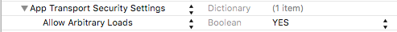
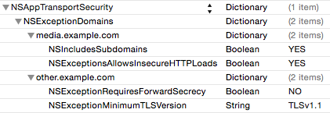

Al igual que hemos visto para Android, en esta sesión veremos cómo acceder a la red desde las aplicaciones iOS.

## Conexión a URLs en iOS

Comenzaremos viendo cómo conectar con URLs desde aplicaciones iOS.

En el API de Cocoa Touch encontramos diferentes objetos para representar las URLs y las conexiones a las mismas. Veremos que se trabaja con estos objetos de forma similar a las librerías para conectar a URLs de Java.

Para crear la conexión, **antes de iOS7** teníamos la clase `NSURLConnection`, que permitía hacer las conexiones de forma síncrona o asíncrona. Sin embargo, la gestión de estas conexiones dejaba bastantes aspectos del código al programador, lo que daba lugar a problemas de seguridad. Para simplificar el código, la mayoría de desarrolladores empezaron a usar clases alternativas de terceros como _AFNetworking_, hasta que Apple decidió añadir una clase integrada en iOS que hiciera algo parecido mejorando así la gestión de las conexiones. Esta clase, que es la que debe usarse siempre en iOS, es `NSURLSession`.

Se puede crear una nueva conexión del siguiente modo:

```objectivec
// Creamos la configuración
NSURLSessionConfiguration *config = [NSURLSessionConfiguration defaultSessionConfiguration];
// Se pueden hacer cambios en la configuración, por ejemplo:
config.allowsCellularAccess = NO;

// Creamos la sesión con esta configuración
NSURLSession *session = [NSURLSession sessionWithConfiguration:config];
```

La configuración de la sesión puede ser de tres tipos:

* `defaultSessionConfiguration`: Usa una caché persistente en disco y guarda las credenciales en el _keychain_. Es la que se suele usar en la mayoría de casos.

* `ephemeralSessionConfiguration`: No se guarda ningún dato en disco. Toda la caché, credenciales y demás datos se guardan en la RAM y se vinculan a la sesión. Cuando la sesión termina, estos datos se eliminan.

* `backgroundSessionConfiguration`: Son similares a las sesiones `default`, pero usan un proceso separado para gestionar todas la transferencia de datos. Se emplea cuando queremos descargar datos mientras la aplicación está suspendida.

Como alternativa, en iOS también podemos usar una sesión _singleton_ que está creada por defecto y que se llama _sharedSession_:

```objectivec
NSURLSession * session = [NSURLSession sharedSession];
```

La sesión compartida puede usarse desde cualquier punto de nuestra aplicación, y es interesante cuando nuestras peticiones son sencillas y no requieren cambios en la configuración, ya que la sesión compartida no puede modificarse.

Una vez tenemos creada la sesión podemos realizar una tarea mediante una petición. Para ello primero tenemos que crear un objeto de la clase `NSURL` que representa una URL, y que se inicializa con la cadena de la URL:

```objectivec
NSURL *theUrl = [NSURL URLWithString:@"http://www.ua.es"];
```

Se puede usar directamente la URL, pero en general es conveniente filtrar la cadena por si ésta tiene caracteres no permitidos:

```objectivec
NSString *url = @"http://www.ua.es";
NSString *encodedUrl = [url stringByAddingPercentEncodingWithAllowedCharacters:
          [NSCharacterSet URLQueryAllowedCharacterSet]];
NSURL *theURL = [NSURL URLWithString:encodedUrl];
```

Para hacer una petición a dicha URL, deberemos crear un objeto `NSURLRequest` a
partir de la URL anterior. De la petición podemos especificar también la política de caché a seguir, o el _timeout_ de la conexión. Si queremos modificar más datos de la petición, deberíamos utilizar un objeto `NSMutableURLRequest`.

```objectivec
NSURLRequest *theRequest = [NSURLRequest requestWithURL: theURL];
```

En nuestra petición podemos añadir valores como el tipo de método (GET,POST,etc.), como veremos en la parte de servicios REST.

Una vez tenemos la petición y la sesión configurada, podemos lanzar la consulta mediante una tarea:

```objectivec
  [[session dataTaskWithRequest:request
   completionHandler:^(NSData *data,
                  NSURLResponse *response,
                  NSError *error)
                  {
                      // La respuesta del servidor se recibe en este punto
                  }] resume];
```

Este método lanza una petición asíncrona y recibe la respuesta del servidor, los datos, y un error si se ha producido algún problema. Además de `dataTaskWithRequest`, podemos usar otro tipos de tareas:

* `dataTaskWithRequest`, `dataTaskWithURL`: Se usan para peticiones puntuales al servidor. `dataTaskWithURL` es similar a `dataTaskWithRequest` pero no necesita una `URLRequest` sino sólo una `NSURL`, y por tanto puede usarse para conexiones sencillas que no requieren cabeceras o configuraciones específicas.

* `downloadTaskWithRequest`, `downloadTaskWithURL`: Descargan datos en forma de fichero y soportan descargas en segundo plano cuando la aplicación no se está ejecutando. Se usan por ejemplo cuando queremos descargar una serie de imágenes y mostrarlas en una tabla.

* `uploadTaskWithRequest`, `uploadTaskWithURL`: Como la anterior, pero para subir ficheros al servidor en lugar de descargarlos.

Vamos a ver un ejemplo completo de código, con una clase propia `Connection` que usaremos para gestionar las conexiones. Esta clase asumirá que la sesión y la petición están ya creadas. Tener esto separado en una clase nos va a permitir que nuestra app pueda crear conexiones desde distintos controladores dejando el código limpio.

`Connection.m`

```objectivec
#import "Connection.h"

@implementation Connection

// Método que se llama cuando se ha producido algún error
-(void)connectionError:(NSString *)message
{
    if (self.delegate != nil && [self.delegate respondsToSelector:@selector(connectionFailed:withError:)])
        [self.delegate connectionFailed:self withError:message];
}

// Método para crear una conexión data una sesión y una petición
-(void)startConnection:(NSURLSession *)session withRequest:(NSURLRequest *)request
{
    [[session dataTaskWithRequest:request
     completionHandler:^(NSData *data,
                    NSURLResponse *response,
                    NSError *error)
    {
                if (!error)
                {
                    NSHTTPURLResponse *httpResponse=(NSHTTPURLResponse *) response;
                    if (httpResponse.statusCode == 200)
                    {
                        dispatch_async(dispatch_get_main_queue(), ^{
                            if (self.delegate!=nil && [self.delegate respondsToSelector:@selector(connectionSucceed:withData:)])
                                [self.delegate connectionSucceed:self withData:data];
                        });
                    }
                    else
                    {
                        dispatch_async(dispatch_get_main_queue(), ^{
                            NSString *errorMessage=[NSString stringWithFormat:@"Received code: %ld",(long)[httpResponse statusCode]];
                            [self connectionError:errorMessage];
                        });
                    }
                }
                else
                {
                    dispatch_async(dispatch_get_main_queue(), ^{
                        NSString *errorMessage=[error localizedDescription];
                        [self connectionError:errorMessage];
                    });
                }

    }] resume];

}

@end
```

`Connection.h`

```objectivec
#import <Foundation/Foundation.h>

@class Connection;

@protocol ConnectionDelegate <NSObject>

- (void)connectionSucceed:(Connection *)connection withData:(NSData *)data;
- (void)connectionFailed:(Connection *)connection withError:(NSString *)errorMessage;

@end

@interface Connection : NSObject <NSURLSessionDelegate>

@property (nonatomic, unsafe_unretained) id<ConnectionDelegate> delegate;

-(void)startConnection:(NSURLSession *)session withRequest:(NSURLRequest *)request;

@end
```

Con esta clase, desde cualquier punto de nuestra aplicación podemos crear una conexión básica. Por  ejemplo:

```objectivec

-(void)createConnection
{
  self.theConnection=[Connection alloc];
  self.theConnection.delegate=self;

  NSString *urlString=@"http://www.apple.com";

  NSURLSessionConfiguration *config = [NSURLSessionConfiguration defaultSessionConfiguration];
  NSURLSession *session = [NSURLSession sessionWithConfiguration:config];

  NSURL *theUrl = [NSURL URLWithString:urlString];
  NSMutableURLRequest *theRequest = [NSMutableURLRequest requestWithURL: theUrl];

  [self.theConnection startConnection:session withRequest:theRequest];
}

// Y tenemos que implementar los métodos delegados:

-(void)connectionSucceed:(Connection *)connection withData:(NSData *)data
{
  // En 'data' tenemos los datos recibidos
}

-(void)connectionFailed:(Connection *)connection withError:(NSString *)error
{
  // En 'error' tenemos el mensaje de error
}

```

Evidentemente en algunos casos esto no es tan sencillo y necesitamos añadir bastante más código para gestionar las conexiones. Si quieres aprendar más sobre `NSURLSession`, puedes consular la referencia de esta clase en: <a href="https://developer.apple.com/library/ios/documentation/Cocoa/Conceptual/URLLoadingSystem/Articles/UsingNSURLSession.html">https://developer.apple.com/library/ios/documentation/Cocoa/Conceptual/URLLoadingSystem/Articles/UsingNSURLSession.html</a>.

### Apple Transport Security

**Muy importante**: Desde iOS9, Apple obliga a adoptar el protocolo ATS (_Apple Transport Security_) para incrementar la seguridad de las conexiones. Debido a esto, por defecto no podemos conectarnos a ninguna web sin usar SSL o TLS, por lo que por ejemplo no podríamos hacer una conexión directa para descargar una imagen de cualquier web, o tampoco podemos acceder a la de la universidad, por ejemplo. Para evitar esto, hay que añadir una excepción a nuestro fichero plist:

```xml
<key>NSAppTransportSecurity</key>  
     <dict>  
          <key>NSAllowsArbitraryLoads</key><true/>  
     </dict>  
```

Desde el visor de plist, se puede añadir del siguiente modo:




Esto sólo es necesario si nuestra aplicación permite la conexión a cualquier servidor y no tenemos control sobre ellos. Si sólo nos conectamos un servidor y este no tiene TLS, podemos añadir una excepción sólo para este mediante `NSExceptionDomains`. Por ejemplo:



También es importante resaltar que a veces es necesario adoptar el protocolo `NSURLSessionDelegate` para usar alguno de sus métodos. En particular, el más habitual es `didReceiveChallenge` para autentificación, como veremos en la parte de REST.

### Indicador de actividad de red

Mientras estamos descargando datos, debemos mostrar el indicador actividad de red en la barra de estado. Esto **no** se hace de forma automática, por lo que debemos añadir la siguiente instrucción:

```objectivec
 [UIApplication sharedApplication].networkActivityIndicatorVisible = YES;
```

Cuando las descargas finalicen, devemos ocultar el indicador asignándole el valor `NO`.

## Comprobación de la conectividad en iOS

En iOS también podemos comprobar el tipo de conexión con el que contamos. De hecho, uno de los ejemplos publicados en la documentación de Apple consiste precisamente en esto.
El ejemplo se llama _Reachability_ (se puede encontrar en la sección _Sample Code_
de la ayuda), y su código se puede utilizar directamente en nuestras aplicaciones. En el caso de iOS la comprobación no es tan sencilla como en Android, y se requiere el acceso a la conexión a bajo nivel. Por este motivo, lo más habitual entre los desarrolladores es incorporar el código del ejemplo _Reachability_.

Lo que necesitaremos incorporar al proyecto son los ficheros `Reachability.m` y `Reachability.h`. Además, también necesitaremos el _framework_ `SystemConfiguration` (deberemos añadirlo en la pantalla _Build Phases_ del _Target_).

```objectivec
internetReach = [Reachability reachabilityForInternetConnection];
[internetReach startNotifier];
if ([internetReach currentReachabilityStatus] == ReachableViaWWAN) {
    // Tenemos conexión a Internet
}

wifiReach = [Reachability reachabilityForLocalWiFi];
[wifiReach startNotifier];
if ([wifiReach currentReachabilityStatus] == ReachableViaWiFi) {
    // Estamos conectados mediante Wi-Fi
}
```

## Carga lazy de imágenes en iOS

En iOS contamos en la documentación con un ejemplo proporcionado por Apple que realiza esta función. Vamos a ver aquí como ejemplo una solución simplificada y bastante menos código. La forma de trabajar será similar a la vista en el caso de Android. En el controlador de nuestra tabla podemos incluir un diccionario que contenga las imágenes que se estén descargando actualmente (equivale al mapa de tareas de descarga que teníamos en Android):

```objectivec
@property (nonatomic,strong) NSMutableDictionary *downloadingImages;
```

Conforme se vayan rellenando las celdas, se solicita la carga de las imágenes que no hayan sido cargadas todavía:

```objectivec
- (UITableViewCell *)tableView:(UITableView *)tableView
         cellForRowAtIndexPath:(NSIndexPath *)indexPath
{
  ...

  // Configure the cell.
  Elemento *theItem = [self.listadoElementos objectAtIndex: indexPath.row];
  cell.textLabel.text = theItem.texto;

  if(theItem.imagen!=nil) {
      cell.imageView.image = theItem.imagen;
  }
  else if(theItem.urlImagen!=nil) {
      [self cargarImagen: theItem paraIndexPath: indexPath];
      cell.imageView.image = [UIImage imageNamed: @"Placeholder.png"];
  }

  return cell;
}
```

En caso de no contar todavía con la imagen, podemos poner una imagen temporal en la celda (en este ejemplo, `Placeholder.png`). La carga de imágenes se puede hacer de la siguiente forma:

```objectivec
- (void) cargarImagen: (Elemento *) item
        paraIndexPath: (NSIndexPath *) indexPath
{
    if ([self.downloadingImages objectForKey: indexPath] == nil)
    {
        UAImageDownloader *theDownloader = [[UAImageDownloader alloc] initWithUrl:item.urlImagen indexPath:indexPath session:self.session delegate:self];
        [self.downloadingImages setObject: theDownloader forKey: indexPath];
    }
}
```

Cada descarga es gestionada por un objeto de la clase `UAImageDownloader`, que se encargará de gestionar la descarga asíncrona de la imagen cuya URL se le pasa en el inicializador, y estos objetos se introducen en el diccionario de descargas en progreso. Utilizamos el patrón delegado para que, una vez se haya finalizado la descarga, se nos proporcione la imagen obtenida. Definimos el protocolo para el delegado junto a la clase
`UAImageDownloader`:

```objectivec
@class UAImageDownloader;

@protocol UAImageDownloaderDelegate

- (void) imageDownloader: (UAImageDownloader *) downloader
   didFinishDownloadingImage: (UIImage *) image
                forIndexPath: (NSIndexPath *) indexPath;

-(void) imageDownloader:(UAImageDownloader *)downloader
   didFailDownloadingImage: (NSString *)url
                forIndexPath : (NSIndexPath *)indexPath;

@end

@interface UAImageDownloader : NSObject <NSURLSessionDelegate>

- (id)initWithUrl: (NSString *) url
        indexPath: (NSIndexPath *)indexPath
          session: (NSURLSession *)session
         delegate: (id<UAImageDownloaderDelegate>) delegate;

@property(nonatomic,strong) NSString *url;
@property(nonatomic,strong) UIImage *image;

@property(nonatomic,unsafe_unretained) id<UAImageDownloaderDelegate> delegate;

@end
```


Podemos implementar esta clase de la siguiente forma:

```objectivec
@implementation UAImageDownloader

- (id)initWithUrl: (NSString *) url
        indexPath: (NSIndexPath *)indexPath
          session: (NSURLSession *)session
         delegate: (id<UAImageDownloaderDelegate>) delegate
{
    self = [super init];

    if (self)
    {
        self.url = url;
        self.delegate = delegate;

        NSString *encodedUrl = [url stringByAddingPercentEncodingWithAllowedCharacters:[NSCharacterSet URLQueryAllowedCharacterSet]];
        NSURL *imageURL = [NSURL URLWithString:encodedUrl];

        NSURLSessionDownloadTask *downloadPhotoTask =
            [session downloadTaskWithURL:imageURL
                       completionHandler:^(NSURL *location, NSURLResponse *response, NSError *error)
        {
            NSHTTPURLResponse *httpResponse=(NSHTTPURLResponse *) response;
            if (httpResponse.statusCode == 200)
            {
                if (!error)
                {
                        UIImage *downloadedImage = [UIImage imageWithData:[NSData dataWithContentsOfURL:location]];

                        dispatch_async(dispatch_get_main_queue(), ^{
                            [self.delegate imageDownloader:self didFinishDownloadingImage:downloadedImage forIndexPath:indexPath];
                    });
                }
                else
                {
                    NSLog(@"Image %@ not found", imageURL);
                    [self.delegate imageDownloader:self didFailDownloadingImage:url forIndexPath:indexPath];
                }
            }
            else
            {
                NSLog(@"Received code %ld for url %@",(long)httpResponse.statusCode,imageURL);
                [self.delegate imageDownloader:self didFailDownloadingImage:url forIndexPath:indexPath];
            }
        }];

        [downloadPhotoTask resume];
    }

    return self;
}

@end
```


La carga de la imagen se realiza de la misma forma que hemos visto anteriormente para descargar contenido de una URL, pero usando `downloadTaskWithURL` en lugar de `dataTaskWithRequest`, ya que en realidad vamos a descargar ficheros que contienen imágenes. Una  vez finalizada la descarga se notifica al delegado. Utilizaremos el controlador de la tabla como delegado, que responderá de la siguiente forma cuando una imagen haya sido descargada:

```objectivec
- (void) imageDownloader:(UAImageDownloader *)downloader
      didFinishDownloadingImage:(UIImage *)image
                   forIndexPath:(NSIndexPath *)indexPath
{
    Elemento *theItem = [self.listadoElementos objectAtIndex: indexPath.row];
    theItem.imagen = image;

    UITableViewCell *cell = [self.tableView cellForRowAtIndexPath: indexPath];
    cell.imageView.image = image;
}

-(void)imageDownloader:(UAImageDownloader *)downloader
     didFailDownloadingImage: (NSString *)url
                forIndexPath: (NSIndexPath *)indexPath
{
    Elemento *theItem = [self.listadoElementos objectAtIndex: indexPath.row];
    theItem.image=[UIImage imageNamed:@"not-found.png"];

    UITableViewCell *cell = [self.tableView cellForRowAtIndexPath: indexPath];
    cell.imageView.image = theItem.image;
}

```

Al recibir la imagen descargada la almacena en el item correspondiente, y la muestra en la tabla. Si no se puede descargar la imagen, entonces se invoca el método `didFailDownloadingImage` para poner una imagen vacía (llamada `not_found.png`) en la celda.

Tal como hemos visto en el caso de Android, podemos evitar que se descarguen las imágenes mientras se está haciendo _scroll_ con un código como el siguiente:

```objectivec
- (UITableViewCell *)tableView:(UITableView *)tableView cellForRowAtIndexPath:(NSIndexPath *)indexPath
{
  ...
  // Configure the cell.
  Elemento *theItem = [self.listadoElementos objectAtIndex: indexPath.row];
  cell.textLabel.text = theItem.texto;

  if(theItem.imagen!=nil) {
    cell.imageView.image = theItem.imagen;
  }
  else if(theItem.urlImagen!=nil) {
    if (self.tableView.dragging == NO && self.tableView.decelerating == NO) {
      [self cargarImagen: theItem paraIndexPath: indexPath];
    }
    cell.imageView.image = [UIImage imageNamed: @"Placeholder.png"];
  }

  return cell;
}
```

Como podemos observar, impedimos la carga tanto si el usuario está arrastrando la lista, como si el _scroll_ se está realizando por la inercia de un movimiento anterior. Cuando el scroll pare deberemos hacer que carguen las imágenes de todas las celdas visibles en pantalla. Para ello deberemos implementar los siguientes métodos del protocolo `UIScrollViewDelegate`:

```objectivec

- (void)scrollViewDidEndDragging:(UIScrollView *)scrollView willDecelerate:(BOOL)decelerate
{
    if (!decelerate)
        [self cargarImagenesEnPantalla];
}

- (void)scrollViewDidEndDecelerating:(UIScrollView *)scrollView
{
    [self cargarImagenesEnPantalla];
}

- (void)cargarImagenesEnPantalla
{
    if ([self.listadoElementos count] > 0)
    {
        NSArray *visiblePaths = [self.tableView indexPathsForVisibleRows];
        for (NSIndexPath *indexPath in visiblePaths) {
            Elemento *theItem = [self.listadoElementos objectAtIndex:indexPath.row];

            if (!theItem.imagen)
                [self cargarImagen: theItem paraIndexPath: indexPath];
        }
    }
}
```

Si queremos evitar que las imágenes de una tabla puedan acabar con la memoria disponible (aunque esto es poco probable) tenemos implementar el método `didReceiveMemoryWarning`. En él deberíamos detener las descargas pendientes, y liberar de memoria las imágenes que no sean necesarias. En este caso la liberación de los objetos la deberemos implementar manualmente nosotros.

Hemos visto que en ambos casos utilizamos un mapa o diccionario para almacenar todas las descargas que ya se han iniciado, y así evitar que se repita una descarga para la misma entrada de la tabla. Hemos utilizado la entrada de la tabla para indexar este mapa o diccionario. Sin embargo, en algunos casos podría ocurrir que existan múltiples entradas con la misma imagen (por ejemplo varios _tweets_ de una misma persona). Si es probable que distintas entradas tengan la misma imagen, sería recomendable utilizar la propia URL de la imagen para indexar el mapa o diccionario de descargas.

# Ejercicios de acceso a la red en iOS

## Visor de HTML (1.5 puntos)

Vamos a hacer una aplicación que nos permita visualizar el código HTML de la URL que indiquemos. En las plantillas de la sesión encontramos el proyecto `LectorHtml` que podemos utilizar como base. Este proyecto contiene una pantalla con un cuadro de edición texto para introducir la URL, un botón para cargar la URL, y un visor de texto donde deberemos mostrar los resultados obtenidos cuando se pulse el botón. Se pide:

_a)_ Implementar el código necesario para que cuando se pulse el botón se realice una conexión a la URL indicada, se obtenga el resultado como texto, y se muestre en el visor de texto. Para ello puedes añadir la clase `Connection` que hemos visto anteriormente.

> Ayuda: Trabajaremos con la clase `UAViewController`. Concretamente la conexión deberá ser iniciada en el método `conectarUrl`.

_b)_ Desactivar ATS en el fichero info.plist para poder conectarnos a cualquier servidor.

_c)_ Mostrar en la barra de estado un indicador de actividad de red mientras se descarga el HTML. Haz también que el botón se deshabilite mientras dura la descarga.

## Carga de imágenes (1.5 puntos)

Vamos a implementar una aplicación que nos permita visualizar una lista de imágenes de carátulas de películas, y que al pulsar sobre cada una de ellas nos aparezca la información de la película.

Se proporciona una plantilla `Pelis` que utilizaremos como base. En esta sesión no usaremos servicios REST, ya que esto lo haremos en la siguiente. Todos los datos de las películas estarán almacenados en nuestro programa, y sólo accederemos a la red para descargar las imágenes del servidor.

<!-- Primero debemos implementar la carga (**no lazy**) de las imágenes en la vista detalle, y en la parte final haremos la carga lazy en la vista maestra. Cuando se abra una vista detalle, tendremos que cargar la imagen correspondiente, mostrando la carátula en el `ImageView` destinado a tal fin. Puedes usar la clase UAImageDownloader con `indexPath:nil`. No olvides mostrar y ocultar el indicador de actividad de red.

> Ayuda: Trabajaremos con la clase `DetailViewController`, en su método `configureView` deberemos inicializar la conexión para obtener la imagen.

Cuando hayas terminado la carga de la imagen en la vista detalle, carga las imágenes conforme visualizamos el listado de películas en la vista maestra, y no sólo al entrar en los detalles de cada una de ellas.
-->

Primero actualizaremos las imágenes de la tabla de forma _lazy_, es decir, cargándolas conforme se solicita que se muestren las celdas en pantalla. Esta carga deberá hacerse en segundo plano.

 <!--Recuerda mostrar el indicador de actividad de la red cuando se estén descargando las imágenes. -->

Cuando lo tengas implementado, es posible que al pinchar sobre una imagen y volver, se descoloque en la celda. Para evitar esto, añade la instrucción ``[cell layoutSubviews];`` cuando actualices la imagen de la celda.

Una vez implementada la carga lazy, puedes asignar la imagen correspondiente en la vista detalle para que se muestre cuando se pulse sobre ella en la tabla maestra.

<!-- Puedes comentar el código para hacer la conexión en el método `configureView` de `DetailViewController`, y en su lugar asignar la imagen correspondiente.-->

Implementa la funcionalidad para no descargar las imágenes mientras se hace _scroll_.

<!--También debes permitir que se eliminen todas las imágenes en condiciones de baja memoria.-->

<!--
* Guardar las imágenes de forma persistente en el directorio de caché (se puede utilizar la URL como nombre de los ficheros).
*
-->
