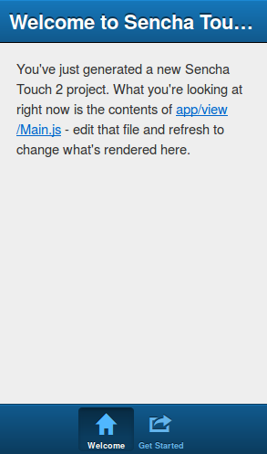
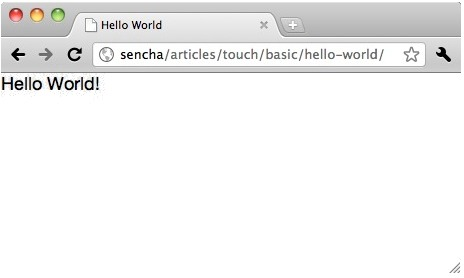
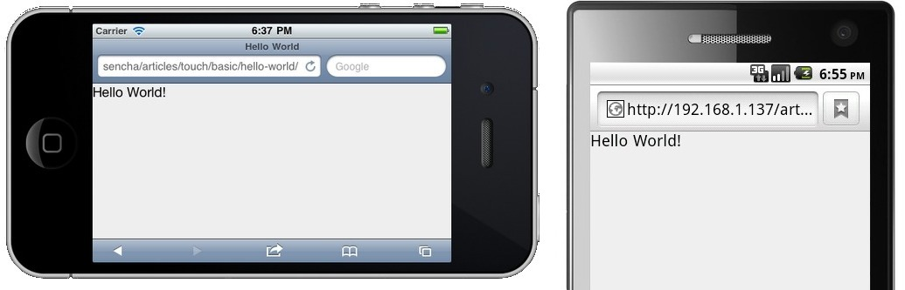
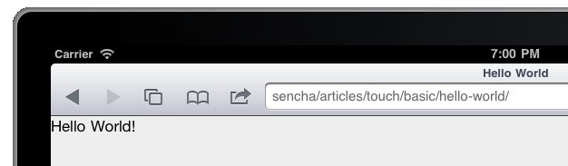
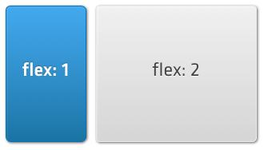
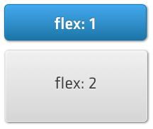
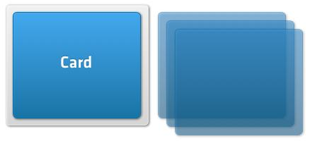

<!-- ********************************************************************* -->
## Crear nuestra primera aplicación

Una vez instalado Sencha Touch y Sencha Cmd ya podemos crear nuestra primera aplicación. Para ello crearemos una nueva carpeta para la aplicación y entraremos en ella:

```bash
mkdir myapp
cd myapp
```

Y a continuación ejecutaremos el comando:

```bash
sencha -sdk /path/to/touch generate app MyApp .
```

Esto generará el esqueleto de una nueva aplicación de Sencha Touch en el directorio actual, con todas los ficheros que vamos a necesitar incluyendo un documento `index.html` inicial, una copia del SDK de Sencha Touch, las hojas de estilo, imágenes y ficheros de configuración.

Una vez creada la aplicación podemos comprobar que funcione correctamente de varias formas:

* Abriendo directamente el fichero `index.html`, la mayoría de aplicaciones básicas las podremos probar de esta forma.
* Copiando nuestro proyecto a un servidor web y accediendo al proyecto a través de la dirección: http://localhost/MyApp
* Usando el servidor Web que proporciona el Cmd de Sencha. Para activarlo tenemos que ir a la carpeta de nuestra aplicación y en un terminal ejecutar `sencha web start &`. Para acceder en este caso tendremos que usar la ruta: `http://localhost:1841/`



Sencha Touch solo funciona con navegadores basados en WebKit, como son: Safari, Google Chrome, Epiphany, Maxthon o Midori. Si lo probamos en un navegador que no lo soporte, como Firefox o Internet Explorer, solamente veremos una página en blanco o un resultado erróneo. Por lo tanto para probar nuestros proyectos Web tendremos que instalar uno de los navegadores soportados, como Google Chrome (<a href="http://www.google.es/chrome">http://www.google.es/chrome</a>) o Apple Safari (<a href="http://www.apple.com/es/safari/">http://www.apple.com/es/safari/</a>).

Aunque la mayoría de webs que podemos hacer con Sencha Touch se podrían ejecutar y visualizar directamente sin necesidad de un servidor Web, sí que será necesario su uso si queremos probar nuestros proyectos utilizando algún emulador o un dispositivo móvil real.

En la sección inicial de "Instalación de un servidor Web" se puede encontrar información sobre la instalación de un emulador móvil o la configuración para el acceso externo mediante un dispositivo móvil real.


<!-- ********************************************************************* -->
## Estructura de carpetas

Las carpetas y ficheros principales que se generan con un nuevo proyecto son:

* _app_ - En este directorio es donde se almacenan las vistas, modelos, controladores y stores para la aplicación.
* _app.js_ - Es el principal script o punto de entrada de nuestra aplicación, el cual ejecutará el código inicial.
* _app.json_ - Es el fichero de configuración de nuestra aplicación.
* _index.html_ - Fichero HTML principal de la aplicación, el cual se abrirá al iniciarla.
* _packager.json_ - Fichero de configuración utilizado por Sencha Cmd para la generación de paquetes nativos de la aplicación.
* _resources_ - Contiene todos los recursos o assets de la aplicación, como los CSS, imágenes, etc.

El fichero _index.html_ es el primero que se abrirá al iniciar la aplicación. Este fichero únicamente contendrá la carga de javascripts y estilos y después le pasará el control al fichero _app.js_, el cual será el punto de entrada a la aplicación y donde irá todo el código de Sencha Touch.


<!-- ********************************************************************* -->
## Código HTML básico de una aplicación

Las aplicaciones de Sencha Touch se crean como un documento HTML5 que contiene referencias a los recursos de JavaScript y CSS. Nuestro fichero `index.html` debe de contener como mínimo el siguiente código:

```html
<!DOCTYPE HTML>
<html manifest="" lang="en-US">
<head>
    <meta charset="UTF-8">
    <title>Mi aplicación</title>
    <script id="microloader" type="text/javascript" src=".sencha/app/microloader/development.js"></script>
</head>
<body>
</body>
</html>
```

A continuación analizaremos por separado cada una de las partes de este código:


```html
<!DOCTYPE HTML>
<html manifest="" lang="en-US">
  ...
</html>
```

La primera línea nos indica que este es un documento del tipo HTML5. Las etiquetas de `<html>` y `</html>` indican el inicio y final del documento HTML y deben de contener en su interior todo el resto del código.


```html
<head>
  <meta charset="UTF-8">
  <title>Mi aplicación</title>
  ...
</head>
<body>
</body>
```

Todo documento HTML (y HTML5 también) debe de contener primero una sección de cabecera (`<head>`) y a continuación una sección con el contenido principal o cuerpo del documento (`<body>`). En este caso el cuerpo del documento (`<body>`) se encuentra vacío. Esto se debe a que la librería Sencha Touch crea todo el contenido de la Web, incluidos todos los elementos de la interfaz, mediante código JavaScript.

La cabecera del documento (`<head>`) debe de contener como mínimo los metadatos acerca del tipo de contenido, el conjunto de caracteres usados, y un título que mostrará el navegador en la parte superior de la ventana. Además debe de contener un enlace a la librería de javascript de carga de Sencha Touch:

```html
<script id="microloader" type="text/javascript" src=".sencha/app/microloader/development.js"></script>
```

La etiqueta `<script></script>` se utiliza para cargar código JavaScript en nuestra página Web. En este caso se carga únicamente el fichero `development.js`, el cual se encarga de cargar todo lo necesario para iniciar nuestra aplicación: ficheros con hojas de estilo, librerías de Sencha Touch de JavaScript y el fichero `app.js` con el código de nuestra aplicación.

El fichero `development.js` comprueba el dispositivo y navegador en el que se ha cargado la aplicación y configura las hojas de estilo, javascripts y otros parámetros para que la aplicación se adapte lo mejor posible al mismo.

Este fichero se utiliza para entornos de desarrollo, pero para producción o testing tendremos que compilar la aplicación mediante Sencha Cmd o generar nuestra propia compilación. En futuras secciones se tratará más en profundidad este tema.

Ahora ya tenemos cargadas las librerías de Sencha Touch y el código de nuestra aplicación para empezar a trabajar. De momento, si lo visualizamos en un navegador solo veremos una página en blanco ya que el código de nuestra aplicación (`app.js`) de momento está vacío.


<!-- ********************************************************************* -->
## Compilar un proyecto

Al crear un nuevo proyecto este viene preparado para un entorno de desarrollo, por lo que si queremos obtener la versión final de producción con el código optimizado para su utilización tendremos que ejecutar (dentro de la carpeta del proyecto):

```bash
sencha app build production
```

Este comando creará una versión de producción de nuestro proyecto y la colocará en la carpeta `build/production/<nombre-app>`. Como esta carpeta también estará en el servidor para probarla podremos acceder a la dirección: `http://localhost/<nombre-app>/production/<nombre-app>`. Para más información sobre este proceso podéis consultar las direcciones:

http://docs.sencha.com/touch/2.4/getting_started/using_creating_builds.html

http://www.sencha.com/blog/getting-started-with-sencha-touch-2-build-a-weather-utility-app-part-3/


<!-- ********************************************************************* -->
## Mostrar aviso durante la carga

Mientras que se carga la librería de Sencha Touch podemos mostrar fácilmente un texto o una imagen. Para esto podemos aprovechar el cuerpo del documento (`<body>`) que hasta ahora se encontraba vacío. Todo lo que incluyamos en esta sección se visualizará únicamente durante la carga, posteriormente será ocultado por el contenido de la aplicación. En el siguiente ejemplo se ha creado un cuadro centrado en el que aparece el texto "Cargando Aplicación...".

```html
<body>
	<div style="margin:100px auto 0 auto; width:220px; font-size:16pt;">
		Cargando aplicación...
	</div>
</body>
```


<!-- ********************************************************************* -->
## Instanciar una aplicación

Para realizar nuestro primer ejemplo vamos a crear una aplicación que muestre en pantalla el mensaje "¡Hola Mundo!", para lo cual abriremos el fichero `app.js` y añadiremos el siguiente código:

```javascript
Ext.application({
    name: 'MyApp',
    launch: function() {
        Ext.create("Ext.Panel", {
            fullscreen: true,
            html: '¡Hola Mundo!'
        });
    }
});
```

A continuación analizaremos por separado cada una de las partes de este código:

```javascript
Ext.application({
    name: 'MyApp',
    launch: function() {
        ...
    }
});
```

Con `Ext.application({ ... });` creamos una nueva instancia de Sencha Touch, es decir, este es el constructor de nuestra aplicación. Entre las llaves `{}` le pasaremos la lista de opciones de configuración para crear nuestra aplicación. En primer lugar le damos un nombre `name: 'MyApp'`, con esto automáticamente se crea una variable global llamada `MyApp` junto con los siguientes _namespaces_:

* _MyApp_
* _MyApp.views_
* _MyApp.controllers_
* _MyApp.models_
* _MyApp.stores_

Estos _namespaces_ (o espacios de nombres) nos permitirán acceder a atributos de nuestra aplicación de forma sencilla, los iremos viendo en detalle más adelante.

> El nombre de la aplicación (`name: 'MyApp'`) no debe contener espacios y deberá estar formado únicamente por letras mayúsculas y minúsculas, números y algunos símbolos permitidos en la definición de variables en JavaScript.

La función `launch: function() { ... }` solo se ejecuta una vez al cargar la aplicación, y es donde deberemos de colocar el código necesario para definir y cargar nuestra aplicación. En el ejemplo propuesto creamos un panel usando el siguiente código:

```javascript
Ext.create("Ext.Panel", {
    fullscreen: true,
    html: '¡Hola Mundo!'
});
```

Con `Ext.create("Ext.Panel", { ... });` instanciamos un panel para nuestro contenido y se lo asignamos al _viewport_ de nuestra aplicación. El _viewport_ es la vista principal de la aplicación, dentro de la cual iremos añadiendo todo el contenido.

Entre las llaves `{}` le pasaremos la lista de opciones de configuración que definirán el panel. Con la instrucción `fullscreen: true` le indicamos que debe ocupar toda la pantalla y con `html: 'Hola Mundo!'` el código HTML que tiene que contener.

Con esto ya hemos creado nuestra primera aplicación, un panel que ocupa toda la pantalla con el texto "¡Hola Mundo!".

> Si queremos podemos definir la función `launch` como una función independiente. Dentro del código del panel simplemente tendremos que poner el nombre de la función a llamar, por ejemplo: `launch: iniciarAplicacion` (sin poner los paréntesis de función). Y luego de forma independiente definiríamos la función `function iniciarAplicacion() { ... }` con el resto del código. Esta es una buena práctica para modularizar nuestro código.


<!-- ********************************************************************* -->
## Comprobando los resultados

Para comprobar el resultado de nuestra aplicación podemos abrirla en un navegador compatible con WebKit, como Chrome o Safari. Si abrimos el ejemplo de la sección anterior deberíamos obtener algo como:



Recordad que además del acceso directo se puede acceder usando un servidor web (en general será preferible esta 2ª opción ya que en muchas ocasiones el acceso directo puede dar problemas de permisos o de _cross origin request_). Para el servidor tenemos dos alternativas:

* Usar un servidor web propio instalado en nuestro sistema operativo, copiar nuestro proyecto dentro de la carpeta pública del servidor y acceder a través de la dirección: http://localhost/MyApp
* Usar el servidor Web que proporciona Sencha Cmd. Para activarlo tenemos que ir a la carpeta de nuestra aplicación y en un terminal ejecutar `sencha web start &`. Para acceder en este caso utilizaremos la ruta: `http://localhost:1841/`

Al usar un servidor también podemos comprobar el resultado utilizando un emulador de móvil, como en las imágenes inferiores:





Estos emuladores son parte del IDE de Xcode y del SDK de Android. Para poder utilizarlos necesitaremos tener instalados los SDKs además de tener el código en un servidor Web. Para más información consultar la sección inicial "Instalación de un servidor Web" y "Emuladores".

Para depurar nuestras aplicaciones, además de las herramientas para el desarrollador que incorpora el navegador podemos instalar la siguiente extensión especial para Sencha:

https://chrome.google.com/webstore/detail/app-inspector-for-sencha/pbeapidedgdpniokbedbfbaacglkceae?hl=en


<!-- ********************************************************************* -->
## Todo en un único fichero vs. MVC (patrón Modelo, Vista, Controlador)

Para facilitar la creación de aplicaciones y proporcionar a la vez una estructura de contenidos sencilla pero potente, Sencha Touch utiliza el patrón de diseño MVC (Modelo Vista Controlador).

Siguiendo este patrón una aplicación se conforma por una lista de Modelos, Vistas, Controladores, Stores (o Almacenes) y Profiles (o Perfiles), además de una serie de metadatos como el icono, imágenes, etc.


Sin embargo para aplicaciones pequeñas y sencillas no es necesario realizar esta separación del código y se puede escribir todo en un único fichero. Por lo tanto Sencha Touch permite ambos sistemas.

En este curso de introducción no vamos a tratar el modelo MVC, pero todos los conceptos y herramientas que vamos a ver sirven también para el patrón MVC.

Para más información podéis consultar la siguiente dirección:

http://docs.sencha.com/touch/2.4/core_concepts/about_applications.html


<!-- ********************************************************************* -->
## Componentes y contenedores


<!-- ********************************* -->
### Qué es un componente

La mayoría de las clases visuales de Sencha Touch son componentes que heredan de `Ext.Component` lo que les da una serie de propiedades:

* Mostrar y ocultarse en cualquier momento.
* Habilitarse y deshabilitarse.
* Centrarse en la pantalla.
* Flotar sobre otros componentes.
* Acoplar y alinear otros componentes dentro del propio componente.
* Acoplarse a otros componentes.


<!-- ********************************* -->
### Qué es un contenedor

Las aplicaciones se forma mediante multitud de componentes, normalmente anidados unos dentro de otros. Los contenedores son un tipo de componente especial que permite agrupar y organizar otros componentes dentro de si mismo. La mayoría de las aplicaciones tendrán un único contenedor (el _viewport_) que ocupará toda la pantalla, el cual contendrá una serie de componentes hijos. Por ejemplo en una aplicación de correo el contenedor del _viewport_ contendrá dos componentes principales, uno para la lista de mensajes y otro para la previsualización de los correos.

Los contenedores proporcionan además la siguiente funcionalidad:
* Añadir componentes hijos e instanciarlos en tiempo de ejecución.
* Eliminar componentes hijos.
* Especificar un tipo de _layout_.


Los _layouts_ determinan la disposición de los componentes hijos dentro del contenedor. En la aplicación del ejemplo de correo podríamos utilizar un _layout_ horizontal del tipo _HBox_ para indicar que la lista se sitúe en la parte izquierda y el panel de previsualización a la derecha ocupando el resto del espacio.


<!-- ********************************* -->
### Instanciar componentes

Los componentes se crean igual que el resto de clases en Sencha Touch, utilizando el método `Ext.create`. A continuación se incluye un ejemplo:

```javascript
var panel = Ext.create('Ext.Panel', {
    html: 'Esto es un panel'
});
```

Este trozo de código crea una instancia de un panel, le asigna un contenido HTML básico y lo almacena en la variable `panel`. Un Panel es un tipo de componente que puede contener HTML u otros items o paneles.

En el código de ejemplo simplemente se instancia el panel pero sin llegar a mostrarse, esto es porque al instanciar un elemento no se renderiza (no se hace visible) en la pantalla de forma automática. Esta característica nos permite crear componentes cuando queramos y mostrarlos cuando nos hagan falta, lo cual en general será más rápido que instanciarlos y mostrarlos inmediatamente.

Si queremos mostrar el panel que hemos creado simplemente tendríamos que añadirlo al _viewport_ de la aplicación, de la forma:

```javascript
Ext.Viewport.add(panel);
```


<!-- ********************************* -->
### Configuración de un componente

Al crear un componente le podemos pasar un objecto con las opciones para configurarlo. Este objecto lo podemos crear directamente en la propia declaración del componente englobando las opciones entres llaves `{}` e indicando las opciones de configuración como pares de clave - valor. Por ejemplo:

```javascript
// Crear la aplicación con sus opciones de configuración
Ext.application({
    name : 'MiApp',
    launch : function() { ; }
});

// Crear un panel y pasarle opciones de configuración
 var panel = Ext.create('Ext.Panel', {
    fullscreen: true,
    html: 'Esto es un panel!'
});
```

Cada componente tiene multitud de opciones de configuración, las cuales las podemos consultar en la documentación de Sencha Touch.

Al instanciar el objeto podemos pasarle tantas opciones de configuración como queramos, las cuales las podremos consultar después o modificar, por ejemplo:


```javascript
Ext.application({
    name : 'MiApp',
    requires: ['Ext.MessageBox'],
    launch : function() {
        // Crear un panel y pasarle opciones de configuración
        var panel = Ext.create('Ext.Panel', {
            fullscreen: true,
            html: 'Esto es un panel!'
        });

        // Actualizar el HTML del panel
        panel.setHtml('Nuevo HTML!');

        // Obtener el HTML del panel y mostrarlo
        Ext.Msg.alert(panel.getHtml());
}});
```

Cada opción de configuración tiene sus métodos tipo _getter_ y _setter_, se generan automáticamente a partir del nombre del atributo por lo que siempre siguen el mismo patrón. Por ejemplo, la opción de configuración `html` tiene los métodos `getHtml` y `setHtml`, o por ejemplo la opción de configuración `defaultType` tiene los métodos `getDefaultType` y `setDefaultType`.


<!-- ********************************* -->
### Array de _items_ y el atributo _xtype_

Algunos componentes incluyen la propiedad "_items_", la cual permite especificar un array de elementos. Por ejemplo, en un panel nos permitirá indicar los elementos que este contiene o en un grupo de botones los botones a agrupar.

Si los elementos han sido creados previamente podemos usar su nombre de variable para añadirlos de la forma:

```javascript
items: [elemento]
items: [elemento1, elemento2]
```

Pero Sencha Touch también incluye la posibilidad de crear estos elementos en línea, lo cual será mucho más rápido y nos ahorrará código. Para ello tendremos que especificar directamente las opciones del objeto a crear entre llaves `{}`, de la forma:

```javascript
items: [{...}, {...}]
// O si solo queremos crear un elemento:
items: {}
```

Al crear un elemento en línea, además de especificar el resto de sus propiedades, también tendremos que definir su tipo _xtype_ (o tipo de objeto), de la forma:

```javascript
items: { xtype: 'toolbar', docked: 'top' }
```

El atributo _xtype_ facilita la creación de componentes y sin la necesidad de utilizar su nombre de clase completo. Es especialmente útil para crear componentes dentro de una clase contenedora. A continuación se muestra un ejemplo más completo de uso:

```javascript
Ext.application({
    name : 'MiApp',
    launch : function() {
        Ext.create('Ext.Container', {
            fullscreen: true,
            layout: 'fit',
            items: [
                {
                    xtype: 'panel',
                    html: 'Este panel se ha creado mediante xtype'
                },
                {
                    xtype: 'toolbar',
                    title: 'Mi App',
                    docked: 'top'
                }
            ]
        });
}});
```


<!-- ********************************* -->
### Listado de todos los _xtypes_ disponibles

A continuación se incluye un listado de todos los _xtypes_ disponibles en Sencha Touch:

**Componentes generales:**

| xtype | Class |
| -- | -- |
| actionsheet             | Ext.ActionSheet |
| audio                   | Ext.Audio |
| button                  | Ext.Button |
| component               | Ext.Component |
| container               | Ext.Container |
| image                   | Ext.Img |
| label                   | Ext.Label |
| loadmask                | Ext.LoadMask |
| map                     | Ext.Map |
| mask                    | Ext.Mask |
| media                   | Ext.Media |
| panel                   | Ext.Panel |
| segmentedbutton         | Ext.SegmentedButton |
| sheet                   | Ext.Sheet |
| spacer                  | Ext.Spacer |
| title                   | Ext.Title |
| titlebar                | Ext.TitleBar
| toolbar                 | Ext.Toolbar |
| video                   | Ext.Video |
| carousel                | Ext.carousel.Carousel |
| carouselindicator       | Ext.carousel.Indicator |
| navigationview          | Ext.navigation.View |
| datepicker              | Ext.picker.Date |
| picker                  | Ext.picker.Picker |
| pickerslot              | Ext.picker.Slot |
| slider                  | Ext.slider.Slider |
| thumb                   | Ext.slider.Thumb |
| tabbar                  | Ext.tab.Bar |
| tabpanel                | Ext.tab.Panel |
| tab                     | Ext.tab.Tab |
| viewport                | Ext.viewport.Default |


**Componentes tipo _DataView_:**

| xtype | Class |
| -- | -- |
| dataview                | Ext.dataview.DataView |
| list                    | Ext.dataview.List |
| listitemheader          | Ext.dataview.ListItemHeader |
| nestedlist              | Ext.dataview.NestedList |
| dataitem                | Ext.dataview.component.DataItem |


**Componentes para formulario:**

| xtype | Class |
| -- | -- |
| checkboxfield           | Ext.field.Checkbox |
| datepickerfield         | Ext.field.DatePicker |
| emailfield              | Ext.field.Email |
| field                   | Ext.field.Field |
| hiddenfield             | Ext.field.Hidden |
| input                   | Ext.field.Input |
| numberfield             | Ext.field.Number |
| passwordfield           | Ext.field.Password |
| radiofield              | Ext.field.Radio |
| searchfield             | Ext.field.Search |
| selectfield             | Ext.field.Select |
| sliderfield             | Ext.field.Slider |
| spinnerfield            | Ext.field.Spinner |
| textfield               | Ext.field.Text |
| textareafield           | Ext.field.TextArea |
| textareainput           | Ext.field.TextAreaInput |
| togglefield             | Ext.field.Toggle |
| urlfield                | Ext.field.Url |
| fieldset                | Ext.form.FieldSet |
| formpanel               | Ext.form.Panel |


<!-- ********************************* -->
### Añadir componentes a contenedores

Una vez creado un panel o contenedor también podemos añadirle más elementos en tiempo de ejecución mediante su método `add`. En el siguiente ejemplo se crea un panel que contiene un único panel y posteriormente se le añade otro panel de forma dinámica:


```javascript
Ext.application({
    name : 'MiApp',
    launch : function() {
        var secondPanel = Ext.create('Ext.Panel', {
            html: 'Segundo panel'
        });

        // Este sería el panel principal
        var mainPanel = Ext.create('Ext.Panel', {
            fullscreen: true,
            layout: 'hbox',
            defaults: {
                flex: 1
            },
            items: {
                html: 'Primer panel',
                style: 'background-color: #5E99CC;'
            }
        });

        // Añadimos otro panel al contenedor principal
        mainPanel.add(secondPanel);
}});
```

En este caso le asignamos el layout _hbox_ al panel principal contenedor para que los paneles hijos se vayan añadiendo de forma horizontal. Además se utilizan un par de propiedades nuevas: `style`, la cual nos permite escribir código CSS para aplicar estilos a un componente y `defaults`, que nos permite establecer valores por defecto que se aplicarán a todos los componentes que contenta. En este caso al primer panel se le asignará un `flex` de 1, por lo que ocupará todo el ancho, pero al añadir el segundo panel también se le asignará un `flex` de 1 por lo que el ancho se repartirá y cada panel ocupará la mitad del espacio disponible (en la sección de _layouts_ se tratará este tema más en profundidad).


<!-- ********************************* -->
### Eliminar componentes

Para eliminar elementos de un contenedor utilizamos su método `remove` y la variable que define el item. Por ejemplo para eliminar el panel que hemos añadido en el ejemplo anterior tendríamos que hacer:

```javascript
mainPanel.remove(secondPanel);
```

> Este método elimina el componente del contenedor, no lo destruye ni libera la memoria ni los eventos asociados.


<!-- ********************************* -->
### Mostrar y ocultar componentes

Los elementos también se pueden mostrar u ocultar simplemente llamando a sus métodos `hide()` o `show()`. Continuando con el ejemplo anterior, para mostrar u ocultar el panel principal haríamos:

```javascript
mainPanel.show();

mainPanel.hide();
```


<!-- ********************************* -->
### Eventos

Todos los componentes de Sencha Touch lanzan eventos ante determinados cambios, estos eventos pueden ser escuchados y realizar una acción cuando son activados. Por ejemplo, al escribir en un campo de texto este lanza su evento `change`, por lo que podríamos escuchar a dicho evento usando un _listener_ como se muestra en el siguiente ejemplo:

```javascript
Ext.create('Ext.form.Text', {
    label: 'Name',
    listeners: {
        change: function(field, newValue, oldValue) {
            // El contenido ha cambiado
        }
    }
});
```

Los componentes de Sencha Touch lanzan multitud de eventos facilitando el control de la aplicación y la programación por eventos. A estos eventos nos podemos suscribir también de forma dinámica una vez que el componente se ha creado. En la documentación de cada clase se puede encontrar un listado con los eventos que lanza y como podemos utilizarlos.


<!-- ********************************* -->
### Destruir componentes

Cuando no se va a necesitar más un elemento se recomienda eliminarlo completamente para ahorrar memoria. Hemos de tener en cuenta que en los dispositivos móviles la memoria es un recurso escaso y si nuestra aplicación es muy grande puede llegar a ralentizar el móvil. Por este motivo se ha introducido el método `destroy` que elimina el componente que lo llame:

```javascript
mainPanel.destroy();
```

Este comando eliminaría el _mainPanel_ del DOM y además eliminaría todos los _listeners_ que estuvieran escuchando a sus eventos. Hemos de tener cuidado ya que también se eliminará todo el contenido del elemento, por ejemplo si es un contenedor se eliminarían sus paneles hijos.


<!-- ********************************************************************* -->
## _Layouts_

Los _layouts_ se utilizan para especificar las dimensiones y posicionamiento de los componentes en una aplicación. Por ejemplo, en un aplicación de correo en general se colocarán dos paneles una a continuación del otro en horizontal, el de la izquierda para lista de mensajes ocupando un tercio del ancho y el de la derecha para la previsualización ocupando el resto del espacio.


<!-- ********************************* -->
### _Layout_ tipo _HBox_

Si queremos que los elementos en un contenedor se dispongan de forma horizontal podemos utilizar el _layout_ tipo `hbox`.

Además, para especificar el espacio que han de ocupar los componentes dentro del contenedor podemos utilizar la propiedad `flex`, la cual indica la proporción de espacio que ocupará un componente. Al indicar el espaciado de una serie de componentes con `flex` no es necesario que sumen 100, sino que se sumará el total de las cantidades y ese será el 100% del espacio. Por ejemplo, para conseguir una columna que ocupe 1/3 y otra de 2/3 especificaríamos los siguientes valores para la propiedad _flex_:



Para conseguir una disposición como la de la imagen tendríamos que indicar el _layout_ tipo _hbox_ al contenedor padre y establecer el atributo _flex_ de cada hijo de la forma:

```javascript
Ext.create('Ext.Container', {
    fullscreen: true,
    layout: 'hbox',
    items: [
        {
            xtype: 'panel',
            html: 'Columna que ocupa 1/3 del ancho.',
            flex: 1,
            style: 'background-color: #5E99CC;'
        },
        {
            xtype: 'panel',
            html: 'Columna que ocupa 2/3 del ancho.',
            flex: 2,
            style: 'background-color: #759E60;'
        }
    ]
});
```


<!-- ********************************* -->
### _Layout_ tipo _VBox_

El layout _vbox_ es similar a _hbox_ pero creando una disposición vertical en lugar de horizontal. Lo podemos visualizar como un conjunto de cajas apiladas de la siguiente forma:



El código para crear una pantalla de este tipo sería idéntico al utilizado en el ejemplo anterior pero cambiando el tipo de _layout_ _hbox_ por _vbox_:

```javascript
Ext.create('Ext.Container', {
    fullscreen: true,
    layout: 'vbox',
    items: [
        {
            xtype: 'panel',
            html: 'Fila que ocupa 1/3 del alto.',
            flex: 1
        },
        {
            xtype: 'panel',
            html: 'Fila que ocupa 2/3 del alto.',
            flex: 2
        }
    ]
});
```


<!-- ********************************* -->
### _Layout_ tipo _Card_

El _layout_ tipo _Card_ permite asignar muchos componentes o contenedores al mismo _layout_ pero en el que solamente se mostrará uno a la vez. Como si fuera una baraja de cartas, los componentes se apilarán y solamente se mostrará uno de ellos ocupando toda la pantalla y ocultando al resto.



En esta imagen el cuadro gris es el contenedor y la caja azul dentro de él es el elemento que actualmente se está mostrando. El resto de elementos que aparecen al lado están ocultos, pero se pueden intercambiar en cualquier momento para mostrarse.

A continuación se incluye un ejemplo de un panel con un _layout_ tipo _card_ que contiene cuatro tarjetas:

```javascript
var panel = Ext.create('Ext.Panel', {
    layout: 'card',
    items: [
        {
            html: "Primer item"
        },
        {
            html: "Segundo item"
        },
        {
            html: "Tercer item"
        },
        {
            html: "Cuarto item"
        }
    ]
});

panel.setActiveItem(1);
```

Por defecto se muestra la primera tarjeta, pero mediante la llamada a `panel.setActiveItem(1);` indicamos que se muestre la 2ª tarjeta (el número de elemento empieza en cero, por lo que el 1 se refiere a la 2ª posición).

Al añadir las _cartas_ del _layout_ las podemos crear directamente en el array de _items_, como en el ejemplo, o añadirlas posteriormente con el método `add` del panel (como ya se vio en una sección anterior).


<!-- ********************************* -->
### _Layout_ tipo _Fit_

El _layout_ tipo _fit_ es uno de los más sencillos, simplemente hace que sus componentes hijos ocupen todo el tamaño disponible del contenedor.


Por ejemplo, si tenemos un contenedor de 200px de ancho por 200px de alto y le añadimos un hijo y el _layout_ tipo _fit_, el componente añadido será expandido para ocupar el mismo tamaño que el padre:

```javascript
var panel = Ext.create('Ext.Panel', {
    width: 200,
    height: 200,
    layout: 'fit',
    items: {
        xtype: 'panel',
        html: 'Panel del mismo tamaño que el padre.'
    }
});
Ext.Viewport.add(panel);
```

> Si añadimos varios elementos a un contenedor de este tipo solamente será visible el primero, ya que al expandirse para ocupar todo el espacio ocultará al resto. Para mostrar otros elementos en el panel podemos utilizar otros _layouts_ (hbox, vbox o card) u ocultar el elemento visible para dejar espacio.


<!-- ********************************* -->
### _Docking_ o acoplamiento

Todos los _layouts_ tienen la capacidad de acoplar elementos "adicionales" de forma fija en cualquiera de sus laterales. Al acoplar un elemento el resto de contenido del _layout_ será redimensionado para adaptarse. Las posiciones en las que se puede acoplar un elemento son: _top_, _right_, _bottom_, o _left_.

Es importante notar que los elementos acoplados son "adicionales" al contenido del _layout_, es decir, si por ejemplo acoplamos un elemento a un contenedor con un _layout_ tipo _hbox_, el elemento acoplado no seguirá la alineación horizontal, sino que se pondrá en la posición que se especifique con `docked` de entre la lista de posiciones permitidas.


En la imagen superior tenemos un _layout_ tipo _hbox_ con dos columnas y un elemento acoplado en la parte superior. A continuación se incluye el código para crear una disposición de este tipo:

```javascript
Ext.create('Ext.Container', {
    fullscreen: true,
    layout: 'hbox',
    items: [
        {
            docked: 'top',
            xtype: 'panel',
            height: 20,
            html: 'Elemento acoplado en la parte superior.'
        },
        {
            xtype: 'panel',
            html: 'Columna izquierda.',
            flex: 1
        },
        {
            xtype: 'panel',
            html: 'Columna derecha.',
            flex: 2
        }
    ]
});
```

En el ejemplo se ha utilizado la característica `docked` para acoplar un panel, pero es mucho más común su utilización con herramientas tipo `toolbar` o `titlebar`.

Podemos acoplar tantos elementos como queramos, los cuales se irán añadiendo en el mismo orden en el que se asignen.


<!-- ********************************* -->
### _Pack_ y _Align_

Las características _pack_ y _align_ del _layout_ sirven para controlar la alineación de los elementos hijos dentro de un contenedor:

* _Pack_: es la alineación en el mismo eje de alineación del _layout_ utilizado. Por ejemplo, en un _layout_ tipo _hbox_ sería el horizontal y en uno tipo _vbox_ el vertical. Se pueden asignar tres posibles valores: _start_, _center_ y _end_.
* _Align_: es la alineación en el eje perpendicular al de la alineación del _layout_ utilizado. Por ejemplo, en un _layout_ del tipo _hbox_ será la vertical y en uno del tipo _vbox_ la horizontal. Puede tener cuatro posibles valores: _start_, _center_, _end_ y _stretch_.

A continuación se incluye un ejemplo de su utilización:

```javascript
Ext.create('Ext.Panel', {
    fullscreen: true,
    layout: {
        type: 'hbox',
        align: 'center',
        pack: 'center'
    },
    items: {
    	xtype: 'panel',
    	html: 'Contenido centrado.'
    }
});
```


<!-- ********************************************************************* -->
## Toolbars

Hasta ahora hemos visto como utilizar paneles y contenedores (`Ext.Panel` y `Ext.Container`), en esta sección vamos a ver como añadir barras de herramientas dentro de estos elementos.

Para añadir barras de herramientas a un panel tenemos dos opciones, igual que para otro tipo de componentes, estas son:

* Crear la barra de herramientas de forma separada usando el constructor "`var toolbar = Ext.create('Ext.Toolbar', { ... });`" y posteriormente añadirla al panel en su atributo "`items`" usando su nombre de variable.
* Crear la barra de herramientas directamente en el atributo "`items`" del panel. Para esto definiremos el tipo de componente usando el `xtype: 'toolbar'`.


En ambos casos, dentro del constructor podemos usar los siguientes atributos:

* **id: 'identificador'**: Atributo opcional para indicar el identificador de la barra.
* **docked: 'top'** o **docked: 'bottom'**: indica que la barra se coloque en la parte superior o en la parte inferior del panel respectivamente.
* **title: 'texto'**: indica el texto que se colocará en el centro de la barra.
* **ui: valor**: atributo opcional que cambia la apariencia de la barra. Por defecto toma el valor "_dark_", pero también podemos usar "_light_" que aplicará unos colores más claros.


En el siguiente ejemplo se crean dos barras de herramientas y se añaden a un panel. La primera se crea de forma separada y después se añaden al panel usando su nombre de variable. La segunda barra se crea en línea usando su _xtype_:

```javascript
var topToolbar = Ext.create('Ext.Toolbar', {
  docked: 'top',
  title: 'Top Toolbar'
});

var panel = Ext.create('Ext.Panel', {
  fullscreen: true,
  layout: 'fit',
  html: 'Contenido central',
  items: [
    topToolbar,
    {
        xtype: 'toolbar',
        dock: 'bottom',
        title: 'Bottom Toolbar'
    }
  ]
});
```

Con lo que obtendríamos un resultado similar a:


<!-- ********************************************************************* -->
## Botones

Los botones se añaden a las barras de herramientas (Toolbar) u otro tipo de componentes mediante su propiedad `items`. La forma de construir un botón, igual que para otros componentes, son dos:

* Mediante su constructor creamos el botón y lo asignamos a una variable:  `var button = Ext.create('Ext.Button', {...});`. Posteriormente podemos asignar dicha variable al atributo `items` de algún contenedor.
* Definir el botón directamente dentro del atributo `items` de algún contenedor mediante el `xtype: 'button'`.

Además tenemos una serie de propiedades que podemos configurar:
* _text_: texto del botón.
* _ui_: tipo o apariencia del botón.
* _iconCls_: icono del botón.

En el siguiente ejemplo se crea una barra de herramientas con dos botones, uno creado de forma _inline_ y otro de forma separada:


```javascript
var button1 = Ext.create('Ext.Button', {
  text: 'Mi botón 1'
});

var topToolbar = Ext.create('Ext.Toolbar', {
  dock: 'top',
  title: 'mi barra',
  items: [
        button1,
        {
            xtype: 'button',
            ui: 'action',
            text: 'Mi botón 2'
        }
  ]
});
```

Podemos usar siete tipos **ui** predefinidos de botones, estos son:

* ui: 'normal'
* ui: 'back'
* ui: 'forward'
* ui: 'round'
* ui: 'action'
* ui: 'confirm'
* ui: 'decline'


Además podemos usar los modificadores **"-small"** y **"-round"** sobre los tipos de botón "action", "confirm" y "decline" para obtener botones más pequeños o redondeados:


Si no indicamos un tipo (ui) por defecto nos aparecerá el botón tipo "normal".

Si queremos variar el **ancho** de un botón podemos utilizar la propiedad "width: '200px'" en píxeles o "width: '95%'" indicando porcentajes.


**Iconos**

También podemos usar algunos iconos predefinidos, indicando el nombre del icono mediante la propiedad **"iconCls: 'nombre'"**, de la forma:

```javascript
var button = Ext.create('Ext.Button', {
  iconCls: 'action'
});
```

Los iconos que podemos utilizar son:

<table>
	<tr>
		<td>
			 action
		</td><td>
			   add
		</td><td>
  			   arrow_down
		</td></tr><tr><td>
	  		   arrow_left
		</td><td>
  			   arrow_right
		</td><td>
	  		   arrow_up
		</td></tr><tr><td>
  			   compose
		</td><td>
	  		   delete
  		</td><td>
  			   organize
		</td></tr><tr><td>
  			   refresh
  		</td><td>
	  		   reply
  		</td><td>
  			   search
  		</td></tr><tr><td>
  			   settings
  		</td><td>
  			   star
		</td><td>
	  		   trash
  		</td></tr><tr><td>
  			   maps
  		</td><td>
  			   locate
  		</td><td>
	  		   home
  		</td></tr>
</table>

Si además usamos la propiedad **"text: 'texto'"** al definir el botón, el texto aparecerá a la derecha del icono:


Opcionalmente podemos aplicar colores a estos iconos, aplicándole los tipos (ui) de 'action', 'decline' o 'confirm', obteniendo:


**Imágenes externas**

Si queremos usar una imagen externa tenemos que aplicar al botón un estilo CSS. El botón lo definimos de forma normal, pero utilizamos su propiedad `cls` para indicar el nombre del estilo:


```javascript
items: [ { xtype: 'button', ui: 'normal', cls: 'btnAyuda' } ]
```

El estilo "btnAyuda" lo tendremos que definir indicando la imagen de fondo a usar junto con el ancho y el alto del botón. El tamaño de la imagen que usemos deberá de coincidir con el tamaño aplicado al botón para que no se vea recortado. El tamaño habitual de un botón es de 45x35 píxeles. Además es muy importante añadir en el CSS la propiedad `!important` al cargar la imagen de fondo. Esto es debido a que Sencha Touch sobrescribe algunos estilos y tenemos que aplicar esta propiedad para que prevalezca el nuestro:

```css
.btnAyuda {
	background: url(resources/imgs/ayuda.png) !important;
	width: 45px;
	height: 35px;
}
```


**Badges**

De forma sencilla podemos añadir una insignia distintiva a los botones para destacar alguna información. Para esto utilizamos la propiedad **"badgeText: '2'"**, que daría como resultado:


**Alineaciones**

Por defecto los botones salen alineados a la izquierda. Para crear otras alineaciones utilizaremos un espaciador **"{ xtype: 'spacer' }"**. En el siguiente código podemos ver diferentes ejemplos de alineaciones:

```javascript
// Alineación derecha
items: [
  { xtype: 'spacer' },
  { xtype: 'button', ui: 'normal', text: 'Botón' }
]
// Alineación centrada
items: [
  { xtype: 'spacer' },
  { xtype: 'button', ui: 'normal', text: 'Botón' },
  { xtype: 'spacer' }
]
```


**Acciones**

Para añadir acciones a los botones tenemos que definir su propiedad "**handler**", a la cual le asignaremos una función. Esta función la podemos definir en línea, de la forma `handler: function () { ... }`, o creando una función independiente para separar mejor el código, como en el ejemplo:

```javascript
function botonPresionado(btn, evt) {
	alert("Presionado " + btn.text);
}

var topToolbar = Ext.create('Ext.Toolbar', {
  	items: [
        {
            xtype: 'button',
            ui: 'normal',
            text: 'Botón 1',
            handler: botonPresionado
        },
        {
            xtype: 'button',
            ui: 'action',
            text: 'Botón 2',
            handler: function(btn, evt) {
				alert("Presionado " + btn.text);
            }
        }]
});
```


<!-- ********************************************************************* -->
<!-- ********************************************************************* -->
<!-- ********************************************************************* -->
<!-- ********************************************************************* -->

<!-- ********************************************************************* -->
# Ejercicios - Introducción a Sencha Touch

En la sección de ejercicios de Sencha Touch vamos a practicar creando una pequeña aplicación móvil que nos permita gestionar un listado de notas. La pantalla principal contendrá el listado de notas, con botones que nos permitirán crear nuevas notas y modificarlas. Al crear una nueva nota nos aparecerá un formulario en el que podremos introducir los datos y añadirlos al listado. Este mismo formulario también se utilizará para modificar las notas existentes. Además desde la pantalla principal podremos abrir la ayuda con información sobre la aplicación y el autor.

> En todos los ejercicios se utilizará el mismo proyecto de Sencha Touch, el cual se irá completando ejercicio tras ejercicio hasta tener la aplicación completa. Para la entrega solamente será necesario enviar el resultado final.


<!-- ********************************************************************* -->
## Ejercicio 1 - Estructura de la aplicación (0.5 puntos)

En este primer ejercicio vamos a crear el proyecto de Sencha Touch que utilizaremos en todos los ejercicios y la función de inicialización del mismo.

Si ya tenemos descargado e instalado el SDK y el Cmd de Sencha Touch procedemos a crear una carpeta llamada `misnotas` y a generar un proyecto dentro de esta llamado `MisNotas`.

El contenido de los ficheros principales será el siguiente:

* El documento _index.html_ no será necesario modificarlo ya que al generar el proyecto ya se incluye la estructura básica, la carga de los recursos necesarios (hojas de estilo y javascript) e incluso un aviso de carga que aprovecharemos para nuestro proyecto.

* En _app.js_ es donde vamos a crear nuestra aplicación y los paneles que necesitamos. Borramos el código que se incluye de ejemplo para empezar nuestra aplicación desde cero, siguiendo estos pasos:
  * En primer lugar creamos la instancia de la aplicación a la que pondremos como nombre `MisNotas`. Aquí deberemos definir también la función `launch`, la cual destruirá el _loading_ y asignará el panel principal al _viewport_:
```javascript
Ext.application({
    name: 'MisNotas',
    launch: function() {
        Ext.fly('appLoadingIndicator').destroy();
        Ext.Viewport.add( /*TODO: referencia al panel principal*/ );
    }
});
```
  * De forma separada creamos el panel principal. En este panel de momento solo indicaremos que ocupe toda la pantalla y que muestre el texto HTML "Mis Notas".
```javascript
var panelPrincipal = Ext.create('Ext.Panel', {
    fullscreen: true,
    html: 'Mis Notas'
});
```

No es necesario que la declaración esté dentro de la función _launch_ pero sí que es **importante** que se ejecute después (ya que es necesario que el SDK esté cargado). Para esto podemos crear una función (definida antes de `Ext.application({...});`) que instancie el objeto y lo devuelva o que lo guarde en una variable global (esta segunda opción será mejor ya que después tendremos que hacer referencias a estos objetos). Una posible estructura a seguir es:

```javascript
var panelPrincipal = null;

function crearPanelPrincipal() {
    panelPrincipal = Ext.create('Ext.Panel', { ... });
    return panelPrincipal;
}

Ext.application({
    name: 'MisNotas',
    launch: function() {
        Ext.fly('appLoadingIndicator').destroy();
        Ext.Viewport.add( crearPanelPrincipal() );
    }
});
```


<!-- ********************************************************************* -->
## Ejercicio 2 - Creación de paneles (0.5 puntos)

En este ejercicio vamos crear los paneles principales de la aplicación, para esto partiremos del código del ejercicio anterior.

Como ya hemos explicado la aplicación consta de un panel para listar las notas, otro para editar las notas y un tercero para mostrar la ayuda. Además vamos a necesitar un cuarto panel que se utilizará como contenedor. A continuación se explican los pasos que debemos seguir:

En _app.js_ modificaremos el panel principal para asignarle un _layout_ tipo _card_ y una sección `items` con referencias a los tres paneles de la aplicación mediante su nombre de variable, a los que llamaremos `panelContenedorLista`, `panelFormulario` y `panelAyuda`.

Estos tres paneles los definiremos de la misma forma: un panel con _layout_ tipo _fit_ y un texto _html_ de prueba que utilizaremos para comprobar que el panel se visualiza correctamente.

Por último deberemos comprobar que todo funciona correctamente. Para visualizar cada uno de los paneles de momento podemos cambiar su orden en la sección `items` del panel contenedor o llamar al método `panelPrincipal.setActiveItem(1);` del panel.


<!-- ********************************************************************* -->
## Ejercicio 3 - Barras de herramientas (1 punto)

Este ejercicio continua con el anterior, al cual vamos a añadir las barras de herramientas necesarias para cada panel.

Las barras las instanciaremos como un objeto separado y después las añadiremos a los paneles:

* En el panel `panelContenedorLista` añadiremos una barra en la parte superior con el título "Mis Notas".

* En el panel `panelFormulario` añadiremos dos barras de herramientas. Una en la parte superior con el título "Editar nota" y una segunda en la parte inferior sin ningún título.

* Por último para el panel `panelAyuda` añadiremos una barra en su parte superior con el título "Ayuda".


<!-- ********************************************************************* -->
## Ejercicio 4 - Botones (1 punto)

En este último ejercicio vamos a añadir los botones de cada una de las barras de herramientas que hemos definido en el ejercicio anterior. Los botones los podemos declarar directamente de forma _inline_ en la sección `items` de cada barra de herramientas mediante su `xtype`.

* En el panel `panelAyuda` vamos a poner un único botón en su barra de herramientas alineado a la izquierda, en el que colocaremos el icono predefinido de tipo 'home'.

* En el panel `panelContenedorLista` vamos a colocar dos botones en su barra de herramientas. El primer botón estará alineado a la izquierda y contendrá una imagen externa (la imagen `inf.png` de la plantilla). Para añadir esta imagen tendremos que asignar un estilo al botón, llamado "btnAyuda" (ver sección "Botones"). Este estilo lo podemos añadir directamente a los estilos del documento "_index.html_" e indicar que cargue la imagen indicada (recordad usar `!important`) con un ancho de 45 píxeles y un alto de 35 píxeles.
	<br/>
	El segundo botón del panel `panelContenedorLista` estará alineado a la derecha, con el tipo 'action' y el texto "Nueva Nota".

* Por último en el panel `panelFormulario` teníamos dos barras de herramientas. En la barra superior colocaremos dos botones. El primero de ellos estará alineado a la izquierda y con el icono predefinido de tipo 'home'. El segundo botón de esta barra estará alineado a la derecha, será de tipo 'action' y con el texto "Guardar". En la barra inferior colocaremos otro botón alineado a la derecha y con el icono predefinido de tipo 'trash'.


