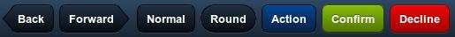
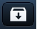
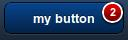

<!-- ********************************* -->
### Array de _items_ y el atributo _xtype_

Algunos componentes incluyen la propiedad "_items_", la cual permite especificar un array de elementos. Por ejemplo, en un panel nos permitirá indicar los elementos que este contiene o en un grupo de botones los botones a agrupar.

Si los elementos han sido creados previamente podemos usar su nombre de variable para añadirlos de la forma:

```javascript
items: [elemento]
items: [elemento1, elemento2]
```

Pero Sencha Touch también incluye la posibilidad de crear estos elementos en línea, lo cual será mucho más rápido y nos ahorrará código. Para ello tendremos que especificar directamente las opciones del objeto a crear entre llaves `{}`, de la forma:

```javascript
items: [{...}, {...}]
// O si solo queremos crear un elemento:
items: {}
```

Al crear un elemento en línea, además de especificar el resto de sus propiedades, también tendremos que definir su tipo _xtype_ (o tipo de objeto), de la forma:

```javascript
items: { xtype: 'toolbar', docked: 'top' }
```

El atributo _xtype_ facilita la creación de componentes y sin la necesidad de utilizar su nombre de clase completo. Es especialmente útil para crear componentes dentro de una clase contenedora. A continuación se muestra un ejemplo más completo de uso:

```javascript
Ext.application({
    name : 'MiApp',
    launch : function() {
        Ext.create('Ext.Container', {
            fullscreen: true,
            layout: 'fit',
            items: [
                {
                    xtype: 'panel',
                    html: 'Este panel se ha creado mediante xtype'
                },
                {
                    xtype: 'toolbar',
                    title: 'Mi App',
                    docked: 'top'
                }
            ]
        });
}});
```


<!-- ********************************* -->
### Listado de todos los _xtypes_ disponibles

A continuación se incluye un listado de todos los _xtypes_ disponibles en Sencha Touch:

**Componentes generales:**

| xtype | Class |
| -- | -- |
| actionsheet             | Ext.ActionSheet |
| audio                   | Ext.Audio |
| button                  | Ext.Button |
| component               | Ext.Component |
| container               | Ext.Container |
| image                   | Ext.Img |
| label                   | Ext.Label |
| loadmask                | Ext.LoadMask |
| map                     | Ext.Map |
| mask                    | Ext.Mask |
| media                   | Ext.Media |
| panel                   | Ext.Panel |
| segmentedbutton         | Ext.SegmentedButton |
| sheet                   | Ext.Sheet |
| spacer                  | Ext.Spacer |
| title                   | Ext.Title |
| titlebar                | Ext.TitleBar
| toolbar                 | Ext.Toolbar |
| video                   | Ext.Video |
| carousel                | Ext.carousel.Carousel |
| carouselindicator       | Ext.carousel.Indicator |
| navigationview          | Ext.navigation.View |
| datepicker              | Ext.picker.Date |
| picker                  | Ext.picker.Picker |
| pickerslot              | Ext.picker.Slot |
| slider                  | Ext.slider.Slider |
| thumb                   | Ext.slider.Thumb |
| tabbar                  | Ext.tab.Bar |
| tabpanel                | Ext.tab.Panel |
| tab                     | Ext.tab.Tab |
| viewport                | Ext.viewport.Default |


**Componentes tipo _DataView_:**

| xtype | Class |
| -- | -- |
| dataview                | Ext.dataview.DataView |
| list                    | Ext.dataview.List |
| listitemheader          | Ext.dataview.ListItemHeader |
| nestedlist              | Ext.dataview.NestedList |
| dataitem                | Ext.dataview.component.DataItem |


**Componentes para formulario:**

| xtype | Class |
| -- | -- |
| checkboxfield           | Ext.field.Checkbox |
| datepickerfield         | Ext.field.DatePicker |
| emailfield              | Ext.field.Email |
| field                   | Ext.field.Field |
| hiddenfield             | Ext.field.Hidden |
| input                   | Ext.field.Input |
| numberfield             | Ext.field.Number |
| passwordfield           | Ext.field.Password |
| radiofield              | Ext.field.Radio |
| searchfield             | Ext.field.Search |
| selectfield             | Ext.field.Select |
| sliderfield             | Ext.field.Slider |
| spinnerfield            | Ext.field.Spinner |
| textfield               | Ext.field.Text |
| textareafield           | Ext.field.TextArea |
| textareainput           | Ext.field.TextAreaInput |
| togglefield             | Ext.field.Toggle |
| urlfield                | Ext.field.Url |
| fieldset                | Ext.form.FieldSet |
| formpanel               | Ext.form.Panel |


<!-- ********************************* -->
### Añadir componentes a contenedores

Una vez creado un panel o contenedor también podemos añadirle más elementos en tiempo de ejecución mediante su método `add`. En el siguiente ejemplo se crea un panel que contiene un único panel y posteriormente se le añade otro panel de forma dinámica:


```javascript
Ext.application({
    name : 'MiApp',
    launch : function() {
        var secondPanel = Ext.create('Ext.Panel', {
            html: 'Segundo panel'
        });

        // Este sería el panel principal
        var mainPanel = Ext.create('Ext.Panel', {
            fullscreen: true,
            layout: 'hbox',
            defaults: {
                flex: 1
            },
            items: {
                html: 'Primer panel',
                style: 'background-color: #5E99CC;'
            }
        });

        // Añadimos otro panel al contenedor principal
        mainPanel.add(secondPanel);
}});
```

En este caso le asignamos el layout _hbox_ al panel principal contenedor para que los paneles hijos se vayan añadiendo de forma horizontal. Además se utilizan un par de propiedades nuevas: `style`, la cual nos permite escribir código CSS para aplicar estilos a un componente y `defaults`, que nos permite establecer valores por defecto que se aplicarán a todos los componentes que contenta. En este caso al primer panel se le asignará un `flex` de 1, por lo que ocupará todo el ancho, pero al añadir el segundo panel también se le asignará un `flex` de 1 por lo que el ancho se repartirá y cada panel ocupará la mitad del espacio disponible (en la sección de _layouts_ se tratará este tema más en profundidad).


<!-- ********************************* -->
### Eliminar componentes

Para eliminar elementos de un contenedor utilizamos su método `remove` y la variable que define el item. Por ejemplo para eliminar el panel que hemos añadido en el ejemplo anterior tendríamos que hacer:

```javascript
mainPanel.remove(secondPanel);
```

> Este método elimina el componente del contenedor, no lo destruye ni libera la memoria ni los eventos asociados.


<!-- ********************************* -->
### Mostrar y ocultar componentes

Los elementos también se pueden mostrar u ocultar simplemente llamando a sus métodos `hide()` o `show()`. Continuando con el ejemplo anterior, para mostrar u ocultar el panel principal haríamos:

```javascript
mainPanel.show();

mainPanel.hide();
```


<!-- ********************************* -->
### Eventos

Todos los componentes de Sencha Touch lanzan eventos ante determinados cambios, estos eventos pueden ser escuchados y realizar una acción cuando son activados. Por ejemplo, al escribir en un campo de texto este lanza su evento `change`, por lo que podríamos escuchar a dicho evento usando un _listener_ como se muestra en el siguiente ejemplo:

```javascript
Ext.create('Ext.form.Text', {
    label: 'Name',
    listeners: {
        change: function(field, newValue, oldValue) {
            // El contenido ha cambiado
        }
    }
});
```

Los componentes de Sencha Touch lanzan multitud de eventos facilitando el control de la aplicación y la programación por eventos. A estos eventos nos podemos suscribir también de forma dinámica una vez que el componente se ha creado. En la documentación de cada clase se puede encontrar un listado con los eventos que lanza y como podemos utilizarlos.


<!-- ********************************* -->
### Destruir componentes

Cuando no se va a necesitar más un elemento se recomienda eliminarlo completamente para ahorrar memoria. Hemos de tener en cuenta que en los dispositivos móviles la memoria es un recurso escaso y si nuestra aplicación es muy grande puede llegar a ralentizar el móvil. Por este motivo se ha introducido el método `destroy` que elimina el componente que lo llame:

```javascript
mainPanel.destroy();
```

Este comando eliminaría el _mainPanel_ del DOM y además eliminaría todos los _listeners_ que estuvieran escuchando a sus eventos. Hemos de tener cuidado ya que también se eliminará todo el contenido del elemento, por ejemplo si es un contenedor se eliminarían sus paneles hijos.


<!-- ********************************************************************* -->
## _Layouts_

Los _layouts_ se utilizan para especificar las dimensiones y posicionamiento de los componentes en una aplicación. Por ejemplo, en un aplicación de correo en general se colocarán dos paneles una a continuación del otro en horizontal, el de la izquierda para lista de mensajes ocupando un tercio del ancho y el de la derecha para la previsualización ocupando el resto del espacio.


<!-- ********************************* -->
### _Layout_ tipo _HBox_

Si queremos que los elementos en un contenedor se dispongan de forma horizontal podemos utilizar el _layout_ tipo `hbox`.

Además, para especificar el espacio que han de ocupar los componentes dentro del contenedor podemos utilizar la propiedad `flex`, la cual indica la proporción de espacio que ocupará un componente. Al indicar el espaciado de una serie de componentes con `flex` no es necesario que sumen 100, sino que se sumará el total de las cantidades y ese será el 100% del espacio. Por ejemplo, para conseguir una columna que ocupe 1/3 y otra de 2/3 especificaríamos los siguientes valores para la propiedad _flex_:


Para conseguir una disposición como la de la imagen tendríamos que indicar el _layout_ tipo _hbox_ al contenedor padre y establecer el atributo _flex_ de cada hijo de la forma:

```javascript
Ext.create('Ext.Container', {
    fullscreen: true,
    layout: 'hbox',
    items: [
        {
            xtype: 'panel',
            html: 'Columna que ocupa 1/3 del ancho.',
            flex: 1,
            style: 'background-color: #5E99CC;'
        },
        {
            xtype: 'panel',
            html: 'Columna que ocupa 2/3 del ancho.',
            flex: 2,
            style: 'background-color: #759E60;'
        }
    ]
});
```


<!-- ********************************* -->
### _Layout_ tipo _VBox_

El layout _vbox_ es similar a _hbox_ pero creando una disposición vertical en lugar de horizontal. Lo podemos visualizar como un conjunto de cajas apiladas de la siguiente forma:


El código para crear una pantalla de este tipo sería idéntico al utilizado en el ejemplo anterior pero cambiando el tipo de _layout_ _hbox_ por _vbox_:

```javascript
Ext.create('Ext.Container', {
    fullscreen: true,
    layout: 'vbox',
    items: [
        {
            xtype: 'panel',
            html: 'Fila que ocupa 1/3 del alto.',
            flex: 1
        },
        {
            xtype: 'panel',
            html: 'Fila que ocupa 2/3 del alto.',
            flex: 2
        }
    ]
});
```


<!-- ********************************* -->
### _Layout_ tipo _Card_

El _layout_ tipo _Card_ permite asignar muchos componentes o contenedores al mismo _layout_ pero en el que solamente se mostrará uno a la vez. Como si fuera una baraja de cartas, los componentes se apilarán y solamente se mostrará uno de ellos ocupando toda la pantalla y ocultando al resto.


En esta imagen el cuadro gris es el contenedor y la caja azul dentro de él es el elemento que actualmente se está mostrando. El resto de elementos que aparecen al lado están ocultos, pero se pueden intercambiar en cualquier momento para mostrarse.

A continuación se incluye un ejemplo de un panel con un _layout_ tipo _card_ que contiene cuatro tarjetas:

```javascript
var panel = Ext.create('Ext.Panel', {
    layout: 'card',
    items: [
        {
            html: "Primer item"
        },
        {
            html: "Segundo item"
        },
        {
            html: "Tercer item"
        },
        {
            html: "Cuarto item"
        }
    ]
});

panel.setActiveItem(1);
```

Por defecto se muestra la primera tarjeta, pero mediante la llamada a `panel.setActiveItem(1);` indicamos que se muestre la 2ª tarjeta (el número de elemento empieza en cero, por lo que el 1 se refiere a la 2ª posición).

Al añadir las _cartas_ del _layout_ las podemos crear directamente en el array de _items_, como en el ejemplo, o añadirlas posteriormente con el método `add` del panel (como ya se vio en una sección anterior).


<!-- ********************************* -->
### _Layout_ tipo _Fit_

El _layout_ tipo _fit_ es uno de los más sencillos, simplemente hace que sus componentes hijos ocupen todo el tamaño disponible del contenedor.


Por ejemplo, si tenemos un contenedor de 200px de ancho por 200px de alto y le añadimos un hijo y el _layout_ tipo _fit_, el componente añadido será expandido para ocupar el mismo tamaño que el padre:

```javascript
var panel = Ext.create('Ext.Panel', {
    width: 200,
    height: 200,
    layout: 'fit',
    items: {
        xtype: 'panel',
        html: 'Panel del mismo tamaño que el padre.'
    }
});
Ext.Viewport.add(panel);
```

> Si añadimos varios elementos a un contenedor de este tipo solamente será visible el primero, ya que al expandirse para ocupar todo el espacio ocultará al resto. Para mostrar otros elementos en el panel podemos utilizar otros _layouts_ (hbox, vbox o card) u ocultar el elemento visible para dejar espacio.


<!-- ********************************* -->
### _Docking_ o acoplamiento

Todos los _layouts_ tienen la capacidad de acoplar elementos "adicionales" de forma fija en cualquiera de sus laterales. Al acoplar un elemento el resto de contenido del _layout_ será redimensionado para adaptarse. Las posiciones en las que se puede acoplar un elemento son: _top_, _right_, _bottom_, o _left_.

Es importante notar que los elementos acoplados son "adicionales" al contenido del _layout_, es decir, si por ejemplo acoplamos un elemento a un contenedor con un _layout_ tipo _hbox_, el elemento acoplado no seguirá la alineación horizontal, sino que se pondrá en la posición que se especifique con `docked` de entre la lista de posiciones permitidas.


En la imagen superior tenemos un _layout_ tipo _hbox_ con dos columnas y un elemento acoplado en la parte superior. A continuación se incluye el código para crear una disposición de este tipo:

```javascript
Ext.create('Ext.Container', {
    fullscreen: true,
    layout: 'hbox',
    items: [
        {
            docked: 'top',
            xtype: 'panel',
            height: 20,
            html: 'Elemento acoplado en la parte superior.'
        },
        {
            xtype: 'panel',
            html: 'Columna izquierda.',
            flex: 1
        },
        {
            xtype: 'panel',
            html: 'Columna derecha.',
            flex: 2
        }
    ]
});
```

En el ejemplo se ha utilizado la característica `docked` para acoplar un panel, pero es mucho más común su utilización con herramientas tipo `toolbar` o `titlebar`.

Podemos acoplar tantos elementos como queramos, los cuales se irán añadiendo en el mismo orden en el que se asignen.


<!-- ********************************* -->
### _Pack_ y _Align_

Las características _pack_ y _align_ del _layout_ sirven para controlar la alineación de los elementos hijos dentro de un contenedor:

* _Pack_: es la alineación en el mismo eje de alineación del _layout_ utilizado. Por ejemplo, en un _layout_ tipo _hbox_ sería el horizontal y en uno tipo _vbox_ el vertical. Se pueden asignar tres posibles valores: _start_, _center_ y _end_.
* _Align_: es la alineación en el eje perpendicular al de la alineación del _layout_ utilizado. Por ejemplo, en un _layout_ del tipo _hbox_ será la vertical y en uno del tipo _vbox_ la horizontal. Puede tener cuatro posibles valores: _start_, _center_, _end_ y _stretch_.

A continuación se incluye un ejemplo de su utilización:

```javascript
Ext.create('Ext.Panel', {
    fullscreen: true,
    layout: {
        type: 'hbox',
        align: 'center',
        pack: 'center'
    },
    items: {
    	xtype: 'panel',
    	html: 'Contenido centrado.'
    }
});
```


<!-- ********************************************************************* -->
## Toolbars

Hasta ahora hemos visto como utilizar paneles y contenedores (`Ext.Panel` y `Ext.Container`), en esta sección vamos a ver como añadir barras de herramientas dentro de estos elementos.

Para añadir barras de herramientas a un panel tenemos dos opciones, igual que para otro tipo de componentes, estas son:

* Crear la barra de herramientas de forma separada usando el constructor "`var toolbar = Ext.create('Ext.Toolbar', { ... });`" y posteriormente añadirla al panel en su atributo "`items`" usando su nombre de variable.
* Crear la barra de herramientas directamente en el atributo "`items`" del panel. Para esto definiremos el tipo de componente usando el `xtype: 'toolbar'`.


En ambos casos, dentro del constructor podemos usar los siguientes atributos:

* **id: 'identificador'**: Atributo opcional para indicar el identificador de la barra.
* **docked: 'top'** o **docked: 'bottom'**: indica que la barra se coloque en la parte superior o en la parte inferior del panel respectivamente.
* **title: 'texto'**: indica el texto que se colocará en el centro de la barra.
* **ui: valor**: atributo opcional que cambia la apariencia de la barra. Por defecto toma el valor "_dark_", pero también podemos usar "_light_" que aplicará unos colores más claros.


En el siguiente ejemplo se crean dos barras de herramientas y se añaden a un panel. La primera se crea de forma separada y después se añaden al panel usando su nombre de variable. La segunda barra se crea en línea usando su _xtype_:

```javascript
var topToolbar = Ext.create('Ext.Toolbar', {
  docked: 'top',
  title: 'Top Toolbar'
});

var panel = Ext.create('Ext.Panel', {
  fullscreen: true,
  layout: 'fit',
  html: 'Contenido central',
  items: [
    topToolbar,
    {
        xtype: 'toolbar',
        dock: 'bottom',
        title: 'Bottom Toolbar'
    }
  ]
});
```

Con lo que obtendríamos un resultado similar a:


<!-- ********************************************************************* -->
## Botones

Los botones se añaden a las barras de herramientas (Toolbar) u otro tipo de componentes mediante su propiedad `items`. La forma de construir un botón, igual que para otros componentes, son dos:

* Mediante su constructor creamos el botón y lo asignamos a una variable:  `var button = Ext.create('Ext.Button', {...});`. Posteriormente podemos asignar dicha variable al atributo `items` de algún contenedor.
* Definir el botón directamente dentro del atributo `items` de algún contenedor mediante el `xtype: 'button'`.

Además tenemos una serie de propiedades que podemos configurar:
* _text_: texto del botón.
* _ui_: tipo o apariencia del botón.
* _iconCls_: icono del botón.

En el siguiente ejemplo se crea una barra de herramientas con dos botones, uno creado de forma _inline_ y otro de forma separada:


```javascript
var button1 = Ext.create('Ext.Button', {
  text: 'Mi botón 1'
});

var topToolbar = Ext.create('Ext.Toolbar', {
  dock: 'top',
  title: 'mi barra',
  items: [
        button1,
        {
            xtype: 'button',
            ui: 'action',
            text: 'Mi botón 2'
        }
  ]
});
```

Podemos usar siete tipos **ui** predefinidos de botones, estos son:

* ui: 'normal'
* ui: 'back'
* ui: 'forward'
* ui: 'round'
* ui: 'action'
* ui: 'confirm'
* ui: 'decline'



Además podemos usar los modificadores **"-small"** y **"-round"** sobre los tipos de botón "action", "confirm" y "decline" para obtener botones más pequeños o redondeados:


Si no indicamos un tipo (ui) por defecto nos aparecerá el botón tipo "normal".

Si queremos variar el **ancho** de un botón podemos utilizar la propiedad "width: '200px'" en píxeles o "width: '95%'" indicando porcentajes.


**Iconos**

También podemos usar algunos iconos predefinidos, indicando el nombre del icono mediante la propiedad **"iconCls: 'nombre'"**, de la forma:

```javascript
var button = Ext.create('Ext.Button', {
  iconCls: 'action'
});
```

Los iconos que podemos utilizar son:

<table>
	<tr>
		<td>
			 action
		</td><td>
			   add
		</td><td>
  			   arrow_down
		</td></tr><tr><td>
	  		   arrow_left
		</td><td>
  			   arrow_right
		</td><td>
	  		   arrow_up
		</td></tr><tr><td>
  			   compose
		</td><td>
	  		   delete
  		</td><td>
  			   organize
		</td></tr><tr><td>
  			   refresh
  		</td><td>
	  		   reply
  		</td><td>
  			   search
  		</td></tr><tr><td>
  			   settings
  		</td><td>
  			   star
		</td><td>
	  		   trash
  		</td></tr><tr><td>
  			   maps
  		</td><td>
  			   locate
  		</td><td>
	  		   home
  		</td></tr>
</table>

Si además usamos la propiedad **"text: 'texto'"** al definir el botón, el texto aparecerá a la derecha del icono:


Opcionalmente podemos aplicar colores a estos iconos, aplicándole los tipos (ui) de 'action', 'decline' o 'confirm', obteniendo:


**Imágenes externas**

Si queremos usar una imagen externa tenemos que aplicar al botón un estilo CSS. El botón lo definimos de forma normal, pero utilizamos su propiedad `cls` para indicar el nombre del estilo:


```javascript
items: [ { xtype: 'button', ui: 'normal', cls: 'btnAyuda' } ]
```

El estilo "btnAyuda" lo tendremos que definir indicando la imagen de fondo a usar junto con el ancho y el alto del botón. El tamaño de la imagen que usemos deberá de coincidir con el tamaño aplicado al botón para que no se vea recortado. El tamaño habitual de un botón es de 45x35 píxeles. Además es muy importante añadir en el CSS la propiedad `!important` al cargar la imagen de fondo. Esto es debido a que Sencha Touch sobrescribe algunos estilos y tenemos que aplicar esta propiedad para que prevalezca el nuestro:

```css
.btnAyuda {
	background: url(resources/imgs/ayuda.png) !important;
	width: 45px;
	height: 35px;
}
```


**Badges**

De forma sencilla podemos añadir una insignia distintiva a los botones para destacar alguna información. Para esto utilizamos la propiedad **"badgeText: '2'"**, que daría como resultado:




**Alineaciones**

Por defecto los botones salen alineados a la izquierda. Para crear otras alineaciones utilizaremos un espaciador **"{ xtype: 'spacer' }"**. En el siguiente código podemos ver diferentes ejemplos de alineaciones:

```javascript
// Alineación derecha
items: [
  { xtype: 'spacer' },
  { xtype: 'button', ui: 'normal', text: 'Botón' }
]
// Alineación centrada
items: [
  { xtype: 'spacer' },
  { xtype: 'button', ui: 'normal', text: 'Botón' },
  { xtype: 'spacer' }
]
```


**Acciones**

Para añadir acciones a los botones tenemos que definir su propiedad "**handler**", a la cual le asignaremos una función. Esta función la podemos definir en línea, de la forma `handler: function () { ... }`, o creando una función independiente para separar mejor el código, como en el ejemplo:

```javascript
function botonPresionado(btn, evt) {
	alert("Presionado " + btn.text);
}

var topToolbar = Ext.create('Ext.Toolbar', {
  	items: [
        {
            xtype: 'button',
            ui: 'normal',
            text: 'Botón 1',
            handler: botonPresionado
        },
        {
            xtype: 'button',
            ui: 'action',
            text: 'Botón 2',
            handler: function(btn, evt) {
				alert("Presionado " + btn.text);
            }
        }]
});
```


