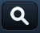
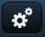

<!-- ********************************************************************* -->
## Botones

Los botones se añaden a las barras de herramientas (Toolbar) u otro tipo de componentes mediante su propiedad `items`. La forma de construir un botón, igual que para otros componentes, son dos:

* Mediante su constructor creamos el botón y lo asignamos a una variable:  `var button = Ext.create('Ext.Button', {...});`. Posteriormente podemos asignar dicha variable al atributo `items` de algún contenedor.
* Definir el botón directamente dentro del atributo `items` de algún contenedor mediante el `xtype: 'button'`.

Además tenemos una serie de propiedades que podemos configurar:
* _text_: texto del botón.
* _ui_: tipo o apariencia del botón.
* _iconCls_: icono del botón.

En el siguiente ejemplo se crea una barra de herramientas con dos botones, uno creado de forma _inline_ y otro de forma separada:


```javascript
var button1 = Ext.create('Ext.Button', {
  text: 'Mi botón 1'
});

var topToolbar = Ext.create('Ext.Toolbar', {
  dock: 'top',
  title: 'mi barra',
  items: [
        button1,
        {
            xtype: 'button',
            ui: 'action',
            text: 'Mi botón 2'
        }
  ]
});
```

Podemos usar siete tipos **ui** predefinidos de botones, estos son:

* ui: 'normal'
* ui: 'back'
* ui: 'forward'
* ui: 'round'
* ui: 'action'
* ui: 'confirm'
* ui: 'decline'


Además podemos usar los modificadores **"-small"** y **"-round"** sobre los tipos de botón "action", "confirm" y "decline" para obtener botones más pequeños o redondeados:


Si no indicamos un tipo (ui) por defecto nos aparecerá el botón tipo "normal".

Si queremos variar el **ancho** de un botón podemos utilizar la propiedad "width: '200px'" en píxeles o "width: '95%'" indicando porcentajes.


**Iconos**

También podemos usar algunos iconos predefinidos, indicando el nombre del icono mediante la propiedad **"iconCls: 'nombre'"**, de la forma:

```javascript
var button = Ext.create('Ext.Button', {
  iconCls: 'action'
});
```

Los iconos que podemos utilizar son:

<table>
	<tr>
		<td>
			 action
		</td><td>
			   add
		</td><td>
  			   arrow_down
		</td></tr><tr><td>
	  		   arrow_left
		</td><td>
  			   arrow_right
		</td><td>
	  		   arrow_up
		</td></tr><tr><td>
  			   compose
		</td><td>
	  		   delete
  		</td><td>
  			   organize
		</td></tr><tr><td>
  			   refresh
  		</td><td>
	  		   reply
  		</td><td>
  			   search
  		</td></tr><tr><td>
  			   settings
  		</td><td>
  			   star
		</td><td>
	  		   trash
  		</td></tr><tr><td>
  			   maps
  		</td><td>
  			   locate
  		</td><td>
	  		   home
  		</td></tr>
</table>

Si además usamos la propiedad **"text: 'texto'"** al definir el botón, el texto aparecerá a la derecha del icono:


Opcionalmente podemos aplicar colores a estos iconos, aplicándole los tipos (ui) de 'action', 'decline' o 'confirm', obteniendo:


**Imágenes externas**

Si queremos usar una imagen externa tenemos que aplicar al botón un estilo CSS. El botón lo definimos de forma normal, pero utilizamos su propiedad `cls` para indicar el nombre del estilo:


```javascript
items: [ { xtype: 'button', ui: 'normal', cls: 'btnAyuda' } ]
```

El estilo "btnAyuda" lo tendremos que definir indicando la imagen de fondo a usar junto con el ancho y el alto del botón. El tamaño de la imagen que usemos deberá de coincidir con el tamaño aplicado al botón para que no se vea recortado. El tamaño habitual de un botón es de 45x35 píxeles. Además es muy importante añadir en el CSS la propiedad `!important` al cargar la imagen de fondo. Esto es debido a que Sencha Touch sobrescribe algunos estilos y tenemos que aplicar esta propiedad para que prevalezca el nuestro:

```css
.btnAyuda {
	background: url(resources/imgs/ayuda.png) !important;
	width: 45px;
	height: 35px;
}
```


**Badges**

De forma sencilla podemos añadir una insignia distintiva a los botones para destacar alguna información. Para esto utilizamos la propiedad **"badgeText: '2'"**, que daría como resultado:


**Alineaciones**

Por defecto los botones salen alineados a la izquierda. Para crear otras alineaciones utilizaremos un espaciador **"{ xtype: 'spacer' }"**. En el siguiente código podemos ver diferentes ejemplos de alineaciones:

```javascript
// Alineación derecha
items: [
  { xtype: 'spacer' },
  { xtype: 'button', ui: 'normal', text: 'Botón' }
]
// Alineación centrada
items: [
  { xtype: 'spacer' },
  { xtype: 'button', ui: 'normal', text: 'Botón' },
  { xtype: 'spacer' }
]
```


**Acciones**

Para añadir acciones a los botones tenemos que definir su propiedad "**handler**", a la cual le asignaremos una función. Esta función la podemos definir en línea, de la forma `handler: function () { ... }`, o creando una función independiente para separar mejor el código, como en el ejemplo:

```javascript
function botonPresionado(btn, evt) {
	alert("Presionado " + btn.text);
}

var topToolbar = Ext.create('Ext.Toolbar', {
  	items: [
        {
            xtype: 'button',
            ui: 'normal',
            text: 'Botón 1',
            handler: botonPresionado
        },
        {
            xtype: 'button',
            ui: 'action',
            text: 'Botón 2',
            handler: function(btn, evt) {
				alert("Presionado " + btn.text);
            }
        }]
});
```


