# Sencha Touch 2 - Componentes


<!-- ********************************************************************* -->
## Identificadores y referencias

Como ya hemos visto, al crear un elemento lo podemos almacenar en una variable de javascript que posteriormente podemos utilizar para hacer referencia a él. Pero Sencha Touch también permite definir un identificador (`id`) mediante el cual posteriormente podremos hacer referencia a ese elemento. La forma de definirlo, por ejemplo, para un panel es la siguiente:

```javascript
var panel1 = Ext.create('Ext.Panel', {
  id: 'idpanel1',
  html: 'Panel 1'
});
```

Posteriormente desde otro elemento podremos referirnos a este panel de dos formas:
* Mediante la variable `panel1`, por ejemplo: `panel1.setHtml('Nuevo HTML');`
* Mediante su identificador `idpanel1`. Para esto utilizaremos el método `Ext.getCmp('idpanel1')` que nos devolverá una referencia al objeto.

Por ejemplo, para añadir este elemento a un panel contenedor tendríamos que hacer:

```javascript
var panelPrincipal = Ext.create('Ext.Panel', {
  fullscreen: true,
  layout: 'card',
  items: [ Ext.getCmp('idpanel1') ]

  // También podríamos haber usado su nombre de variable, de la forma:
  // items: [ panel1 ]
});
```

Este identificador podemos usarlo con todos los elementos: botones, barras, etc. Es una buena práctica definirlo para todos los elementos que creamos que vayamos a referenciar posteriormente. En este documento, por simplicidad, no lo incluiremos en todos los ejemplos, solamente cuando sea necesario.


<!-- ********************************************************************* -->
## Transiciones de cambio de vista

En este apartado vamos a ver como cambiar entre diferentes paneles. Nuestra aplicación tendrá una vista principal y al apretar sobre algún botón, cambiaremos a una vista o panel diferente. Para hacer esto lo más importante es utilizar un panel base no visible que guardaremos en una variable (en este caso en `panelPrincipal`), el cual contendrá como **"items"** los paneles entre los que queremos cambiar. Además tenemos que establecer el layout del panel base a **"layout: 'card'"**, quedando el código de nuestro panel de la forma:

```javascript
var panelPrincipal = Ext.create('Ext.Panel', {
    fullscreen: true,
    layout: 'card',
    items: [
        panel1,  // Panel visible
        panel2
    ]
});
```

El panel que se verá al principio es el primero que se añade a la lista de items, quedando el otro (o los otros) ocultos. En la siguiente imagen se puede ver un esquema del intercambio de paneles (en nuestro ejemplo con dos paneles). El panel asignado al "viewport" (o contenedor base) queda invisible por detrás y mediante un botón podemos pasar de un panel a otro:


A continuación se incluye el código para el "panel1". Un simple panel con una barra de herramientas en la parte superior que contiene un botón. Lo más importante aquí es la función **"handler"** del botón, en la cual llamamos a **`panelPrincipal.setActiveItem`** (función explicada a continuación) para cambiar al "panel2". El código para el "panel2" sería exactamente igual, pero cambiando la variable, el html y la función _handler_.

```javascript
var panel1 = Ext.create('Ext.Panel', {
    fullscreen: true,
    layout: 'fit',
    html: 'Panel 1',
    items: [{
        xtype: 'toolbar',
        docked: 'top',
        items: [{
            ui: 'forward',
            text: 'Adelante',
            handler: function() {
                panelPrincipal.setActiveItem( panel2 );
            }
        }] // end items
    }] // end items
});
```

Es importante destacar que en este ejemplo hemos hecho referencia al panel base mediante su nombre de variable, pero también podríamos haberle asignado un identificador y haberlo obtenido con `Ext.getCmp(id)`.


**Método _setActiveItem_**

La función **`setActiveItem( Object/Number item )`** permite cambiar entre el panel activo o visible por otro panel indicado. La forma de indicar el panel puede ser mediante su número en el array de paneles del contenedor (empezando por cero) o mediante el propio objeto a mostrar.


**Método _animateActiveItem_**

La función **`animateActiveItem( Object/Number item, atributos_animación )`** funciona igual que `setActiveItem`, permite cambiar el panel actual por otro panel indicado mediante su posición en el array de items (empezando por cero) o mediante una referencia al propio objeto. Además, esta función permite definir la animación que se realizará al intercambiar los paneles. Los tipos de animaciones que podemos utilizar son:


* _fade_: difumina el panel actual, fundiéndolo con el panel de destino, hasta completar la transición.

* _pop_: realiza una especie de animación 3D. Escala el panel actual minimizándolo hasta ocultarlo, mientras que aumenta el tamaño del panel a visualizar.

* _slide_: realiza un desplazamiento para intercambiar un panel por otro, podemos indicar una dirección: _left, right, up, down_ (por ejemplo: _direction: 'left'_).

* _flip_: realiza una animación 3D para intercambiar los paneles.

* _cube_: realiza una animación 3D para intercambiar los paneles.

* _cover_: realiza una animación 3D para intercambiar los paneles.

* _reveal_: realiza una animación 3D para intercambiar los paneles.

* _scroll_: realiza una animación 3D para intercambiar los paneles.

Para todos ellos podemos definir una duración en milisegundos (por ejemplo _"duration: 2000"_).

Una posible transición que podemos definir es:

```javascript
panelPrincipal.animateActiveItem(
    panel2,
    {type: 'slide', direction: 'up', duration: 2000});
```

Nota: Las animaciones "_flip_", "_cube_", "_cover_", "_reveal_" y "_scroll_" no funcionan correctamente en versiones antiguas de algunos navegadores, como en Android. En estos casos serán sustituidas por la animación por defecto.


<!-- ********************************************************************* -->
## _TabPanel_

Un _TabPanel_ es similar a un panel con un _layout_ tipo _card_, pero al que se ha añadido además la funcionalidad de mostrar automáticamente una barra de herramientas con la lista de _tabs_ que contiene y que nos permitirá cambiar entre ellos.

Esta barra de _tabs_ se puede posicionar en la parte superior (_top_) o en la inferior (_bottom_) del panel, y opcionalmente se le puede asignar un título e iconos a los botones.

En el siguiente ejemplo se muestra un _TabPanel_ con los _tabs_ en la parte inferior, además se le han añadido iconos:

```javascript
Ext.application({
    name: 'MiApp',
    launch: function() {
        Ext.create('Ext.TabPanel', {
            fullscreen: true,
            tabBarPosition: 'bottom',
            defaults: {
                styleHtmlContent: true
            },
            items: [
                {
                    title: 'Home',
                    iconCls: 'home',
                    html: 'Home Screen'
                },
                {
                    title: 'Contact',
                    iconCls: 'user',
                    html: 'Contact Screen'
                }
            ]
        });
    }
});
```

El cual se mostraría como:

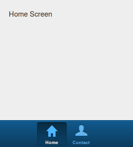


Como se puede observar la barra de _tabs_ automáticamente se configura con su icono y título, además al pulsar sobre ellos se realizaría una animación para cambiar de panel. Si no se especifica el atributo `tabBarPosition` la barra por defecto se situará en la parte superior, a continuación se incluye un ejemplo:

```javascript
Ext.application({
    name: 'MiApp',
    launch: function() {
        Ext.create('Ext.TabPanel', {
            fullscreen: true,
            defaults: {
                styleHtmlContent: true
            },
            items: [
                {
                    title: 'Home',
                    html: 'Home Screen'
                },
                {
                    title: 'Contact',
                    html: 'Contact Screen'
                }
            ]
        });
    }
});
```


El cual se mostraría como:

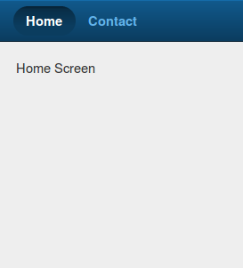


### Animaciones en un _TabPanel_

Los _TabPanel_ realizan el cambio de panel automáticamente (no tenemos que escribir código para esto) y tienen asignada la animación tipo _slide_ por defecto. Si queremos podemos cambiarla por cualquier otra (podemos usar las mismas que en un _card layout_) de la forma:

```javascript
Ext.application({
    name: 'MiApp',
    launch: function() {
        Ext.create('Ext.TabPanel', {
            fullscreen: true,
            defaults: {
                styleHtmlContent: true
            },
            layout: {
                type: 'card',
                animation: {
                    type: 'fade'
                }
            },
            items: [
                {
                    title: 'Home',
                    html: 'Home Screen'
                },
                {
                    title: 'Contact',
                    html: 'Contact Screen'
                }
            ]
        });
    }
});
```


<!-- ********************************************************************* -->
## Carousel

El Carousel es un contenedor de paneles que nos permite cambiar entre ellos simplemente arrastrando el dedo. Solo se muestra un panel en cada momento junto con un pequeño indicador con puntos que referencia el número de paneles disponibles.

Es muy sencillo configurarlo, en su sección `ítems` tenemos que definir cada uno de los paneles. Si queremos que se utilicen los estilos HTML básicos tenemos que activar la opción `defaults: { styleHtmlContent: true }`, como en el siguiente ejemplo:


```javascript
var panelCarousel = Ext.create('Ext.Carousel', {
    fullscreen: true,
    defaults: {
        styleHtmlContent: true
    },
    items: [
        {
            html : 'Item 1',
            style: 'background-color: #5E99CC'
        },
        {
            html : 'Item 2',
            style: 'background-color: #759E60'
        },
        {
            html : 'Item 3'
        }
    ]
});
```

Con lo que obtendríamos un resultado como el siguiente:


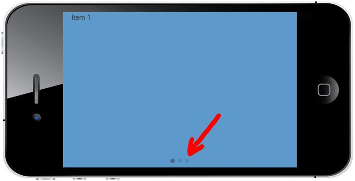


Dentro de los items de un carousel podemos añadir cualquier tipo de componente de entre los disponibles en Sencha Touch.

Una opción interesante de configuración es la orientación del panel, que básicamente lo que hace es cambiar la posición de los puntos y la dirección de movimiento de los paneles. Para configurarlo usamos la propiedad `direction: 'horizontal'` (por defecto) o `direction: 'vertical'`.


<!-- ********************************************************************* -->
## Diálogos mediante _MessageBox_

Esta clase nos permite generar mensajes emergentes de tres tipos: alertas, confirmación y de campo de texto.

Pero para que funcionen los avisos es **importante** que precarguemos la clase `Ext.MessageBox` en el atributo `requires` de la aplicación (o de la clase o componente que lo utilice):

```javascript
Ext.application({
    name: 'MiApp',
    requires: ['Ext.MessageBox'],
    launch: function() {
        ...
    }
});
```

Esto es necesario ya que de otra forma no funcionarán los avisos. En general se recomienda especificar en cada contenedor las clases que tiene que cargar, en general el propio sistema las carga en el momento en que las necesita, pero en algunas ocasiones (como en esta) si no se precargan pueden aparecer errores.

A continuación veremos los diferentes tipos de aviso que podemos usar.


<!-- ********************************************************************* -->
### Alertas

Muestra un mensaje de aviso con un solo botón OK, como podemos ver en la imagen siguiente:

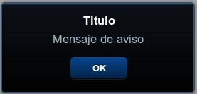

Para crear una ventana de aviso usamos el constructor **`Ext.Msg.alert(title,msg,function)`**, el primer parámetro es el título de la ventana, el segundo es el mensaje de aviso que aparecerá en el centro de la ventana, y el último es la función _callback_ que se llamará una vez cerrada la ventana. Por ejemplo:

```javascript
Ext.Msg.alert('Titulo', 'Mensaje de aviso', Ext.emptyFn);
```

En este caso usamos la función vacía `Ext.emptyFn` para que no se ejecute nada. En su lugar podríamos haber puesto directamente el nombre de una función a llamar.


<!-- ********************************************************************* -->
### Confirmación

Este mensaje de aviso nos da la opción de aceptar o rechazar, como podemos ver en la siguiente imagen:

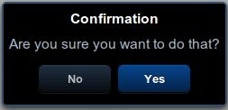

En este caso utilizamos el constructor **`Ext.Msg.confirm(title,msg,function)`**, los parámetros serán los mismos: título, mensaje y función. En este caso sí que nos interesa indicar el nombre de una función para poder comprobar si se ha pulsado el botón OK. La función _callback_ recibirá un único parámetro cuyo valor será el texto del botón pulsado.

```javascript
function myFunction(btn)
{
  if( btn == "yes" )
    Ext.Msg.alert( "¡Ha pulsado sí! :D" );
  else
    Ext.Msg.alert( "Ha pulsado no :(" );
}

Ext.Msg.confirm( "Confirmation", "Are you sure you want to do that?", myFunction );
```


<!-- ********************************************************************* -->
### Prompt, solicitar datos

El diálogo tipo _prompt_ sirve para solicitar un dato al usuario, consiste en una pequeña ventana con un campo de texto que se puede aceptar o rechazar:

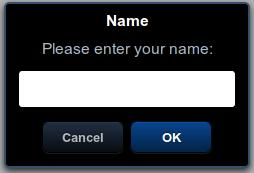

Utilizamos el constructor **`Ext.Msg.prompt(title,msg,function)`** con los parámetros: título, mensaje y función. En este caso la función _callback_ recibirá dos parámetros: el botón pulsado y el texto introducido.

```javascript
function myFunction(btn, text)
{
  Ext.Msg.alert( btn + ' ' + text );
}

Ext.Msg.prompt('Name', 'Please enter your name:', myFunction );
```


<!-- ********************************************************************* -->
## Formularios

Para crear formularios utilizamos el constructor **`Ext.create('Ext.form.Panel', { ... });`**, el cual se comporta exactamente igual que un panel, pero permitiendo añadir fácilmente en el array "`items`" campos de tipo formulario. En el siguiente ejemplo se crea un formulario que contiene un campo de texto y un área de texto:

```javascript
Ext.application({
    name: 'MiApp',
    launch: function() {
        Ext.create('Ext.form.Panel', {
            fullscreen: true,
            items: [
                {
                    xtype: 'textfield',
                    name: 'title',
                    label: 'Title',
                    required: true
                },
                {
                    xtype: 'textareafield',
                    name: 'narrative',
                    label: 'Narrative'
                }
            ]
        });
    }
});
```


<!-- ********************************************************************* -->
### Tipos de campos

Para **todos los campos** podemos especificar un nombre "`name`", una etiqueta "`label`" y si es requerido "`required: true`" (esta propiedad solo es visual, añade un asterisco (`*`) en el nombre del campo, pero **no realiza ninguna validación**).

El nombre (`name`) se utiliza para cargar y enviar los datos del formulario (como veremos más adelante), y la etiqueta (`label`) se mostrará visualmente en la parte izquierda de cada campo. El valor de todos los campos se encuentra en su atributo "`value`", el cual también podemos utilizarlo para especificar un valor inicial.

Los principales tipos de campos que podemos utilizar son los siguientes (indicados según su nombre "`xtype`" en negrita):

* **textfield**: campo de texto.
    <br/>
    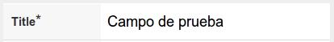

* **textareafield**: área de texto.
    <br/>
    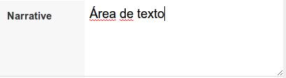

* **passwordfield**: campo de texto para introducir contraseñas. El código es igual que para un _textfield_ pero cambiando el valor de "`xtype: 'passwordfield'`":
    <br/>
    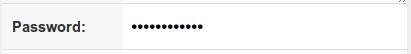

* **urlfield**: campo de texto para direcciones Web, incluye validación de URL correcta:
    <br/>
    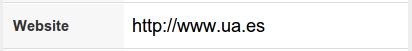

* **emailfield**: campo de texto para introducir e-mails, incluye validación automática:
    <br/>
    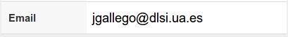

* **togglefield**: permite seleccionar entre dos valores (0 ó 1). Por defecto se encuentra desactivado, para activarlo por defecto tenemos que añadir "`value:1`" a la definición del campo:
    <br/>
    

* **numberfield**: campo numérico, permite introducir el número manualmente o mediante las flechas laterales. Inicialmente no contiene ningún valor, pero podemos definir un valor inicial mediante la propiedad "`value: 20`":
    <br/>
    

* **spinnerfield**: campo numérico, permite introducir el número manualmente o mediante los botones laterales. Inicialmente su valor es 0. Podemos definir un valor inicial mediante la propiedad "`value: 20`". También podemos definir un valor mínimo "`minValue: 0`", un valor máximo "`maxValue: 100`", el incremento "`incrementValue: 2`" y si se permiten ciclos "`cycle: true`".
<br/>


* **sliderfield**: campo numérico modificable mediante una barra o slider. Inicialmente su valor es 0. Podemos definir un valor inicial mediante la propiedad "`value: 50`". También podemos definir un valor mínimo "`minValue: 0`", un valor máximo "`maxValue: 100`" y el incremento "`incrementValue: 2`".
<br/>
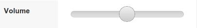

* **datepickerfield**: campo para seleccionar fechas. Al pulsar sobre el campo aparece una ventana en la que podemos seleccionar fácilmente una fecha. Podemos indicarle una fecha inicial utilizando "`value: {year: 1989, day: 1, month: 5}`":
<br/>
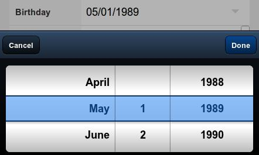

* **fieldset**: Este elemento en realidad no es un campo de datos, sino un contenedor. No añade ninguna funcionalidad, simplemente pone un título (opcional), y agrupa elementos similares, de la forma:
<br/>
```javascript
items: [{
  xtype: 'fieldset',
  title: 'About Me',
  items: [
    { xtype: 'textfield', name : 'firstName', label: 'First Name' },
    { xtype: 'textfield', name : 'lastName', label: 'Last Name'}
  ]
}]
```
<br/>
Con lo que obtendríamos un resultado similar a:
<br/>


* **selectfield**: campo desplegable para seleccionar entre una lista de valores. Las posibles opciones se indican en la propiedad "`options`" como un array. Para cada opción tenemos que indicar sus valores `text` (texto que se mostrará) y `value` (valor devuelto para la opción seleccionada).
<br/>
```javascript
items:[{
  xtype: 'selectfield',
  label: 'Select',
  options: [
    {text: 'First Option',  value: 'first'},
    {text: 'Second Option', value: 'second'},
    {text: 'Third Option',  value: 'third'}
  ]
}]
```
<br/>
Con lo que obtendríamos un resultados como el siguiente:
<br/>
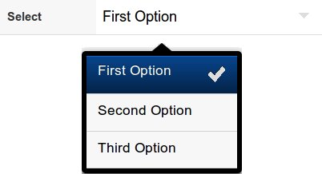


* **checkboxfield**: el campo checkbox nos permite elegir uno o varios elementos de una lista. Cada campo de la lista se tiene que declarar como un item independiente, pero todos ellos deben de tener el mismo nombre "`name`" para poder ser agrupados (muy importante para posteriormente poder recoger los datos correctamente). Además podemos utilizar la propiedad "`checked: true`" para que aparezcan marcados inicialmente:
<br/>
```javascript
items: [
  {
    xtype: 'checkboxfield',
    name : 'check_color',  // Nombre del grupo
    value: 'red',
    label: 'Red',
    checked: true
  }, {
    xtype: 'checkboxfield',
    name : 'check_color',
    value: 'green',
    label: 'Green'
  }, {
    xtype: 'checkboxfield',
    name : 'check_color',
    value: 'blue',
    label: 'Blue'
  }
]
```
<br/>
Con lo que obtendríamos un resultado como el siguiente (en la imagen se han agrupado además dentro de un _fieldset_):
<br/>
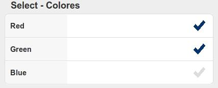


* **radiofield**: el campo de tipo "radio" nos permite elegir **solo un elemento** de una lista. Cada campo de la lista se tiene que declarar como un item independiente, pero todos ellos deben de tener el mismo nombre "`name`" para poder ser agrupados (muy importante para posteriormente poder recoger los datos correctamente). Además podemos utilizar la propiedad "`checked: true`" en uno de ellos para que aparezca marcado inicialmente:
<br/>
```javascript
items: [
  {
    xtype: 'radiofield',
    name : 'radio_color',  // Nombre del grupo
    value: 'red',
    label: 'Red',
    checked: true
  }, {
    xtype: 'radiofield',
    name : 'radio_color',
    value: 'green',
    label: 'Green'
  }, {
    xtype: 'radiofield',
    name : 'radio_color',
    value: 'blue',
    label: 'Blue'
  }
]
```
<br/>
Con lo que obtendríamos un resultado similar a (en la imagen se han agrupado además dentro de un _fieldset_):
<br/>
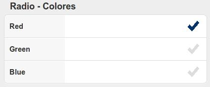


También podemos instanciar los campos de un formulario de forma independiente utilizando su constructor, por ejemplo para el campo de "`textfield`" sería "`Ext.form.Text`", o para el campo "`togglefield`" sería "`Ext.form.Toggle`". En general el constructor tendrá el mismo nombre que su tipo "`xtype`" pero quitando el sufijo "`field`".


<!-- ********************************************************************* -->
<!-- ********************************************************************* -->
<!-- ********************************************************************* -->
<!-- ********************************************************************* -->


<!-- ********************************************************************* -->
# Ejercicios - Sencha Touch

En esta sesión vamos a continuar con el ejercicio del editor de notas de la sesión anterior, al cual añadiremos el contenido de la ayuda, el panel con el formulario y definiremos las transiciones entre paneles.


<!-- ********************************************************************* -->
## Ejercicio 1 - Transiciones (1 punto)

Partiendo del código del último ejercicio vamos a añadir las acciones de transición que nos permitirán movernos entre paneles. Todas las transiciones que apliquemos serán del tipo '_slide_' y con una duración de 1 segundo (1000ms).

* Al presionar el botón del panel `panelAyuda` realizaremos una transición hacia arriba para cambiar al panel `panelContenedorLista`.

* En el panel `panelContenedorLista` tenemos dos botones en su barra de herramientas. Para el primer botón alineado a la izquierda definimos una transición hacia abajo que cargue el panel `panelAyuda`. El segundo botón cargará el panel `panelFormulario` con una transición hacia la izquierda.

* Por último, para los tres botones del panel `panelFormulario` asignaremos la misma transición hacia la derecha para cambiar al panel `panelContenedorLista`.

Nota: para obtener las referencias a los paneles para crear las transiciones tenemos dos opciones:
* Tener almacenados los paneles en variables globales y usar directamente estas variables.
* Asignar un identificador a cada panel mediante su atribudo `id` y posteriormente obtener una referencia mediante la función:  `Ext.getCmp('id-del-panel')`


<!-- ********************************************************************* -->
## Ejercicio 2 - Contenido de la ayuda (1 punto)

En este ejercicio vamos a completar el panel de ayuda. En primer lugar modificamos su constructor para que sea del tipo Carousel y definimos su sección `items` para que contenga dos paneles (además del _toolbar_ que ya teníamos). También tenemos que quitar los campos `layout: fit` y el texto HTML que teníamos puesto de prueba.

El contenido HTML de cada uno de estos paneles del Carousel lo definiremos en una variable independiente (llamadas `var htmlAyuda1` y `var htmlAyuda2`), que posteriormente asignaremos al elemento `html` del panel correspondiente. Recordad que para concatenar cadenas tendremos que usar el símbolo más (+).

Para el HTML del primer panel del Carousel definiremos una capa (DIV) a la que asignaremos el estilo ".ayuda". Dentro de esta capa colocaremos el título "_Mis Notas_" (de tipo H1), seguido por un par de párrafos con el texto "_Aplicación Web para la gestión de notas realizada con <b>Sencha Touch</b>. Máster en Desarrollo de Aplicaciones para Dispositivos Móviles_". Y por último abajo colocaremos una imagen (logo.png) con un ancho de 100 píxeles (subcarpeta "imgs" de la plantilla).

Para el segundo panel utilizaremos también una capa (DIV) con la clase ".ayuda", en la que colocaremos el titular "Autor", seguido por unos párrafos con los datos del autor.

Por último añadiremos los estilos CSS que hemos definido dentro de la sección de estilos del fichero _index.html_:

* _.ayuda_: tendrá un ancho del 100% y el texto centrado.

* _.ayuda h1_: la etiqueta H1 (cuando esté dentro de la clase "ayuda") la definiremos con un color azul oscuro (_color: navy_), un tamaño de letra de 18 puntos y el estilo "uppercase" para que aparezca siempre en mayúsculas (_text-transform: uppercase_).

* _.ayuda p_: la etiqueta P la definiremos para que tenga color gris (gray).


<!-- ********************************************************************* -->
## Ejercicio 3 - Panel con Formulario (1 punto)

En este último ejercicio vamos a crear el formulario. Para esto editamos el panel `panelFormulario` que ya teníamos hecho y le cambiamos el constructor de panel por uno de tipo formulario. Además tenemos que quitar también los campos `layout: fit` y el texto HTML que teníamos puesto de prueba. En este formulario vamos a añadir dos campos al array de `items` (además de las dos barras de herramientas que ya teníamos):

* Un campo de texto con el nombre `title`, con la etiqueta "Título:" y activaremos la opción de requerido.

* Un área de texto con nombre `text`, etiqueta "Texto:" y que también sea requerido.


