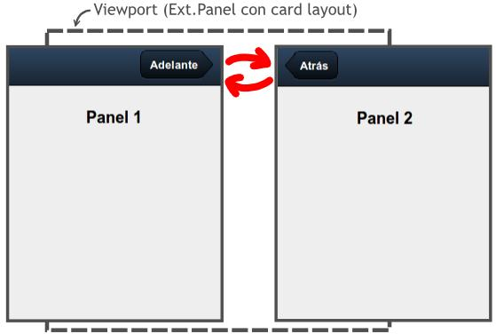

# Sencha Touch 2 - Componentes


<!-- ********************************************************************* -->
## Transiciones de cambio de vista

En este apartado vamos a ver como cambiar entre diferentes paneles. Nuestra aplicación tendrá una vista principal y al apretar sobre algún botón, cambiaremos a una vista o panel diferente. Para hacer esto lo más importante es utilizar un panel base no visible que guardaremos en una variable (en este caso en `panelPrincipal`), el cual contendrá como **"items"** los paneles entre los que queremos cambiar. Además tenemos que establecer el layout del panel base a **"layout: 'card'"**, quedando el código de nuestro panel de la forma:

```javascript
var panelPrincipal = Ext.create('Ext.Panel', {
    fullscreen: true,
    layout: 'card',
    items: [
        panel1,  // Panel visible
        panel2
    ]
});
```

El panel que se verá al principio es el primero que se añade a la lista de items, quedando el otro (o los otros) ocultos. En la siguiente imagen se puede ver un esquema del intercambio de paneles (en nuestro ejemplo con dos paneles). El panel asignado al "viewport" (o contenedor base) queda invisible por detrás y mediante un botón podemos pasar de un panel a otro:



A continuación se incluye el código para el "panel1". Un simple panel con una barra de herramientas en la parte superior que contiene un botón. Lo más importante aquí es la función **"handler"** del botón, en la cual llamamos a **`panelPrincipal.setActiveItem`** (función explicada a continuación) para cambiar al "panel2". El código para el "panel2" sería exactamente igual, pero cambiando la variable, el html y la función _handler_.

```javascript
var panel1 = Ext.create('Ext.Panel', {
    fullscreen: true,
    layout: 'fit',
    html: 'Panel 1',
    items: [{
        xtype: 'toolbar',
        docked: 'top',
        items: [{
            ui: 'forward',
            text: 'Adelante',
            handler: function() {
                panelPrincipal.setActiveItem( panel2 );
            }
        }] // end items
    }] // end items
});
```

Es importante destacar que en este ejemplo hemos hecho referencia al panel base mediante su nombre de variable, pero también podríamos haberle asignado un identificador y haberlo obtenido con `Ext.getCmp(id)`.


**Método _setActiveItem_**

La función **`setActiveItem( Object/Number item )`** permite cambiar entre el panel activo o visible por otro panel indicado. La forma de indicar el panel puede ser mediante su número en el array de paneles del contenedor (empezando por cero) o mediante el propio objeto a mostrar.


**Método _animateActiveItem_**

La función **`animateActiveItem( Object/Number item, atributos_animación )`** funciona igual que `setActiveItem`, permite cambiar el panel actual por otro panel indicado mediante su posición en el array de items (empezando por cero) o mediante una referencia al propio objeto. Además, esta función permite definir la animación que se realizará al intercambiar los paneles. Los tipos de animaciones que podemos utilizar son:


* _fade_: difumina el panel actual, fundiéndolo con el panel de destino, hasta completar la transición.

* _pop_: realiza una especie de animación 3D. Escala el panel actual minimizándolo hasta ocultarlo, mientras que aumenta el tamaño del panel a visualizar.

* _slide_: realiza un desplazamiento para intercambiar un panel por otro, podemos indicar una dirección: _left, right, up, down_ (por ejemplo: _direction: 'left'_).

* _flip_: realiza una animación 3D para intercambiar los paneles.

* _cube_: realiza una animación 3D para intercambiar los paneles.

* _cover_: realiza una animación 3D para intercambiar los paneles.

* _reveal_: realiza una animación 3D para intercambiar los paneles.

* _scroll_: realiza una animación 3D para intercambiar los paneles.

Para todos ellos podemos definir una duración en milisegundos (por ejemplo _"duration: 2000"_).

Una posible transición que podemos definir es:

```javascript
panelPrincipal.animateActiveItem(
    panel2,
    {type: 'slide', direction: 'up', duration: 2000});
```

Nota: Las animaciones "_flip_", "_cube_", "_cover_", "_reveal_" y "_scroll_" no funcionan correctamente en versiones antiguas de algunos navegadores, como en Android. En estos casos serán sustituidas por la animación por defecto.


