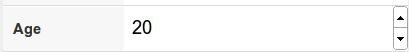
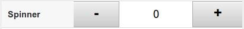

# Sencha Touch 2 - Componentes


<!-- ********************************************************************* -->
## Transiciones de cambio de vista

En este apartado vamos a ver como cambiar entre diferentes paneles. Nuestra aplicación tendrá una vista principal y al apretar sobre algún botón, cambiaremos a una vista o panel diferente. Para hacer esto lo más importante es utilizar un panel base no visible que guardaremos en una variable (en este caso en `panelPrincipal`), el cual contendrá como **"items"** los paneles entre los que queremos cambiar. Además tenemos que establecer el layout del panel base a **"layout: 'card'"**, quedando el código de nuestro panel de la forma:

```javascript
var panelPrincipal = Ext.create('Ext.Panel', {
    fullscreen: true,
    layout: 'card',
    items: [
        panel1,  // Panel visible
        panel2
    ]
});
```

El panel que se verá al principio es el primero que se añade a la lista de items, quedando el otro (o los otros) ocultos. En la siguiente imagen se puede ver un esquema del intercambio de paneles (en nuestro ejemplo con dos paneles). El panel asignado al "viewport" (o contenedor base) queda invisible por detrás y mediante un botón podemos pasar de un panel a otro:


A continuación se incluye el código para el "panel1". Un simple panel con una barra de herramientas en la parte superior que contiene un botón. Lo más importante aquí es la función **"handler"** del botón, en la cual llamamos a **`panelPrincipal.setActiveItem`** (función explicada a continuación) para cambiar al "panel2". El código para el "panel2" sería exactamente igual, pero cambiando la variable, el html y la función _handler_.

```javascript
var panel1 = Ext.create('Ext.Panel', {
    fullscreen: true,
    layout: 'fit',
    html: 'Panel 1',
    items: [{
        xtype: 'toolbar',
        docked: 'top',
        items: [{
            ui: 'forward',
            text: 'Adelante',
            handler: function() {
                panelPrincipal.setActiveItem( panel2 );
            }
        }] // end items
    }] // end items
});
```

Es importante destacar que en este ejemplo hemos hecho referencia al panel base mediante su nombre de variable, pero también podríamos haberle asignado un identificador y haberlo obtenido con `Ext.getCmp(id)`.


**Método _setActiveItem_**

La función **`setActiveItem( Object/Number item )`** permite cambiar entre el panel activo o visible por otro panel indicado. La forma de indicar el panel puede ser mediante su número en el array de paneles del contenedor (empezando por cero) o mediante el propio objeto a mostrar.


**Método _animateActiveItem_**

La función **`animateActiveItem( Object/Number item, atributos_animación )`** funciona igual que `setActiveItem`, permite cambiar el panel actual por otro panel indicado mediante su posición en el array de items (empezando por cero) o mediante una referencia al propio objeto. Además, esta función permite definir la animación que se realizará al intercambiar los paneles. Los tipos de animaciones que podemos utilizar son:


* _fade_: difumina el panel actual, fundiéndolo con el panel de destino, hasta completar la transición.

* _pop_: realiza una especie de animación 3D. Escala el panel actual minimizándolo hasta ocultarlo, mientras que aumenta el tamaño del panel a visualizar.

* _slide_: realiza un desplazamiento para intercambiar un panel por otro, podemos indicar una dirección: _left, right, up, down_ (por ejemplo: _direction: 'left'_).

* _flip_: realiza una animación 3D para intercambiar los paneles.

* _cube_: realiza una animación 3D para intercambiar los paneles.

* _cover_: realiza una animación 3D para intercambiar los paneles.

* _reveal_: realiza una animación 3D para intercambiar los paneles.

* _scroll_: realiza una animación 3D para intercambiar los paneles.

Para todos ellos podemos definir una duración en milisegundos (por ejemplo _"duration: 2000"_).

Una posible transición que podemos definir es:

```javascript
panelPrincipal.animateActiveItem(
    panel2,
    {type: 'slide', direction: 'up', duration: 2000});
```

Nota: Las animaciones "_flip_", "_cube_", "_cover_", "_reveal_" y "_scroll_" no funcionan correctamente en versiones antiguas de algunos navegadores, como en Android. En estos casos serán sustituidas por la animación por defecto.


<!-- ********************************************************************* -->
## Formularios

Para crear formularios utilizamos el constructor **`Ext.create('Ext.form.Panel', { ... });`**, el cual se comporta exactamente igual que un panel, pero permitiendo añadir fácilmente en el array "`items`" campos de tipo formulario. En el siguiente ejemplo se crea un formulario que contiene un campo de texto y un área de texto:

```javascript
Ext.application({
    name: 'MiApp',
    launch: function() {
        Ext.create('Ext.form.Panel', {
            fullscreen: true,
            items: [
                {
                    xtype: 'textfield',
                    name: 'title',
                    label: 'Title',
                    required: true
                },
                {
                    xtype: 'textareafield',
                    name: 'narrative',
                    label: 'Narrative'
                }
            ]
        });
    }
});
```


<!-- ********************************************************************* -->
### Tipos de campos

Para **todos los campos** podemos especificar un nombre "`name`", una etiqueta "`label`" y si es requerido "`required: true`" (esta propiedad solo es visual, añade un asterisco (`*`) en el nombre del campo, pero **no realiza ninguna validación**).

El nombre (`name`) se utiliza para cargar y enviar los datos del formulario (como veremos más adelante), y la etiqueta (`label`) se mostrará visualmente en la parte izquierda de cada campo. El valor de todos los campos se encuentra en su atributo "`value`", el cual también podemos utilizarlo para especificar un valor inicial.

Los principales tipos de campos que podemos utilizar son los siguientes (indicados según su nombre "`xtype`" en negrita):

* **textfield**: campo de texto.
    <br/>
    

* **textareafield**: área de texto.
    <br/>
    

* **passwordfield**: campo de texto para introducir contraseñas. El código es igual que para un _textfield_ pero cambiando el valor de "`xtype: 'passwordfield'`":
    <br/>
    

* **urlfield**: campo de texto para direcciones Web, incluye validación de URL correcta:
    <br/>
    

* **emailfield**: campo de texto para introducir e-mails, incluye validación automática:
    <br/>
    

* **togglefield**: permite seleccionar entre dos valores (0 ó 1). Por defecto se encuentra desactivado, para activarlo por defecto tenemos que añadir "`value:1`" a la definición del campo:
    <br/>
    

* **numberfield**: campo numérico, permite introducir el número manualmente o mediante las flechas laterales. Inicialmente no contiene ningún valor, pero podemos definir un valor inicial mediante la propiedad "`value: 20`":
    <br/>
    

* **spinnerfield**: campo numérico, permite introducir el número manualmente o mediante los botones laterales. Inicialmente su valor es 0. Podemos definir un valor inicial mediante la propiedad "`value: 20`". También podemos definir un valor mínimo "`minValue: 0`", un valor máximo "`maxValue: 100`", el incremento "`incrementValue: 2`" y si se permiten ciclos "`cycle: true`".
<br/>


* **sliderfield**: campo numérico modificable mediante una barra o slider. Inicialmente su valor es 0. Podemos definir un valor inicial mediante la propiedad "`value: 50`". También podemos definir un valor mínimo "`minValue: 0`", un valor máximo "`maxValue: 100`" y el incremento "`incrementValue: 2`".
<br/>


* **datepickerfield**: campo para seleccionar fechas. Al pulsar sobre el campo aparece una ventana en la que podemos seleccionar fácilmente una fecha. Podemos indicarle una fecha inicial utilizando "`value: {year: 1989, day: 1, month: 5}`":
<br/>


* **fieldset**: Este elemento en realidad no es un campo de datos, sino un contenedor. No añade ninguna funcionalidad, simplemente pone un título (opcional), y agrupa elementos similares, de la forma:
<br/>
```javascript
items: [{
  xtype: 'fieldset',
  title: 'About Me',
  items: [
    { xtype: 'textfield', name : 'firstName', label: 'First Name' },
    { xtype: 'textfield', name : 'lastName', label: 'Last Name'}
  ]
}]
```
<br/>
Con lo que obtendríamos un resultado similar a:
<br/>


* **selectfield**: campo desplegable para seleccionar entre una lista de valores. Las posibles opciones se indican en la propiedad "`options`" como un array. Para cada opción tenemos que indicar sus valores `text` (texto que se mostrará) y `value` (valor devuelto para la opción seleccionada).
<br/>
```javascript
items:[{
  xtype: 'selectfield',
  label: 'Select',
  options: [
    {text: 'First Option',  value: 'first'},
    {text: 'Second Option', value: 'second'},
    {text: 'Third Option',  value: 'third'}
  ]
}]
```
<br/>
Con lo que obtendríamos un resultados como el siguiente:
<br/>


* **checkboxfield**: el campo checkbox nos permite elegir uno o varios elementos de una lista. Cada campo de la lista se tiene que declarar como un item independiente, pero todos ellos deben de tener el mismo nombre "`name`" para poder ser agrupados (muy importante para posteriormente poder recoger los datos correctamente). Además podemos utilizar la propiedad "`checked: true`" para que aparezcan marcados inicialmente:
<br/>
```javascript
items: [
  {
    xtype: 'checkboxfield',
    name : 'check_color',  // Nombre del grupo
    value: 'red',
    label: 'Red',
    checked: true
  }, {
    xtype: 'checkboxfield',
    name : 'check_color',
    value: 'green',
    label: 'Green'
  }, {
    xtype: 'checkboxfield',
    name : 'check_color',
    value: 'blue',
    label: 'Blue'
  }
]
```
<br/>
Con lo que obtendríamos un resultado como el siguiente (en la imagen se han agrupado además dentro de un _fieldset_):
<br/>


* **radiofield**: el campo de tipo "radio" nos permite elegir **solo un elemento** de una lista. Cada campo de la lista se tiene que declarar como un item independiente, pero todos ellos deben de tener el mismo nombre "`name`" para poder ser agrupados (muy importante para posteriormente poder recoger los datos correctamente). Además podemos utilizar la propiedad "`checked: true`" en uno de ellos para que aparezca marcado inicialmente:
<br/>
```javascript
items: [
  {
    xtype: 'radiofield',
    name : 'radio_color',  // Nombre del grupo
    value: 'red',
    label: 'Red',
    checked: true
  }, {
    xtype: 'radiofield',
    name : 'radio_color',
    value: 'green',
    label: 'Green'
  }, {
    xtype: 'radiofield',
    name : 'radio_color',
    value: 'blue',
    label: 'Blue'
  }
]
```
<br/>
Con lo que obtendríamos un resultado similar a (en la imagen se han agrupado además dentro de un _fieldset_):
<br/>


También podemos instanciar los campos de un formulario de forma independiente utilizando su constructor, por ejemplo para el campo de "`textfield`" sería "`Ext.form.Text`", o para el campo "`togglefield`" sería "`Ext.form.Toggle`". En general el constructor tendrá el mismo nombre que su tipo "`xtype`" pero quitando el sufijo "`field`".


