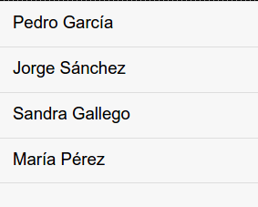
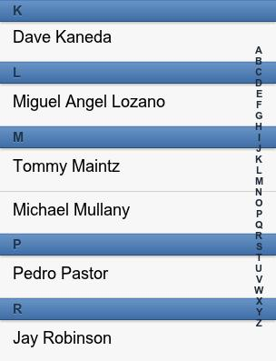
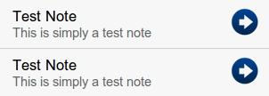

<!-- ********************************************************************* -->
## Plantillas

Las plantillas se utilizan para describir la disposición y la apariencia visual de los datos de nuestra aplicación. Nos proporcionan funcionalidad avanzada para poder procesarlos y darles formato, como: auto-procesado de arrays, condiciones, operaciones matemáticas, ejecución de código en línea, variables especiales, funciones, etc.

Para instanciar un template utilizamos el constructor "`Ext.XTemplate( template )`", donde _template_ será una cadena con la definición del template a utilizar. Posteriormente podemos utilizar la función "`overwrite(elemento, datos)´" del _template_ para aplicar un template con unos datos sobre un elemento dado. En la sección de "Visualización de datos" se detalla otra forma de aplicar un template en un panel.


<!-- ********************************************************************* -->
### Auto-procesado de arrays

Para crear un template que procese automáticamente un array se utiliza la etiqueta `<tpl for="variable">plantilla</tpl>`, teniendo en cuenta que:

* Si el valor especificado es un array se realizará un bucle por cada uno de sus elementos, repitiendo el código de la "plantilla" para cada elemento.
* La "plantilla" puede contener texto, etiquetas HTML y variables o elementos del array a sustituir.
* Las variables a sustituir se indican de la forma "`{nombre_variable}`", donde "`nombre_variable`" debe de corresponder con el nombre de una de los elementos del array iterado.
* Mediante la variable especial `{#}` podemos obtener el índice actual del array.
* En la sección `for="variable"` de la plantilla se debe de indicar el nombre de la variable que contiene el array a procesar, de la forma:
  * Con `<tpl for=".">...</tpl>` se ejecuta un bucle a partir del nodo raíz.
  * Con `<tpl for="foo">...</tpl>` se ejecuta el bucle a partir del nodo "foo".
  * Con` <tpl for="foo.bar">...</tpl>` se ejecuta el bucle a partir del nodo "foo.bar"

Si por ejemplo tenemos el siguiente objeto de datos:

```javascript
var myData = {
  name: 'Tommy Maintz',
  drinks: ['Agua', 'Café', 'Leche'],
  kids: [
    { name: 'Tomás', age:3 },
    { name: 'Mateo', age:2 },
    { name: 'Salomón', age:0 }
  ]
};
```

Podríamos mostrar un listado con el contenido de `myData.kids` indicando en la sección `for="variable"` que procese a partir de la raíz del array a procesar (`myData.kids`):

```javascript
var myTpl = new Ext.XTemplate(
  '<tpl for=".">',
    '<p>{#}. {name}</p>',
  '</tpl>' );

myTpl.overwrite(myPanel.element, myData.kids);
```

Si por ejemplo indicamos que se procese la variable "_myData_" y queremos obtener el mismo resultado, tendríamos que modificar el _template_ para que se procese a partir del nodo "_kids_", de la forma `<tpl for="kids">...</tpl>`.

```javascript
var myTpl = new Ext.XTemplate(
  '<tpl for="kids">',
    '<p>{#}. {name}</p>',
  '</tpl>' );

myTpl.overwrite(myPanel.element, myData);
```

Si el array solo contiene valores (en el objeto de datos de ejemplo, sería el array "_drinks_"), podemos usar la variable especial `{.}` dentro del bucle para obtener el valor actual:

```javascript
var myTpl = new Ext.XTemplate(
  '<tpl for="drinks">',
    '<p>{#}. {.}</p>',
  '</tpl>' );

myTpl.overwrite(myPanel.element, myData);
```


<!-- ********************************************************************* -->
### Condiciones

Para introducir condiciones en las plantillas se utiliza la etiqueta `<tpl if="condicion"> plantilla </tpl>`. Hemos de tener en cuenta que: si utilizamos símbolos como las "`<`", "`>`" o las "comillas" deberemos escribirlos codificados: `&lt;`, `&gt;` o `&quot;`; y que si usamos los operadores "`elseif`" o "`else`" tendremos que cerrar la plantilla al final.

Ejemplos:

```javascript
<tpl if="age &lt; 10">
    Niño
<tpl elseif="age &gt= 10 && age &lt; 18">
    Adolescente
<tpl else>
    Adulto
</tpl>
<tpl if="name == &quot;Javi&quot;">¡Hola Javi!</tpl>
```


<!-- ********************************************************************* -->
### Visualización

Para renderizar el contenido de una plantilla sobre un panel (u otro elemento que lo soporte, como veremos más adelante), podemos usar la función "`tpl.overwrite(elemento, datos)`" que ya hemos usado en los ejemplos anteriores. O usar la propiedades "`tpl`" junto con "`data`", de la forma:

```javascript
var myPanel = Ext.create('Ext.Panel', {
    data: myData,
    tpl: myTpl
});

// O también:
// myTpl.overwrite(myPanel.element, myData);
```


<!-- ********************************************************************* -->
## _Data Views_

Los _Data Views_ nos permiten mostrar datos de forma personalizada mediante el uso de plantillas y opciones de formato. Principalmente se utilizan para mostrar datos provenientes de un _store_ y aplicarles formato utilizando las plantillas "`Ext.XTemplate`", como hemos visto en la sección anterior. Además también proporcionan mecanismos para gestionar eventos como: _click, doubleclick, mouseover, mouseout_, etc., así como para permitir seleccionar los elementos mostrados (por medio de un "_itemSelector_").

En el siguiente ejemplo vamos a crear un _DataView_ para mostrar el contenido de un _store_ definido por separado y mediante la utilización de una plantilla también previamente definida usando `Ext.XTemplate`:

```javascript
var myDataView = Ext.create('Ext.DataView', {
    fullscreen: true,
	store: myStore,
	tpl: myTpl
});
```

En este otro ejemplo creamos un _DataView_ para mostrar el contenido de un _store_ que incluimos dentro de la propia clase con un array de datos interno. Además utilizamos la propiedad `itemTpl` el lugar de `tpl`, lo que nos permite indicar el _template_ de cada elemento o _item_ del array directamente.

```javascript
Ext.create('Ext.DataView', {
    fullscreen: true,
    store: {
        fields: ['name','age'],
        data: [
        	{name:'Manuel', age:21},
        	{name:'Pedro', age:56},
        	{name:'Javi', age:36},
        	{name:'Laura', age:57},
        	{name:'Alfredo', age:11},
        	{name:'María', age:12}
        ]
    },
    itemTpl: '{name} tiene {age} años'
});
```


Esta "vista de datos" podemos mostrarla en nuestra aplicación tal cual la hemos creado o también podemos añadirla a la sección `items` de un panel:

```javascript
var myPanel = Ext.create('Ext.Panel', {
    fullscreen: true,
    items: [ myDataView ]
});
```


<!-- ********************************************************************* -->
### Listados

Permiten mostrar datos en forma de listado a partir de una plantilla por defecto de tipo lista. Estos datos se obtienen directamente de un "_store_" y se mostrarán uno a uno en forma de listado según la plantilla definida en "`itemTpl`". Además incorpora funcionalidades para gestionar eventos como: _itemtap_, _itemdoubletap_, _containertap_, etc.

Utilizarlo es muy simple, solo tenemos que definir el "_store_" que queremos utilizar y la plantilla para cada uno de los elementos con "`itemTpl`", por ejemplo:

```javascript
var myList = Ext.create('Ext.List', {
    fullscreen: true,
    store: {
        fields: ['firstName', 'lastName'],
        data: [
            {firstName: 'Pedro', lastName: 'García'},
            {firstName: 'Jorge', lastName: 'Sánchez'},
            {firstName: 'Sandra', lastName: 'Gallego'},
            {firstName: 'María', lastName: 'Pérez'}
        ]
    },
    itemTpl: '{firstName} {lastName}'
});
```

En el ejemplo anterior hemos creado el _store_ a utilizar directamente dentro de la lista con un array de datos interno, pero también podríamos crear el _store_ de datos por separado y conectarlo alguna fuente de datos local o remota (como se vio en la sección correspondiente):

```javascript
var myList = Ext.create('Ext.List', {
    fullscreen: true,
    store: myStore,
    itemTpl: '{firstName} {lastName}'
});
```

El código del ejemplo generaría una aplicación como la siguiente:



Es muy importante diferenciar "`itemTpl`" de la propiedad "`tpl`" que ya habíamos visto (en las que usábamos los `XTemplate`). En "`itemTpl`" se procesa cada elemento del listado individualmente. Otra diferencia es que tenemos que utilizar como separador para la concatenación el símbolo de unión "+" y no la coma ",".

Esta lista ya la podemos mostrar directamente, sin la necesidad de incluirla en un contenedor, sin embargo, también podemos añadirla dentro de un panel en su sección `items` de la forma:

```javascript
var myPanel = Ext.create('Ext.Panel', {
    layout: 'fit',
    items: [ myList ]
});
```

> Nota: es posible que al asignar un listado a un panel no se visualice correctamente. En este caso tenemos que asegurarnos de eliminar la propiedad `fullscreen` tanto del listado como del panel y de asignar el `layout: 'fit'` al panel (y ningún layout al listado).

En el "_store_" debemos de utilizar la propiedad "`sorters`" para ordenar el listado, pues sino nos aparecerá desordenado. Por ejemplo, podríamos indicar (en el "_store_") que se ordene por el apellido "`sorters: 'lastName'`".


<!-- ********************************************************************* -->
### Obtener datos de la lista

Para obtener el almacén de datos asociado a un listado utilizamos su método `getStore()`:

```javascript
var notesStore = myList.getStore();
```

Una vez obtenido ya podemos realizar operaciones sobre él como añadir, modificar o eliminar algún registro (consultar sección correspondiente).


<!-- ********************************************************************* -->
### Actualizar datos

Si modificamos el almacén de datos asociado con el listado tendremos que actualizarlo para que se visualicen correctamente los nuevos datos en el listado. En primer lugar llamaremos al método `sync()` del _store_ para sincronizar los cambios. A continuación, si es necesario, ordenamos los datos (pues el registro se habrá añadido al final). En el ejemplo se ordenan de forma descendente por fecha. Por último llamamos al método `refresh()` del listado para actualizar la vista.

```javascript
notesStore.add( registro );

notesStore.sync();
notesStore.sort([{ property: 'date', direction: 'DESC'}]);
myList.refresh();
```


<!-- ********************************************************************* -->
### Agrupar elementos

Una propiedad muy útil que nos ofrecen los listados es la posibilidad de agrupar los elementos (como podemos ver en la imagen inferior). Para esto activaremos la propiedad "`grouped: true`" del listado y opcionalmente podremos indicar que se muestre una barra lateral de navegación "`indexBar: true`".



Pero para que esta propiedad funcione correctamente tendremos que indicar dentro del _store_ la forma de agrupar los elementos. Tenemos dos opciones:

* `groupField: 'campo'` - para agrupar por un campo (por ejemplo: elementos de género masculino y femenino).

* `getGroupString: function(instance) {...}` - para agrupar usando una función. Esta opción es mucho más avanzada y nos permitirá agrupar, por ejemplo, usando la primera letra del apellido (como se muestra en la imagen de ejemplo).


Para obtener el resultado de la imagen de ejemplo anterior, el código quedaría como el siguiente:

```javascript
var myStore = Ext.create('Ext.data.Store', {
    model: 'User',
    proxy: {
        type: 'localstorage',
        id: 'my-store-id'
    },
    autoLoad: true,
    sorters: 'apellido',
    getGroupString: function(instance) {
        return instance.get('apellido')[0];
    }
});

var myList = Ext.create('Ext.List', {
    fullscreen: true,
    store: myStore,
    grouped : true,
    indexBar: true,
    itemTpl: '{nombre} {apellido}'
});
```


<!-- ********************************************************************* -->
### Acciones

Para añadir acciones al presionar sobre un elemento del listado tenemos varias opciones:

* `itemtap`: permite realizar una acción al presionar sobre un elemento de la barra. Este evento lo debemos definir dentro de la sección "`listeners`" de nuestro `Ext.List`, de la forma:
<br/>
```javascript
listeners: {
    itemtap: function(view, index, target, record) {
        alert( "tap on" + index );
    }
}
```
<br/>
Donde el parámetro _record_ representa el objeto sobre el que se ha pulsado. Este valor lo podríamos aprovechar para cargarlo directamente en un formulario o realizar alguna operación con él.

* `itemdoubletap`: permite realizar una acción al presionar dos veces consecutivas sobre un elemento. Este evento lo debemos definir dentro de la sección "`listeners`" de nuestro `Ext.List`, de la forma:
<br/>
```javascript
listeners: {
    itemdoubletap: function(view, index, target, record){
        alert("doubletap on "+index);
    }
}
```
<br/>
Donde el parámetro _record_ representa el objeto sobre el que se ha pulsado.

* `onItemDisclosure: Boolean / Función` - esta propiedad admite diferentes valores. Si le indicamos el valor booleano "true" simplemente añadirá un icono con una flecha a la derecha de cada elemento (como podemos ver en la imagen inferior).
<br/>
<br/>

<br/>
<br/>
En lugar de un valor booleano, podemos indicarle una función. En este caso, además de añadirse el icono en cada elemento, también se ejecutará la función cada vez que se presiones sobre dicho icono. Solo se capturará cuando se presione sobre el icono, no sobre toda la barra (como en el caso de _itemtap_). A continuación se incluye un ejemplo de uso:
<br/>
```javascript
onItemDisclosure: function (record) { alert( "item disclosure" ); }
```
<br/>
Donde el parámetro _record_ representa el objeto sobre el que se ha pulsado. En el siguiente código, al pulsar sobre un elemento de la lista se cargan los datos del elemento pulsado en un formulario (como veremos más adelante), y se cambia la vista para visualizar ese panel.
<br/>
```javascript
onItemDisclosure: function( record )
{
	myFormPanel.setRecord( record );
	panelPrincipal.animateActiveItem(
			myFormPanel,
			{ type: 'slide', direction: 'left' });
}
```


<!-- ********************************************************************* -->
## Formularios

En esta sección vamos a ver como podemos cargar, guardar y validar los datos de un formulario.


<!-- ********************************************************************* -->
### Cargar datos en un formulario

Para insertar datos de un modelo en un formulario utilizamos el método "`setRecord( data )`" de la clase "`Ext.form.Panel`". En el siguiente ejemplo se crea un formulario con dos campos llamados "_title_" y "_text_" y a continuación se cargan los datos del registro "_note_".

```javascript
var noteEditor = Ext.create('Ext.form.Panel', {
  id: 'noteEditor',
  fullscreen: true,
  items: [ {
      xtype: 'textfield',
      name: 'title',
      label: 'Title',
      required: true
    }, {
      xtype: 'textareafield',
      name: 'narrative',
      label: 'Narrative'
    } ]
});

noteEditor.setRecord( note );
```

El método "`setRecord( data )`" recibe como parámetro una instancia de un modelo de datos (ver sección _Data Model_), del cual cargará solamente los campos cuyos nombre coincidan con los establecidos en el formulario. En este formulario tenemos dos campos: "`name: 'title'`" y "`name: 'text'`", si cargamos una instancia de un modelo de datos como el descrito a continuación, solamente se cargarían los dos campos que coinciden.


```javascript
Ext.define('Note', {
    extend: 'Ext.data.Model',
    config: {
        fields: [
            { name: 'id', type: 'int' },
            { name: 'date', type: 'date', dateFormat: 'c' },
            { name: 'title', type: 'string' },
            { name: 'text', type: 'string' }
        ]
    }
});
```

En la sección de "_Data Model_" ya hemos visto que podemos usar la función "`Ext.create('<nombre-modelo>', {lista-valores})`" para crear instancias de un modelo de datos. En el siguiente ejemplo se crea una instancia del modelo anterior y se añade al formulario "noteEditor" que habíamos definido anteriormente. En este caso, al asignar los datos al formulario, solo se cargarían los campos "_title_" y "_text_".


```javascript
var note = Ext.create('Note', {
    id: 1,
	date: new Date(),
	title: 'titulo',
	text: 'texto'
});

noteEditor.setRecord( note );
```


A continuación se incluye un ejemplo un poco más avanzado: Creamos una barra de herramientas a la que añadimos un botón con el texto "Cargar datos". Para este botón definimos su función "`handler`", de forma que al pulsar el botón se crea una instancia del modelo 'Note' y posteriormente se carga en el formulario 'noteEditor'.

```javascript
var myToolbar = Ext.create('Ext.Toolbar', {
    docked: 'top',
    title: 'Mi barra',
    items: [
    	{
    	    xtype: 'button',
    	    ui: 'action',
    	    text: 'Cargar datos',
    	    handler: function() {
    	        var now = new Date();
                var noteId = now.getTime();
                var note = Ext.create('Note', {
                    id: noteId,
                	date: now,
                	title: 'titulo',
                	text: 'texto'
                });
                noteEditor.setRecord( note );
    	    }
    	}
    ]
});
```


<!-- ********************************************************************* -->
### Guardar los datos de un formulario

Para guardar los datos de un formulario en general tendremos que seguir cuatro pasos:

* En primer lugar llamamos al método `getRecord()` del formulario para obtener su modelo de datos asociado, el cual devolverá un objeto del tipo `Ext.data.Model` con la definición de los campos utilizados en el formulario, pero no sus valores.

* A continuación llamamos a la función `updateRecord(objeto)` del mismo formulario para transferir los valores introducidos a la instancia del modelo que hemos obtenido antes.

* En tercer lugar tenemos que realizar el proceso de validación de los datos (explicado en el siguiente apartado).

* Y por último guardar los datos en el _store_ correspondiente. Si tenemos una instancia del almacén de datos creada (ver sección _Data Store_) podemos añadir los datos llamando a su función `add`, de la forma:<br/>

```javascript
notesStore.add(currentNote);
```

En el siguiente código de ejemplo se resumen los cuatro pasos que habría que seguir para cargar los datos del formulario 'noteEditor' y guardarlos en el almacén 'notesStore'.


```javascript
// Cargar el modelo de datos
var currentNote = noteEditor.getRecord();

// Actualizar el modelo con los datos del formulario
noteEditor.updateRecord(currentNote);

// Realizar validaciones
// (ver siguiente apartado)

// Guardar los datos
notesStore.add(currentNote);
```


Más comúnmente nuestro almacén estará asociado con algún elemento que nos permita visualizar los datos (como un listado o un _Data View_, ver secciones correspondientes). Si por ejemplo fuera un listado deberíamos de obtener la instancia del almacén de datos llamando a su método `getStore()` y posteriormente añadir los datos que habíamos obtenido del formulario de la forma:

```javascript
var notesStore = notesList.getStore();
notesStore.add( currentNote );
```

Opcionalmente podemos comprobar si los datos a añadir están repetidos. Para esto tenemos que utilizar el método `findRecord()` del _store_ (ver sección _Data Store_).


```javascript
var notesStore = notesList.getStore();

if( notesStore.findRecord('id', currentNote.data.id) === null)
{
   notesStore.add( currentNote );
}
```


Para terminar con el ejemplo del listado, una vez añadidos los datos tendremos que sincronizar su _store_, ordenarlo (si fuese necesario) y por último actualizar o refrescar la vista del listado:


```javascript
notesStore.sync();
notesStore.sort([{ property: 'date', direction: 'DESC'}]);

notesList.refresh();
```


<!-- ********************************************************************* -->
### Comprobar validaciones

Para comprobar las validaciones de un formulario lo tenemos que hacer de forma manual llamando a la función `validate()` del modelo de datos asociado. Para esto tienen que estar definidas estas validaciones en el modelo. Continuando con el ejemplo del modelo de datos "Note", vamos a añadir que los campos `id`, `title` y `text` sean requeridos:

```javascript
Ext.define('User', {
    extend: 'Ext.data.Model',
    fields: [
        { name: 'id', type: 'int' },
        { name: 'date', type: 'date', dateFormat: 'c' },
        { name: 'title', type: 'string' },
        { name: 'text', type: 'string' }
    ],
    validations: [
        { type: 'presence', field: 'id' },
        { type: 'presence', field: 'title',
          message: 'Introduzca un título para esta nota' },
        { type: 'presence', field: 'narrative',
          message: 'Introduzca un texto para esta nota' }
    ]
});
```

Los pasos a seguir para realizar la validación de un formulario son los siguientes:

* Obtener el modelo de datos asociado a un formulario (`getRecord()`) y rellenarlo con los datos introducidos por el usuario (`updateRecord()`).

* Llamar a la función `validate()` del modelo de datos. Esta función comprueba que se cumplan todas las validaciones que estén definidas en dicho modelo, devolviendo un objeto del tipo `Errors`.

* A continuación usaremos la función `isValid()` del objeto `Errors` para comprobar si ha habido algún error. Esta función devuelve un valor _booleano_ indicando si existen errores o no.

* En caso de que existan errores tendremos que mostrar un aviso con los errores y no realizar ninguna acción más.

* Dado que pueden haber varios errores (guardados en el array `items` del objeto `Errors`), tenemos que iterar por los elementos de este array usando la función `Ext.each(array, funcion)`. Esta función recibe dos parámetros: el primero es el array sobre el que va a iterar y el segundo la función que se llamará en cada iteración. Esta función recibe a su vez dos parámetros: el item de la iteración actual y el índice de ese item en el array.

* Para mostrar el aviso con los errores podemos usar un `MessageBox` (ver sección correspondiente).


A continuación se incluye un ejemplo completo de la validación de un formulario:


```javascript
// Cargar el modelo de datos
var currentNote = noteEditor.getRecord();

// Actualizar el modelo con los datos del formulario
noteEditor.updateRecord(currentNote);

// Realizar validaciones
var errors = currentNote.validate();

if(!errors.isValid())
{
    var message="";

    Ext.each( errors.items, function(item, index) {
        message += item.getMessage() + "<br/>";
    });

    Ext.Msg.alert("Errores", message, Ext.emptyFn);

    return;   // Terminamos si hay errores
}

// Almacenar datos
notesStore.add(currentNote);
```

También podríamos haber creado un bucle para iterar entre los elementos del array de errores, o haber llamado a la función `errors.getByField('title')[0].getMessage()` para obtener directamente el mensaje de error de un campo en concreto.


<!-- *********************************************************************** -->
## Más información

Podemos consultar principalmente tres fuentes de información cuando tengamos alguna duda:

* Los **tutoriales y la sección de FAQ** en la página Web de Sencha Touch:
<br/>
http://www.sencha.com/

* La **documentación API** Online:

  * http://docs.sencha.com/touch/2.4/2.4.1-apidocs/

  * http://www.sencha.com/learn/touch/

  * También disponible de forma local accediendo en la dirección "/docs" del SDK descargado.

* Los **foros** en la página web de Sencha Touch.


Además en la carpeta "touch-sdk/examples" podemos encontrar aplicaciones de ejemplo.


<!-- ********************************************************************* -->
<!-- ********************************************************************* -->
<!-- ********************************************************************* -->
<!-- ********************************************************************* -->


